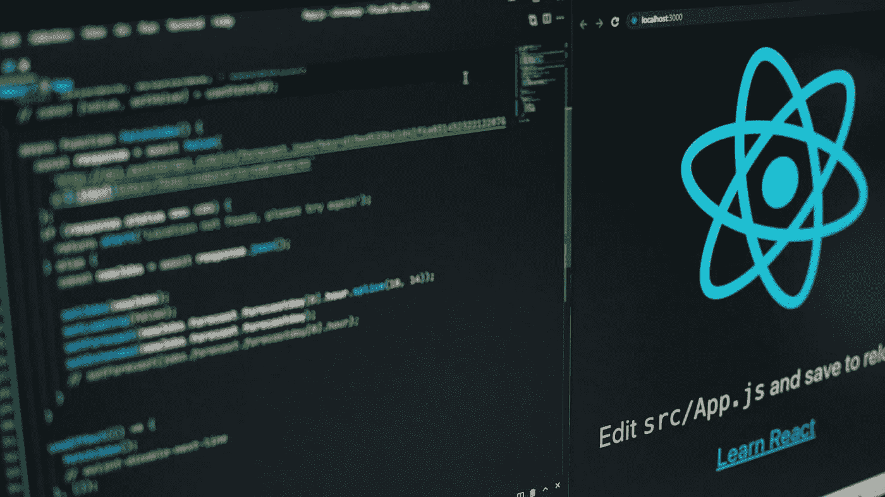

# 我如何在一家科技公司获得高级 React 开发人员的职位

> 原文：<https://levelup.gitconnected.com/how-i-got-a-senior-react-developer-role-in-a-tech-company-d65260406d79>

这篇文章不是关于如何找到一份初级开发人员的工作。我在这里描述我是如何得到我的高级 React 开发人员角色的，即使我当时没有使用 React 超过 2 年。

# 我的故事

在我将主要编程语言改为 Javascript 之前，我花了 5 年时间(兼职和全职相结合)作为 PHP 开发人员，从事意大利面条代码、定制框架、Nette 框架等工作。

一旦我决定改变我的道路，成为一名 JS 开发人员，我能够得到的第一个角色是一名在 Angular 工作的初级 Javascript 开发人员。在那家公司，我逐渐开始与 React 和 Angular 一起工作。这是可能的，因为一个有趣的项目，其中 Angular (1.x)用于路由，React 用于渲染。

然后我去了另一家公司，开始做中角开发者。不幸的是，这不是一个好的选择，两年后，我决定寻找一个新的机会。我的主要焦点是一个新的反应角色，但我希望有相同或更好的条件。这有点棘手，因为我已经两年没有使用 React 了。这是我旅程开始的地方。

# 准备工作

## 询问朋友

因为我没有跟随反应世界，我需要再次进入它。我做的第一件事是，我联系了几个当时在 react 工作的朋友，请他们见面讨论 React。我准备了一大堆关于自从我上次使用它以来它有什么变化的问题，但是两个最重要的问题是:

*   在使用 React 及其生态系统时，您遇到了哪些瓶颈？
*   **最常用的第三方库有哪些(api 请求、缓存、状态管理等。)您遇到了哪些瓶颈？**

这些问题的答案给了我一个很好的知识基础，然后我在面试中使用。

> 了解常见的瓶颈非常重要，因为这是您正在积极使用给定技术的标志。

## 检查文档

还需要钻研文档和一些课程来更新我关于 React 用法的知识。因为我更喜欢视频，所以[前端大师赛](https://frontendmasters.com/)网页对我重回正轨帮助很大。

## 检查 Github 问题

通过检查 Github 上 React 出现的问题，我能够确定最常见的用例以及最常见的瓶颈。正如我在前面的章节中所描述的，获取和学习这些信息是最重要的。

# 测试面试

我对未来 React 开发人员的面试过程一无所知。为了能够克服这个障碍，我制定了一个计划。

## 搜索公司

首先，我准备了一份公司名单，大约有 10 家，他们有一个 React 开发人员的职位空缺，最重要的是，我无意为这些公司工作。他们所有人都有一点点不同的期望，角色也从初级到高级。

## 整理

在下一阶段，我根据这些公司对新 react 开发者的期望对它们进行了分类。期望值最低的那些在我的清单上排在最前面。

## 采访

最后，我开始给这些公司打电话，申请他们提供的职位。并不是我名单上的每家公司都给我提供了面试机会，但这不是我的本意。

在那些面试中，我总是随身带着一个笔记本，记下我得到的所有重要问题。在面试结束前，我还询问了面试官的反馈。面试后，我搜索了所有我不能正确回答的问题的答案，并学会了它们。这有助于我更好地准备接下来的考试。

我变得越来越好，所以我决定进入下一个阶段。

> 有趣的事实:最初的几次面试完全失败了，我没有得到任何工作机会——一些公司至今没有联系我😅。

# 最后的面试

经过几次尝试，我有足够的技能去申请我真正想得到工作机会的公司的职位。

我选了几个(3 个左右)去参加他们的面试。他们非常好，我收到了他们所有人的邀请。所有报价的条件都比我当时的职位好。

我获得这些机会的感觉非常好，最终我选择成为一名高级 React 开发人员。

在我真正开始这个角色之前，我参加了多门课程，只是为了确保我真的有足够的知识来做这个职位。

非常感谢你的阅读！