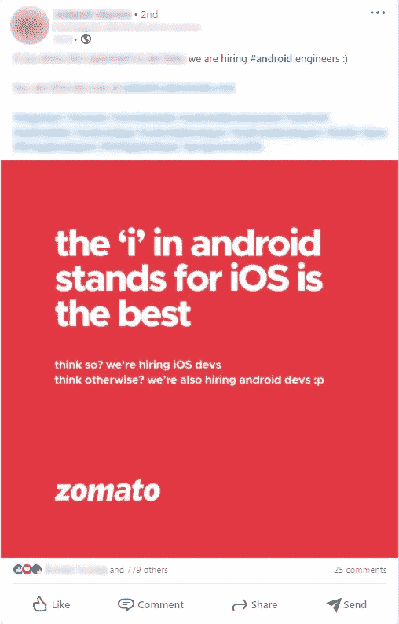
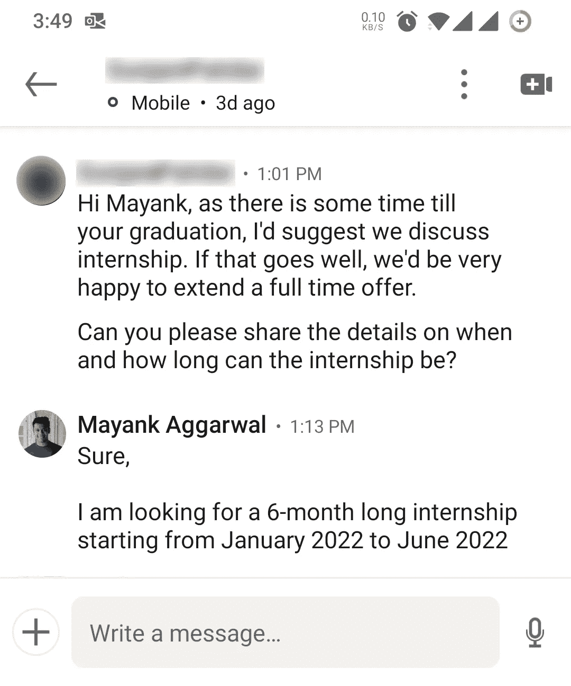
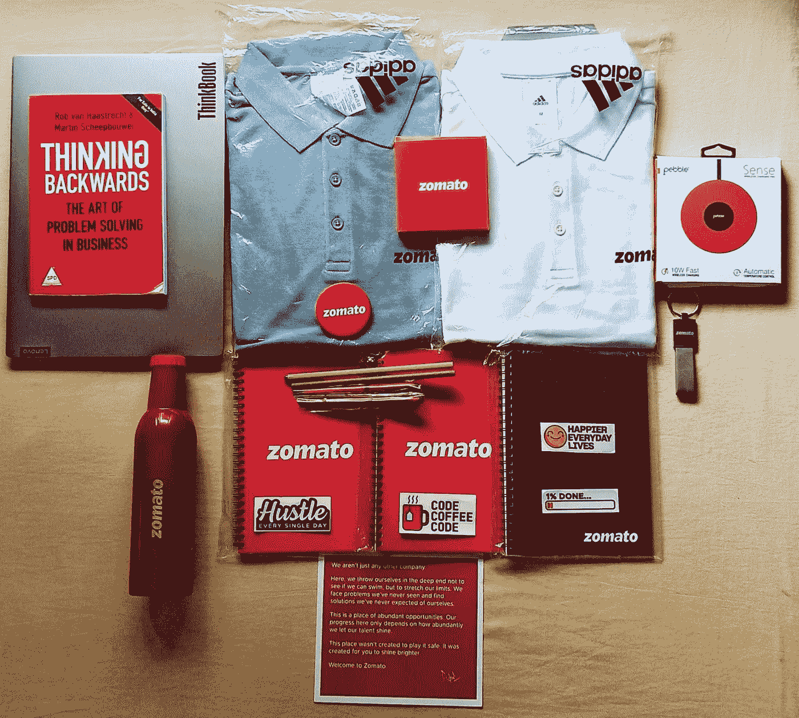

# 我是如何通过 LinkedIn 在 Zomato 获得实习机会的

> 原文：<https://levelup.gitconnected.com/how-i-got-an-internship-at-zomato-through-linkedin-be486cf23628>

## 从招聘流程到常见问题。

[涂鸦上的照片](https://www.scrabbl.com/zomato-acquires-uber-eats-to-become-india-s-no-1-food-delivery-portal/amp//amp/)

我得到了一个在 Zomato 实习软件工程师的绝佳机会。这是从 2022 年 1 月到 2022 年 7 月为期 6 个月的实习。在 Zomato 这样的公司实习对我来说是件大事，在 LinkedIn 的帮助下在校外实习也是如此。

这个博客是关于我想让其他有抱负的人知道的事情，涵盖了从 LinkedIn 在获得校外实习机会中的重要性到我获得实习机会的详细招聘过程。

## 我为什么写这个博客？

自从我在 LinkedIn 上发布了关于在 Zomato 实习的消息后，许多人都联系了我，很难回复每一条消息并回答类似的问题，这就是为什么我写这篇博客是为了给大多数有志之士一个详细的回复。

写这个博客的另一个原因是帮助消除误解，即有一些固定的方法来获得实习或工作，如

*   校内安置活动
*   公司职业页面
*   工作门户网站(例如，Internshala 等。)

最被低估的求职方法是通过 LinkedIn 上的短信或**冷信息**，这就是我如何获得实习机会的。我同意，与其他方法相比，获得实习或工作的可能性较小，但它可以让你获得一个机会，否则就不可能像 Zomato 对我一样。

# 我的招聘流程

## **联系 Zomato 的人事和招聘人员💻**

我开始更新我在 LinkedIn 上的个人资料，记录我在那之前所做的一切，这样当我联系人们时，他们会看到我的个人资料，他们会找到一些对他们有用的东西。

接下来，我开始向我的目标公司拓展我的 LinkedIn 网络，Zomato 就是其中之一。我开始向 Zomato 的所有人事和招聘人员发出联系请求，我甚至向 Zomato 的经理发出请求，因为有可能有一位公司经理对我的个人资料直接感兴趣。

## 联系上了💪

在与几个招聘人员取得联系后，我开始给他们发信息，给他们每个人发一条独特的信息。关键不仅仅是向他们传达信息，而是在最短的时间内吸引他们的注意力。

为此，我曾经确定过一些事情，比如我在 LinkedIn 上非常活跃，因此我看到了 LinkedIn 上的一篇帖子，如下所示👇

正如你所看到的，该公司正在寻找全职的 Android 工程师，这意味着技术团队的招聘现在可能很活跃。因此，这是我开始发出信息的暗示，就好像他们正在寻找全职员工一样，那么要求实习也没有什么坏处。在给他们发短信之前，我一直在想的一件事是，我曾经看到过，招聘人员或人力资源现在在线吗？很明显，我不是唯一一个联系人力资源的人，这就是为什么如果有人在 LinkedIn 上很活跃，然后有新消息进来，它会在列表的顶部，那时有多少人给招聘人员发消息并没有什么区别。

我想我可能为此联系了至少 9-10 名 Zomato 员工，对我来说这是一个非常简单的方法，但帮助我抓住他们注意力的**重要的事情**是在邮件的底部附上我的网络作品集。

为什么这很重要，因为我自己设计和制作了我的作品集，并把它当作一个项目本身，因为对我来说，这是展示你的作品或至少展示你的技能的最快方式。

查看我的投资组合以供参考👇

 [## Mayank Aggarwal 投资组合

### 我是一名正在攻读 BTech 的大四学生。我感兴趣的领域是全栈开发、机器学习…

mayank0255.github.io](https://mayank0255.github.io/) 

## 我得到了回复🎉

这是我从他们那里得到的回复，我也尽快回复了，这样可以即时得到后续回复。注意这里，招聘人员说，

> 你好，Mayank，因为离你毕业还有一段时间，我建议我们讨论一下实习。

因此，在我之前的信息中，**我没有提到我毕业的时候**，招聘人员仍然提到了它，这意味着招聘人员至少**查看了我的 LinkedIn 个人资料或我的投资组合**，他们是从哪里获得这些信息的**。所以，我能够抓住招聘人员的注意力，然后我得到了回复，进一步推断他们可能已经被它打动了。**

## 第一次面试🎓

在 LinkedIn 上进行了一次简短的对话之后，我得到了一个 30 分钟的 Zoom 电话邀请链接🎊

电话安排在同一天，我非常紧张，因为我没有时间准备，我不知道这是一个基本的对话还是一个技术面试。

然后开始通话，我面前只有一个人，是 Zomato 公司的首席技术官 Gunjan Patidar，他正在和我进行一对一的通话😲虽然我认为我变得不必要的紧张，因为他问了我一个简单的问题，告诉他关于我的一切，从我拥有的技能，我做过的项目，我以前的实习等等。

在这之后，我们就技术团队 Zomato 进行了一次谈话，他告诉我在这之后会有一次人力资源面试，这基本上是一种形式。所以，简而言之，在这一点上我有了实习机会😁

## 人力资源面试

这是一个简短的对话，问了一些基本的人力资源问题，然后是加入日期、角色等问题。，被问到。

打完电话后，我拿到了实习聘书🎉 🎊第二天本身。

所以，这是我的招聘过程，不能保证这是每个人的过程，因为我以不同的方式接触公司，这就是为什么 LinkedIn 上的**冷漠信息对我来说是关键。我听说 Zomato 也在校园里招聘了很多候选人，但不幸的是，它没有从我的大学里招聘。**

我建议有志之士在 LinkedIn 上活跃起来，成为其中的一员，因为通过它获得的机会是无穷无尽的。积极主动包括与人接触，不仅是为了从他们那里获得机会，也是为了进行一次随意的交谈，获得他们的一些经验和指导。

另一件事是保持你的 LinkedIn 个人资料的更新，这不仅仅是填写信息，还包括以某种方式输入信息，还包括输入正确的信息，不应该有任何虚假信息。

我的下一篇博客将是关于 ***【如何充分利用 LinkedIn】***，在那里我将为 LinkedIn 写一份完整的指南。

照片由 [Gangotree Das](https://www.linkedin.com/posts/gangotree-das-219b18176_zomato-zoman-activity-6823606658527301633-AajL) 拍摄

# 常见问题

*我在 LinkedIn 上经常被问到的关于我在 Zomato 实习的问题*

1.  他们的招聘页面上写着 Zomato 只通过推荐招聘，是真的吗？它确实通过推荐招聘，但这不是唯一的方法，因为他们在求职页面上提到了另一件事，如果你具备所需条件，他们会找到你，这意味着你需要从其他候选人中脱颖而出。
2.  你能告诉我联系人的名字吗？抱歉，我做不到，这不是关于某个人的机会，而是关于在最短的时间内吸引他们的注意力。
3.  是校内还是校外？这是在校外，通过 LinkedIn。
4.  **佐马托雇佣校内员工吗？是的，它确实在校内招聘，但是我不知道学院的名字。**
5.  你在面试中被问到 DSA 问题了吗？不，我不是，而且我认为那不是他们想要的东西。

非常感谢你阅读这篇文章。我很高兴分享我的经验，并通过这种方式帮助和激励他人。

如果你想知道我错过了什么，请在评论中告诉我😄

**在** [**GitHub**](https://github.com/Mayank0255) **上找我👇**

 [## Mayank0255 -概述

### SDE 实习生@佐马托|创作者@阿梅格玛| MUJ IT'22。Mayank0255 有 37 个可用的存储库。遵循他们的准则…

github.com](https://github.com/Mayank0255) 

**在**[**LinkedIn**](https://www.linkedin.com/in/mayank-aggarwal-14301b168/)**上与我联系👇**

 [## Mayank Aggarwal -软件开发实习生- Zomato | LinkedIn

### 你好，我是一名正在攻读 B. Tech 的四年级学生。我感兴趣的领域是全栈开发、机器学习…

www.linkedin.com](https://www.linkedin.com/in/mayank-aggarwal-14301b168/) 

**查看我的** [**作品集**](https://mayank0255.github.io/) **👇**

 [## Mayank Aggarwal 投资组合

### 我是斋浦尔马尼帕尔大学的四年级学生，在信息技术领域学习 BTech

mayank0255.github.io](https://mayank0255.github.io/)