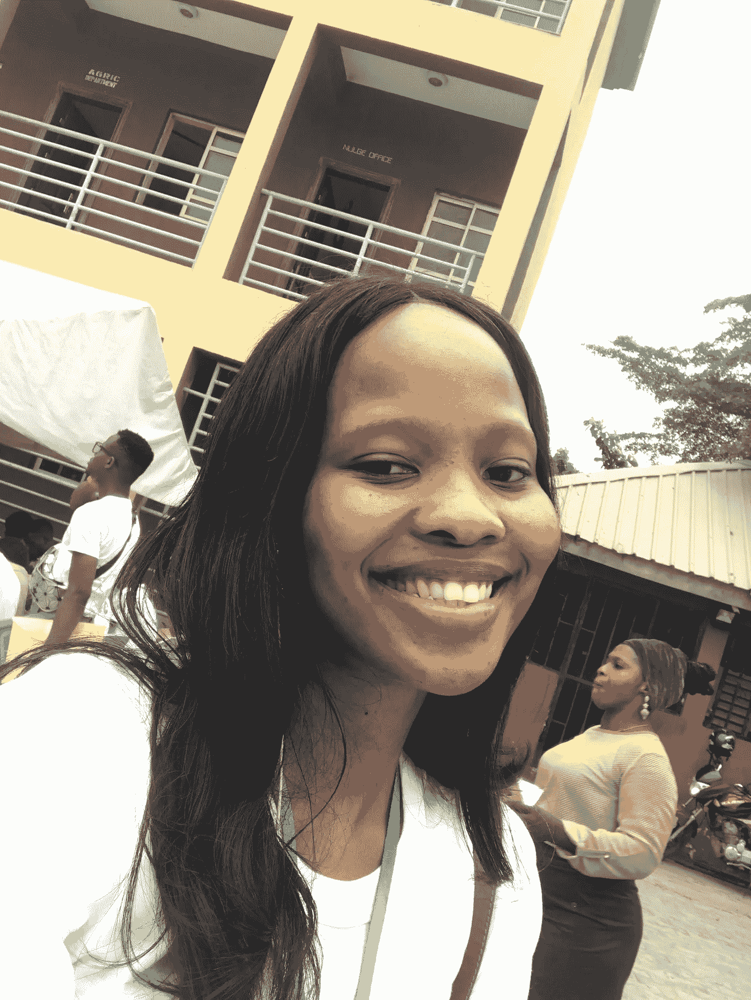
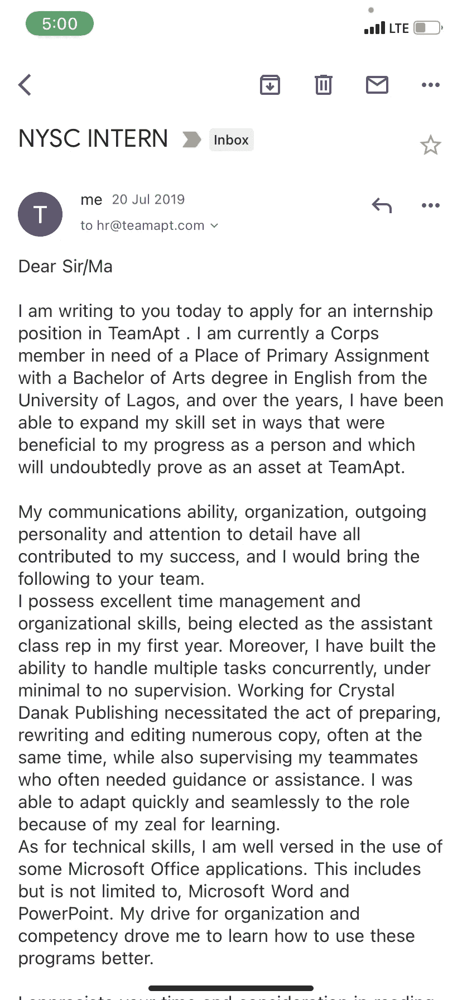
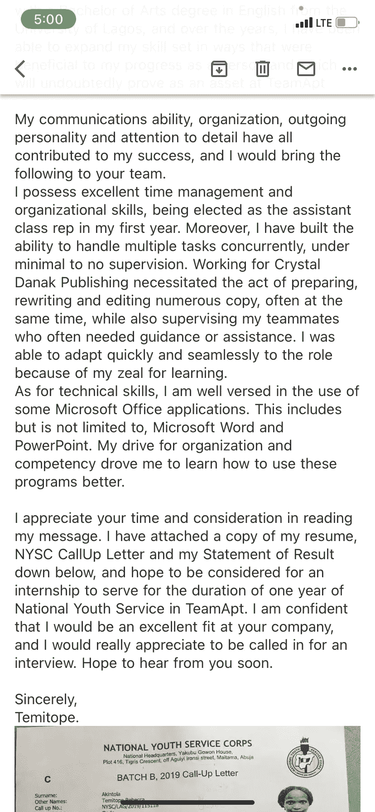
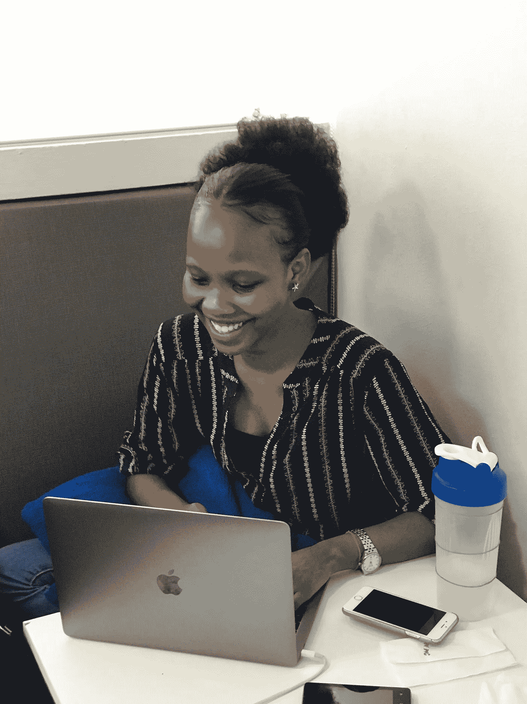
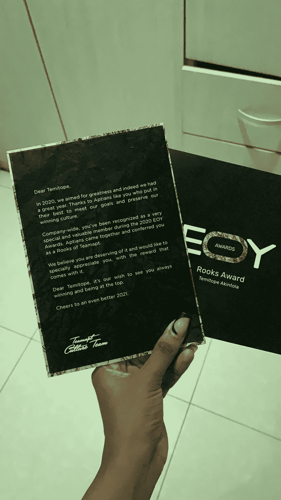
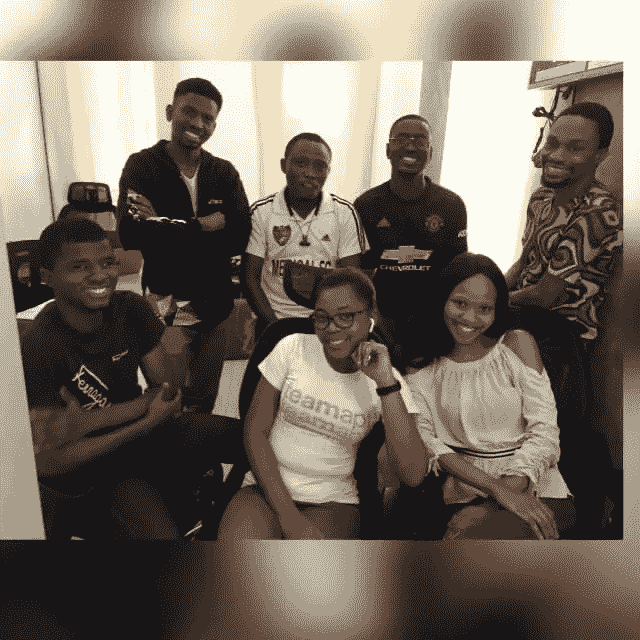
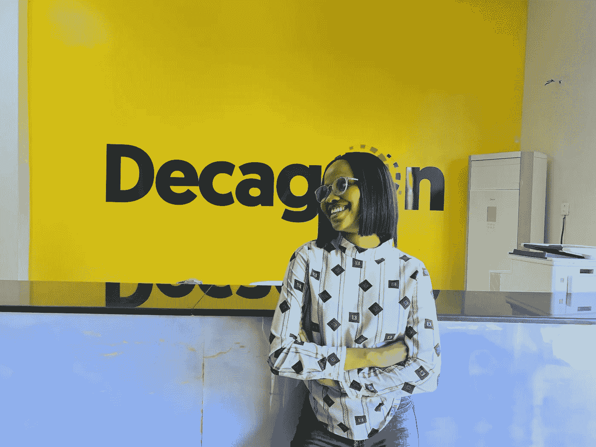
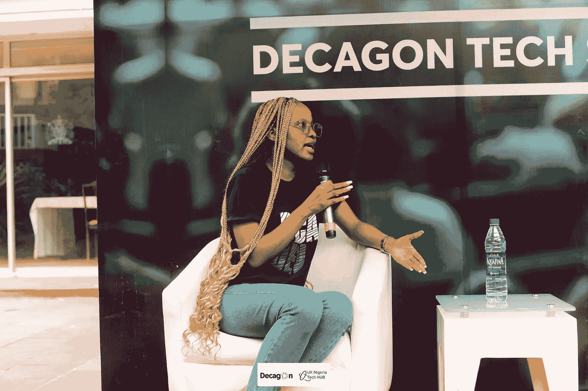

# 我如何得到我的理想工作:从客户支持代表到软件工程师

> 原文：<https://levelup.gitconnected.com/how-i-got-my-dream-job-from-customer-support-rep-to-software-engineer-166e4d627716>

我第一次来到阿布贾。这里比拉各斯平静多了。因此，当我在这个可爱、安静的城市时，让我来讲述一下我是如何从一名 NYSC 公司成员到一名客户支持代表再到一名软件工程师的故事。

我的故事始于 2019 年的 NYSC。刚从迎新营出来，我需要一个 PPA，主要的工作地点，所以我打印了很多份我的简历。每天我都会穿着卡其布，走在拉各斯的大街上，从一家公司到另一家公司，询问他们是否有职位空缺，并递出我的简历。

有一天，我遇到了我排里的一个朋友。我们交换了电话号码。他是从 Flutterwave 来的，他去那里求职。他告诉了我很多其他我可以申请的地方。我是从他那里第一次听说 TeamApt 的。

我在网上找到了位于 Naza 的 TeamApt 人力运营主管的电子邮件地址，并立即发送了一封附有我简历的电子邮件，称我需要一名 PPA。我甚至不知道我想要什么角色。我只知道我想在一个组织里工作，找到自我。我在谷歌上看到，最容易开始的角色是客户支持，所以这就是我申请的。

娜扎回复我的电子邮件说，他们没有任何空缺。我给我们排的一个人发了短信，告诉他 TeamApt 的反应。我问他:“我还应该去办公室吗？”他说，“是的，如果你想的话。”

我觉得。

所以我去了 TeamApt 的办公室，并喜欢我所看到的。每个人都穿得很随意，这个地方有一个很好的氛围。我还是拿到了 L sha，因为就像他们邮件里说的那样，他们当时真的不招人。我问我是否可以放下一份我的简历。他们说是。我丢了两份拷贝，以防其中一份丢失。

我几乎一个月没有收到他们的回信。我正要放弃找工作。我收到了另一个地方的邀请，但我真的不喜欢这份工作。我决定，如果我在那个月底之前没有收到 TeamApt 的回复，我将在另一个地方继续。

离月底还有两天，在一个美丽的星期三，我接到了 Ope 的电话，她在 TeamApt 的人力运营团队工作。他们有一个空缺。她说要检查我的电子邮件，因为我被邀请参加面试。

Omo，我惊呆了。我以为她打错电话了。因为他们已经拒绝了我两次。也因为冒名顶替综合症是我的一个问题。

但是我没有闲心去自我怀疑。这是我离开战壕的通行证。我为面试努力学习，以至于招聘经理所罗门问我是否临时抱佛脚。Lol，sapa dey 激励。

我在参加完面试回家的路上，坐在去伊比尤莱基的公交车上，接到了一份工作邀请。这就是我如何在 2019 年 8 月在 TeamApt 开始担任 Moniepoint 的客户支持代表。

我热爱我的工作，并且下定决心要成功，因为就像我说的，我有抱负。因此，我从一个需要不断指导的新手变成了一个人们寻求解决方案的资源。过了一段时间，我被调到了运营部。我也付出了 110%的精力。

公平地说，TeamApt approaches 的每个人都以同样的追求卓越的精神工作，所以我的职业道德并不是异常的。Aptians 超级投入他们的工作。我非常钦佩这一点。我特别喜欢 TeamApt 的开发人员，几个月来一直有转行的想法。

但问题是我害怕告诉任何人这个目标。我觉得自己像个笑话。我是说，我在大学学过英语。我看不出我会如何从那成为一名软件工程师。

一天，当我和当时的团队领导 Odun Adeboye 谈论个人目标时，我告诉他我的梦想是成为一名软件工程师。

Odun 不仅鼓励我这么做，他还带我去见了 TeamApt 的 to Felix Ike，向他咨询如何进行转型。

我从未与之交谈过的费利克斯立即投入了我的旅程。他给我发了一个 Udemy 上的课程，名为 Python for Everybody。费利克斯说去试试这个课程，如果我喜欢，我可以回来，我们一起计划下一步。

我喜欢这门课程，下班后会留下来学习。事情进展得很顺利。

然后 COVID 命中。

不确定性，封锁，所有这一切都付出了代价。我走神了，停止了在球场上的工作。我的 python 之旅就这样结束了。

我坚持尽我所能做好我的工作，同时克服 COVID 的焦虑。随着世界稍微安定下来，COVID 的新鲜感逐渐消失，我开始感觉到再次转向的动力。

大约在同一时间，我和 Moniepoint 团队的一名技术支持人员 Onome 以及一名和解官员 Tosin Olubiyi 交了朋友。他们都认为我有责任。

每天在工作场所，托辛都会问我是否已经开始努力实现我的梦想。

为了让托辛不再烦我，我认真对待我的目标。我在网上加入了这个班，导师会在晚上给我们上课。它花了大约 10，000 奈拉，真的很便宜。我们首先学习 git，然后转向 HTML。那是我第一次觉得自己在表演魔术。我非常喜欢 HTML 和 CSS。之后，我们转向了 Javascript。

没有奥诺米，我不可能在那个班里进步。每次我遇到困难，他都尽最大努力帮我度过难关，指导我解决问题。有一次他熬夜帮我解决一个特别棘手的问题。

然而过了一段时间，导师不再教我们了。我几乎什么都不知道。我需要高质量的知识。

就在那时，我看到迪冈学院有一个空缺。Decagon 是拉各斯的一所软件工程学院。我的计划是写入学考试只是为了研究，这样当我下次真正准备好申请时，我就会有所期待的背景。

我考了，没通过。

Decagon 告诉我们，那些失败的人可以在两周内重考。我不喜欢失败。所以我打电话给奥诺米，在他的帮助下，我非常非常努力地学习，再次参加考试，并通过了。

2021 年 11 月，我被迪冈录取。

但是有一个问题。迪卡侬需要六个月的承诺。在 TeamApt 工作期间，我无法学习兼职。另一方面，我喜欢 TeamApt，不想离开这家公司。

在我的团队领导和人力资源的帮助下，我们找到了一个适合各方的折中方案。我休了一段时间的假，因为我知道我可以回到客户运营代表的工作岗位上。如果我想以开发人员的身份重新加入团队，我必须通过招聘流程和测试。我同意了。

我不得不在这里暂停我的故事，向确保我在一月份得到一个生日蛋糕的人力资源团队大喊一声。这对我意义重大。

好吧，我们说到哪了？迪卡侬。

迪冈是一生的经历。有挑战性，但真的很好。他们操作翻转学习系统，这意味着大部分学习是自我驱动的。我被放在 Java 路径上。有敏捷要学，有每周的课程要上，还有每周两次的算法。

随着训练接近尾声，我知道是时候回到 TeamApt 了。我不想在别的地方工作。

我团队中的每个人得知我来自 TeamApt 后，都会马上说:“哦，哇，你在 TeamApt 工作？你是我新的最好的朋友。我想去那里工作。”

所以，是的，即使我还不想回来，看到其他人对在这里工作的前景是多么兴奋，也足以激励我了。

迪冈的项目包括四个月的培训和两个月的实习。四个月结束时，迪冈立即尝试给我安排实习。

我回应道，感谢该公司的提议，但拒绝了。公司的人事经理打电话给我，说她看了我的简历，有一个问题。

“你怎么会在 TeamApt 工作过，却想着去别的地方工作？”

我笑着向她保证，计划是回到 TeamApt。

大约三个小时后，她打电话回来说，她认为我的故事很棒，她已经打电话给她在 TeamApt 的朋友，询问是否有空缺。

猜猜她的朋友是谁…

费利克斯·艾克(Felix Ike)，这位首席技术官引领我踏上了软件工程之旅。

在 Felix、我以前的团队领导 Simpa 和 Solomon 之间，我在后端 Moniepoint 团队找到了一个实习职位。

这对每个人都很有效。TeamApt 的标准非常高，不会马上给我一个全职职位。我也想有机会穿上我的新软件工程鞋。

这些天我在工作

我怀孕两个月了，很喜欢。

我的一些代码甚至已经和产品融合了！这让我感觉很好。我把这一切都告诉了我的朋友。

这份工作非常有趣。我仍然时常感到害怕，担心自己是个骗子。但我身边有支持者帮助我提醒自己，我脑海中说这些话的那个声音是个骗子。

这些天，当我不写代码或者不看 YouTube 上关于代码的教程时，我会看网飞的情景喜剧或者和朋友打电话聊天。

我的一个好朋友也在 TeamApt 工作。所以大多数工作日我们从早到晚都在打电话。我们甚至不用说话。工作的时候不孤单真好。

这是我作为阿普特人最喜欢的一点——在这里发展的高质量的友谊。

所以，伙计们，这就是了。到目前为止我在 TeamApt 的旅程。从 NYSC 公司成员到客户支持代表，现在是软件工程实习生。

—

我现在必须回到我的朋友身边。明天早上我们要去远足。我太激动了。远程工作甜甘。

我将给你们留下迄今为止我在职业生涯中学到的最重要的一课。

不要害怕让这个职业成为你的支点。我特别想和那些想探索技术职业的女性谈谈。你能行的。感到恐惧，但还是要去做。

用诗人艾琳·汉森的话说，“在天空的微风中，有自由在等着你。

*你问，“如果我摔倒了怎么办？”*

*哦，但是我亲爱的，“如果你飞呢？”*