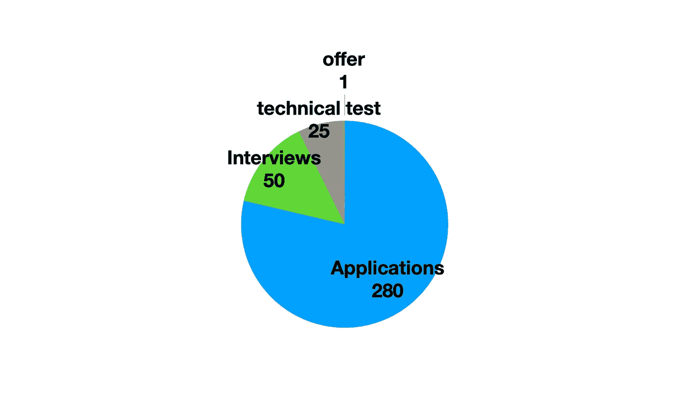
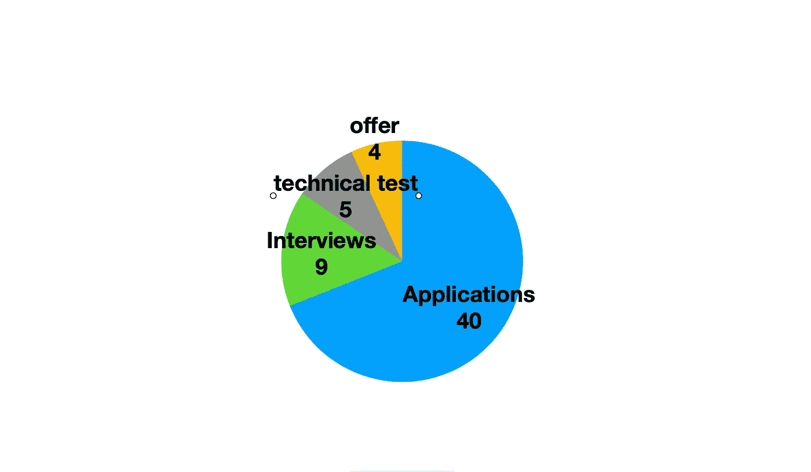

# 我是如何在参加训练营后找到第一份开发人员工作的

> 原文：<https://levelup.gitconnected.com/how-i-got-my-first-developer-job-after-attending-a-bootcamp-c6139644a23a>

## 在 250 多份求职申请后，我学到了什么

米歇尔·巴洛格在 [Unsplash](https://unsplash.com/s/photos/first?utm_source=unsplash&utm_medium=referral&utm_content=creditCopyText) 上的照片

当我决定改变自己的生活，成为一名开发者时，我已经 33 岁了。那时我已经在电影、音乐、活动、零售…

在过去的 8 年里，尽管我认为自己首先是一名 DJ。是的，我是一名专业的 DJ，在我的家乡有一个我经常演奏的地方，我也去其他城市巡回演出(只要他们会付钱给我)。
这不是我唯一的收入来源，事实上，它甚至不是我的主要收入来源。我也是一名音乐制作人/作曲家，为电视和其他类型的媒体创作图书馆音乐。我已经决定改变我的职业，但是我的老地方还剩下一个晚上。我没有告诉任何人，但这是我作为 DJ 的最后一次演出。那天晚上，我决定向一个朋友的朋友吐露，我想改变我的生活，我不再喜欢 DJ 或音乐现场，有时和你刚认识的人在一起更容易脆弱。结果这个陌生人基本上改变了我的生活。他把我介绍给了 IronHack(我参加的训练营)。

聚会在早上 7 点结束，3 个小时后，我和 IronHack 的招生代表约好了见面。

我要跳过训练营的经历。其他每个学生都写了一篇关于它的文章。是的，这是非常激烈的，是的，你交了一辈子的朋友，是的，这是一个情感的过山车。相反，我会把注意力集中在该说的都说了，该做的都做了之后的几周。这几周实际上决定了你的职业转变是否会成功。

没有人参加训练营是为了交朋友或体验。训练营接管了你的生活，而且相当昂贵。训练营的毕业生是非常有动力的人，他们肩负着使命，去找工作。

# 搜索

[Ali Hajian](https://unsplash.com/@alisvisuals?utm_source=unsplash&utm_medium=referral&utm_content=creditCopyText) 在 [Unsplash](https://unsplash.com/s/photos/search?utm_source=unsplash&utm_medium=referral&utm_content=creditCopyText) 上拍摄的照片

有很多关于人们在参加训练营时找到工作的故事，也许在结束几天后就找到了。我那群人中的大多数人都不是这种情况，我当然也不是。

一个学生找到一份工作平均需要多长时间取决于市场，但大多数训练营会宣传需要 3 到 6 个月。

我花了 4 个月。

让我来分解一下。

在那四个月里，算上我使用的所有不同平台，我申请了 280 份工作(这是一个大概的数字，实际数字应该更高)
我得到了 50 次面试。
我完成了 25 项技术测试。
我得到了一份工作。

是的，没错，只有一个报价。最棒的是你只需要一个。关于你应该选择哪份工作，已经说了很多，对于这第一份工作来说，重要的是找到一份工作。迈出你的第一步，仅仅一年的经验，同样的过程是非常不同的。

在一个月的时间里，我申请了 40 份工作。我得到了 9 次面试机会。
我完成了 5 项技术测试。我收到了 4 份聘书。

是的，越来越好了。

这是我学到的

杰克·希尔斯在 [Unsplash](https://unsplash.com/s/photos/phase?utm_source=unsplash&utm_medium=referral&utm_content=creditCopyText) 上拍摄的照片

我把面试过程缩减为四个主要阶段。一些公司有更多的阶段，但它们很可能是这四个阶段的变体。

通过分析我在哪个阶段停止了大部分时间，我能够清楚地看到我需要在哪个领域工作。代码只是这个旅程的一部分。

## 初亏

如果一个人的申请没有得到任何回复，要么是简历，要么是 LinkedIn 个人资料。一开始我就遇到了这种情况，我意识到我没有根据我申请的具体工作制作定制的简历(我最终有大约 4 个模板)，而且我认为我以前作为 DJ 和音乐家的生活无关紧要，所以我没有包括它。这是一个巨大的错误，从那以后，在我参加的几乎每一次面试中，我都被问到我生活中的这一部分。

*试着展示你的旅程为何与众不同*

## 人力资源面试

就像生活中的大多数事情一样，一切都要靠实践。起初，我在这一部分非常紧张，经过几次采访后，我想起了一些事情。我是一个非常友好的人，渴望得到一个机会来展示我对公司的贡献。这正是他们所寻找的。至少在现阶段。

## 技术面试

我记得有一次面试，我在这一部分非常失败。公司的 CTO 问我互联网是怎么运作的。他说:“当你在浏览器中输入一个地址时会发生什么？”。我的回答令人费解，我在 DNS、服务器和客户端之间来回奔波。
外卖，你不知道的东西，直到你能够用简单明了的方式交流。
从那天起，我每天至少花两个小时阅读我能找到的所有关于一般 javascript/internet/react/node 概念的文章。我找了“前 x 个面试问题”。

一旦我锁定了这些问题(这有助于我大多数时候被问到相同的问题)，我发现有一些策略可以像专家一样交流这些问题(仅供参考，在我目前的工作中，我是负责面试的人)

**善于交谈** —我开始回答这些问题，就好像我们已经是讨论代码问题的同事了。我甚至自己问了一些问题来获得他们的意见。我可以从他们的眼神中看出面试进行得很顺利，没有人想和机器人说话。

**不要撒谎—** 当被问及我不知道的事情时，我往往会大发雷霆，并试图将问题引向我知道的事情。在我作为面试官的新角色中，我可以自信地说，只需要 1 秒钟就可以知道一个人是否知道一些事情。如果有人问我一些我不知道的问题，首先我会明确声明我不知道这个问题的答案，然后问这是否与 x 有关。在这种情况下，我会解释 x 是什么。

**发表意见—** 随着我开始阅读越来越多的文章，我意识到我开始对许多问题有了自己的看法。当我发表意见时，我发现我表现出了热情和批判性思维。我的大部分观点来自我阅读的文章，这里的要点不是要有独创性，而是要清晰地表达和交流对一个主题的深思熟虑的观点，它们可以被许多其他开发人员分享，事实上，如果采访者有和我一样的观点，我知道我已经把它们放在口袋里了。

**永远不要说“因为这是我一直被教导的”——如果发表意见表明我是一个批判性的思考者和对一个主题充满热情，那么说上面的短语表明了完全相反的情况。我使用这句话的次数不多，但我能立即看到面试官脸上的失望。
面对现实吧，我们用这条线是因为是真的。我们已经开发了几个月，所以原谅我们不知道 30 种不同技术的来龙去脉。我学到的是，通过将问题提前，我听起来好像知道自己在做什么。我的意思是，不要回答为什么你学会了反应，而是回答为什么你选择了一个有反应而没有棱角的训练营**

## 技术测试

当我说技术测试时，我指的是带回家的作业。这些是目前为止我遇到最多的技术测试类型，我认为它们最适合几乎没有经验的低年级学生，因为它们使学习和实践更有吸引力，为什么？在这条线的尽头可能会有一份真正的工作。

**成功了！—** 这应该很简单，对吧。根据经验，我知道这种事情会发生。我对代码做了一个小的改动(至少我是这么认为的)，就像我准备发送任务一样。我之前已经测试过无数次了，我很着急，什么都没有改变，对吗？
错了！它不起作用！面试官在我的作业上花的时间不超过 30 秒。

**重要提示—** 我花了太多时间才发现这类测试的一个非常重要的秘密。不是所有事情都重要。这些任务通常是由团队中的一个开发人员创建的，他认为自己的初稿太短了。这个开发者接着添加了一些不相关的东西。一旦我开始花时间分析任务的核心是什么，我就能把额外的时间花在重要的事情上。现在是我来纠正这些类型的测试，我经常看到开发人员把宝贵的时间花在最终无关紧要的事情上，而没有太关注真正做了什么。

**干净的代码&可读性—** 我读了 Bob 叔叔的《干净的代码》,这本书非常棒，正如大家所说，这本书在我成为开发人员的过程中对我帮助最大。我也阅读了尽可能多的关于适用于许多框架和语言的干净代码原则的文章。干净的代码绝对是一个旅程，但如果我必须用一句话来总结，那就是这句话。 ***写代码让别人看得懂*** 。不是为了炫耀你有多聪明，甚至不是为了让机器能理解它。

**不要着急—** 每次我必须完成这些测试中的一项时，我都会感到必须在规定的时间内交付的压力。面试官总是问我是否能在两天内或者周末或者周末拿到。然后他们会花几个星期来回复我。有一天我决定说点神奇的。“好的，当然，我会尽快拿到的”。只有我知道“尽快”是什么意思。我从来没有因为迟到而错过机会。因为操之过急，我已经失去了很多机会。我想，*我是想要快速完成还是正确完成？*

布雷特·乔丹在 [Unsplash](https://unsplash.com/s/photos/done?utm_source=unsplash&utm_medium=referral&utm_content=creditCopyText) 上的照片

当我结束训练营时，我参加了很多讲座，阅读了很多关于获得第一份工作的文章，尽管一些信息证明非常有价值，但没有一篇是 100%真诚的。
我希望这曾经是，并且能够像我一样帮助别人改变他们的生活。

# 分级编码

感谢您成为我们社区的一员！[订阅我们的 YouTube 频道](https://www.youtube.com/channel/UC3v9kBR_ab4UHXXdknz8Fbg?sub_confirmation=1)或者加入 [**Skilled.dev 编码面试课程**](https://skilled.dev/) 。

 [## 编写面试问题+获得开发工作

### 掌握编码面试的过程

技术开发](https://skilled.dev)