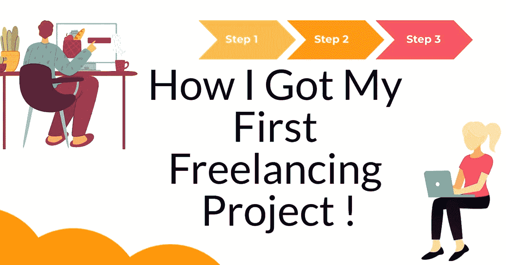

# 我是如何得到我的第一个自由职业项目的！

> 原文：<https://levelup.gitconnected.com/how-i-got-my-first-freelancing-project-722c7688deab>

# 努力获得你的第一个自由职业项目？

注意:这篇文章是特别为那些正努力以自由职业者的身份挣得第一美元的新手写的。

# 进入自由职业世界需要注意的事情

1.  一如既往的默认要求:集中精力，充分了解你将向客户交付什么。我该怎么做？。不用担心，我们将在下面讨论。
2.  积极参与社区论坛。(我已经订阅了 django 用户组，并且在最初的时候一直在阅读发来的邮件)这确实帮助我理解了其他开发者所面临的问题。现在一天的不和是其中一个最好的工具变得流行这些。
3.  提交项目提案时专注于单一技能(最初我只专注于 Python/Django 项目)，因为我在使用 Python 和 Django 框架创建 web 应用程序方面经验丰富。
4.  使用 Github 展示你的专业知识，以及你对你所做的事情有多少热情。创建一些示例应用程序，并开始定期为开源项目做贡献。为开源做贡献一定会增加你的知识和人脉。
5.  活跃在 stackoverflow.com 的[上，通过提问和回答问题赢得声誉。实际上，我正在过滤 stackoverflow.com](http://stackoverflow.com/)[上的标签#django 和#python，并不断刷新浏览器以回答下一个问题。这真的帮助我增长了作为开发人员的知识。](http://stackoverflow.com/)
6.  以更低的价格/零成本提交您的提案。最初只关注客户的好评；一旦你开始交付高质量的工作，钱就会跟着你。
7.  准备好每天连续花几个小时，当你的提议在平台上列出时，立即提交。作为一个初学者，我花了几个小时来完成我的第一个项目。
8.  提交项目建议书时，请务必附上你的 Github 和 stackoverflow.com 简介。这实际上增加了我获得项目的机会。

**针对初学者的特殊技巧:**

1.  尽量申请新的自由职业平台上列出的项目，因为申请项目时竞争对手会少一些。
2.  在成功交付项目后，总是要求客户提供一些评审，但不要强迫他们。
3.  确保打开手机/网络上的通知，并在客户询问时回复信息。延迟回复，可能会失去你的机会。
4.  最后，重要的一点是，每当你学习新技能时，总是展示它。Github 是最好的地方之一。

**如何获得长期客户:**

1.  不可替代是在项目中遵循的最佳策略。
2.  把你所有宝贵的时间投入到了解这个项目中。
3.  不要因为工作的复杂而离开你的客户。

按照这些步骤，客户将很难找到你的替代者，结果你肯定会赢得一个长期客户。

感谢阅读，请在你的网络内分享，如果这引起你的共鸣。

你也可以[在 twitter](https://twitter.com/intent/follow?screen_name=geojacobm6) 上和我联系，因为我会经常在那里记下我的想法。