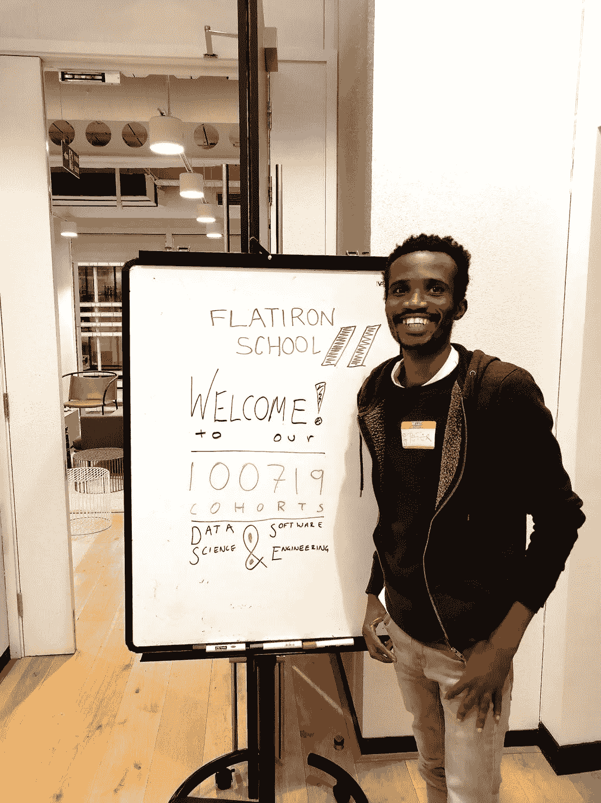
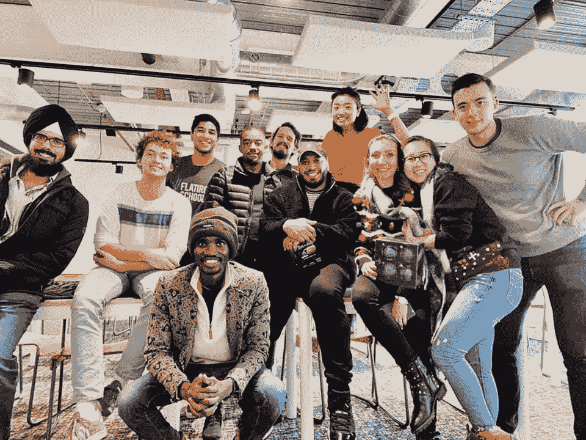
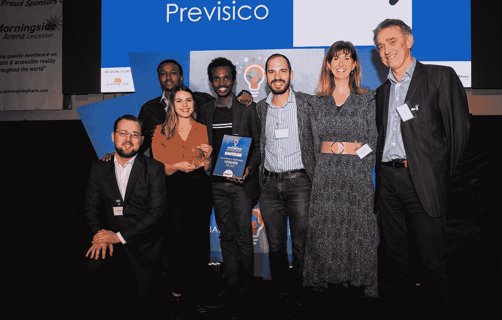

# 作为一名非洲移民，我是如何在英国找到第一份技术工作的。

> 原文：<https://levelup.gitconnected.com/how-i-got-my-first-uk-tech-job-as-an-african-immigrant-ceab96f010c3>

我在一个亲密的脸书小组上分享了这个经历，似乎激励了很多人，所以我决定在这里分享它，并希望它鼓励更多的人经历类似的经历。

做黑人真的很难，这不是新闻，做黑人和第一代移民更难。

我在熨斗学校上学，身无分文，在伦敦甚至连两个星期的房租都没有。我开始住在伦敦郊外的宿舍里，我的学校在伦敦市中心一个我们工作的地方。这意味着早上要坐很长时间的公交车，回宿舍也要坐很长时间的公交车。

这意味着一个非常短的夜晚，为了节省宿舍的钱，我会留在校园里通宵工作，如果你知道我们的工作设施，他们用有电话靴，有时我睡在电话靴过夜。早起梳洗一番，为新的一天做好准备。

因为我的预算很低，所以我一天只吃一顿饭，咖啡、巧克力和饼干在校园里随处可见，这是我早餐会吃的东西。我会买午餐，白天吃一部分，晚上吃剩下的。

在移居英国之前，我一直在尼日利亚从事技术工作，我拥有计算机专业的国际文凭，IT 安全专业的 BBA，我在尼日利亚有大约 5 年的工作经验，有国际奖学金等等。但所有这些都不足以打入英国的科技生态系统。作为一名新移民，你的零英国经验受到了诅咒。

我听到很多人说这是多么的有限，不管你的简历多么令人印象深刻，没有英国经历会成为你和你的第一份工作之间的障碍。

因为我已经尽我所能减轻这种影响，至少就我所知，我是英国红十字会的志愿者，我还参加了阿姆尼克社会企业工作体验项目。然后我开始申请我技能范围内的每一个职位，有一段时间我甚至申请了最不入门的工作。我甚至申请了 WordPress 内容经理的职位，这是一个在 WordPress 网站上发布内容和为电子商务网站输入数据的花哨名字。我甚至没有得到回电。

在许多申请之后，我开始接到一些电话，有些是在电话之后，他们问我在英国的经历。有一个通过了，我发出了一个参加面试的邀请，这个职位是一家机构的 WordPress 开发人员，这真是一个很棒的面试，然后他们给了我一个模型来构建一个完整的 WordPress 主题，我在三天的时间框架内完成了大约 70%的工作。我从头开始编写所有代码，他们说这还不够，我可以使用 Bootstrap😊。

有些面试我会得到反馈，比如公司服务的业务有数百万英镑的营业额，而我没有参与过这样的项目，所以他们没有和我一起前进。来自尼日利亚的百万英镑生意:这是告诉你没有英国经验的一种好方式。

这就是我决定去熨斗学校的原因，因为我已经没有选择了，我实际上是作为技术导师与 Udacity 合作，但工资不稳定，很大程度上取决于学生的出现。我需要进入这个英国科技生态系统，我需要做些什么改变。

熨斗学校是全球知名的学校，根据我在尼日利亚的经验，我知道人们会雇佣他们觉得有关系的人，通过推荐或关系。我在尼日利亚的所有工作都是通过推荐完成的。也许我需要的是将自己融入一个生态系统，在这个系统中，我可以得到所有英国人力资源的信任。这正是我所做的。

熨斗学校不便宜，甚至在伦敦住 3 个月都不便宜。当我申请熨斗学校时，我晚上在一家工厂工作，白天为 Udacity 工作。我把钱凑在一起，买了一台新的 MacBook Pro 2019 我妻子也投入了一些资金。

我周六前往伦敦，希望征服英国的求职山。我在学校拼命学习，我比我的同学付出了 10 倍的努力。在我的头两个星期，我因为营养不良和睡眠不足而病得很重。我甚至连第一次编码挑战都失败了。但我没有让这阻止我。有一天晚上，校园里只有我一个人，我患了重感冒，我以为我要死了。我在电话里哭泣，只有我。我熬过了那个噩梦真是个奇迹。我要求自己每周创建一个新项目。我们通常每三周创建一个项目，我另外创建了两个。

当我提前阅读时，我正在创造新的项目，所以我在申请新的工作。你可以想象，我收到了很多拒绝，但我从未停止。我收到的拒绝越多，我就向英国所有的求职平台申请越多。我接受了一些电话采访，一些 Skype 采访。有些甚至很有希望，但却在无尽的等待中结束。但是失望越多，我就越坚持下去。

在一周又一周地住在一个又一个宿舍后，我妻子用我在 Udacity 的工资筹集了一些资金，我在伦敦东部找到了一个住处，有了一点点安定，可以在学校呆更长时间，然后回家住在一个舒适的公寓里。

2019 年 12 月，在该计划开始约 2 个月后，我的银行出现了一个奇怪的问题，我在 Udacity 的工资被标记，我无法获得资金。那时我意识到伦敦的房东们没有笑。我完全花光了所有的钱，我无法在伦敦养活自己。那年 12 月是我一生中最糟糕的圣诞节。我退出了校园计划，转到了网上。

你会问，既然有选择，为什么我不在网上做我的项目。我们都知道在线课程可能带来的那种动力下降，我以前也经历过。我真的很想毫无借口地付出我所有的一切。我很高兴我做到了。在校园里，我遇到了很多了不起的人，也向自己证明了我并不是一个糟糕的程序员。我的熨斗经历证实了我所知道的一切，也证明了我足够优秀。

熨斗学校了不起的朋友和教练

但我认为，我在熨斗学校学到的很多东西比学费更有价值:它是如何像软件工程师一样思考和解决问题的技能。社区，积极的环境，教练和指导员都很棒。熨斗学校改变了我的生活。

搬到网上后，我的一些申请得到了两个肯定。其中一个给了我第一份工作。穿过黑暗，泪水，疾病，饥饿，深夜，短暂的睡眠。这是我在英国的第一份工作，作为一名软件工程师，在一个我热爱的组织里和出色的团队成员一起工作。

> 这是我在英国的第一份工作，作为一名软件工程师，在一个我热爱的组织里和出色的团队成员一起工作。

更好的是，我是我的同学中第一个找到工作的，即使你熨斗学校有惊人的支持和求职指导，我从来没有使用他们。为了实现我在去伦敦的巴士上对自己许下的承诺，下周一走进我的新工作岗位时，我将结束这个节目。

世界上没有任何地方会把那东西交给你。你必须有足够的饥饿感，才能不顾一切地去争取。你要么在尼日利亚，要么在国外，即使我在尼日利亚的家里，也没有任何东西交给我。我是由一个没有读完小学的单亲妈妈带大的。任何地方都没有等待我的连接，我成功的机会不到 0.05。

> 最重要的是，我们需要有人相信我们，我很高兴熨斗学校和 T2 普雷维西科相信我。😍✌🏾

有时候我们不得不说，要么我成功，要么我死也要努力，我希望写更多关于一些细节的东西，但是如果你有任何问题，我很乐意在评论中回答。

😊继续前进…#改变事物

我正在开始一个 [YouTube 系列](https://www.youtube.com/channel/UC6bYkP764Tdbi1N904T2Fvw?view_as=subscriber)来帮助绝对的技术初学者入门，如果你是或者认识一些人，请友好地与他们分享。

[https://www.youtube.com/channel/UC6bYkP764Tdbi1N904T2Fvw?view _ as =订户](https://www.youtube.com/channel/UC6bYkP764Tdbi1N904T2Fvw?view_as=subscriber)