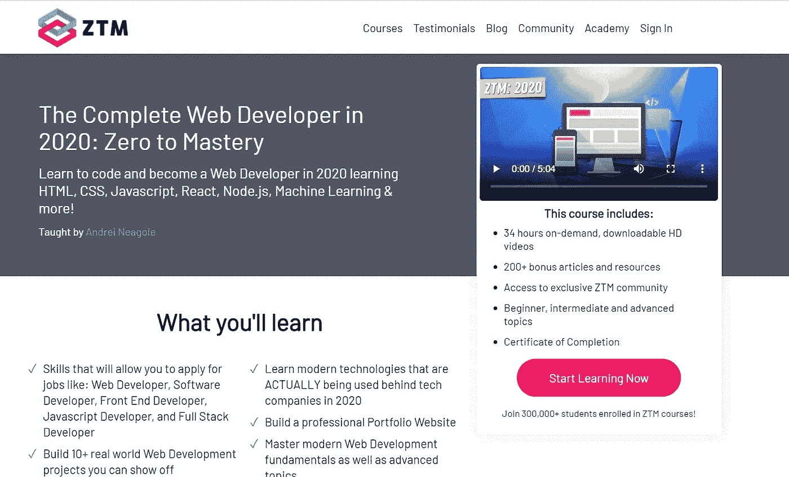
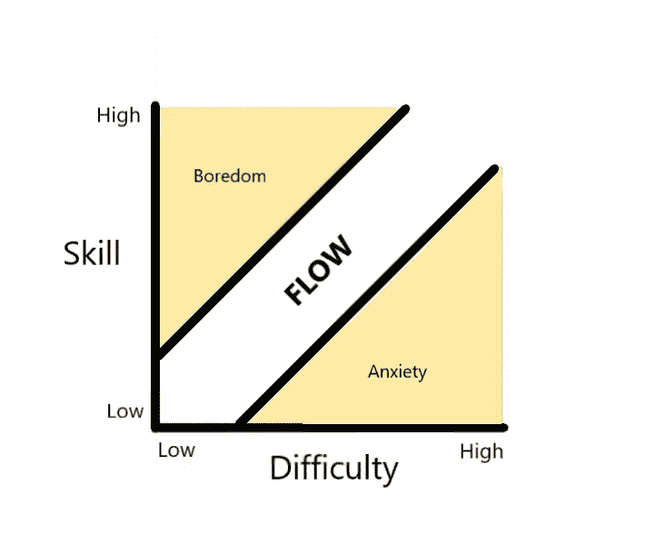

# 我是如何通过“重修”我的 web 开发课来摆脱辅导地狱的

> 原文：<https://levelup.gitconnected.com/how-i-got-out-of-tutorial-hell-by-retaking-my-web-development-class-602c448ff433>

## 入门指南

## 通过构建我的第一个应用程序并开始获得独立，我学到了很多东西

在 [Unsplash](https://unsplash.com?utm_source=medium&utm_medium=referral) 上由 [Aron 视觉](https://unsplash.com/@aronvisuals?utm_source=medium&utm_medium=referral)拍摄的照片

*注:这篇博文是由 Andrei Neagoie* *撰写的《2020 年完全 Web 开发人员:零到精通课程》的学生撰写的。然而，大多数内容应该对任何开始编码之旅的人都是可访问的。*

想象一下。你正坐在电脑前，准备开始构建你的第一个编程项目。也许你已经看过一些 YouTube 教程，或者在 Udemy 或 Coursera 上上过一两门课。所以，你对如何开始有了一个大致的概念。但是，当你盯着你的电脑时，你的大脑慢慢变得一片空白。你的在线导师的指导声音逐渐消失。而剩下的只是一个空的代码编辑器，一种模糊的不确定感，也许，恐惧，不清楚下一步该怎么做。

我有一种感觉，你们中的一些人经历过这样的经历。你所感受到的是处于[‘教程地狱’](https://mastery.games/post/deliberate-practice/)的症状。换句话说，你很擅长跟随教程。但是自己迈出编码的第一步是很困难的。我发现“初学者”进入这种情况很常见，我想分享我是如何走出教程地狱的，以及我从我的经历中学到了什么。

答案似乎很简单:建立一个项目，稍微拓展一下你的技能。实践是获得技能和提高的最佳途径。问题是我们必须在精神上说服自己迈出第一步。

在我继续之前，知道不仅仅是新手在不确定性和恐惧中挣扎可能会有所帮助。大师——无论是程序员、音乐家还是运动员——也会经历这种情况。我喜欢爵士乐传奇人物迪兹·吉莱斯皮的这句话:

> 有些日子，你站起来，把喇叭(乐器)对着你的嘴唇，它听起来很好，你赢了。有些日子你尝试了，但什么都没用，号角赢了。如此周而复始，直到你死去，号角获胜。

如果一个高手每天都要经历这种挣扎，难怪我们初学者也会！只是，我们需要适应这个现实。

## 这个人是谁？

我学的是音乐和市场营销，在美国一所重点大学的研究机构有一份公关工作。我工作的一部分是管理一个每年有数万次访问的网站。几年前，我决定定制我们的网站，这样它就能在与我们的竞争对手的对比中熠熠生辉。这就是我开始 web 开发之旅的原因。我自学了一些 HTML 和 CSS。我最终投身于 JavaScript 和更复杂的框架。

我在 Udemy 和 Coursera 上了一些基础的 JavaScript 课程。然后，我一头扎进了 ZTM 的安德烈·尼戈伊(Andrei Neagoie)的两个课程(T1)和 T2 的《2020 年完全的 Web 开发人员:零到精通》(T3)和 T4 的《从初级到高级 Web 开发人员的完整路线图》(T5)。这条道路给了我更好地改进我所在机构网站的工具。但更重要的是，我现在对转向编码职业感兴趣，因为我发现它超级迷人。

# 构建我的第一个应用程序

在学习教程的间隙，我决定暂停学习新材料，开发自己的应用。我有一个起点。我曾想开发一个应用程序，让我在当地杂货店购物更快。在美国，杂货店可能很大。你最终要花很多时间从商店的一头走到另一头，然后再回来，只是为了找到你要的东西。我讨厌那样！:)

基本上，我想要一个加快购物过程的购物清单应用程序。它将具有以下特征:

*   在自动完成表单功能的帮助下添加项目
*   向项目添加注释
*   核对项目
*   设置更改列表显示顺序的类别，以优化我的商店空间
*   根据我的购买历史记录，“快速添加”菜单中的 10 个最喜欢的项目
*   黑暗模式 toggler，只是为了好玩！

下面是我搭建的:[演示](https://ihouwat.github.io/shopping-list-react-app-demo/) / [源代码](https://github.com/ihouwat/shopping-list-react-app-complete)

## 我如何构建项目

如果你关注*2020 年完整的网络开发者:零到精通* [课程大纲](https://academy.zerotomastery.io/p/complete-web-developer-zero-to-mastery)，它的结构是一个蓝图，可以帮助你构建自己的应用程序(而不仅仅是无休止的跟随教程)。基本上，它从设计前端开始。然后，它教你建立一个服务器和数据库。最后，它向您展示了如何部署您的应用程序。

[2020 年课程](https://academy.zerotomastery.io/p/complete-web-developer-zero-to-mastery)完全网络开发者主页截图

我决定密切关注课程的工作流程。这是盯着一个空的代码编辑器，不知道如何开始的解药。因此，我从安德烈教我们的技能开始。但是我的应用程序有一些不同于课程项目中的功能。这些差异迫使我去做自己的研究，拓展我在课程中学到的技能。我不得不超越我的舒适水平。

实际上，这种方法背后有一个很好的理论。看看这本书:[心流:最佳体验的心理学，作者米哈里·契克森米哈](https://www.amazon.com/Flow-Psychology-Experience-Perennial-Classics/dp/0061339202)。当你全神贯注于一项任务时，“心流”是一种“深度享受、创造力和完全融入生活”的感觉。来实现心流(我简化了很多！)，你的任务必须给你足够的挑战，让你保持活力和动力。如果你的任务太简单——比方说，你创建了一个和你在过去的教程中学到的一样的应用程序——你会感到厌烦。如果太难，你会感到焦虑、害怕，很可能会放弃(这是你盯着空代码编辑器的感觉)。

来自米哈里·契克森米哈的“流程图”在 x 轴上显示了一项任务的难度，在 y 轴上显示了一个人目前的技能水平。流动的区域是中间区域。

## 我是如何遵循(或不遵循)课程大纲的

这是博文中与 2020 年的 [*完全网络开发者的学生更相关的部分:零到精通课程*](https://academy.zerotomastery.io/p/complete-web-developer-zero-to-mastery) 。我将简要地详述我在哪里遵循了课程大纲，以及何时偏离了大纲。我从 React 部分开始，因为我觉得所有前面的部分都是在构建任何东西之前应该知道的基础。如果你没有参加这个课程，请随意跳到*我学到的经验*部分，这对任何新开发人员都很有价值。

*   **Section 19 (React)** :我复制了 Andrei 的前端结构，包括路由、基于类的组件……我分歧的地方:我用 [Material-UI](https://material-ui.com/) 框架构建了这个应用，这让我们可以用谷歌的 [Material Design](https://material.io/design/) 系统进行开发。由于 Material-UI 文档、生命周期方法和其他 React 特性，这迫使我尝试 React 挂钩。我构建了一个全功能的应用程序，没有服务器或数据库，只是为了感受它是如何工作的。
*   **第 22 节(API)**:我的 app 中主要的 API 来自 Material-UI。它们向组件注入不同类型的功能，如模态、列表、按钮等。
*   **第 24 节(Node.js + Express.js)和第 25 节(最终项目:SmartBrain 后端—服务器)**:我逐字复制 Andrei 的服务器结构。像他一样，我从我将建立的路线的大纲开始，把它们写出来，并用 Postman 测试它们。我必须尝试删除请求，Andrei 没有涉及到。这不是一个巨大的变化。
*   **第 26 部分(数据库)和第 27 部分(最终项目:SmartBrain 后端—数据库)**:我还是照字面理解 Andrei。但是，我的服务器请求与他的不一样。因此，我发现自己严重依赖 knex 的 docs 和 Stack Overflow 来学习更多关于 SQL 查询的知识。我最终也学到了很多关于异步 JS 的知识。
*   我也在 Heroku 部署，这里没什么特别的。

# 我学到的教训

## 1.设定现实的目标并坚持不懈

这一课超越了编码。我的应用程序没有什么开创性的。它类似于我在教程中学到的东西，与教程的差异不是很大。但是，事情是这样的，当我发现新的问题和错误，我不得不自己解决时，即使是这些小的差异也会让我头疼好几个小时。我在所有挫折中坚持下来的原因是这些变化足够小，不会太可怕。此外，我是按照一个蓝图。它就像一个温柔的向导，指引你安全到达最终目的地。

我的建议是:保持简单，从你知道的开始，然后稍微超越你的舒适区。建立一个你一直梦想建立的项目。用正确的态度去做，你会学到很多东西，走出“教程地狱”

## 2.创建自己的项目可以增加自信

您向 GitHub 发出最后一个推送请求，您的项目就完成了(目前)。说实话，感觉真的很好。

> 就像生活中的任何领域一样，通过实践“创造自己的东西”是提高技能的最佳方式。

一旦你自己迈出第一步，你会发现编码并不可怕。它开始变得令人愉快。你练习得越多，这个过程就变得越容易，越令人愉快，这导致了一个惊人的正反馈循环。

## 3.你学习编程语言的基础

编码涉及大量的重复。你写循环。条件语句。您将练习较新的 JavaScript 语法，并尝试异步 JavaScript。你在做这些事情的同时，还享受着编写一个你想看到它变成现实的应用程序的乐趣。这不是家庭作业，是一系列你以后会忘记的抽象练习。

这里有另一个隐藏的好处:你开始了解你的语言背后的大背景。在我的例子中，我可以区分代码的哪些部分是纯 JS 的，哪些是特定于框架的，比如 React。这是很有价值的一课，因为这是理解基础为什么超级重要的第一步。React 也许有一天会消失，但 JS 会存在更长时间。如果你专注于学好你的语言，你将能够浏览你选择的任何框架。反过来就不行了。

## 4.你学会喜欢虫子

不尽然，虫子不好玩！但是我发现它们是开发者体验的重要部分。当您按照教程进行操作时，您会得到一个简单的、没有错误的体验。这是误导！事实上，你的导师已经花时间想出了一个解决方案，然后以一种清晰的方式呈现给你。没有自己的经验，你可能会认为编码是“容易的”，你错过了完整的经验。

**通过开发我的第一个应用程序，我了解到编码需要耐心和毅力。涉及到很多问题的解决**。我花了几个小时找出错误，其中许多是愚蠢的基本语法错误。不过，没关系，我在练习。

关于虫子的另一件事，他们似乎被新奇所吸引！当你尝试新事物的时候，他们突然冒出来。这可能是您的代码有问题。也可能是你无法控制的，比如库之间的冲突或者你的操作系统的问题。没关系。但是有了一些经验，我已经变得更善于识别哪里出了问题。我已经减少了愚蠢的错误。我更擅长看日志。感觉虫子让我压扁的时间更少了。

## 5.你学会了如何问正确的问题

每个人都必须使用 Stack Overflow 或 Google，它们是很好的资源。但是，对于任何给定的主题，都有许多问题和解决方案，并不是所有的都符合你的问题。我慢慢发展了提出更好的问题的技巧，使用正确的行话和术语，帮助我解决问题。

我还学会了花时间阅读文档。在我开发应用的过程中，我记得有几次我花了一个小时在谷歌上搜索一个问题。然后，我会发现医生的答案就在我面前，如果我不是懒惰的话！文件不是最有趣的读物。但是，即使它们没有包含所有的答案，它们也会教你问更聪明的问题。

## 6.学习新东西变得更容易了

一旦我完成了我的应用程序，我就回去继续[安德烈的‘高级’开发者课程](https://academy.zerotomastery.io/p/the-complete-junior-to-senior-web-developer-roadmap)。我发现跟上要容易得多。这种材料不再令人生畏。习题解答起来更快。毕竟，与构建一个完整的应用程序相比，它们的规模要小得多！

**更重要的是，我学会了如何更好地学习。我现在对课程有了一个“宏观”的看法。在那门课程中，我能够辨别并更加关注基础知识的学习，而不是拘泥于每一个细节。这样一来，我的学习效率更高，也能更好地管理时间！**

# 结论

这就是了。在构建我的第一个应用程序时，我学到了很多。是的，我还在上课。我需要填补我的知识空白，以实现我转行进入编码职业的目标，但我现在比以往任何时候都更有信心。我一直在享受学习和进步的乐趣，甚至为我雇主的网站开发了一些很酷的、新的普通 JavaScript 功能！

我只能说，你还在等什么？我希望这能鼓励你现在就用你所拥有的任何知识开始构建你的第一个项目！你不会后悔的。而且，如果你有一天想成为一名开发者，难道不应该先搞清楚自己是否喜欢吗？至少，如果你发现你没有，那么，你可以节省时间，继续做别的事情。但是如果你热爱它并坚持下去，你将会获得成功。你会很乐意想出更大的点子来进一步提升你的技能。你会渴望做更多的事情，建造更多的东西！