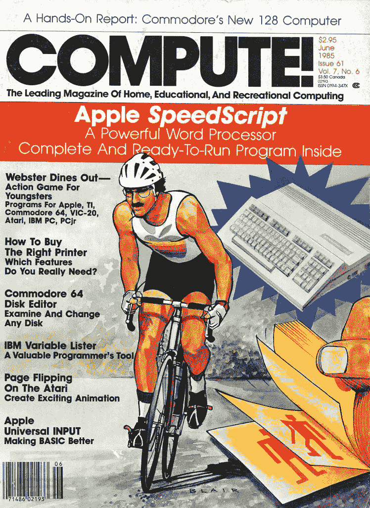
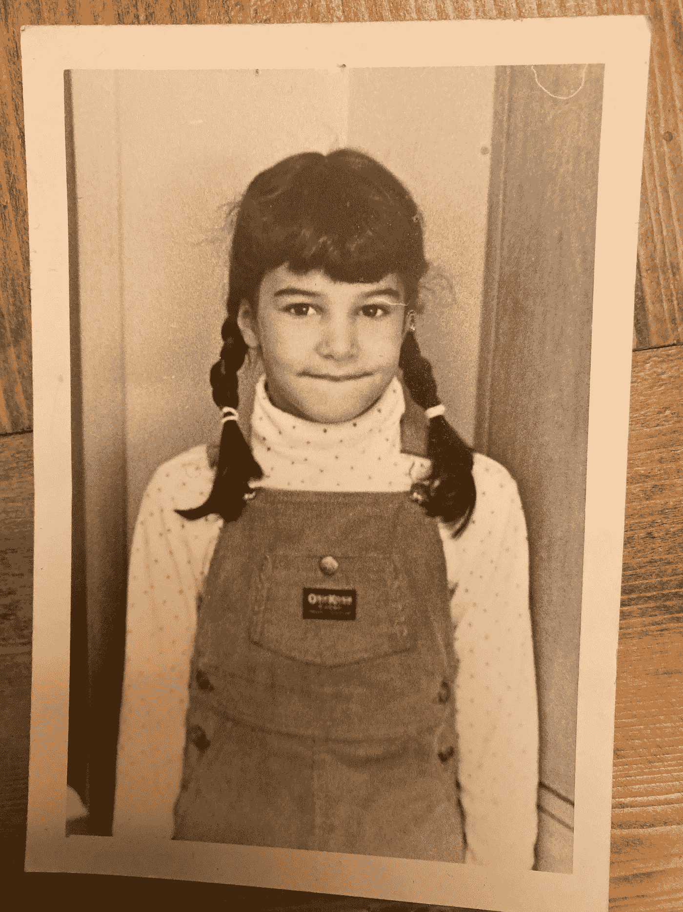
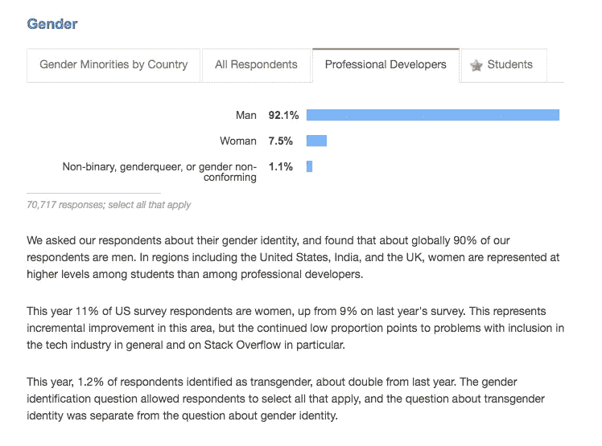

# 我是如何成为一名程序员的

> 原文：<https://levelup.gitconnected.com/how-i-got-started-as-a-female-coder-and-how-you-can-too-3d85e63bbe6>


凯利·西克玛在 [Unsplash](https://unsplash.com?utm_source=medium&utm_medium=referral) 上的照片

那是 1985 年。我爸爸抱着一个大包裹走进了车库门。他的运动袜拖到了膝盖，短裤比法定长度要短，留着八字胡的脸上挂着灿烂的笑容。我们都知道那是什么。

一台[苹果 IIc](https://en.wikipedia.org/wiki/Apple_IIc) 电脑。

我哥哥比我大两岁，他在学校参加了计算机编程竞赛。我们拿到电脑后，他总是在我们放电脑的后卧室里疯狂地打字。

那时，我想做我哥哥做的一切。他打棒球；我打棒球。他得到了一个滑板；第二年圣诞节我想要一个。他是一名程序员；我想学习编码。

对我来说，参加当前的比赛已经太晚了，但当我的老师在学校宣布下一次比赛时，我有了一个想法。我走到妈妈面前问:“我可以参加学校的编程竞赛吗？”你可能会认为，因为我是一个生长在 80 年代的 9 岁女孩，我妈妈回答说，“你甚至不知道如何使用电脑。”(其实我没有)或者“一个小女孩玩电脑是为了什么？”

但她没说过这样的话。她说，“好的，”在围裙上擦了擦手，然后回去收拾碗碟。

我写第一行代码的时候才九岁。

在我成长的过程中，我的父母从未真正劝阻过我做我想做的事情。恰恰相反，他们期望我表现得和我哥哥一样好。

我不是一个典型的 9 岁女孩。我喜欢数学和科学，想骑着我的“越野车”在泥地里玩耍。我总是在追我哥哥和他的朋友。我们经常在地下室里设置一个游戏，我们称之为“战争”这个精心设计的系统包括林肯原木陆军基地、骑着我的小马的美国大兵、芭比梦幻屋医院、躲在费舍尔普莱斯农舍里的威布尔摇摆舞，以及《星球大战》中的冰雪星球霍斯。为了完成这个场景，我们有一个巨大的弹射器来摧毁一切，当然。

当时，我不知道有人相信男孩和女孩在智力上有差异。

在我的父母同意我参加竞赛后，我大步走到后面卧室里的哥哥面前，大声说道:“我要编码！”

他不停地打字。我低头看着我的脚，“你能教我吗？”

他什么也没说。他甚至没有离开电脑。与此同时，他抢到了 [COMPUTE 的最新副本！杂志](https://ia902708.us.archive.org/23/items/1985-06-compute-magazine/Compute_Issue_061_1985_Jun.pdf)又扔给我，“自学。”

我照做了。



计算！这本杂志对我学习如何编程至关重要

第二天我参加了学校的计算机编程竞赛。

接下来的几个星期，我都在看哥哥的编码杂志后面的 BASIC 代码。我会把游戏输入苹果电脑的 DOS 终端。太迷人了。我可以把指令输入计算机，然后机器就会做我告诉它做的事情。每天结束时，我会将代码保存到软盘上，放入纸套中，然后藏在一个安全的地方。

几天后，我为自己的游戏想出了一个主意，这个游戏叫做“侦探事务所”该游戏由一系列多项选择问题组成，要么以玩家抓住罪犯并成为英雄而告终，要么以非常糟糕的结局而告终。这就像那些[选择你自己的冒险书籍](https://www.amazon.com/House-Danger-Choose-Your-Adventure/dp/1933390069)。

我记得我狂热地用 2 号铅笔在画线纸上写代码。我小心翼翼地给每一行代码编号。我的意思是，如果我不对每一行代码进行编号，我怎么能正确地执行我的 [GOTO](https://en.wikipedia.org/wiki/Goto) 语句呢？我的第一个真正的代码是一件奇妙的艺术品，看起来像这样。

```
**PRINT** "WHAT DO YOU WANT TO DO NEXT? (A) CHASE THE ROBBER (B) SIT AND READ A BOOK (C) EAT LUNCH (D) RUN OUT THE BACK DOOR"**INPUT** "Choose a path?"; N**IF** N = "A" **THEN** **GOTO** 1456
**IF** N = "B" **THEN** **GOTO** 4567
**IF** N = "C" **THEN GOTO** 4325
**IF** N = "D" **THEN PRINT** "HE GOT AWAY. YOU LOSE, YA LOSER, GAME OVER."... and so on for 1000s of lines using GOTO all the way (not joking)
```

当我完成后，我把我的软盘带到学校(当然是备份的)并提交给比赛。

许多星期后，我发现我赢了。

这是我 1985 年的唯一目标，我想知道这一年剩下的时间里我会做些什么。赢得学校的竞赛意味着我现在可以去参加地区计算机竞赛了。老实说，我想去。我的这个新爱好开始时只是同学之间的一个小竞赛，现在已经变成了一件有趣的事情。我喜欢编码。

所以，我妈妈带我去了地区比赛。我们走进去，一个年长的家伙径直走向我们，递给我一个巨大的奖杯，说，"祝贺你…你是唯一出现的人。"

我赢得了地区比赛。这意味着我要去美国。

宾夕法尼亚州计算机编程竞赛的早晨到了。我妈妈把两条紧紧的辫子拉到我的头上，用紫色丝带扎好。当我们到达学校时，我很紧张，对自己的头发感到难为情。当我环顾房间，不仅我是唯一的女孩，而且我是房间里唯一的孩子。十几岁的男孩站在墙边盯着我，傻笑。

当轮到我演讲时，我被吓到了。这些男孩比我大很多，他们是男孩，他们中的一些人有很酷的图形程序。我一点机会都没有，这是我第一次觉得自己不属于这里。我把我妈妈带到大厅，说，“我不想做。”她平静地提醒我，我花了多少时间在我的程序上，我现在不打算退出。如果她知道我为什么紧张，她从来没有提过。我是一个非常害羞的孩子，但是我站在教室前面展示了我的游戏。

我不确定这是不是出于怜悯，因为我年轻，是个女孩，但我不在乎。我在比赛中获得了第二名。仅次于两个 16 岁的男孩，他们的节目包括一个令人敬畏的自由女神像动画(由巨大的像素制成)。

我就是这样开始编码的。早期，从来没有人质疑我，公开怀疑我，或者告诉我应该参加更多的女孩子的活动。那是后来我开始工作的时候。比赛中的裁判微笑着，鼓励我，从来没有对我是一个女孩，一个头发上扎着紫色丝带的孩子的事实感到惊讶。我的朋友说我聪明，而不是说我是书呆子。我哥哥后来确实帮助了我。我的父母总是支持我。

这种支持和差异化的缺乏帮助我获得了继续编程所需的信心。在男性主导的行业里做一个女性并不容易。每加入一个新的团队或项目，你都必须证明自己，并被要求达到更高的标准。如果我的父母、兄弟或朋友在我年轻的时候因为我想编程而给了我一段艰难的时光，甚至是微妙的，我不知道我现在会在哪里。

但是没有人这么做。

几年后我发现人们愿意付钱给你玩电脑。付你很多钱。



我，大约在我开始编码的时候(1985 年)

在写这篇文章的时候，我已经做了 20 年的软件工程师。我在 2000 年获得了计算机科学学士学位，去年刚从约翰霍普金斯大学获得了生物信息学硕士学位。多年来，我收到了“晋升”到管理职位的邀请，但我一直想写代码。

虽然有时充满挑战，令人沮丧，压力极大，但这是一段令人欣慰的旅程。我感到幸运的是，我能够把开始时的爱好变成成熟的职业。

所以，当你的女儿或姐妹或朋友来找你说，“我想学编程”，请一定要告诉她“好的”，然后尽你所能帮助她实现这个愿望。

# 你或你的孩子如何开始编码？

让我们面对现实吧，开始职业生涯，或者甚至是对编程的爱好都是令人生畏的，尤其是如果你是女性的话。事实上，在 2019 年底，女性编码员的比例似乎在提高，但与男性相比仍然低得多。



[2019 年堆栈溢出开发者调查](https://insights.stackoverflow.com/survey/2019#most-loved-dreaded-and-wanted)

我很幸运有朋友和家人，他们没有给我设限。有时候，这些限制可能非常微妙，就像父母说，“你为什么要这么做？”或者你的朋友取笑你是个书呆子。

我也很幸运有一个对电脑感兴趣的父亲，他有能力给我们买一台电脑。我意识到不是每个人都是这种情况。你可能没有电脑，但是*有*种方法可以在没有电脑的情况下开始使用。

在本指南中，我描述了学习编码的一些最重要的障碍。幸运的是，一旦你解决了第一个问题，就比以前更容易开始了。

# 购买一台电脑

对于一些人来说，拥有一台电脑可能是最大的障碍，尤其是如果你还年轻，没有多少钱的话。

如果你家里没有电脑，有几个项目努力帮助低收入家庭获得一台电脑。你只需要申请。以下是其中的一些例子。这个列表并不全面，所以你自己去研究吧。但是这个列表是一个很好的起点。

*   [个人电脑](https://www.pcsforpeople.org/eligibility/)
*   [IT 基础](http://theonitfoundation.org/faqs/)
*   [大家上](https://www.everyoneon.org/)
*   [计算机技术援助团](https://ctac-nh.org/node/12)
*   [有原因的计算机](https://www.computerswithcauses.org/application.htm)
*   [技术翻新和再利用联盟](https://www.aftrr.org/map-locator/)

你也可以查看 Craigslist 和 FreeCycle 等网站，看看是否有人在赠送二手机器或廉价出售旧笔记本电脑。

如果你家里没有电脑，你可以通过向低收入家庭的学生免费赠送笔记本电脑来获得电脑。咨询你的学校，看看他们是否提供这项服务。

如果你存了一些钱，有办法在网上买到便宜的笔记本电脑。许多技术公司提供打折的翻新产品。[戴尔](https://www.dellrefurbished.com/laptops)和[苹果](https://www.apple.com/shop/refurbished)有两个最好的程序，可以保证高质量。

如果你存了一大笔钱，这里有一些给程序员的最好的笔记本电脑。我用的是 MacBook Pro。

如果以上途径都不适合你，你可以去你的公共图书馆或者当地的社区大学查询。其中一些组织提供免费的编程课程，你可以在课堂上借用电脑。

# 选择一种语言

这些年来，我学习了几种编程语言，从小时候的 BASIC 开始。我是在大学的一门工程课里转到 FORTRAN 的。我这些年学的其他语言还有 Pascal，COBOL，C，C++，PHP，Java，Python，JavaScript。一旦你发现了一种或两种语言，学习更多就变得容易了。

为了帮助你选择，看看现在最流行的编程语言是什么。这里有一篇[的好文章](/top-3-programming-languages-to-learn-in-2020-cb3c53d32ec9)概述了 2020 年的前三种语言。 [StackOverflow 开发者调查](https://insights.stackoverflow.com/survey/2019#most-loved-dreaded-and-wanted)总是一个查看语言趋势的绝佳地方。

也要看你想做什么。如果你不确定，想学习如何编码，我一直推荐 Python。Python 很容易学习，可读性很强，初学者也容易理解，而且有数以千计的 Python 教程。如果你对机器学习或生物信息学感兴趣，Python 是一个很好的选择。

如果你想开发手机应用，那就去看看 Swift 在 macOS 和 iOS 上的应用，或者 Java 和 Kotlin 在 Android 上的应用。如果您计划将来过渡到 web 开发，那么带有 React Native 的 JavaScript 可能是一个不错的选择。

如果您想构建全栈 web 应用程序，您可能想从 JavaScript 开始。随着 Node.js 的出现，您可以使用 JavaScript 构建前端和后端。为了构建一个应用程序的前端，还需要了解一些 HTML 和 CSS。

后来，如果你打算进入企业开发，你可以添加一种像 Java 或 C#这样的语言作为后端。

虽然我在这方面没有任何经验，但 [Rust](https://www.rust-lang.org/) 是一个令人兴奋的选项，你可能想探索一下。它主要用于系统编程，据说比大多数其他语言都快。据说将来有可能取代 C。如果你想构建命令行工具，构建自己的操作系统，或者在设备上进行嵌入式编程，Rust 可能值得一试。我可能会在我的一些生物信息学项目中试用它来测试它的速度。

> 根据 2019 年 Stackoverflow 开发者调查，“在我们的调查中，增长最快的主要编程语言 Python 再次在编程语言中排名上升，今年超过 Java，成为第二大最受欢迎的语言(仅次于 Rust)。”

这一步不要花太多时间。如果你选择了一种似乎不适合你的语言，你可以学习另一种语言来充实你的简历。

# 学一门课程

现在大多数学校都提供编程指导，甚至早在小学就开始了。如果你试图限制年幼儿童的屏幕时间，有办法让他们不用电脑就开始学习编码逻辑(T4)。咨询你的学校，看看机会在哪里。谷歌有一个很棒的免费课程[来教孩子们如何编码。](https://csfirst.withgoogle.com/s/en/home)

如果你在大学里，你会很轻松。即使你不是计算机科学专业的，如果你感兴趣，你也应该选修一门编程课程。

我已经帮助雇佣了几个没有计算机科学学位的开发人员。公司寻找聪明的人，有很强的编程基础，善于沟通。如果你很喜欢，就换专业。当我第一次上大学时，在意识到我可以以编码为职业之前，我是一名土木工程师。

如果你是一个完成学业的成年人，自学比以往任何时候都容易。你不需要计算！杂志。网上有成千上万的初学编程课程。在学习更难的东西之前，学习计算机科学和编程的基础是很重要的。不要跳过数据结构和算法，一旦学会了基础，一定要学会设计模式。

[这篇文章](https://medium.com/hackernoon/learn-code-for-free-online-31c623514fca)为每一种流行的语言提供了大量的编程资源。

# 开一个免费的 GitHub 账户

你需要一个地方来存放你的代码，而现在软盘已经不够用了。GitHub 是一个免费的版本控制系统，用于管理你的代码库。如果你计划有一天成为一名程序员，你应该有一个活跃的 GitHub 账户。如果你还没有账户，[现在就去注册吧](https://github.com/)。

要学习使用 git 的基础知识，请查看这个[亚特兰大 Git 教程](https://www.atlassian.com/git/tutorials)。在使用 git 15 年后，我仍然会不时地查看文档。但是，你可以在几分钟内学会基础知识。

# 建造一些东西

没有什么比一个好主意更能激发我学习的动力了。如果你正在读这篇文章，我肯定你有想法。现在拿出一张纸，头脑风暴出五个你可能想要构建的脚本、应用程序或手机应用程序的想法。

如果你想不出什么，这里的[是](https://www.freecodecamp.org/news/how-to-build-a-react-js-chat-app-in-10-minutes-c9233794642b/) [一些](https://towardsdatascience.com/simple-machine-learning-model-in-python-in-5-lines-of-code-fe03d72e78c6)优秀的[选择](https://medium.com/free-code-camp/building-a-simple-node-js-api-in-under-30-minutes-a07ea9e390d2)让你入门。

一旦开始，确保[在 GitHub 中创建一个新的库](https://help.github.com/en/github/getting-started-with-github/create-a-repo)并每天推送你的代码。

如果你仍然不确定如何开始，给我发一条消息，告诉我你的想法，我会给你指出正确的方向。

# 使用谷歌

我在 2000 年获得了计算机科学学位。当我刚开始工作时，我们不允许在工作中使用互联网。我都不知道自己是怎么活下来的。从那以后，我学到的一切要么来自同事，一本书，要么在大多数情况下，来自谷歌搜索。

每个伟大的想法都始于谷歌。找出是否有人已经做过你正在尝试做的事情。如果有人已经创造了你想要开发的东西，不要因此而气馁。向他们学习，建立一些东西，然后改进它。

如果您在代码中遇到错误，请复制并粘贴到 Google 搜索栏中。你可能会在一分钟内找到答案。

使用谷歌。谷歌是你的朋友。

[https://wifflegif.com/](https://wifflegif.com/)

# 开始吧

帮助我成为一名成功的软件工程师的一件事，以及总的来说，就是立即开始。当你有一个想法的时候，不要计划在周一或下个月或在新的一年开始。我从来不喜欢新年决心。当我有一个想法时，我从今天开始。

以下是开始的方法。拿出一张纸和一支笔，写下你的想法。列出完成它的步骤。将第一步分解成更小的任务。

看看最小的任务。怎么才能完成呢？现在就开始。你会发现，如果你开始了，你应该会获得一些动力，更有可能成功。你的想法不再是这个只存在于你头脑中的不可能的怪物。你现在拥有的是有形的东西。