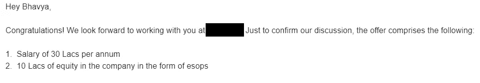

# 我如何在 3 年内将工资提高了 6 倍

> 原文：<https://levelup.gitconnected.com/how-i-grew-my-salary-by-6x-in-3-years-478ae10f7d0b>

## 我得到了一份 30 英镑的软件开发工作，而我甚至不是计算机科学毕业生。

照片由 [Pexels](https://www.pexels.com/photo/dream-text-on-green-leaves-1535907/?utm_content=attributionCopyText&utm_medium=referral&utm_source=pexels) 的[Karyme frana](https://www.pexels.com/@karymefranca?utm_content=attributionCopyText&utm_medium=referral&utm_source=pexels)拍摄

首先是一些快速的背景，我目前是一名首席工程师，我目前的角色主要涉及前端和后端开发，我还必须开发智能合同。我本科做的是电子与电信，2018 年毕业。我知道最基本的数据结构和算法。我不是来自 IIT，也不是班上最聪明的学生，更确切地说，远非如此。下面我将分享三件事，它们帮助我走到了今天。

3 年前，也就是 2018 年 7 月，我开始了软件开发的工作。我当时的手里工资大约是 5 磅印度卢比，就在几天前，我得到了 30 磅印度卢比+10 磅印度卢比的 ESOPS。不幸的是，由于我的其他承诺，我不能接受这份工作，但我很感激，我为不能加入向我提供同样机会的公司感到内疚。

好吧，只是因为我得到了一个很好的提议，我不是说我什么都知道，或者你应该接受我的建议。我只想分享我对事物的看法。你可以有把握地假设，就技术能力而言，我非常平庸，我以前工作中的很多同事都比我强得多。此外，我远不是收入最高的软件开发人员，我的名单上有很多人比我挣得多。我分享这篇文章是因为我对自己的成长速度感到高兴，并觉得在这个时代，有这么多的人在贬低自己，也许阅读这篇文章可以激励他们前进，实现他们一直想要的东西。

说到我觉得对我有用的地方—

## **激情**

我非常热衷于解决问题和学习商业运作方式。我喜欢理解公司是如何给人们的生活增加价值的，以及为什么他们的客户要支付他们要求的钱。这让我对很多员工不感兴趣的事情充满了好奇。我注意到人们把太多的精力放在取悦他们的老板，或者穿着得体去办公室，而很少甚至没有精力确保他们得到好的工作，确保他们是否解决了对公司至关重要的问题，这些问题将直接帮助公司发展业务。此外，我还看到许多人并不完全关心他们目前的工作是否能帮助他们获得市场需要的技能，在像现在这样的时代，在疫情，如果有必要，他们可以换工作。

很多人可能会说，并不是每个人都能找到好工作，对此，我有一个简单的答案，主动去找，耐心等待，如果找不到，你也不能无限期地等待，换一份工作，去承担更多责任的地方。我想补充的另一件事是，我没有给激情下定义，因为我本来就是要这么做的，如果我不这么做，我不知道我会做什么。老实说，我相信恰恰相反，我相信努力做好你正在做的任何事情，有一个比上次做得更好 10%的目标，你会开始享受这个过程，一旦你开始享受这个过程，工作就会成为激情的同义词，你会实现你曾经认为太大甚至想都不敢想的梦想。

> "如果人们不嘲笑你的梦想，那么他们还不够大！"― **格雷森·马歇尔**

## 驱动器

我非常有动力，我必须达到顶峰的渴望，加上准备不惜一切代价达到顶峰的态度，使我的生活发生了很大的变化。就像，我的许多朋友会同意我从来都不擅长学术，总是以某种方式通过，他们也会同意我遇到了一个人，他会不惜一切代价从生活中获得更多。在所有的采访中，我都明确表示，我希望建立一家公司，开发产品，让这个世界变得更美好的产品。同样，我也谈论我有多么雄心勃勃，以及在不久的将来我对自己有什么愿望。这有助于面试官理解，我不是一个每天都在找工作的人，也不是一个会满足于别人给他的任何东西的人。我给人的印象是，如果有助于实现我学习和赚钱的目标，我不会介意下个月每天工作 12 个小时。这帮助我赢得了很多印象分，我也确保突出了我快速学习新东西并适应我所处的任何情况并继续完成任务的例子。以上这些可以确保面试官相信我会成为团队的一笔财富，而我对成长的渴望反过来也会让他们受益，并帮助他们发展公司。

> "当你渴望成功时，不要让任何人给你灌输放慢脚步的废话."—玛丽·弗里奥

## 做

我强烈而绝对地相信做，做更多的行为。解释一下，如果有两个人，一个读了 100 本关于如何创业的书，另一个连一本书都没读过，但已经开始做小生意，营业额不错，那么第二个人成功的几率是第一个人的 90%。我觉得对我来说也是如此，我不是最博学的人，我的技能也不是无与伦比或无与伦比的，但我做了，我做了很多，而且大多比我周围的几乎所有人都多。补充一下，我并不是强调做更多你正在做的事情或者花更多时间在你的工作上，我是建议花更多时间培养技能，追求爱好，做一些有助于你恢复活力并在工作中表现得更好的事情。学习赚钱的艺术，理解世界如何运作的机制，这些都是复杂的事情，没有正确的答案，但是学习你作为一个个体如何为这个世界增加价值，一旦你明白了这一点，我相信你能够实现你所希望的一切。

去年，我在做我的全职工作，与一个非政府组织合作，帮助他们建立一个排行榜平台，帮助我的三个朋友建立他们的网站，帮助另一个人为他的产品建立一个 MVP，花了 160 多个小时学习对我的职业发展至关重要的东西，我打了 100 多个小时的羽毛球，我进行了大约 7 次徒步旅行，我画了超过 75 张草图，写了几篇文章，我可能花了至少 80 个小时帮助我妈妈做日常家务，我敢肯定她会否认。我帮助一个朋友为他的公司招聘员工，花了很多时间与朋友和家人交往，等等。所有这些都帮助我成为一个更完整的人，过着更充实的生活。我喜欢宝莱坞电影《亲爱的津达吉》中的一个场景，它讲述了你如何不能为你想做的任何事情而给一段关系增加负担，以及它如何不可能成为你持续快乐的源泉。它说，即使你在谈恋爱，有一个喝咖啡的朋友，一个经常和你一起打羽毛球的朋友，一个和你一起去远足的朋友，等等，也是很重要的。如果你想让你的伴侣无处不在，或者做你喜欢的任何事情，这将会很费力，而且肯定会导致争吵，甚至可能导致你们分手。同样，我觉得我们大多数人都把工作作为职业发展的唯一来源，这个地方会让我们变得非常富有，也会帮助我们获得我们需要的所有技能，没有工作能做到这一点，你需要走出去做其他事情，追求你的爱好，加入一两个俱乐部，从那里的聪明人那里学到更多，参加会议等等。这将有助于你的全面发展。所以它的关键是做得更多，然后等待宇宙展现它的魔力。

> 不要只是梦想，要去做― **罗伊·班纳特，** [**心中的光**](https://www.goodreads.com/work/quotes/49604402)

最后，我要再次重申，我并不知道所有的事情，对我有用的东西绝对不能对你有用。我只是想分享我的想法，给大家一个不同的视角。

感谢你花时间阅读这篇文章，如果你想谈谈生活，或者对我的文章有什么建议，请在下面留言。也可以通过[电报](https://t.me/iambhavyamehta)或 [LinkedIn](https://www.linkedin.com/in/bhavya-y-mehta/) 联系我。