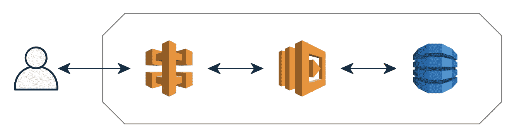
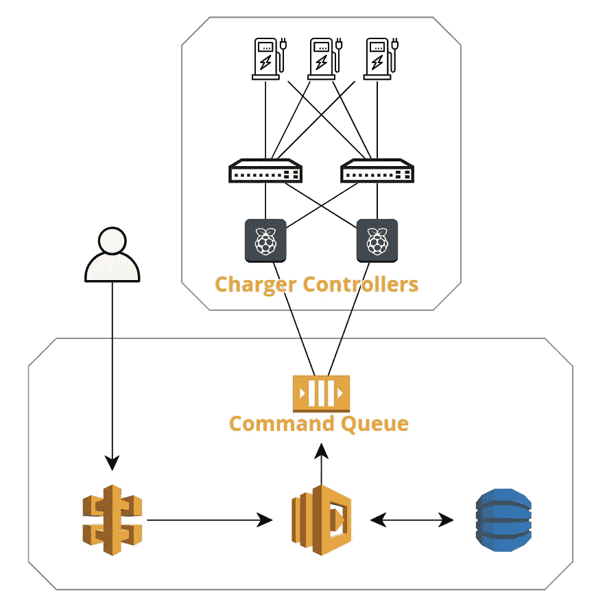
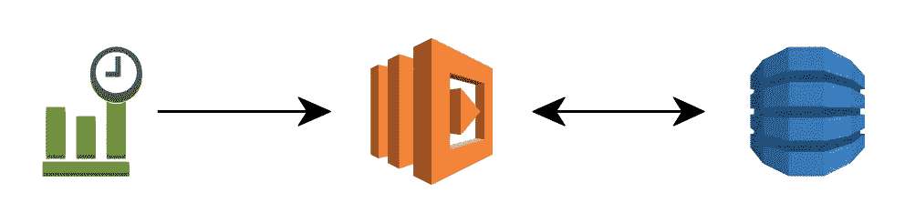
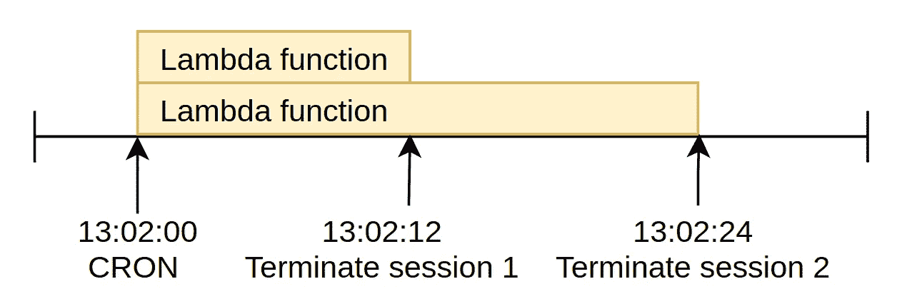
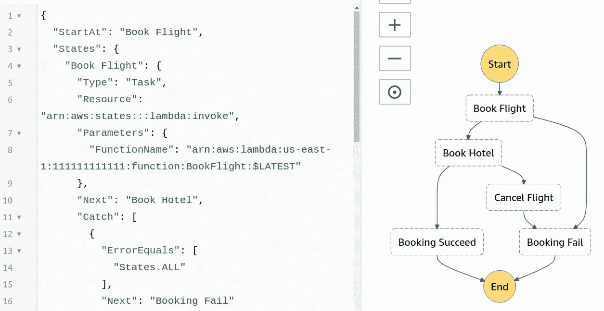
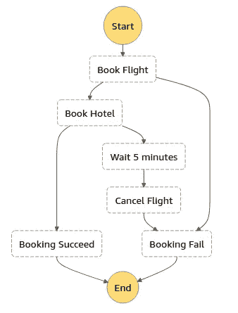
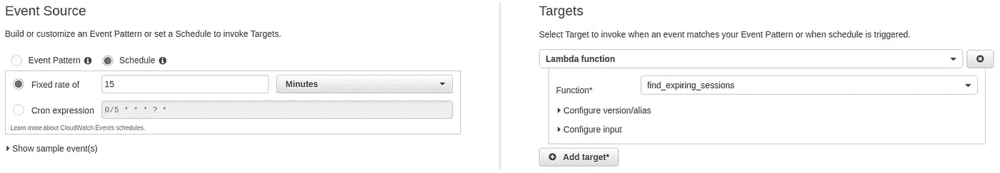
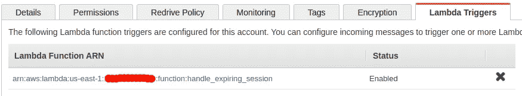
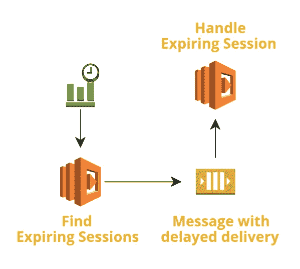

# 我如何在无服务器架构中处理基于时间的事件

> 原文：<https://levelup.gitconnected.com/how-i-handle-time-based-events-in-serverless-architecture-30a8155a712>

# 无服务器是一个事件驱动的世界

不像几年前，当我们都将长期运行的守护程序作为服务器时，我们正在进入一个无服务器时代，一切都由事件触发。

这是显而易见的，如果你认为正常的网站流量。用户命中你网站的 URL/API 端点，API 网关触发 Lambda 函数，Lambda 再触发 DynamoDB 更新/检索数据，一切从用户开始。



通用的无服务器架构。一切从用户动作开始

然而，如果您的系统足够大，您将总是面临需要预定动作的情况。对于这些情况，我们如何采用无服务器架构？

# 我过去的项目:电动汽车充电器控制系统

我过去的一个项目是建立一个基于云的系统来远程控制电动汽车充电器。主要功能是定时每次充电会话的持续时间，并在持续时间到期时停止充电器(用户必须选择持续时间并在会话开始前支付)。



我的设计很简单。用户通过 API 网关与系统进行交互。Lambda 函数处理逻辑并通过 SQS 队列向现场 Raspberry Pi 发送命令，Raspberry Pi 然后通过现场 LAN 控制充电器。

主要问题是，当会话过期时，我应该如何触发事件？如果我托管一个经典服务器，我可以每分钟运行一个 CRON 作业。或者极端地，我可以运行一个无限循环来检查每秒是否有任何过期的会话。

```
while True:
    terminate_expired_sessions()
    time.sleep(1)
```

在无服务器架构中呢？我们做什么呢

# 选项 1: CRON

回到过去，我们使用 CRON 来做基于时间的工作，为什么我们不用同样的方法呢？在 AWS 中，我们可以使用 CloudWatch 事件规则定期触发 Lambda 函数。在 Azure 中，我们可以设置一个带有定时器触发器的功能 App。



我们可以使用 CloudWatch 事件规则定期触发 Lambda

权衡的结果是您希望计划功能运行的频率。如果时间间隔太长，您将无法精确安排事件。如果太短，您可能会过于频繁地调用该函数，但什么也不做。

另一个问题是你不能设置短于 1 分钟的时间间隔。对我来说，这没什么大不了的，因为多给客户一分钟也不是什么大损失，这仍然是可行的。


像 CRON 一样，我们不能将间隔设置为小于一分钟

# 选项 2:等待

如果 CloudWatch 事件规则无法实现小于一分钟的精度，那么在 Lambda 函数内部控制它怎么样？

你可能会认为让这个功能等待整整 2 个小时的充电时间只是为了终止它是疯狂的。

如果我们使用选项 1 来调度一个 1 分钟的 CRON 作业，以检查在下一分钟内是否有任何即将过期的会话，并让函数等到确切的终止时间，这样会怎么样？



这是托管服务器中的一种常见方法。让进程等待比调度任务更容易。此外，让一个进程等待根本不会损害系统，因为我们已经提供了资源，等待进程不会消耗太多资源。

## 反模式

然而，在 Lambda 中这样做使我们陷入两种反模式:1)长时间运行的任务，和 2)不使函数忙碌。

假设 AWS Lambda 允许每个区域有多达 1000 个并发。如果我们用它来运行长时间运行的任务，我们会很快耗尽极限。想象一下，如果下一分钟有 600 个收费会话到期，我们调用 600 个函数来等待终止时间。目前，我们只剩下 400 个并发请求来满足其他请求。

更糟糕的是，我们在利用执行时间什么都不做。Lambda 函数每 100ms 充电一次，这使得该架构更具成本效益。然而，通过调用函数来等待，我们失去了这种好处。

# 选项 3:阶跃函数

人们建议的另一个选择是使用 [AWS 阶跃函数](https://aws.amazon.com/step-functions/)。如果你遇到一些需要协调的动作，这是一个很棒的工具。

例如，如果您正在构建一个旅游预订系统，那么您已经构建了预订酒店房间和航班的功能。如果您分别调用这两个函数，您如何确保它们都成功？我相信您不希望您的客户乘飞机到达目的地后发现他们的酒店预订不成功。

通过使用阶跃函数，我们可以很容易地实现一个 saga 模式(这是 Chris Richardson 的一个很棒的[演讲](https://youtu.be/txlSrGVCK18))。您可以定义状态转换的逻辑。例如，如果航班预订成功，请继续预订酒店房间。如果失败了，就去取消航班。



用阶跃函数实现 saga 模式



我们可以在阶跃函数中加入等待时间

当然，我们可以在阶跃函数中添加等待时间。例如，如果航空公司不允许你取消新预订的航班，你可以在取消之前增加一段等待时间。

## 这是有代价的

阶跃函数是如此强大的工具，它的[也不便宜](https://aws.amazon.com/step-functions/pricing/)。每 1000 次状态转换花费 0.025 美元。

在我的情况下，我只是希望充电器在某个时间停止，不需要复杂的协调，步进功能似乎是一个大材小用。

# 选项 4: CRON + SQS

最后我想出了这个解决方案:用 CloudWatch Event 实现 CRON 和 SQS 秒精度触发事件。

它结合了前三个选项，使用 CloudWatch 事件来调度 CRON 作业，然后创建一个等待期来在准确的时间终止收费会话。我没有使用 Lambda 函数本身或阶跃函数，而是选择 SQS 来实现等待期。

首先，我创建了一个 SQS 队列来存储那些预定的操作。我没有使用现有的命令队列，因为我不想直接推出命令。我想执行一个函数来做最后的检查，看看在等待期间是否有任何变化。例如，用户可以将更多小时添加到充电会话中。在这种情况下，我不希望系统终止充电会话。

AWS SQS 允许消息在 15 分钟后发送[，所以我将 find _ expiring _ sessions 函数安排为每 15 分钟一次。](https://docs.aws.amazon.com/AWSSimpleQueueService/latest/APIReference/API_SendMessage.html#API_SendMessage_RequestParameters)



使用 CloudWatch 事件每 15 分钟触发一次 find _ expiring _ sessions

```
def find_expiring_sessions():
    fifteen_minute_later = datetime.now() \
        + timedelta(minutes = 15)
    expiring_sessions = Sessions.filter(
        expire_time__lte = fifteen_minute_later,
        expire_time__gt = datetime.now()
    ) for expiring_session in expiring_sessions:
        sqs_client**.**send_message(
            QueueUrl='xxxxxxxxxx',
            DelaySeconds=expiring_session.expire_time-datetime.now(),
            MessageBody=expiring_session.id
        )
```

在该函数中，我找出了在未来 15 分钟内即将到期的所有充电会话。然后，对于每个会话，我将一条 SQS 消息按其自己的延迟时间推入队列。

因为 SQS 是基于拉的，所以由队列触发的函数需要权限来拉消息。所以我在 handle _ expiring _ session 函数中附加了一个策略

```
{
    "Version": "2012-10-17",
    "Statement": [
        {
            "Effect": "Allow",
            "Action": [
                "sqs:DeleteMessage",
                "sqs:ReceiveMessage",
                "sqs:GetQueueAttributes"
            ],
            "Resource": "arn:aws:sqs:us-east-1:111111111111:ExpireSessionWaitQueue"
        }
    ]
}
```

然后，我将一个触发器从队列配置到 handle _ expiring _ session 函数



配置 SQS 以触发 Lambda 功能

现在，每当收费时间到期时，我的 handle _ expiring _ session 将被触发，它可以立即执行终止过程。



克朗+ SQS 建筑设计

# 比较不同的选项

我将使用以下场景来比较这 4 个选项:

1.  每小时平均终止 240 个会话
2.  所有会话在第 30 秒终止(例如 14:02:30)
3.  实际执行需要 500 毫秒和 128 兆内存
4.  所有充电会话的持续时间是相等的

对于选项 1，每小时将有 60 次 CRON 调用。每次调用执行一次 Lambda 函数。因为端接是成批执行的，所以我们可以假设所需的时间仍然是 500 毫秒。

选项 1 的成本将是:每小时 0.00006 美元(60 次 CloudWatch 事件)+0.000012 美元(60 次 Lambda 执行)+0.00006249 美元(30 秒总执行时间)= $0.00013449 美元。

对于选项 2，每小时将有 60 次 CRON 调用。每次调用执行 4 个 Lambda 函数(每分钟 4 个终止)，这些函数将执行 30 秒。

选项 2 的成本将是:每小时 0.00006 美元(60 次 CloudWatch 事件)+ $0.000048 美元(240 次 Lambda 执行)+ $0.01524756 美元(240 x 30.5s 次 Lambda 执行时间)= $0.01535556 美元。

对于备选方案 3。假设 Step Functions 允许执行时间长达 1 年，我假设我们不必使用 CRON，只需从整个会话的开始到结束安排终止操作。每小时有 240 个会话，因此每小时有 240 个状态转换。

选项 3 的成本将是:0.006 美元(240 个状态转换)

对于选项 4，将有 4 次 CRON 调用(间隔 15 分钟)，每次调用生成 240 个 SQS 消息(每小时 240 个终止)，每个消息最终将调用终止函数。

选项 4 的成本将为:0.000004 美元(4 个 CloudWatch 事件)+0.000096 美元(240 条 SQS 消息)+0.000048 美元(240 次 Lambda 执行)+0.00024996 美元(240 x 500ms 毫秒执行时间)= $0.00039796 美元

4 个不同选项的比较

在这些选项中，使用 Lambda 等待是最糟糕的一个，它的成本很高，1000 个并发配额也限制了它的可伸缩性。它唯一的优点是易于使用。你可以简单地在你的代码中以你想要的方式实现。

Simple CRON 便宜且可扩展，缺点是它只能提供 1 分钟的精度。

阶跃函数对于处理复杂的协调情况很好，但是对于解决简单的基于时间的事件来说就有点大材小用了。

如果您希望以秒级精度安排基于时间的事件，CRON + SQS 将是最合适的选择。