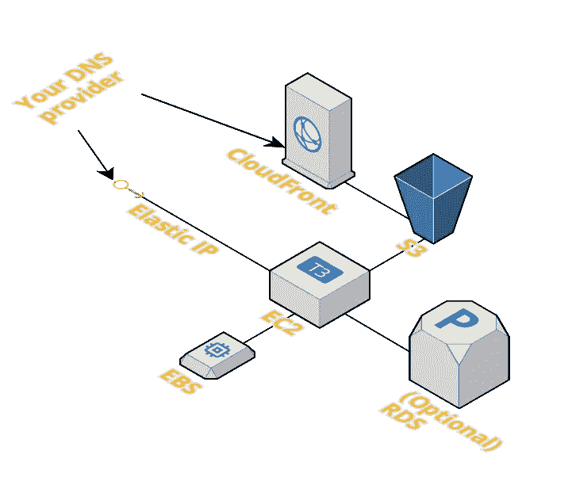
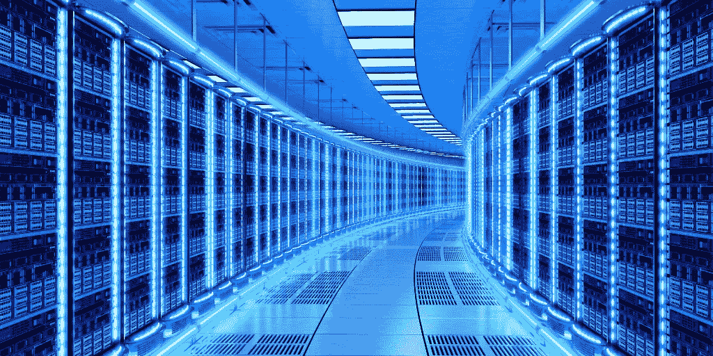
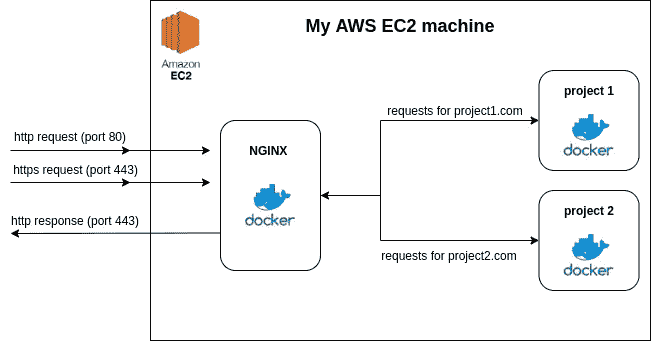
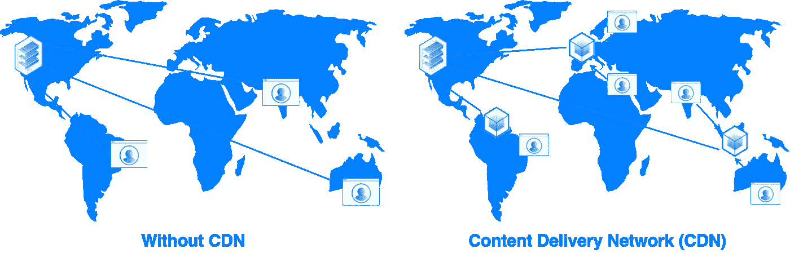

# How I host all my personal projects for £10 / month (

> 原文：<https://levelup.gitconnected.com/how-i-host-all-my-personal-projects-for-10-month-15-on-aws-359a006cec2>

*目标受众:初级到中级*

最近，我已经将一些个人项目整合到一个(相对而言)易于管理且经济高效的 AWS 解决方案中，这些项目是由一些云提供商托管的。想了解更多？

本文提供了我的 AWS 设置的高层次概述，并链接到过去(希望是将来)的文章，这些文章提供了自己复制设置的实用指南。

# 情况

多年来，我已经创建并试图维持一些个人项目。说到这个话题，我强烈鼓励所有的软件工程师从事个人项目，因为这样做的好处是深远的。这类项目可能是为了追求永远难以捉摸的被动收入而创建的；为你所在的社区做贡献；或者学习新技术。

对我来说，这些项目从我作为一名 noobie 软件工程师开始到现在作为一名高级工程师工作，因此它们自然存在于许多托管服务中——从 noob 友好的平台即服务到 AWS 和 GCP 这样的大公司。

今年，我决定咬紧牙关，将这些项目整合到一个易于管理且价格合理的地方，这样我就可以在未来轻松构建和托管更多项目。本文概述了我选择的设置及其原因。

## 范围

这种主机设置不会适合所有人，毫无疑问，有更容易和更便宜的选择。然而，这(至少到目前为止)被证明是一个很好的选择，满足了我的需求:

*   任何应用程序都可以轻松运行的环境。
*   尽可能少的“魔法”——我希望在需要的时候供应和配置每个 AWS 资源和服务。
*   尽可能经济高效(在合理的范围内，我对走无服务器路线不感兴趣)。
*   能够处理相对较多的*流量很低的*站点(我个人项目)。

## 放弃

为了让事情非常清楚，**我不支持也永远不会支持任何重要的生产应用程序的这种设置**。对于不重要的个人项目，这种设置是一种容错部署，只能处理最小的负载。

# 设置

## 它看起来像什么？

图 1——我个人的项目设置(使用 cloudcraft 创建——一个很酷的 AWS 图表工具)

## 该设置的组成部分

上面的图 1 显示了用于保持我的个人项目正常运行的 AWS 资源。如果你是 AWS 或 devops 的新手，请不要被这个吓倒，因为在下一节中，我将尝试用通俗的语言来介绍每个资源。

**AWS EC2 —运营的大脑(10.80 美元/月)**

> 亚马逊弹性计算云(Amazon EC2)是一个 web 服务，它在云中提供安全的、可调整大小的计算能力。它旨在使开发人员更容易进行网络规模的云计算。

上面亚马逊的定义挺拗口的吧？对于那些不熟悉 devops 世界的人，我将尝试提供一个更实际的解释。

想象一下，贝佐斯走到当地的电脑商店，买了一堆普通的台式电脑。他回到家，把它们连接到互联网上。他启动电脑，让你“租”这些电脑，想租多久就租多久。这种“租赁电脑”服务被称为 EC2，但 AWS 的规模要大得多，效率也高得多，这是我的一个糟糕的类比。

实际上，AWS 购买了非常大且功能强大的计算机，并在被称为数据中心的大型设施中运行它们(见下图 2)。然后使用特殊的软件将这些大型机器分割成许多较小的“虚拟机”。这些虚拟机是自包含的实例，它们认为自己就是计算机。

图 2 — AWS 数据中心

因此，当您选择“租赁”这样的计算机时，您可以灵活地指定您想要的计算机的功能有多强大(通常以 CPU 和 RAM 来衡量), AWS 将为您提供这样的虚拟机。

我的个人项目不太可能同时有几个以上的用户，所以运行它们的机器不需要太多的内存或计算。对于我的个人项目，我运行可用的最小机器(实例)之一，t3.micro [(单击此处获得所有可用实例类型的列表)](https://aws.amazon.com/ec2/instance-types/)。这是一台只有 1GB 内存和 1 个虚拟 CPU 的微型机器。

如果你承诺“租赁”一台机器一年，亚马逊会提供折扣，如果你将承诺延长至三年，亚马逊会提供额外的折扣。如果您预先支付部分年费，而不是选择按月付费，您还可以获得折扣。因此，有相当多的计费组合可用。为了简单起见，我只列出了下面几个(在我写这篇文章的时候——2021 年 1 月):

*   t3 .微点播(无承诺或预付):17.23 美元/月
*   t3.micro 预订一年，无需预付:10.80 美元/月
*   t3.micro 预订一年，预付一半:10.28 美元/月

对于我的设置，我选择了 1 年的保留实例，费用大约为每月 11 美元。这构成了整个安装每月成本的大部分。不过请注意，如果你是 AWS 新手，那么你可以免费获得一个类似的实例(t2.micro)一年——详情请点击[:](https://aws.amazon.com/ec2/pricing/)

> AWS 免费层包括为期一年的每月 750 小时的 Linux 和 Windows t2.micro 实例(t3.micro 适用于 t2.micro 不可用的地区)。要保持在空闲层内，请仅使用 EC2 微实例。

一旦您设置了实例(详细说明将包含在后续文章中)，您将能够通过 SSH(安全 shell)进入机器。这允许您从自己的计算机上运行远程机器上的终端命令。一旦成功地 ssh 到实例中，您就可以执行运行项目所需的任何命令，就像在本地机器上一样。

我是 docker 的忠实粉丝，所以在我的 EC2 机器中，每个项目都在自己的 docker 容器中运行。为了允许多个项目在同一台机器上运行，我设置了一些简单的规则，根据请求发送到的 url 将传入的请求路由到相关的容器。我将这个设置命名为“穷人的 kubernetes ”,并试图在图 3 中展示其内部工作原理。

图 3——一个穷人的库伯内特斯:D

如上所述，我计划写一篇后续文章，更详细地探讨以上内容。如果有足够的兴趣，这篇文章将提供一个实用的指南，告诉你如何:

1.  在 AWS 上设置此实例。
2.  SSH 进入实例并安装 docker。
3.  设置并运行 NGINX 容器，将请求转发到项目容器。
4.  配置 SSL 证书，从而允许您的 api 处理 HTTPS 请求。

计划和写这样一篇文章需要一些时间，所以如果这对你有用，请评论。

**AWS EBS —您的计算机需要存储空间(1 美元/月)**

> Amazon Elastic Block Store (EBS)是一种易于使用的高性能块存储服务，旨在与 Amazon Elastic Compute Cloud (EC2)配合使用，用于任何规模的吞吐量和事务密集型工作负载。

还记得你从贝佐斯先生那里“租借”的那些电脑吗？它们没有硬盘，所以你还没有地方存储你的项目代码。为了使 AWS 尽可能灵活和容易理解，需要指定机器应该访问多少和什么类型的持久性存储。

这个持久存储是您的项目的代码和依赖项将被存储的地方，以便它可以被加载到内存中执行。

我选择了 8GB 的通用 SSD 存储，即 gp2 卷。也许这有点低，但目前对我来说是有效的。这大约每月花费 1 美元。

图 4 —绑定到我的 EC2 实例的块存储的屏幕截图

**AWS S3 —为其他服务存储文件(～0.00 美元/月)**

> 亚马逊简单存储服务(亚马逊 S3)是一种对象存储服务，提供行业领先的可扩展性、数据可用性、安全性和性能

一个非常粗略的类比是，把 S3 想象成一个非常精简的类似 dropbox 的服务，你可以在“云中”存储任何类型的文件，让任何需要的人都可以访问。S3 被组织在所谓的桶中，再一次相当粗略地，可以认为类似于文件夹或目录。

虽然您的 EBS 卷存储了 EC2 实例的持久数据，但这些数据只能直接用于该实例，不能用于其他 AWS 服务或公众。与 EBS 相反，S3 组织数据，并让外部实体有效地获得数据——有点像组织下面这个威士忌收藏，让任何人进来品尝他们选择的威士忌🙈🥃.

图 5——威士忌世界的 S3

如果你的项目依赖于一个你的用户必须与之交互的前端，你几乎肯定会想要一个为你的用户提供静态内容(图像、文件等)的机制。这种静态内容可以是一张图片，也可以是构成项目前端的整个 web 应用程序。

我的大多数个人项目都使用一个 [React](https://reactjs.org/) (我的首选 FE 框架)应用程序作为主要用户界面。然后，这个 UI 向运行在 EC2 上的一个容器中的一个后端服务发送 HTTP 请求(如图 3 所示),以提交和获取用户请求的数据。

为了让上面的工作，我将我的 react 应用程序的生产版本存储在一个 S3 桶中。在这种情况下,“生产构建”可以被认为是捆绑到一小组文件中的整个 react 应用程序，这些文件可以很容易地提供给用户并加载到他们的浏览器中。

现在是激动人心的部分。一旦任何对象存储在 S3，很容易将 url 映射到该位置，这样当用户访问 myproject.com 时，他们就可以从 S3 获得您选择的文件。在我的例子中，这是我的 react 构建的 index.html，这意味着当他们访问项目 url 时，整个 react 应用程序加载到他们的浏览器中。在我之前的一篇文章中解释了一个实用的设置指南，[在 2019 年使用廉价域名](https://medium.com/@ScottJFraser/deploying-your-react-app-to-aws-in-2019-with-a-namecheap-domain-3a6f5a30225f)将你的 React 应用部署到 AWS。

**AWS Cloudfront——让你的项目更接近用户(～0.01 美元/月)**

> Amazon CloudFront 是一种快速内容交付网络(CDN)服务，它在一个对开发人员友好的环境中，以低延迟、高传输速度向全球客户安全地交付数据、视频、应用程序和 API。

AWS cloudfront 确保您的 web 内容(在我们的例子中是 html、javascript、css 和图像文件)的副本分布在数据中心，以便它们在地理上尽可能靠近您的用户。这可以减少用户导航到 myproject.com 和在浏览器中加载网站之间的延迟。

图 6—使用 CDN 与不使用 CDN 时用户请求路径的差异([www.digitalocean.com](http://www.digitalocean.com))

为了让事情变得更快更安全，我使用 AWS cloudfront 从 S3 向想要访问我的站点的用户提供我的 react 构建。这意味着 AWS 将我的资产副本存储在 S3 靠近我的用户的多个边缘位置。

Cloudfront 还使得确保用户可以使用 HTTPS 请求内容变得非常容易，这在当今是必须的。下面的文章(与上面的文章相同)也涵盖了如何设置这一点，[在 2019 年使用廉价域名](https://medium.com/@ScottJFraser/deploying-your-react-app-to-aws-in-2019-with-a-namecheap-domain-3a6f5a30225f)将您的 React 应用程序部署到 AWS。

**(可选)AWS RDS—(～10 美元/月)**

> Amazon 关系数据库服务(Amazon RDS)使得在云中设置、操作和扩展关系数据库变得很容易。它提供经济高效且可调整大小的容量，同时自动执行耗时的管理任务，如硬件配置、数据库设置、修补和备份。

您的项目可能需要一个数据库来轻松获取和更新数据。AWS RDS 是由 AWS 提供的一项服务，它使数据库的供应变得非常容易。在 AWS 控制台中，您可以选择一种数据库类型(如 MySQL、PostgreSQL 等), AWS 将为您完成所有繁重的工作。创建实例后，将为您提供一个主机和端口，任何应用程序都可以连接到该主机和端口来使用数据库。

在我的设置中，我选择了这项服务，因为它很容易启动，而且自动备份让我更加放心。但是，严格来说，这是一个可选组件，原因如下:

1.  不是每个项目都需要数据库。
2.  可以在 EC2 机器上运行 dockerised db 实例来避免这种开销(我将在后面添加一篇文章)。

# 结论

最终结果是一个相当好的灵活的设置，可以托管我的所有项目，每月大约 14 美元(10)。不可否认，我确实使用 RDS，这使我每月的总花费达到 25 美元(18 英镑)左右，但这是一种可选的便利。

美妙之处在于，我理解并手动配置了端到端堆栈的每个组件，并且可以继续向我的 EC2 实例添加更多项目(以 docker 容器的形式),直到它真正开始抱怨为止。一旦实例过载，我可以简单地迁移到一个更大的实例。

我希望这篇文章是有用的，如果你想让我更深入地挖掘这个设置的任何组件，那么请评论，我会考虑写后续文章。

祝一切顺利，

斯科特