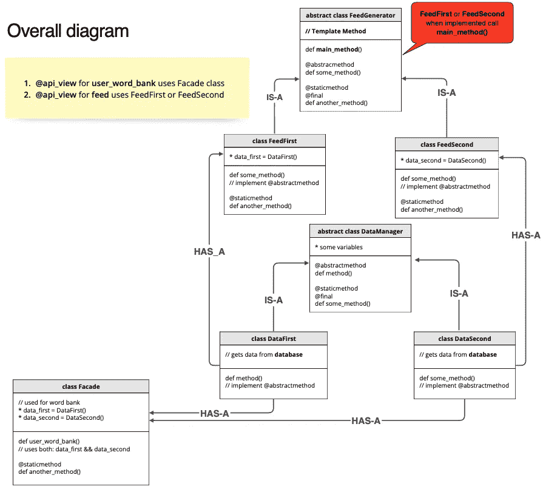

# 我如何在生产中实现设计模式

> 原文：<https://levelup.gitconnected.com/how-i-implemented-design-patterns-in-production-186aa306ca6a>

工程师同仁们！✌️:在这篇文章中，我想告诉你我是如何设法在产品中利用设计模式的，以及**它是如何不如我想象的那么顺利**😮‍💨

作为一名业余爱好者，我在一家初创企业 [Picklang](https://picklang.ml) 工作，我们在那里实现了两项新功能——为我们亲爱的用户提供的**智能提要**和**词库**。我决定放弃所有关于模式和面向对象设计的知识，让它设计得尽可能巧妙。让我们看看发生了什么…

> 在人工智能的帮助下学习语言🤖: [https://picklang.ml](https://picklang.ml)

❗️ **免责声明:**我不能透露产品代码或任何关于内部工作的敏感信息，但我会向你展示整体概念，并指导你应该如何处理类似的问题

**结构:**

*   介绍
*   设计问题
*   我的解决方案的问题
*   MVC 离题
*   Outro:建议和参考

无可挑剔的 Picklang 标志

## 介绍

我们都知道 **OOP** 是一个很酷的东西，我们想在我们的工作/项目中使用它来编写具有*高内聚*、*低依赖性*(以及其他崇高词汇)的代码。尤其是如果你来自 Java 背景。

但是如果我告诉你 OOP 并不总是一个选项，特别是当你用其他语言写的时候，比如 Python🐍。

停下，什么？😱是的，Python，Kotlin 允许你使用基于函数的方法，如果不需要的话，用它来写不太复杂的代码。

> 作为一个明智的 swe🥷🏼Picklang 告诉我:“OOP 是好的，但它并不总是一个需要利用的选项。OOP 源于数据和功能之间的高度关联。例如，List 和 HashMap 都是包含数据的类，因此它们也拥有处理数据的方法。如果复杂性要求的话，最好从函数开始，然后用方法转换成类”

起初我没有接受这样的评论。我怎么会？我刚从[奥赖利媒体](https://medium.com/u/fbfa235a954c?source=post_page-----186aa306ca6a--------------------------------)设计模式书毕业。我们需要 OOP，仅此而已💪

唉，我错了，在 3 页的谷歌文档评论和长时间的不和谐讨论后，一些代码被我重写了。

> **顺便说一句**，看看我这篇关于我从设计模式书里学到的知识的文章:[https://blog . dev genius . io/what-ive-learned-from-Design-Patterns-book-daniil-slobodeniuk-ea 61 BD 2c d609](https://blog.devgenius.io/what-ive-learned-from-design-patterns-book-daniil-slobodeniuk-ea61bd2cd609)

## 设计问题

正如我在开始提到的，我有两个任务。这些特性使用了一些相似的数据，这就是为什么我决定使用模式来压缩重复的代码，看起来很酷🙋🏼‍♂️

聪明的家伙为用户设计了 smart-feed，并给了我一堆功能，我需要将它们合并到 production⚙️中

所以，作为一个很酷的工程师，我在白板上写下设计，然后开始使用我的笔记本电脑👨‍💻

工作室设计🎨：

我最初的设计是这样的

我希望你从这个计划中得到了要点，但有几点需要澄清:

有两个 API:

*   `/feed`使用`FeedFirst`或`FeedSecond`，它们依次从`FeedGenerator`调用模板方法。这个模板方法拥有提要的所有管道。`DataFirst`和`DataSecond`是两个策略对象，按组合放在`FeedFirst`和`FeedSecond`中。
*   `/user_word_bank`使用`Facade`类，它封装了所有的细节调用。这个类具有与`/feed`相同的提取数据的类

乍一看，一切都是 stellar✨.实际上，并不是整个设计都不好。但是出现了一些问题，因此我重新设计了一些代码。

> 阅读**我的关于[门面模式](https://blog.devgenius.io/adapter-facade-pattern-for-perfect-adapting-kotlin-ccbc8f8cfcd6)和[模板模式](https://blog.devgenius.io/template-pattern-for-encapsulating-algorithms-kotlin-3ded81377fc5)的文章**,从当前的文章中获得更多，丰富你的知识

## 我的解决方案的问题

让我们马上指出几个问题👋：

*   我完全搞砸了 MVC(稍后会详细介绍)
*   一些**类**没有任何用途:只有几个方法，下面没有真正的数据

解决办法🙌：

1.  决定保留**模板图案**和`FeedFirst`和`FeedSecond`
2.  将这些`DataFirst`和`DataSecond`拆分成打包在 Python **包**中的方法，其中某些**模块**负责`DataFirst`和另一个— `DataSecond`
3.  固定命名很多——可能与设计没有直接关系，但如果你有一个包含很多包和复杂逻辑的大项目，这肯定是一个大问题。相信我，特别是，如果你写的项目将成为更大的事情的一部分
4.  将`Facade`类拆分成多个函数，放入**模块**中。是的，Facade 可以是一两个普通的函数，而不仅仅是类。

Python-folder 中的**包**是什么？什么是**模块**——包内的独立文件

## MVC 离题

按照承诺，我会给你一个 **MVC** 的快照。

**MVC** 代表模型视图控制器🤯

**查看** —应用程序 UI 部分的结果，或者在某些情况下，数据的最终表示。例如，如果你从数据库中获取数据，然后在 Pandas DataFrame 中处理它——可以认为是一个视图。

**型号**——简单来说就是数据库或者其他保存数据的存储设备。

**控制器** —粘*视图*和*模型*的工人。

而且，ta-dam — **MVC** 实际上是一起使用的设计模式的集合。哪些模式和如何？

1.  看[奥莱利传媒](https://medium.com/u/fbfa235a954c?source=post_page-----186aa306ca6a--------------------------------)设计模式书的开源代码，**下载代码**链接:[https://wickedlysmart.com/head-first-design-patterns/](https://wickedlysmart.com/head-first-design-patterns/)。你可以在 *DjView 文件夹*中找到 MVC 的例子
2.  **视图**是一个经典的*复合模式*，它也通过利用*策略模式*拥有**控制器**类
3.  **模型**使用*观察者模式*通知**视图**发生变化

> 阅读**我的文章**关于[策略](https://towardsdev.com/strategy-pattern-for-independent-algorithms-kotlin-70ed24c7bd8b)、[观察者](https://towardsdev.com/observer-pattern-for-loose-coupling-kotlin-f5ab804609bb)、[复合](https://blog.devgenius.io/iterator-composite-patterns-for-managing-collection-kotlin-fda036ffda9f)模式*来了解更多关于它们的内容，以及 MVC 实际上是如何利用它们来运作的*

让我们看看 MVC 图表

因此，我的与数据相关的类，在图中命名为`DataFirst`和`DataSecond`，不仅从数据库中获取数据，还将它们转换成 Pandas DataFrame — bad。

我们的后端部分是用 Django 写的🐲—它不像 Spring 那样是一个直接的 MVC 框架，因此可以接受一些侧面的框架。但是，如果可能的话，还是应该划分责任。

❗️ **注意:** ❗️我们的解决方案不是直接的 MVC 案例，但是可以找到它的痕迹

此问题的解决方案💥：

1.  使用`FeedFirst`或`FeedSecond`作为控制器，将 API 调用的调用传输到数据库(在我们的例子中是从`@api_view`)
2.  从模型中检索数据
3.  在控制器中处理它
4.  将原始数据返回到`@api_view`并将其转换为数据帧

## 结尾部分😶‍🌫️

最后，我想提出几点意见:

1.  总是仔细思考并画出想要的图案，因为它可能会帮助你找到 problems🖋
2.  保持耐心，接受好的批评。没有适当的反馈和错误，你打算如何成长？🎭
3.  永远不要停止 learning…➿

链接到初创公司的人🤙：

*   **软件工程师/首席技术官**谁给了我明智的意见，并为智能提要编写了初始代码:[https://www.linkedin.com/in/alexey-serdyukov-52624b213/](https://www.linkedin.com/in/alexey-serdyukov-52624b213/)
*   **数据科学家/首席执行官**谁开发了智能提要背后的理论部分:[https://www.linkedin.com/in/svyatoslav-oreshin/](https://www.linkedin.com/in/svyatoslav-oreshin/)

你可以找到 me✌️:

*   领英:[www.linkedin.com/in/sleeplesschallenger](http://www.linkedin.com/in/sleeplesschallenger)
*   GitHub:[https://github.com/SleeplessChallenger](https://github.com/SleeplessChallenger)
*   Leetcode: [https://leetcode.com/SleeplessChallenger/](https://leetcode.com/SleeplessChallenger/)
*   Telegram: @SleeplessChallenger