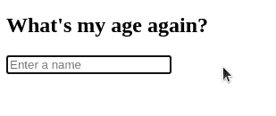

# 我如何使用钩子在 React 中实现实时搜索

> 原文：<https://levelup.gitconnected.com/how-i-implemented-realtime-search-in-react-using-hooks-3c28121f8ed9>

## 经典去抖实现的替代方案


由[马库斯·温克勒](https://unsplash.com/@markuswinkler)在 [unsplash](https://unsplash.com/photos/afW1hht0NSs) 上制作的基础图像

实时搜索是一种功能，用户可以键入他们的搜索查询并获得结果，而不必按下任何按钮来实际启动搜索。这是现代网络浏览器中非常流行的功能。

这方面的一个例子是 google.com 的搜索建议功能。当您键入查询时，建议列表会实时变化。在这里，我们将看看这种类型的搜索会出现的常见问题。我们还将尝试使用钩子来解决这些问题，而不是通常用来解决这个问题的常规方法。

为了演示问题和解决方案，我们将致力于创建一个应用程序，用户将能够输入他们的名字，应用程序将尝试猜测他们的年龄。幸运的是，有一个 API 是由 [agify.io](https://agify.io/) 提供的。我们的最终目标是创造出这样的东西:


现在，让我们来看一个实现这一功能的简单解决方案。

## 简单的解决办法

去吧！运行上面的代码笔，在文本字段中键入您的姓名。你有没有注意到任何奇怪的行为，除了可能弄错了你的年龄？



每次击键时更新年龄和姓名

这里的问题是每次击键时文本都会更新。有很多闪烁，并且用户不知道名叫`cl`或`pet`或`bruc`的人的年龄；你明白了。就用户体验而言，这并不好，因为用户可能很难理解正在发生的事情。

这也导致了对 API 的一堆不需要的请求。如果你去看看 devtools，你会看到大量不必要的请求。

如果这是一个按请求数量收费的 API，那么你最终可能会收到比你想要的更多的账单。


我们不需要的过多的 API 请求

**经典解法**

这类问题的经典解决方案是使用去抖。这种技术已经存在了很长时间，并在类似的情况下使用。然而，这将导致它自己的问题。我们先来看看什么是去抖。

*   每当调用去抖功能时，就会开始倒计时。只有在倒计时达到 0 后，才会执行该功能。递减计数的值可以由开发人员设置。
*   如果在倒计时结束前再次调用该函数，则倒计时将重新开始。

下面的代码演示了这种行为。请注意，我们正在使用 lodash 库中的[去抖函数，而不是自己编写。](https://lodash.com/docs/4.17.15#debounce)

这里我们创建一个`myFn`的“去抖版本”，延迟 3000ms (3 秒)。然后，我们调用这个函数一次，并在 1000 毫秒(1 秒)的额外延迟后再次调用它。最后，`myFn`应该在不到 4000 毫秒的时间内运行，并打印运行后的时间。

您可能会注意到结果中显示的延迟可能大于 4000 毫秒。这仅仅是因为 JavaScript 的核心机制之一，称为事件循环。

事件循环超出了本文的范围。如果你想了解更多关于它和其他 JavaScript 的内部知识(这对任何 JavaScript 开发者来说都是巨大的帮助),那么请查看 Uday Hiwarale 的这篇文章。虽然很长，但很值得。

[](https://medium.com/jspoint/how-javascript-works-in-browser-and-node-ab7d0d09ac2f) [## JavaScript 和 JavaScript 引擎在浏览器和节点中是如何工作的？

### JavaScript 的调用栈、事件循环、任务队列和其他各种组成 JavaScript 的部分。

medium.com](https://medium.com/jspoint/how-javascript-works-in-browser-and-node-ab7d0d09ac2f) 

现在，让我们来看看如何利用去抖来解决这个问题。

这解决了我们每次击键更新年龄的问题。但是，该名称仍然会在每次击键时更新。看下面的 gif。


用户键入姓名时出现不一致

在用户发出的第一个查询中，它说年龄无法猜测。此外，当用户开始键入另一个名字时，文本会将前一个人的年龄显示为当前人的年龄。

让我们看看更新文本的代码来解决问题:

```
function AgeText({ name, age, loading }) {
  if (!name) return "";
  if (loading) return `Hello ${name}! Your age is ...`;
  if (typeof age === "number") {
    return `Hello ${name}! Your age is ${age}`;
  } else {
    return `Sorry ${name}! I could not guess your age!`;
  }
}
```

每当用户键入名字时，`loading = false`因为只有当去抖功能实际运行时，加载才被设置为`true`。这是在`600ms`之后，如果用户停止输入的话。因此，在输入过程中，`AgeText`将总是绕过`if (loading)`检查并显示与最后一个请求相关的`age`。

为了解决这个问题，最简单的方法是在`useEffect`内部将 loading 设置为 true，而不是在请求之前。但是这将意味着`setLoading(true)`和`setLoading(false)`被设置在完全不同的地方。这可能会给维护代码带来一些困难。它也不能解决用户输入时名称更新的问题。


去抖+ setLoading(true)在 useEffect 内部

此时，为了解决这个问题，您可能会引入第二个状态，`searchedName`并在搜索结束后更新`searchedName`。如果你把`searchedName`传给`AgeText`，而不是把`name`传给`AgeText`，问题就解决了。

以下是使用此方法的解决方案:

关于去抖解决方案，最让我困扰的是`useMemo`调用。我们不能在组件外准备去抖函数，因为这个函数需要访问组件范围内的函数，如`setLoading`和`setGuessedAge`。

如果我们在这里不使用`useMemo`，那么去抖功能将无法工作。这是因为每次重新渲染组件时都会重新创建去抖功能。每当用户在输入字段中键入内容时，都会发生这种重新呈现。如果你想看到它的运行，那么我欢迎你从上面的 codepen 中移除`useMemo`并尝试一下。

让我们试着找到一个更简单的解决方法。

## 自定义挂钩解决方案

这个解决方案使用了一个名为`useDelayedValue`的定制钩子。

```
function useDelayedValue (srcValue, delay = 0) {
  const [value, setValue] = useState(srcValue);
  useEffect(() => {
    const timer = setTimeout(
      () => setValue(srcValue),
      delay
    );
    return () => clearTimeout(timer);
  }, [srcValue, delay]);
  return value;
}
```

它所做的就是接受一个值(`srcValue`)，并返回另一个与`srcValue`相关的值。但是，它只会在经过`delay`毫秒后返回更新值。如果延迟尚未结束，它将返回旧值。这意味着在开发人员定义的一些最小延迟之后，`return value`将总是最终等于`srcValue`。

是的，这有点类似于函数的反跳，但这里的优点是它不必像函数反跳那样担心作用域和其他绑定。

我们现在可以将这个延迟值用于实际的搜索和显示，并使用原始值绑定到输入字段。

这在逻辑上也说得通。您需要原始的`inputName`以便将值绑定到`input`字段。您需要`nameToRequest`来执行实际的请求。这是两个独立的用例。它们之间唯一的关系是用于请求的值(`nameToRequest`)来自用户输入的值(`inputName`)。

使用这个钩子使得我们的主`App`组件的逻辑更加简单。在渲染过程中，不需要借助使用`useMemo`来创建去抖动功能。代码现在比使用去抖动时简单多了，并且`useDelayedValue`的“稍微复杂”的实现隐藏/抽象在另一个函数中。

## 最后的想法

实时搜索是一个常见的功能，但它也有一些缺陷。一个请求优化问题来自不需要的 API 请求，一个一致性问题来自反应式组件中的绑定。去抖动通常用于处理请求优化问题。然而，处理一致性问题需要其他解决方案。然而，React 中功能组件和钩子的流行为解决这两个问题的其他解决方案铺平了道路。