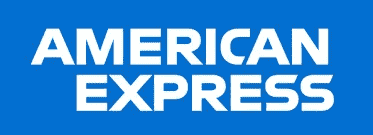

# 我如何获得美国运通的全职工作机会(软件工程师)

> 原文：<https://levelup.gitconnected.com/how-i-landed-a-full-time-offer-from-american-express-software-engineer-533c312c2e76>

每年 10 月至 11 月，Techgig 都会举办一场名为“ [Techgig 极客女神](https://www.techgig.com/geekgoddess)”的活动，向科技界的女性致敬。在两个月的时间里，各种各样的挑战接踵而至，从黑客马拉松到编码竞赛，从网络研讨会到与技术领域的顶级女性领导者互动，以及许多有趣的活动。
除此之外，还有一场招聘会。

美国运通是赞助商之一，并通过招聘会雇佣应届毕业生进行为期 6 个月的实习。

## 我是如何申请的

我通过 Techgig 极客女神的[职业](https://www.techgig.com/geekgoddess/career)页面申请。
11 月，我得到了一个在线技术评估的链接。

邮件中提到，基于多种因素，我的个人资料已入围在线测试。

## **在线评估**

**平台:**黑客地球
**时长:**1 小时 30 分钟
由 3 道中等难度到困难难度的编码题组成。
这些不是标准的 DSA 问题，而是 CP 方面的问题。

如果你已经在 LeetCode 上解决了中/难题，你将能够解决它们。

五天后，我们学院的 TNP 分部收到邮件，说我们学院有两个学生通过了测试，我是其中之一。他们要求提供课程，因为他们要招聘 6 个月的实习生，所以他们不想有任何学术重叠。

但是因为我们没有 6 个月的实习作为我们课程的一部分，所以人力资源部通知我们，他们将评估我们的全职工作。
(所有在 OA 后入围的 IP 大学学生都被评估为全职角色。)

两天后，我们的采访得到安排。我们被告知将在同一天进行三轮面试，每轮都是淘汰性质的。

## 视频访谈(三轮)

**平台:** Webex
**时长:**45–60 分钟

每一轮都在同一天进行，中间有 60-90 分钟的间隔。

所有回合都是从面试官自我介绍开始，然后要求我也这样做。我原以为面试是典型的解决问题的过程，但事实并非如此。主要的焦点是我参与的项目和 CS 基础知识。

## 第一轮面试:

我们就我的所有项目进行了大约 20-25 分钟的深入讨论。我所有的项目都是在 GitHub 上开源的，所以我分享了我的屏幕，并和截图一起向他解释了每一件事。

**我在解释项目时提到的几点:
1。制作这个项目的动机。(解决任何现实世界的问题)
2。解释应用程序的完整功能。
3。解释所有用于其目的的技术。
4。选择特定技术堆栈而非其他技术堆栈的原因。
5。未来范围**

我还提到，我的一个项目也被一个开源项目选中，在那个项目中，我合并了大约 25 个拉请求。他似乎很感动，然后问了我一些交叉问题。

你可以在这里查看我的 GitHub 简介。

然后我们进入了问题解决部分，他问了我 2 个简单难度的 DSA 问题。
**1。矩阵对角线上所有元素的和。
2。二叉树的高度。**
因为问题比较简单，所以我用时间和空间的复杂度向他详细解释了我的方法。然后他让我用记事本把它们编码。

他似乎很满意，问我是否有问题要问他。我问了他几个问题，然后面试结束了。

**面试第二轮:** 这一轮，我只被问了一个 DSA 问题:[硬币零钱](https://leetcode.com/problems/coin-change/)。
我开始给他讲解蛮力解法，然后逐渐转移到 DP 解法。面试官让我在任何编辑器中编写代码，并在给定的测试用例上运行。
我的代码给出了正确的输出，面试官对这种方法也很满意。

在接下来的采访中，他问了很多关于 CS 基础的问题，包括 DSA(理论部分)、OOPS、DBMS 和 OS。然后他转向了计算机网络，但是我告诉他我还没有准备好，他对此完全没有意见。

我必须说面试官很有帮助，非常耐心地听我回答。对于我不知道的问题，比如他问我关于设计模式的问题，我以前没有研究过，他在采访中向我解释了这些问题。

最后，他问我有什么问题要问他。

## 第三轮面试:

这是一次与工程总监的管理会谈。

他让我详细解释我所有的项目。我分享了我的屏幕，向他解释了一切，然后他问了很多基于此的交叉问题。我的项目使用 Firebase 来存储数据，所以我们详细讨论了如何在不同的数据库中存储数据。他还问了几个关于 DBMS 和 SQL 的问题。

然后他翻看了我的简历，然后我们详细讨论了我到目前为止所从事的所有技术，我的开源经验，以及之前所有的实习经历。然后，他问了 3-4 个管理问题。我按照星方法回答了所有的问题。

最后，我问他在美国运通的这段旅程(因为他已经和他们一起工作了 10 多年)。当谈到他的旅程时，他看起来很开心。最后，他说希望有一天能在办公室见到你，所以我很有信心能得到这份工作。

三天后，他们把结果邮寄到了我们在 TNP 的分部。

*我必须说，从我目前接受的所有面试来看，我在美国运通的经历是最好的。*

## **一些小技巧:**

1.  在你的简历上至少要有两个好的项目。
2.  准备面试的时候不要忽略 CS 科目。它们和 DSA 一样重要。
3.  千万不要在简历上作假。只提及那些你真正研究过的技术。
4.  始终按照 STAR 方法回答行为问题。
5.  把你所有的项目上传到 GitHub 上，它给面试官留下了很好的印象(如果是网站的话，把现场演示给面试官看)。
6.  如果你不知道任何问题的答案，那就对面试官说清楚，而不是编造任何故事。
7.  最后，当面试官给我们一个提问的机会时，要充分利用这个机会。

希望这对你有帮助:)
我也分享过我和亚马逊的面试经历，你可以在这里[查看](https://medium.com/@priyalbhatewara2000/amazon-sde-1-interview-experience-selected-175517b08ba7)。

如果你有任何疑问，请随时发表评论或联系我。

# 分级编码

感谢您成为我们社区的一员！更多内容见[升级编码出版物](https://levelup.gitconnected.com/)。
跟随: [Twitter](https://twitter.com/gitconnected) ， [LinkedIn](https://www.linkedin.com/company/gitconnected) ，[通迅](https://newsletter.levelup.dev/)
**升一级就是转型理工招聘**👉 [**加入我们的人才集体**](https://jobs.levelup.dev/talent/welcome?referral=true)