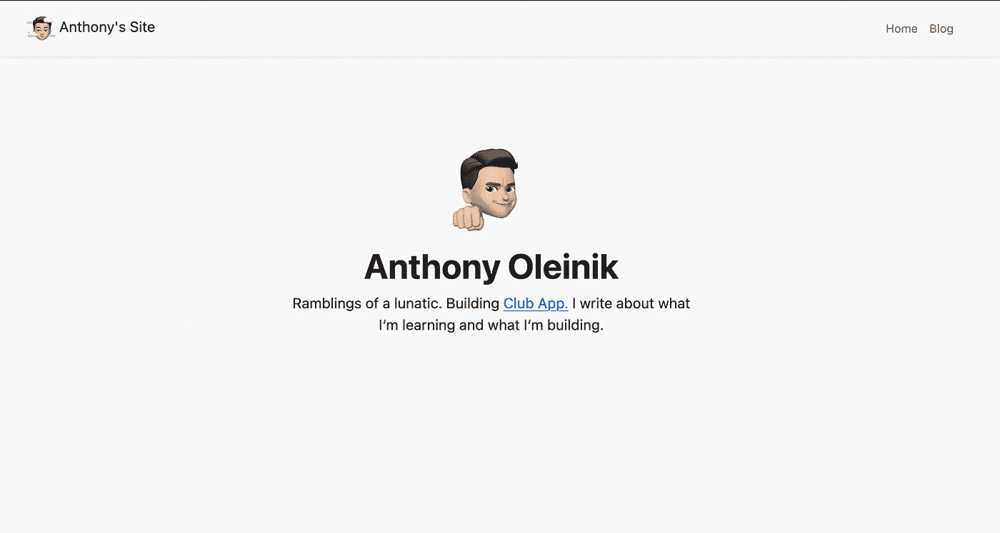
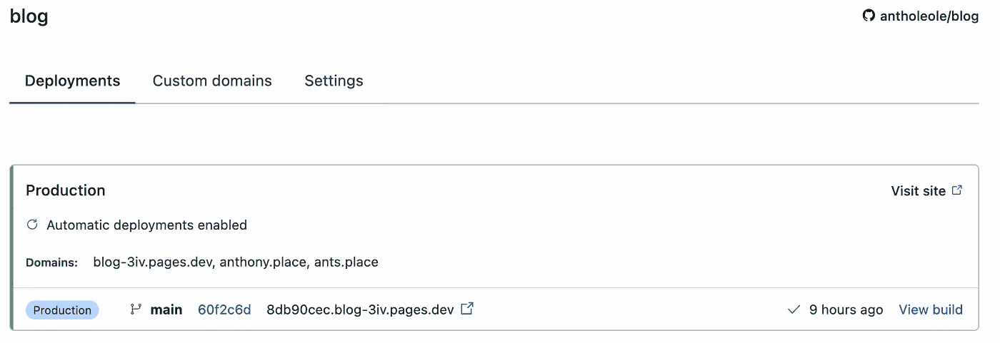
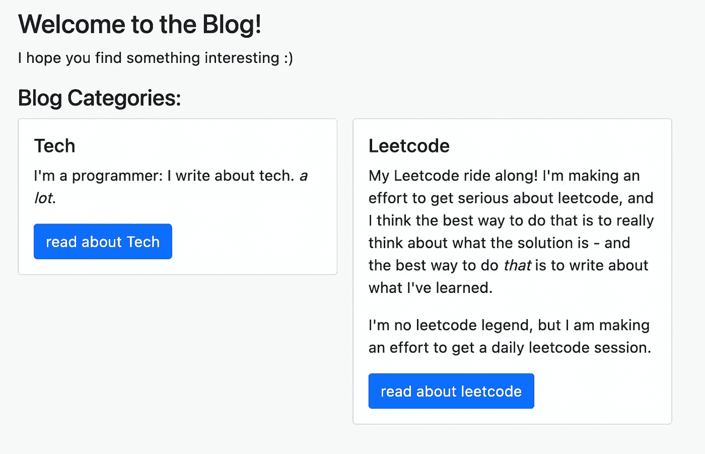

# 我如何在三小时内推出我的网站

> 原文：<https://levelup.gitconnected.com/how-i-launched-my-website-in-three-hours-for-free-637eb4f9606e>

我的网站！

不要误解我的意思:我喜欢把 Medium 作为一个平台。这是迄今为止作家让自己的作品受到关注的最佳方式——出版物提供了一种自然而有用的内容过滤机制，也是读者发现新作家的好方法。

简而言之，这是作家接触新读者的最佳方式之一——对作家和读者都是一种胜利。

但是，作为一个靠在这个平台上发表文章赚钱的作家，我需要把它当成一份工作:我*只*在我引以为豪的媒体上发表内容(比如这篇文章！)，而且我觉得向读者传递了价值。更重要的是，我觉得我需要呆在我的“利基”中:我的追随者跟随我是因为他们喜欢我的技术教程，而不是因为他们关心我对 Kolmogrov 复杂性的想法，或者我每天的 Leetcode grind。

这就是为什么我建立了我的博客——我在不到 3 个小时的时间里建立并部署了它。我是这样做的。

证据:[这是博客](https://ants.place/):)的链接

# 旅程

大家都知道，每一个好的边项目都是从买域名开始的。

如果你将此作为启动免费网站的教程，不要担心:购买域名 100%不是强制性的，你可以直接在 Cloudflare 页面上启动。

我选定了 Anthony . place，但很快意识到 ants . place(Ant 是我的朋友们经常给我起的名字，它是一个简短而朗朗上口的域名)是开放的，所以我也买了那个。Cloudflare(你很快就会意识到它是这个故事中的一个大玩家)最近推出了一个域名注册器。这些域名是成本价，也就是说他们以购买价格卖给我们，所以我就在那里买了。

嗯，这个域已经在 Cloudflare 上了，所以还不如用 [Cloudflare Pages](https://pages.cloudflare.com/) ，对吧？

# Cloudflare 页面

Cloudflare Pages 是这个故事中第一个节省大量时间的项目——以前，建立一个网站需要几个小时，因为您需要连接 Github Actions 或其他 CI/CD 来实际部署您编写的代码，并将其推送到服务器，然后确保您的所有配置(DNS 记录、Nginx 等)。)工作正常。

我通过键入`git add --all && git commit -m "new article" && git push`部署了这篇文章。

我的 Cloudflare 页面已部署

Cloudflare Pages 会立即连接到您的 Github 存储库，在每次推送时运行构建命令，并提供静态目录。就像魔法一样。

你甚至不需要一个域来做这件事——我很容易就把我的域连接起来了，但是 Cloudflare 会自动给你一个 pages 域，你也可以愉快地使用它。

# 选择 Web 框架

好的，这样我就可以快速部署和服务我的网站……*但是还没有要部署的网站*。在这个阶段，我已经准备好了我的部署解决方案、我的领域和文章——但是没有我的实际网站的代码！

选择前端很有趣——有很多框架提供了非常棒的 SSG(这是静态站点生成——对于那些不知道的人来说，它基本上只是将您的网站和所有页面完全构建到静态 HTML、CSS 和 JS 文件中，而不是让服务器提供内容时发生这种情况。)但是我有一些要求:

1.  基于 React:我非常了解 React，这是我想要使用的框架——学习是很好的，但在这种情况下，我只是想要一个最终产品。
2.  Cloudflare Pages 支持的开箱即用:Cloudflare Pages 允许您自定义静态输出目录和构建脚本，但仅此而已。这不是一个限制因素，因为 Cloudflare Pages 支持大量现成的框架。
3.  流行框架:我不想学习一个垂死的框架，或者一个人们根本不知道存在的框架。我想选择一些流行的、有很多在线文档的东西。

这 3 个要求直接将我引向`Next.js`。Next 是 React 的一个超集，支持 React 还不支持的很多非常棒的东西，比如静态站点导出。

这是我第一次进入下一个领域，但对我来说并不完全陌生——它是基于 React 的，我对此进行了广泛的研究，并且有大量的在线文档，以至于我遇到的每个问题都是一个简短的谷歌搜索。

# 编码

我是个 Typescript 的粉丝，所以我显然用的是 Next.js 的 Typescript 版本。

我花了大约 15 分钟试图为应用程序设计一个导航条:我已经忘记 CSS 对于生疏的开发者来说是多么挑剔，所以我很快转向 Bootstrap。Bootstrap 正是我需要的推动力，在接下来的一个小时内，我完成了整个网站:

一个基于 markdown 的博客，包含图片、代码和面包屑。

本质上，在公共目录中，有类别的文件夹，然后是文章的子文件夹。在这些文章文件夹中有`content.md`和`meta.json`，以及我想提供的任何图片。

如果你在任何博客文章的末尾加上`/meta.json`，[，就可以看到元数据，就像这里。](https://ants.place/blog/leetcode/remove-linked-list-elements/meta.json)

功能齐全吗？绝对不行。没有 SEO 优化，没有`sitemap.xml`，没有`robots.txt`，没有个人简历…只是一个博客。事实上，有些页面存在问题——例如，在博客文章类别页面上，我使用了一些 Mozilla 特有的样式，因此，它在 Chrome 上无法正确显示。这就是*应该有的*的样子:

一个适当的两列布局与良好的流动

将功能蠕变保持在最低限度是很重要的:我已经着手建立一个博客。如果我选择添加任何其他功能，如电子邮件列表或用户跟踪，也许网站会好一点——但启动 MVP 所需的时间越长，你永远不会启动的可能性就越大。

如果有一天早上我决定我的博客需要电子邮件订阅(不确定)，我会在那天花时间添加。现在，我很高兴在 3 个小时内建立和部署我的网站，我会很高兴地将我每天的 leetcode 博客帖子写在 markdown 文件中，并很高兴地将它们推送到我的网站上。

感谢阅读！

*原发表于*[*https://ants . place*](https://ants.place/blog/Tech/Write-and-Deploy-a-Whole-Website-in-3-Hours)*。*