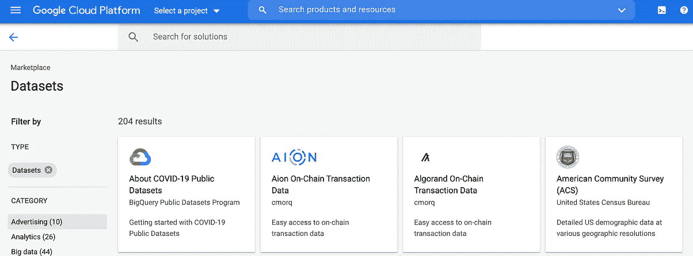
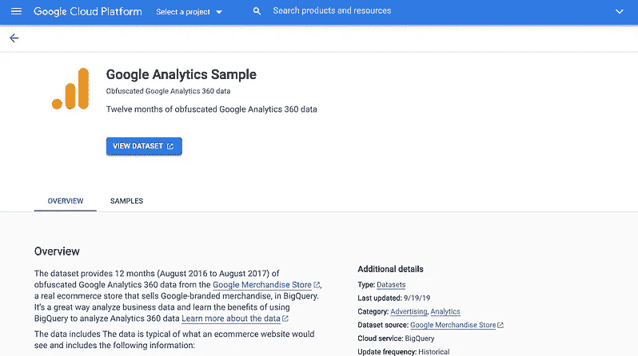
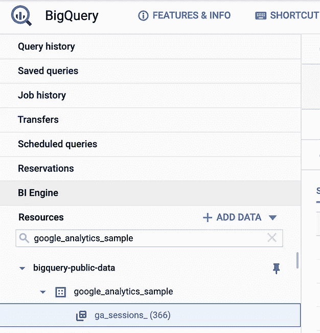
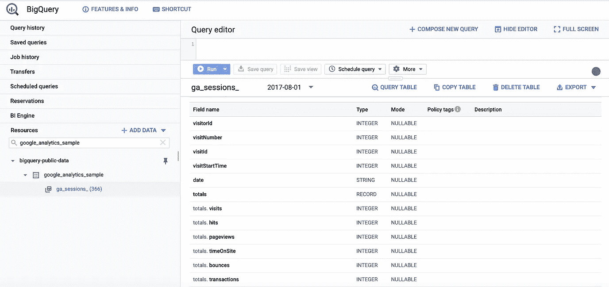
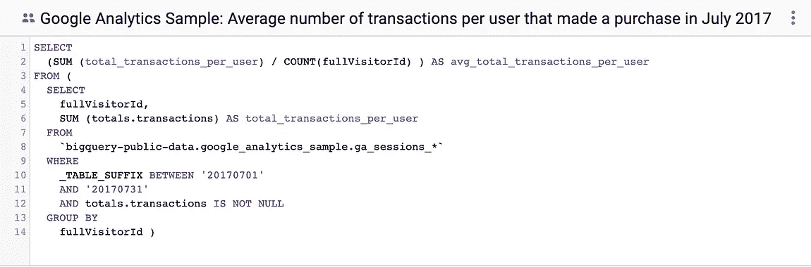
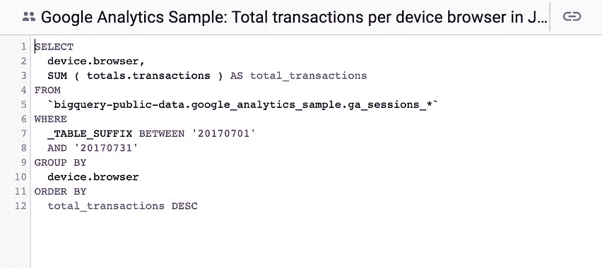

# 我如何使用 BigQuery 学习 SQL

> 原文：<https://levelup.gitconnected.com/how-i-learned-sql-using-bigquery-67c193f33b31>

## [动手数据](https://medium.com/tag/hands-on-data)

## 用 BigQuery 挖掘 SQL。


照片由 [Edho Pratama](https://unsplash.com/@edhoradic?utm_source=unsplash&utm_medium=referral&utm_content=creditCopyText) 在 [Unsplash](https://unsplash.com/s/photos/technology?utm_source=unsplash&utm_medium=referral&utm_content=creditCopyText) 上拍摄

在当今以数据为导向的商业世界中，使用 SQL 并理解身边的数据是非常重要的。

在本文中，我将深入探讨我是如何开始使用 SQL 和 Google 的 BigQuery 工具的。为了更好地了解我的背景以及我的旅程中的一些关键提示、技巧和收获，请首先查看这篇文章:

[](https://medium.com/@jodydavidroberts/my-0-to-1-journey-learning-sql-dbaaa6098d1c) [## 我从 0 到 1 的 SQL 学习之旅

### 开始使用 SQL 时我希望了解的内容。

medium.com](https://medium.com/@jodydavidroberts/my-0-to-1-journey-learning-sql-dbaaa6098d1c) 

# 橡胶与路面的交汇处

BigQuery 可通过基于 web 的 UI 获得，因此您可以通过浏览器访问您的数据并运行查询，您所需要的只是一个互联网连接。BigQuery 也支持其他访问方法——bq 命令行工具和各种客户端库的 API 访问。为了本文的目的，我将坚持基于 web 的 UI。

刚刚开始使用 SQL 的另一个巨大好处是 [BigQuery 提供免费的公共数据集](https://cloud.google.com/bigquery/public-data)(包括 1TB 的查询)，您可以利用这些数据集来磨练自己的技能。

出于我们的目的，我们将查看[谷歌分析样本数据集](https://console.cloud.google.com/marketplace/product/obfuscated-ga360-data/obfuscated-ga360-data)。这恰好是谷歌提供的与这个数据集相关的样本查询的额外好处。



谷歌提供涵盖许多垂直领域的公共和样本数据集。*图片由作者提供。*

一旦您将数据集添加到您的 BigQuery 项目中，您将看到它列在您的 BigQuery 项目中的“Resources”下，如下所示。此外，如果您选择现在可用的表系列— `**ga_sessions_**` —您将看到列出的表的**模式**。*模式表示表中可用的数据列及其结构。*



谷歌分析样本数据集和模式。*图片由作者提供。*

开始的一个简单方法是简单地运行提供的示例查询。这些都是有问题的，每个问题都会产生一个经过验证的结果。

我之前提到但值得再次提及的一件事是，在许多情况下，数据可以被操纵来讲述任何故事。重要的是不要有预先确定的偏见，否则你可能会产生一个查询，从而告诉你你想听到的结果。



谷歌分析样本数据集样本查询。*图片由作者提供。*

```
***Sample 1
What is the average number of transactions per purchaser?*** *Calculate the average number of transactions per purchaser for April 2017.*SELECT
  (SUM (total_transactions_per_user) / COUNT(fullVisitorId) ) AS avg_total_transactions_per_user
FROM (
  SELECT
    fullVisitorId,
    SUM (totals.transactions) AS total_transactions_per_user
  FROM
    `bigquery-public-data.google_analytics_sample.ga_sessions_*`
  WHERE
    _TABLE_SUFFIX BETWEEN '20170701'
    AND '20170731'
    AND totals.transactions IS NOT NULL
  GROUP BY
    fullVisitorId )***Sample 2******What is the total number of transactions generated per device browser?*** *Identify the top 5 browsers used for making transactions in July 2017, listed in descending order by total transactions.*SELECT
  device.browser,
  SUM ( totals.transactions ) AS total_transactions
FROM
  `bigquery-public-data.google_analytics_sample.ga_sessions_*`
WHERE
  _TABLE_SUFFIX BETWEEN '20170701'
  AND '20170731'
GROUP BY
  device.browser
ORDER BY
  total_transactions DESC
```

# 分解它

这些查询碰到了几个非常重要的值得注意的语法项目:

*   **标准 SQL** — BigQuery 支持使用传统和标准 SQL。我的偏好是使用标准 SQL，但是当我开始使用 BigQuery 时，我使用的是遗留 SQL。两者都有好处——你可以在这里找到更多信息。
*   `**WHERE**`是你的滤镜。使用它。
*   `**_TABLE_SUFFIX**` —如前所述，样本数据集以表序列的形式存在，包括按日期分隔的数据(每天的数据是一个单独的实例)。在`**WHERE**`子句中使用`**_TABLE_SUFFIX**`通配符允许您查询多天的数据。*这也可以用来限制查询的数据量！*

## 示例查询

*   两个查询都利用`**WHERE**`子句将查询限制在 2020 年 7 月 1 日-7 月 31 日的数据
*   两个查询都使用了`**SUM**`操作符。这些问题本质上是定量的，所以你期待数学计算是很自然的。需要注意的一点是，当使用聚合函数并选择额外的数据列时，必须使用一个`**GROUP BY**`操作符。
*   示例 2 要求“前 5 名浏览器”，但是查询产生的结果多于 5 个。由于有一个`**ORDER BY**`操作符，挑选出前 5 个结果相当容易。`**ORDER BY**`按从小到大【升序`**ASC**`或从大到小【降序`**DESC**`对数据进行排序

# 我们将何去何从？

这只是通过 Google 的 BigQuery 工具使用 SQL 挖掘真实数据的快速入门。如果你还没有真正的数据集，别忘了，数据就在你身边。在电子表格中跟踪一些东西，然后将其作为自己的表上传到 BigQuery(您可以上传一个 CSV 文件来创建一个表)，然后使用 SQL 对其进行分割。有关 BigQuery 的更多细节，请查看— [BigQuery 的文档](https://cloud.google.com/bigquery/docs)。

现在，我已经打下了基础，并建立了一个平台来改进我们的 SQL-foo，请务必关注我，并继续关注后续关于使用 SQL 进行分析的深入文章，包括关于使用数据可视化和仪表板功能的文章。

*本文并没有全面涵盖 SQL 或 BigQuery，我很乐意听到您对未来主题的意见或建议。欢迎在评论中分享。*

# 关于我

我致力于解决问题、推动卓越运营和推出产品。作为一名专注于 DaaS 的产品经理，我还为致力于通过专注于产品的增长和数据价值实现价值最大化的组织提供咨询。[伸出手来继续对话或一起工作。](https://www.hornetsnest.io/contact/)

[](https://www.linkedin.com/in/jodyroberts/) [## Jody Roberts -高级产品经理- Bombora | LinkedIn

### 在全球最大的职业社区 LinkedIn 上查看乔迪·罗伯茨的个人资料。乔迪有 4 份工作列在他们的…

www.linkedin.com](https://www.linkedin.com/in/jodyroberts/)