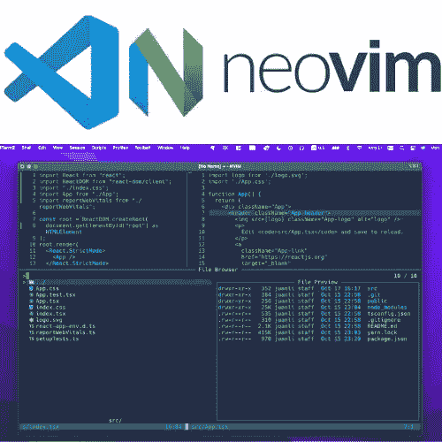
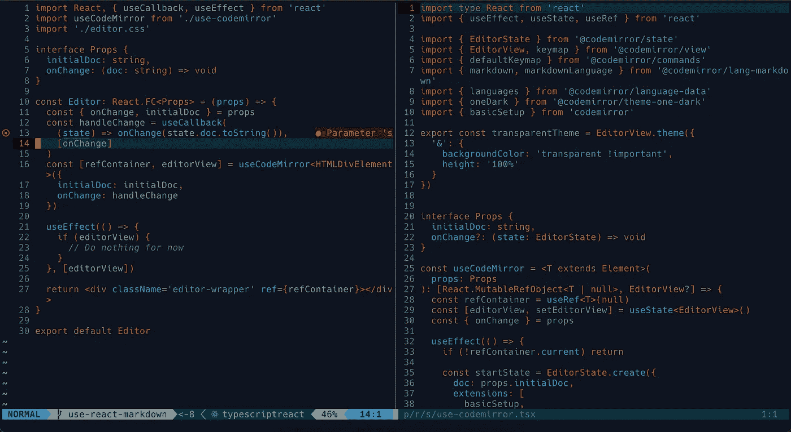

# 我是如何学会爱上 Vim 并在一个月内从 VS 代码过渡到 Neovim 编码工作流的

> 原文：<https://levelup.gitconnected.com/how-i-learned-to-love-vim-9b7fe53a4615>

## 快速过渡到基于 Neovim 的文本编辑器是正确的选择！

作者创造的形象。

几年来，我和 VIM 有着复杂而有趣的关系。一开始纯粹是出于好奇。当我开始学习编码时，好奇心驱使我尝试 VIM，来自各种编码教程的主流工作流不鼓励我成为最终的 VIM 用户，但是现实世界的工作环境继续像公司中的其他人一样将我推向 IDE，但是当前的工作流允许我作为独立开发人员享受编码的乐趣。

和 VIM 关系比较好，感觉很幸运。享受 VIM 带给我的生产力、专注和快乐。所以，我很乐意在这篇文章中分享这个可爱的故事。

# 放弃使用 Vim

三年前刚开始学编码的时候，对互联网上一些开发者使用 VIM 的情况还挺好奇的。所以我在终端上尝试了一些 VIM 命令。嗯，当我不用鼠标就能把光标移动到我想移动的地方时，感觉很酷。我想我可以在未来的编码项目中使用带有 VIM 命令的终端。但是，我学习编码的时间越长，学习的教程越多，我就越不愿意使用带有 VIM 的终端。因为大多数时候，导师也是依靠一个 IDE 来做一个项目。为了顺利跟进，我很快适应了这个主流工作流程。像 VS Code 这样的 IDE 可以自动提供大量强大的特性，无需任何预先配置。尤其是，在我之前的两个开发工作中，几乎每个同事都在使用 IDE。那么，为什么要费心使用与众不同的东西呢？我可以用鼠标在屏幕上移动光标，为什么还要学习 VIM 命令呢？有了 IDE 提供的所有这些舒适，我发现自己在一个舒适的地方学习编码并作为一名开发人员工作。

我确实在 VIM 插件的帮助下在 VS 代码中尝试了 VIM 命令。但结果却是萎靡不振。很多时候，出于某种原因，代码被冻结，这只能通过从 VS 代码中禁用 VIM 插件来修复。很好！我认为有足够的理由让我放弃使用 VIM。许多优秀的开发人员不使用 VIM，但他们仍然做得很好。所以，为什么要在我的开发者生涯中麻烦 VIM 呢？

# 使用 Vim 重新启动了我的工作流

使用基于 Vim 的文本编辑器在 React 应用程序中编写 TypeScript。由[使用相同的基于 vim 的工作流设置构建了我自己的项目。*   坚持每天使用 Vim 构建项目。

因为我碰巧和拓也从事类似的技术工作。因此，在我熟悉的编码项目中练习 Vim 是有意义的，这有助于保持专注。因此，在短短的两三周内，我学会了自信地用基于 Vim 的文本编辑器构建 web 应用程序。永远不要为我依赖 VS 代码的旧工作流程而烦恼。感觉就像改变了生活。](https://medium.com/u/9f2dc23bfffa#我是如何用 Next.js + Tailwind CSS(在自然中)</a>搭建一个软件代理网站，搭建一个单网页应用。</li><li id=) 

</a>搭建一个软件代理网站，搭建一个单网页应用。</li><li id=)

# [我学到了什么](https://medium.com/u/9f2dc23bfffa#我是如何用 Next.js + Tailwind CSS(在自然中)</a>搭建一个软件代理网站，搭建一个单网页应用。</li><li id=)

## [用维姆的方式做任何事](https://medium.com/u/9f2dc23bfffa#我是如何用 Next.js + Tailwind CSS(在自然中)</a>搭建一个软件代理网站，搭建一个单网页应用。</li><li id=)

[提高你的 Vim 技能的关键就是不要使用任何其他东西。很难不求助于你的旧习惯，尤其是当你面临完成任务的压力时。但是你可以在你的业余项目中练习 Vim。经过多次实践，您将会对有效使用 Vim 有一种直观的感觉。最终，它变成了第二天性。](https://medium.com/u/9f2dc23bfffa#我是如何用 Next.js + Tailwind CSS(在自然中)</a>搭建一个软件代理网站，搭建一个单网页应用。</li><li id=)

## [让自己成为独一无二的开发者](https://medium.com/u/9f2dc23bfffa#我是如何用 Next.js + Tailwind CSS(在自然中)</a>搭建一个软件代理网站，搭建一个单网页应用。</li><li id=)

[找出基于 Vim 的文本编辑器的插件可以帮助你理解你需要什么，并构建一个适合你和你的工作流程的文本编辑器。我们不是别的什么开发者，只有我们。我们知道自己想要什么，也知道什么会影响我们的工作效率。](https://medium.com/u/9f2dc23bfffa#我是如何用 Next.js + Tailwind CSS(在自然中)</a>搭建一个软件代理网站，搭建一个单网页应用。</li><li id=)

[当 Vim 生态系统中还没有匹配的插件用于某个项目时，一个成熟的 IDE 在某些情况下确实很有意义。但是很多时候，你不需要担心缺失的插件，只需要找出最适合你使用的就可以了。](https://medium.com/u/9f2dc23bfffa#我是如何用 Next.js + Tailwind CSS(在自然中)</a>搭建一个软件代理网站，搭建一个单网页应用。</li><li id=)

</a>搭建一个软件代理网站，搭建一个单网页应用。</li><li id=)

# [结论](https://medium.com/u/9f2dc23bfffa#我是如何用 Next.js + Tailwind CSS(在自然中)</a>搭建一个软件代理网站，搭建一个单网页应用。</li><li id=)

[使用 Vim 绝对可以加速您的编码过程，还可以在您和文本编辑器之间建立良好的交互。Vim 中建立的信任提升了生产力。](https://medium.com/u/9f2dc23bfffa#我是如何用 Next.js + Tailwind CSS(在自然中)</a>搭建一个软件代理网站，搭建一个单网页应用。</li><li id=)

[感谢阅读。以后，我会更多地分享我如何使用 VIM 来构建一些很酷的项目。](https://medium.com/u/9f2dc23bfffa#我是如何用 Next.js + Tailwind CSS(在自然中)</a>搭建一个软件代理网站，搭建一个单网页应用。</li><li id=)

</a>搭建一个软件代理网站，搭建一个单网页应用。</li><li id=)

[*如果你想在 Medium 上阅读来自*](https://medium.com/@amy-juan-li/membership) [*【李冠仪】*](https://medium.com/u/9f2dc23bfffa?source=post_page-----9b7fe53a4615--------------------------------) *以及成千上万其他作家的每一个故事，考虑成为 Medium 会员* *。每月 5 美元，你可以无限制地访问媒体内容。如果你* [*通过我的推荐链接*](https://medium.com/@amy-juan-li/membership) *报名，我会得到一点佣金。*

 [## 通过我的推荐链接-李冠仪加入媒体

### 阅读李冠仪的每一个故事(以及媒体上成千上万的其他作家)。你的会员费直接支持李冠仪…

medium.com](https://medium.com/@amy-juan-li/membership) 

# 进一步阅读

 [## 使用 Neovim、TypeScript 和 TailwindCSS 设置 Next.js 应用程序工作流

### 为新的 Next.js 应用程序设置高效的工作流。

艾米-胡安-李](https://amy-juan-li.medium.com/set-up-a-next-js-application-workflow-using-neovim-typescript-tailwind-23621a34ed38)  [## 作为一名软件开发人员，我从观念转向黑曜石的两大原因

### 使用 VIM 快速键入，使用 Markdown 快速格式化文本。

amy-juan-li.medium.com](https://amy-juan-li.medium.com/why-i-use-obsidian-for-note-taking-making-system-as-a-tech-writer-e208699e0011)