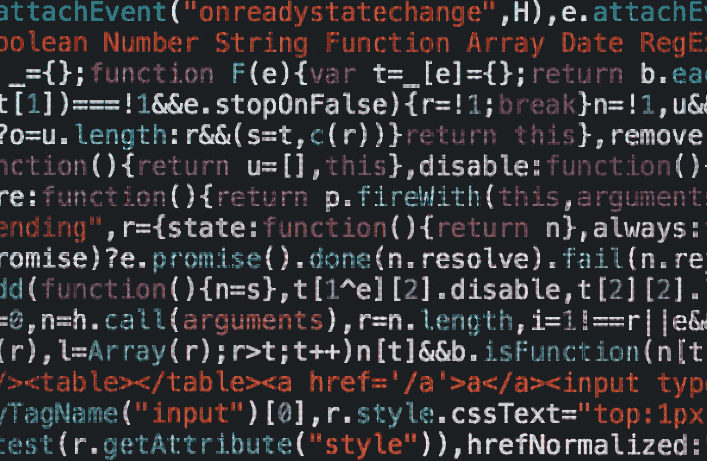

# 我是如何在 5 小时内学会 Vim 的

> 原文：<https://levelup.gitconnected.com/how-i-learned-vim-in-5-hours-9ef2696216d2>

## 以及为什么它值得你花时间去学习

马库斯·斯皮斯克在 [Unsplash](https://unsplash.com/s/photos/code?utm_source=unsplash&utm_medium=referral&utm_content=creditCopyText) 上拍摄的照片

开始新的编程工作的第一天，我正在和公司的高级开发人员一起设置我的开发环境。

> 他:我们需要添加一些代码。bash_profile。
> **我:**好的。
> **他:**用你喜欢的任何编辑器打开。Vim，emacs...
> **我:**(思考:我只知道纳米)
> 【我在纳米里打开】
> **他:**哦原来你是个纳米佬。
> **我:**(心想:sh*t 现在我看起来像个 noob)

那是我决定学习 Vim 的一天。

# Vim 是什么？

Vim 是一个文本编辑器。它可以用来写代码或做笔记。它是从命令行打开的。

# 为什么要学习 Vim

*   从命令行编辑文件消除了使用复杂编辑器时的少量上下文切换。
*   没有文件树或闪烁的按钮阵列来分散你的注意力，因为编辑器是你的整个终端。
*   导航更快，因为你的手不需要离开键盘的中心。再见箭头键。
*   Vim 让导航文件和文本的速度与键盘命令一样快。所以你不需要触摸鼠标或触控板。
*   对你的手腕来说更容易，因为你输入的`shift`、`control`、`option`、`cmd` …
*   它是语言不可知的。我用它来写 Ruby，Python，只是做笔记。
*   几乎每台机器上都有。因此，当您 ssh 到远程服务器时，仍然会非常高效。
*   学习曲线被夸大了。如果你虔诚地使用它，你可以在几天内变得非常精通。
*   Vim 很有趣，并且随着您的改进会变得更有趣。
*   你不会看起来像个新手。

# 为什么不学习 Vim

*   这是一项时间投资，一开始会让你头疼。
*   如果你是一个前端开发人员，需要经常使用你的鼠标，它不会有用。

# 我是如何学习 Vim 的

1.  在命令行中输入`vimtutor`。这将打开一个 Vim 教程，带您了解 Vim 基础知识。您必须在 Vim 中浏览教程。慢慢来，记笔记。
2.  做`vimtutor`练习时，使用 Vim 在另一个终端窗口做笔记。`vim vim_notes.txt`将创建并打开一个文件，帮助您入门。
3.  写下你学习 Vim 的经历，在 Vim。
4.  抵制使用箭头键而不是 Vim 命令进行导航的诱惑。相信我，会变得更容易的。
5.  为你喜欢的代码编辑器下载 Vim 插件。为 Rubymine 或其他 JetBrains 编辑器下载`IdeaVim`。
6.  为 Atom 下载`vim-mode-plus`。
7.  在 Vim 中做一些软件开发的日常工作。
8.  尽快重做 Vim 教程。
9.  在 Vim 中编辑您的购物清单。现在，我可以快速添加工作时突然出现在我脑海中的项目。
10.  在 Vim 中编写 Vim 备忘单。

综上所述，做`vimtutor`然后开始使用。

# 结论

在我多年的软件开发生涯中，我确实认为像 Vim 和 Emacs 这样的工具是愚蠢的。我继续使用 nano，只在必要时使用，因为摩擦力很小。

也就是说，配置您的环境和学习正确的工具是一项被低估的投资。目前，我绝不是 Vim 专家，但我已经开始获益。其中大部分源于减少的上下文切换和随之而来的更多乐趣。

本周花点时间试试`vimtutor`。