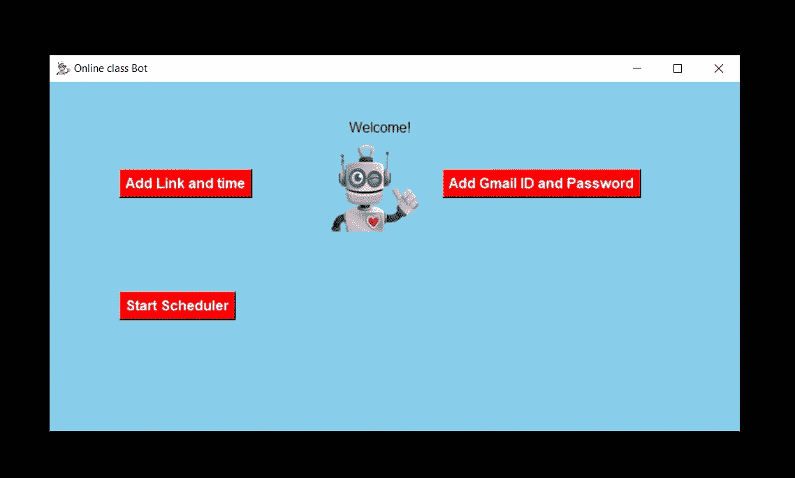
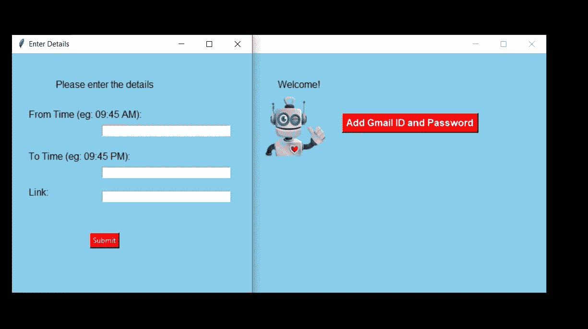
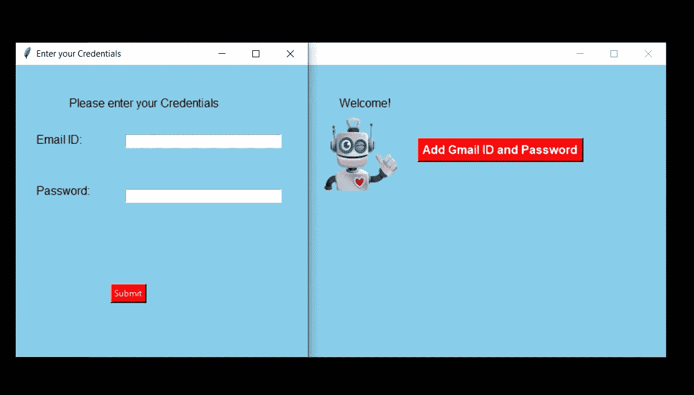

# 我如何为我的网络课程制作一个机器人？

> 原文：<https://levelup.gitconnected.com/how-i-made-a-bot-for-my-online-class-3b087e6f90b3>

## 下面是我如何使用 python 和 selenium 为我的在线课程制作一个机器人。


在印度，由于疫情新冠肺炎的情况，学院开展在线课程。因为我懒的去找那个时候和加盟的联系。但是，我仍然需要加入这个班级。于是，我给自己做了一个机器人，在用户给的特定时间加入在线课堂。

由于我的学院使用 Google Meet 进行在线课程，这使得事情变得更加简单。万一，如果在线课程是在 zoom 中，那么自动化它可能有点复杂。由于 Google Meet 运行在 web 浏览器中，我们可以使用 python selenium 自动化工具来实现自动化。好了，我们开始吧。

# 开始使用:

自动化入门，有一些要求。首先，我们需要安装 python 3.3 以后的任何版本，你可以从[这里](https://www.python.org/downloads/)下载。下面列出了一些 python 包的要求

```
pip install selenium
pip install Pillow
```

安装完这些东西之后，创建一个开发文件夹，设置一个 IDE。对于理解代码来说，只需要具备 python 中的 **python** 和 **OOPS** 概念的基础知识就足够了。我已经使用 Tkinter 为这个自动化创建了一个 UI。Tkinter 是基于 python 的 UI 开发工具之一。这里，我们将使用一些文件，文件名分别是 ***setup.py，main.py，alarm.py，******scrap . py***

# 源代码:

好了，我们来看一下代码。setup.py 文件由 UI 代码组成

setup.py 文件的源代码

所以，在这个设置文件中，我用 Tkinter 创建了一个 UI，它有三个按钮，即**添加链接和时间、添加 Gmail ID 和密码、**和**开始日程安排**按钮。因此，当我们单击添加链接和时间按钮时，一个新的页面打开，用户被要求不时地用示例和 Google Meet 链接填充在线类，当单击提交时，这些数据被存储在本地 SQLite 数据库中。

# 什么是 SQLite？

SQLite 是一个使用 SQL 查询语言的关系数据库。与客户机-服务器引擎/架构中的其他关系数据库不同，它是嵌入在最终程序中的本地 RDS(关系数据库系统)。如果你是一个移动应用开发者，你可能会觉得这个东西很熟悉。SQLite 类似于其他数据库系统，如 MySQL、PostgreSQL 和查询语言，用于操作、定义和控制。与其他数据库不同的唯一变化是托管在服务器中，但是 SQLite 是嵌入到终端程序中的。这里，为了分析数据库文件，我使用了 **DB Browser(SQLite)** 软件及其免费软件。

接下来，我们将转到 main.py 文件，它是所有进程的关键文件之一。main.py 文件处理 CRUD(**C**create**R**EAD**U**pdate**D**elete)操作并格式化用户的输入。

main.py 文件的源代码

有两个类文件 **CRUD** 和 **totalInput** 。如前所述，CRUD 将处理 **C** reate、 **R** ead、 **U** pdate 和 **D** elete 操作。 **userInsert()** 函数用于在本地 SQLite 数据库中添加 Gmail ID 和密码。 **Insert()** 函数用于插入类的计时和链接。 **getCredentials()** 函数用于从 SQLite 数据库中检索存储的电子邮件 ID 和密码。 **totalInput** 类用于在将输入存储到 SQLite 之前对其进行格式化。在某些情况下，如果课程是在下午或晚上，我们应该采用 24 小时制。main.py 文件就是这样。

在**中，alarm.py** 文件由代码组成，当在线课程时间结束时，该文件将启动 **scrap.py** 文件。alarm.py 文件的用途是它会监听计算机中的当前时间并据此采取行动。

alarm.py 的源代码

如上所述，这个文件将监听计算机上的计时。接下来，是这个应用的主角**scrap . py。**这个文件使用网页抓取技术来自动化这个过程。自动化是通过 selenium 完成的，selenium 是 python 包，也适用于 java 和其他一些语言。自动化是在开发人员版本的 chrome 驱动程序的帮助下完成的，可以通过我们的工具来控制。你可以从[这里](https://chromedriver.chromium.org/downloads)下载 chrome 驱动。

我们使用元素 XPath 来查找一个元素，该元素用于在没有工具的情况下自动键入和单击元素。在这里，我们将首先登录 Gmail，因为 Google Meet 需要 Gmail cookies。因此，首先，该工具将**登录 Gmail** 并在另一个选项卡中的 **Google Meet** 旁边，它会自动点击网站上的**加入按钮**。你可以坐下来放松一下。源代码是

这就是全部，我们已经建立了加入类的 python 工具。但是，还有一件事要做，为了让我们的代码没有错误并正常工作，我们需要将 **setup.py** 文件转换为 **exe** (对于 windows)。我们可以使用 python 包 **pyinstaller** 来转换它 pyinstaller 主要用于将 python 文件转换为可执行安装程序(EXE)。安装 pyinstaller 的命令是

```
pip install pyinstaller
```

安装完成后，打开工作目录中的**命令提示符**并执行该命令

```
pyinstaller --onefile -w setup.py
```

可能需要一些时间来执行。执行完成后，exe 文件将被**放置在 dist 目录**中，该目录将被创建在工作目录中。**将可执行文件从 dist 移动到工作目录。**现在，您可以删除不再需要的 dist 和 build 文件夹。就这样，我们的工具设置完毕。**请记住****我们应该尊重网站的政策**。我们**不应该用**流量**使**服务器过载。因为我们已经同意了它的条款和条件。以信息丰富和有用的方式使用该工具。至此，我们对这个自动化工具的构建已经完成。如果你喜欢这篇文章，并希望给我投稿，你可以给我买杯咖啡。

[](https://buymeacoff.ee/pavithran) [## pavithran 是一名软件开发人员

### 嘿，👋我是一名软件开发人员、机器学习爱好者和移动应用程序开发人员。你现在可以给我买杯咖啡了！

buymeacoff.ee](https://buymeacoff.ee/pavithran) 

# 截图:

我们已经建立的应用程序的一些截图如下



应用程序的主页



添加链接和时间页面

当我们点击**添加链接和时间**时，上面的进入详情页面打开。



电子邮件和密码页面

当我们点击 Gmail ID 和密码时，上面的凭证页面打开。

需要记住的一件事是这个工具**以纯文本**保存密码，这是**存储密码**的不可取方式之一。请注意这种**风险**并采取相应措施，或者给该工具添加加密方法。

截图中的机器人图片在我的 GitHub 库中，你可以从那里下载。

“启动计划程序”页面将打开一个命令提示符来监听时间。所以，不要慌。此外，一旦 chrome 驱动程序开始运行，不要关闭那个终端。如果你关闭，那么 chrome 驱动也将无法运行，这将导致 chrome 的关闭。

您可以在我的 Github 页面上找到该工具的完整源代码。你可以在这里 下载 [**。**](https://github.com/Pavithran-07/Automated_online_class_tool)

***免责声明:*** *本博客内容仅供参考和教学之用。对于因使用博客内容而直接或间接导致的任何直接、间接、暗示、惩罚性、特殊、附带或其他后果性损害，我特此声明不对任何一方承担任何及所有责任，由读者自行负责*