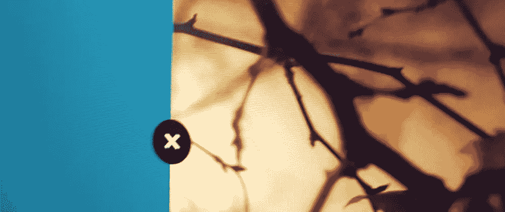
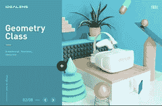
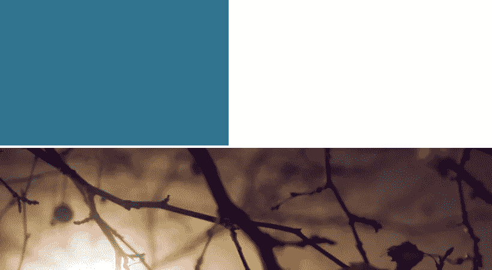
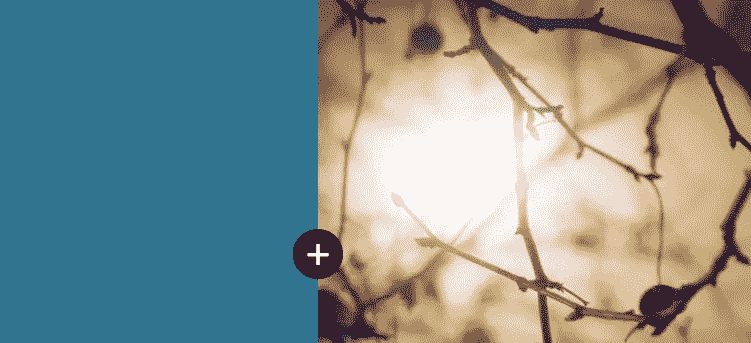
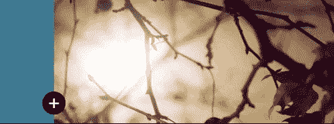

# 我如何制作一个流体布局组件——WotW

> 原文：<https://levelup.gitconnected.com/how-i-made-a-fluid-layout-component-wotw-eccd17966066>



欢迎来到“每周小部件”系列，在这里我拍摄了令人敬畏的 UI/UX 组件的 gif 或视频，并用代码将它们赋予生命。

> 查看本周所有的 [Widget 文章](https://levelup.gitconnected.com/wotw/home)，关注 gitconnected，确保你不会错过任何一个 Widget 教程。

今天我将做一个组件，当一个按钮被点击时，它改变一个两列布局的宽度。这个小工具的灵感来自[这个提交](https://uimovement.com/ui/5303/vr-class/)，看起来像这样:



## 准备

像我以前做的一样，我们将使用 [Vue.js](https://vuejs.org/) 进行交互，使用 [GSAP 平台](https://greensock.com/gsap)制作动画。如果你使用类似 [codepen](http://codepen.io) 的东西，你可以在图书馆找到它们。

## 基本标记

对于此组件，我将简化其内容，我不会添加任何文本，我们将只使用左窗格、右窗格和操作按钮:

```
<div id="app">
  <div class="container">
    <div class="left-pane"></div>
    <div class="right-pane"></div>
  </div>
  <div class="action-btn">+</div>
</div>
```

不要被它的简单性所欺骗，因为这意味着 CSS 和 JS 将在今天承担重任。

## 式样

让我们开始对组件的各个部分进行样式化，但是首先要对 HTML 的主体进行一些初始的 css 设置:

```
body {
  margin: 0;
  padding: 0;
}
```

现在，我们将在容器上定义一个高度，以使窗格具有一定的体积。在左侧窗格中，我们将使用纯色，在右侧窗格中，我们将设置一个居中的背景图像，覆盖整个窗格。对于图像，我将使用来自 [placeimg](https://placeimg.com/) 的占位符，但它可以是您想要的任何内容:

```
.container {
  height: 600px;
}
.left-pane {
  display: inline-block;
  background-color: #307490;
  width: 30%;
  height: 600px; /* should match containers height */
}
.right-pane {
  display: inline-block;
  width: 70%;
  height: 100%;
  height: 600px;/* should match containers height */

  background-image: url("https://placeimg.com/1000/600/nature");
  background-size: cover;
  background-repeat: no-repeat;
  background-position: 50% 50%;
}
```

我们现在有两个`inline-blocks`，一个有`30%`宽，另一个有`70%`，所以它们应该并排，对吗？
错了！它们看起来像这样:



为什么会这样呢？
信不信由你，由于我们自己的标记，两个窗格之间有一个小空间。基本上“30% +小空格+ 70%”大于“100%”，导致最后一个元素(右窗格)向下。但是这个空间到底在哪里呢？就在这里:

```
<div class="left-pane"></div>
    <div class="right-pane"></div>
```

也许你看不到它，但它就在那里，让我把它拿掉，这样你就能明白我在说什么了:

```
<div class="left-pane"></div><!-- this comment removes the space
  --><div class="right-pane"></div>
```

现在你看到了，如果你愿意，你可以把两个窗格放在同一行，但是我发现这种“注释”的方法更具可读性。

现在让我们来设计将改变布局的按钮。为此，我们需要它被定位`absolute` ly，所以它可以在两个窗格的顶部，我也使用`border-radius`使它成为一个圆形，一些规则有白色和居中的文本，最后`cursor: pointer`，所以当悬停时它看起来可点击:

```
.action-btn {
  position: absolute;
  width: 50px;
  height: 50px;
  left: calc(30% - 25px); /* width of first pane - half circle */
  top: 300px;
  border-radius: 50%;
  background: black;
  color: white;
  font-size: 40px;
  text-align: center;
  cursor: pointer;
}
```

我们几乎完成了 CSS 方面的工作，我们只需要为转换做准备。我们的窗格将改变它们的宽度，所以我们需要一个动画:

```
.right-pane, .left-pane {
  transition: width 0.7s;
}
```

最后，当它们打开时，我们将添加一个`.open`类来改变它们的宽度，为此我们需要这两条规则:

```
.left-pane.open {
  width: 70%;
}
.right-pane.open {
  width: 30%;
}
```

现在看起来好多了。



## 互动

为了开始对组件的行为进行编程，我们需要创建 Vue 实例。之后，我们将只声明一个名为`open`的数据属性来跟踪我们窗格的状态，我们还声明一个方法`toggle`来改变`open`属性:

```
new Vue({
  el: '#app',
  data: {
    open: false,
  },
  methods: {
    toggle () {
      this.open = !this.open
    }
  }
})
```

很直接，对吧？现在我们需要将它绑定到我们的 HTML 上，这样它才能工作。我们将在两个窗格上添加一个类绑定，这样当`open`属性为真时，就会添加`open`类，然后将按钮 click 绑定到 toggle 方法，如下所示:

```
<div id="app">
  <div class="container">
    <div class="left-pane" :class="{'open': open}"></div><!-- this comment removes the space
  --><div class="right-pane" :class="{'open': open}"></div>
  </div>
  <div @click="toggle" class="action-btn">+</div>
</div>
```

如果一切顺利，我们应该有我们的窗格动画时，点击按钮。



棘手的部分来了，我们的按钮也需要动画来匹配我们之前看到的。为了能够直接引用我们的按钮，让我们以如下方式放置一个`ref`:

```
...
    <div @click="toggle" ref="actionbtn" class="action-btn">+</div>
...
```

这样我们就可以在 JS 中引用`actionbtn`。此时，我们的按钮一直是可点击的，为了避免双击，我们需要一个`animating`数据属性来帮助我们只在按钮和窗格不活动时运行切换功能。

```
//...
  data: {
    open: false,
    animating: false
  },
  methods: {
    toggle () {
      if(this.animating) {
        // avoid any action if button clicked when animated
        return
      }

      this.open = !this.open
      this.animateButton()
    }
  }
//...
```

我们刚刚在 toggle 方法中添加了一个动画按钮方法调用，所以让我们来创建它。在这里，我们将设置“动画”为“真”,然后使用 TweenMax 使我们的按钮消失:

```
//... methods
    animateButton () {
      this.animating = true

      // animate out
      const propsOut = {
        scale: 0, // make it disappear
        ease: Back.easeIn,
        onComplete: this.animateIn // this function will be called when animation finishes
      }
      TweenMax.to(this.$refs.actionbtn, 0.2, propsOut)

    },
```

在 ease: Back.easeIn 线上，我们声明我们将使用哪种动画，作为参考，你可以查看 GSAP ease visualizer 中所有可用的选项。还要注意我们用这个。$refs.actionbtn 来引用我们的按钮并开始制作动画。我们在消失的动画结束后调用的 animateIn 函数非常相似，我们只需要一个计算的属性来知道我们的按钮根据打开状态应该出现在哪里:

```
//... methods 
    animateIn () {
      //set new position
      TweenMax.set(this.$refs.actionbtn, this.actionBtnPosition)

      const propsIn = {
        delay: 0.4,
        scale: 1,
        ease: Back.easeOut,
      }
      TweenMax.to(this.$refs.actionbtn, 0.2, propsIn)
    },
  }
  computed: {
    actionBtnPosition () {
      const perc = this.open ? '70%' : '30%'
      const top = this.open ? '200px' : '300px'
      return {
        top: top,
        left: `calc(${perc} - 25px)` 
      }
    },
  }
//...
```

动画差不多准备好了，我们只需要把加号改成关闭符号。在我们的参考 gif 中，他们通过旋转按钮来做到这一点，我们也将这样做。

就在让按钮出现的代码之后，我们需要添加一个改变旋转的补间。同样，当一切完成后，我们可以将“动画”设置回 false，这样我们就可以再次单击该按钮:

```
//... methods
////... animateIn
        const propsRotation = {
        delay: 0.4,
        rotation: this.actionBtnRotation,
        onComplete: this.endedAnimating
      }
      TweenMax.to(this.$refs.actionbtn, 0.3, propsRotation)
    },
    endedAnimating () {
      this.animating = false
    }
//... computed
    actionBtnRotation () {
      return this.open ? -135 : 0
    }
//...
```

就这样，这就是最终的结果！

如果你渴望更多，你可以检查其他 WotW:
[向导](http://ederdiaz.com/blog/2018/04/25/how-to-make-an-animated-wizard-component-wotw/)
[动画卡滑块](http://ederdiaz.com/blog/2018/04/18/animated-card-slider-with-vue-gsap/)
[提交按钮与加载器](http://ederdiaz.com/blog/2018/04/11/making-a-submit-button-with-loader-wotw/)

另外，如果你想看下周的某个小部件，可以在评论区发表。

下周见，关注 [gitconnected](https://levelup.gitconnected.com) 获取每周小工具！

*最初发表于*[*Eder díaz*](http://ederdiaz.com/blog/2018/05/09/how-i-made-a-fluid-layout-component-wotw/)*。*