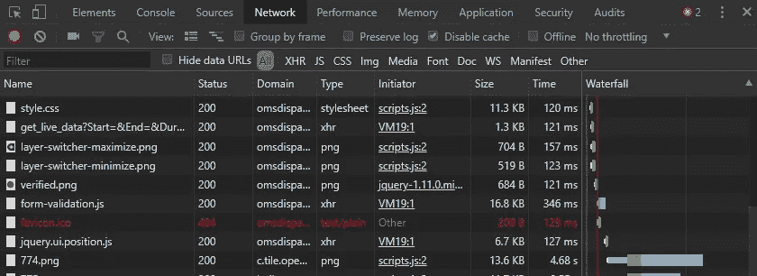
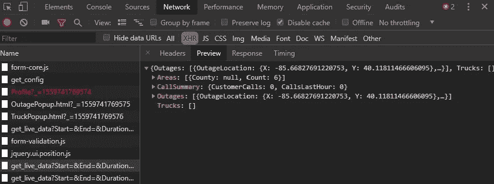

# 我如何免费使用无服务器功能发出停电通知

> 原文：<https://levelup.gitconnected.com/how-i-made-power-outage-notifications-using-a-serverless-function-for-free-ceb0f7714284>

发布于 2019 年 6 月 5 日


照片由 [NASA](https://unsplash.com/@nasa?utm_source=medium&utm_medium=referral) 在 [Unsplash](https://unsplash.com?utm_source=medium&utm_medium=referral) 拍摄

# 原因

有一天我在工作，碰巧查看了我的电子邮件。我注意到一个社区应用程序生成的标题为“有人停电了吗？”。

我是一个很喜欢智能家居的人，所以我当然会在家里安装摄像头和传感器。我很快检查我的相机饲料，果然:无法连接。我的一些智能家居技术人员说它已经有一个小时没有连接了。

现在我有点慌了，因为去年夏天我们彻底完成了我们的地下室。我买了我能找到的最好的带备用电池的排水泵，但我从未测试过它。我不知道这场雨会持续多久，当然这几天一直在下雨。我工作的地方离这里有 35 分钟的路程，所以我开始给家人打电话，看看他们中有没有人能借我一台发电机。

我们通过城市获得电力，我们的城市有一个网站。在这个网站上有一个显示城市地图的链接，所有停电都用阴影标出。果然，我家是停电的一部分。非常方便。我不停地按刷新键，看看有没有更新。

又过了一个小时，地图终于更新了。我的房子已经不在阴影部分了。我检查了我的相机，它们又开了！我终于可以放松了。

# 一定有更好的方法

所以，无论我的家有多智能，有水传感器和报警器，如果我的家没有电，它就没有办法和我交流。

直到我能买得起一个在没电时自动打开的天然气发电机，我需要能够在停电的几个小时内回家并连接上一个便携式发电机，否则我可能会因地下室洪水损坏而损失数千美元。

所以我在网上查了一下，看看有没有什么服务可以在停电时提醒我。没什么。当然，我的电力供应商没有为我的小镇提供这样的服务…

但是等等…他们有那张地图。我想知道那张地图是如何得到数据来知道哪些部分有阴影的。

# 在网站上检查幕后

如果你用谷歌浏览器加载一个网站，你可以点击`F12` 来查看开发者工具。其中一个选项卡叫做“网络”。该选项卡将向您显示该网站需要引入的所有资产，如图像、字体、数据，并显示其来源。



Chrome 开发工具。我把我的调成了黑暗模式。

最初加载该选项卡时，它可能是空白的。只要刷新网站，它就会开始填充数据。

我感兴趣的部分是它从服务器获取的任何数据。所以我过滤了 XHR。果然，我找到一个叫做`get_live_data`的。点击它会显示任何停机的数据！



使用 API 从服务器获取停机信息

但他们肯定有某种认证和安全措施，所以不是任何人都可以访问这些数据。我决定找出答案。我加载了一个名为[邮递员](https://www.getpostman.com/)的免费工具来检查 API。

从开发工具的 Headers 选项卡中，我找到了`Request URL`。当我把它插入 Postman 时，它返回相同的中断结果！这个 API 对公众开放，我可以在自己的应用程序中使用它。太棒了。🙌

但是等等，还有更好的。进一步浏览地图，我发现了一个获取断电细节的链接。当我查看其背后的 API 时，我发现它给了我一个中断的街道名称列表。这是完美的，因为现在我可以只检查我的街道名称，而不是经度和纬度。

> *注意:我知道这是我的特殊情况。这实际上不会帮助任何人，除非他们和我住在同一个城镇。然而，我的目标是展示我是如何在网站的幕后看到它是如何工作的。*

所以我有我的数据。但是现在我需要一种方法来持续检查我的街道是否出现。通常我会设置一个 web 服务器，它有一个调用 API 和解析街道名称的时间表。然而，我的问题是:

*   我不能在我的房子里托管这个 web 服务器，因为这样做的目的是为了发现我的房子什么时候没电了。
*   托管一个在云中运行代码的 web 服务器可能要花钱。即使一个月只有 5 美元，我也不想为此付钱。

# 无服务器功能来拯救

我最近听到人们谈论无服务器功能有多棒，以及它们将如何改变开发，但我从未真正研究过它们，也没有发现对它们的需求。

基本上，您可以编写一些基于触发器运行的代码。不需要在服务器上安装操作系统，也不需要确保操作系统正在运行、是最新的并且是安全的。并且不需要安装整个网站框架。

这听起来很有趣，所以我查看了亚马逊最受欢迎的服务之一，名为 [AWS Lambda](https://aws.amazon.com/lambda/) 。他们甚至有一个免费层，只要你每月运行该功能少于一百万次。相当慷慨！

所以我注册了 AWS。这确实需要一张信用卡，这样如果我去他们的免费层，我将被收费。他们有一个账单预算提醒系统，你可以设置它，这样你就可以在事情发生前得到通知。

AWS Lambda 允许你用几种不同的语言编写。我最近一直在努力学习 Python，所以我选择了这个。

# 设置您的环境

此时，我已经准备好直接从 AWS 网站上创建这个函数。这肯定是可能的，它有一个内置的代码编辑器和所有你需要的工具。然而，我发现一种更简化的方法是在我的计算机上本地开发代码，并使用一个名为 serverless 的 npm 包将其引入 AWS。因此，这假设您的系统上安装了 Python 3，并且还安装了 Node JS v6.5.0 或更高版本。

# 步骤 1:创建框架

从您的终端安装无服务器

```
npm install -g serverless
```

现在转到您想要存储该项目的位置。我有一个名为“代码”的文件夹，所以我在终端的那个文件夹中运行了这个

```
serverless create
```

这将在代码中创建一个名为`power-outage-bot`的新文件夹。在该文件夹中，它创建了两个文件:

您可以在您喜欢的代码编辑器中加载这些代码。我使用免费的 [PyCharm 社区](https://www.jetbrains.com/pycharm/) IDE。

现在向 power-outage-bot 文件夹添加一个名为 requirements.txt 的新文件。

```
requests
```

这将确保请求模块被加载到 Python 中。

# 步骤 2:通过 AWS 进行身份验证

接下来，设置您的本地系统以连接到您的 AWS 帐户。

*   登录 AWS 控制台，进入服务>安全> IAM。找到“用户”部分，点击“添加用户”蓝色按钮。
*   选择一个用户名，然后只选择“编程访问”复选框。
*   在第二页上，选择“直接附加现有策略”。寻找“管理员访问”并检查它。
*   最后，一旦用户被创建，它将显示您的“访问密钥 ID”和“秘密访问密钥”。把这些拷贝到安全的地方。

回到你的终端，通过键入添加密钥(替换<>部分)

```
export AWS_ACCESS_KEY_ID=<Access key ID> export AWS_SECRET_ACCESS_KEY=<Secret access key>
```

# 第三步:设置你的电报机器人

这个功能需要在我没电的时候提醒我。如果你愿意，你可以设置电子邮件或短信，但你需要找到一个提供这些服务的服务，因为我们不使用服务器，这可能需要每月付费。我敢肯定，如果你搜索，有免费层可用。

对我来说，我决定用[电报](https://telegram.org/)。这是我手机上的一个免费应用程序，你可以用它在 Telegram 上与其他人交流。Telegram 对开发者非常友好，它允许你创建免费的机器人，你的代码可以插入其中以便进行通信。

一旦你在手机上安装了 Telegram 并设置了帐户，你就可以与 [@botFather](https://web.telegram.org/#/im?p=@BotFather) 开始新的对话。您也可以从计算机上的 web 浏览器中完成此操作。键入`/newbot` to @botFather，它会引导你设置一个新的机器人。最后，@botFather 会给你一个令牌，你可以用它从我们的 Python 代码连接到 bot。让我们从终端将它存储在一个环境变量中。

```
export TELEGRAM_TOKEN="4592342328:APHruyw7ZFj5qOasDFSDFdsfdDFSFJxil-zsdF98"
```

@botFather 还会显示创建的新机器人的链接。转到这个开始对话。你可以发送任何东西，只要说点什么，它就会打开一个频道。

因为你是唯一一个将要与你刚刚创建的这个新机器人对话的人，所以我们只关心向这个聊天对话发送警报。我们需要获取聊天 id。

将以下内容粘贴到您的浏览器中，但用您的令牌替换`<API-access-token>`:

```
https:*//api.telegram.org/bot<API-access-token>/getUpdates?offset=0*
```

现在，您应该能够从结果中找到您的聊天 id。它将是聊天部分中的 id。

```
{  
   "ok":true,
   "result":[  
      {  
         "update_id":XXXXXXXXX,
         "message":{  
            "message_id":2,
            "from":{  
               "id":123456789,
               "first_name":"Mushroom",
               "last_name":"Kap"
            },
            "chat":{  
               "id":123456789,
               "first_name":"Mushroom",
               "last_name":"Kap",
               "type":"private"
            },
            "date":1487183963,
            "text":"hi"
         }
      }
   ]
}
```

让我们将它保存到一个环境变量中

```
export CHAT_ID=123456789
```

我们不需要用 Telegram 设置任何类型的网络挂钩，因为所有的通信都是单向的。机器人会通知我，但我没有在我的代码中听到任何响应。

# 编码时间到了

最后，设置完成后，让我们开始编码吧！

将`handler.py`载入你的编辑器。我们的 Python 代码将需要一些包，所以确保这是在顶部

```
import json
import os
import sys

here = os.path.dirname(os.path.realpath(__file__))
sys.path.append(os.path.join(here, "./vendored"))

import requests
```

接下来，让我们设置一些我们将在整个代码中使用的常量，这样就更容易阅读和更新了

```
TOKEN = os.environ['TELEGRAM_TOKEN']
CHAT_ID = os.environ['CHAT_ID']
BASE_URL = "https://api.telegram.org/bot{}".format(TOKEN)
STREETS_TO_CHECK = [
    'SESAME ST',
    'MAIN ST'
]
```

我决定，如果我的任何朋友和家人遭遇停电，我希望得到提醒，这样我就可以让他们知道，而不是只检查一条街道。这就是为什么我列出了街道，而不仅仅是街道的字符串。

首先，我们想给电力公司的 API 打电话，获取他们停电的街道列表。然后我们想过滤列表，只显示我们关心的街道。

```
def check_power_outages():
    url = "http://path_to_public_power_api.com/get_outage_details"
    response = requests.request("POST", url)
    data = json.loads(response.text)
    return list(filter(filter_streets, data["Streets"]))
```

我在 return 语句中使用的 Python 过滤函数使用了一个名为`filter_streets`的过滤方法。看起来是这样的:

```
def filter_streets(street):
    return street in STREETS_TO_CHECK
```

不言自明。这个`filter(filter_streets, data["Streets"])`正在检查每一条断电的街道，并过滤出那些包含在我要检查的街道列表中的街道。最后，我们将结果放入 Python 列表中。

我们将由 AWS 运行的主要功能称为`hello`。这是里面的代码。

```
def hello(event, context):
    filtered_streets = check_power_outages()
    if filtered_streets:
        response = ''
        try:
            for filtered_street in filtered_streets:
                response += 'Power out on ' + filtered_street + '! '

            response += 'http://link-to-power-outage-map.com'

            data = {"text": response.encode("utf8"), "chat_id": CHAT_ID}
            url = BASE_URL + "/sendMessage"
            requests.post(url, data)

        except Exception as e:
            print(e)

    return {"statusCode": 200}
```

首先，我们调用刚刚构建的`check_power_outages` 方法，并返回我们关心的街道列表。

在 Python 中，如果列表为空，那么当在“if”语句中调用时，它将返回一个`False` 。因此，当我们说`if filtered_streets:`没有中断时，它将简单地跳到结尾，什么也不做。

但是，如果它找到了一条或多条街道，它将开始遍历这些街道并构建我们想要发送给机器人的消息。

最后，它将我们的响应放入一个 Python 字典中，该字典还包含聊天 id。然后我们用`requests.post(url, data)`把它发送给聊天机器人。

# 将其部署到 AWS

看一看生成的`serverless.yml`。这是您的 AWS 配置文件。这是我的样子:

```
service: power-outage-bot
provider:
  name: aws
  runtime: python3.7
  stage: dev
  region: us-east-1
  environment:
    TELEGRAM_TOKEN: ${env:TELEGRAM_TOKEN}
    CHAT_ID: ${env:CHAT_ID}
functions:
  hello:
    handler: handler.hello
    events:
      - schedule: rate(15 minutes)
```

我已经将我的触发器设置为每 15 分钟运行一次的计划。这使我保持在每月 100 万次的请求之下。

最后，我们准备将它发送到 AWS。回到您的终端，键入

```
serverless deploy
```

就是这样。该功能现在应该每 15 分钟运行一次。无服务器框架还设置了 AWS CloudWatch 的日志记录。如果您在 AWS 控制台中访问该服务，您应该会看到一个日志部分，一段时间后，它应该会开始填充。

> *提示:如果您需要稍微调试一下，Python 中的任何* `*print()*` *语句都会被记录下来。*

# 结论

现在我有一个警报系统，当我家里停电时，它会告诉我。我不必让服务器在任何地方运行，而且它是完全免费的。还不错。

显然，只有当你和我住在同一个城镇时，这种特殊的设置才有效，否则城市断电 API 对你来说毫无价值。但是希望这能给你一些想法，告诉你如何基于你能访问的其他类型的数据来创建你自己的通知系统。

# 参考

当我从事这个项目时，我发现这些帖子非常有用:

*   [AWS Lambda 上的无服务器电报机器人](https://hackernoon.com/serverless-telegram-bot-on-aws-lambda-851204d4236c)
*   [使用 AWS API 网关和 AWS Lambda 构建电报机器人](https://dev.to/nqcm/-building-a-telegram-bot-with-aws-api-gateway-and-aws-lambda-27fg)

*原发布于*[*https://nlehman . dev*](https://nlehman.dev/blog/post/how-i-made-power-outage-notifications-using-serverless-function)*。*