# 我如何用 CSS 网格制作周期表并作出反应

> 原文：<https://levelup.gitconnected.com/how-i-made-the-periodic-table-with-css-grid-and-react-69f94d7fcec>

我在查看周期表，试图按顺序记住所有的元素。一天下午，我想，嘿，我能用我现在的 CSS 技能做元素周期表吗？

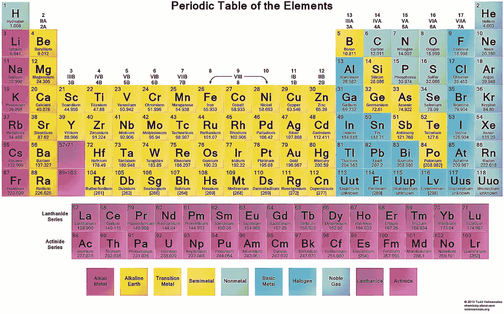

周期表是以奇怪的结构方式排列的元素的集合。过去早就建好了，可问题是，我自己看都不看能做吗？

# 制作布局

第一项任务是按照特殊的顺序排列所有的元素。我想到的第一个想法是制作一个 HTML `<table>`，将所有条目放入表格单元格中。但是桌子又旧又乱，更不用说，它们很难维护。

我知道 CSS 网格，为什么不用它呢？

在那一点上，我有点怀疑，并认为也许我将不得不使用 flexbox 来完成这项任务。

所以这些元素每一个都会是一个`
`，我用 CSS 来排列。

我制作的元素是这样的:

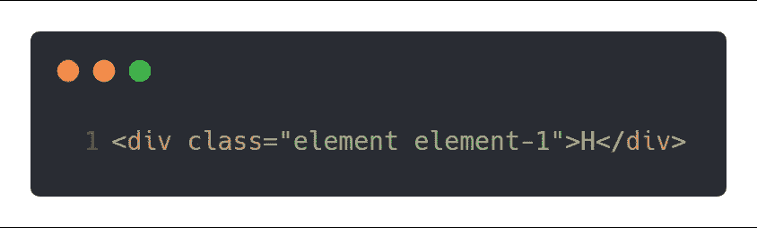

我放了 2 个类，`element`类制作盒子，`element-1`类专门控制位置。我总共有 118 种元素。

我没有为我的表手工编码所有 118 个 div，而是使用了 emmet 简写:

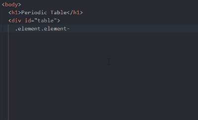

这个表格有 18 列，所以我用 CSS 网格做了一个 18 列的布局。

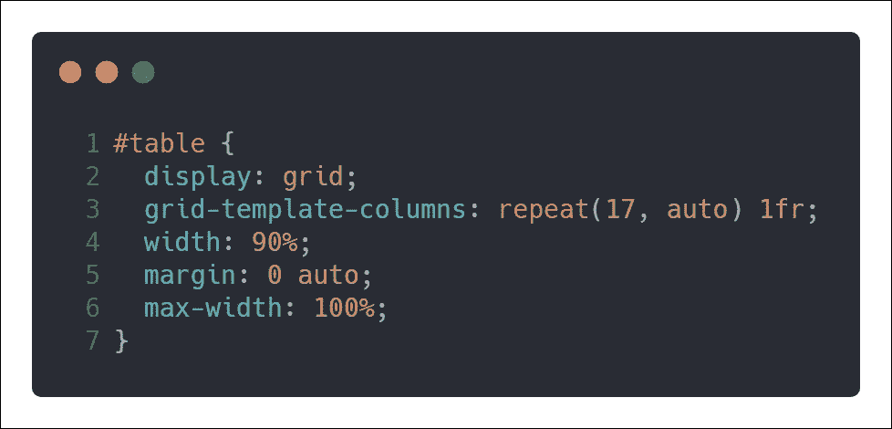

# 棘手的部分

好了，现在我准备好了容器，我要把氢作为第一元素，把氦放在最右边。

我是这样做的:

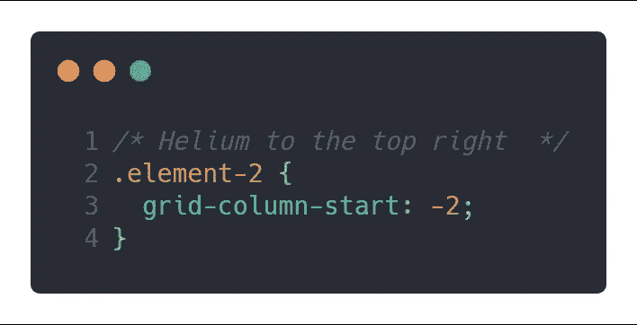

而且成功了！

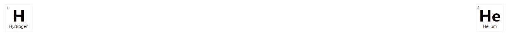

我以这种方式一个接一个地排列元素。因为我为每个单元格添加了准确的元素编号作为类，所以我可以很容易地控制它们在表中的位置。

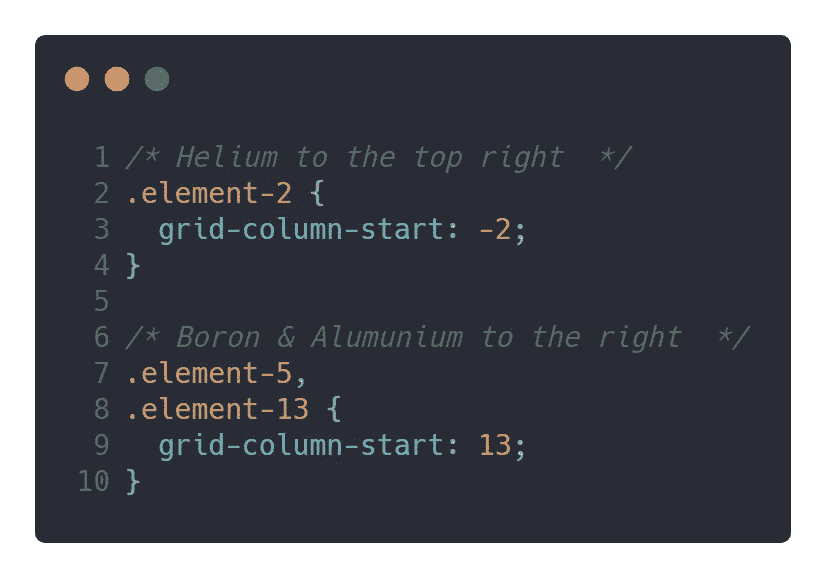

在周期表中，元素之间有很大的间隙。我们来看看——原来的周期表很长，大概 32 列:

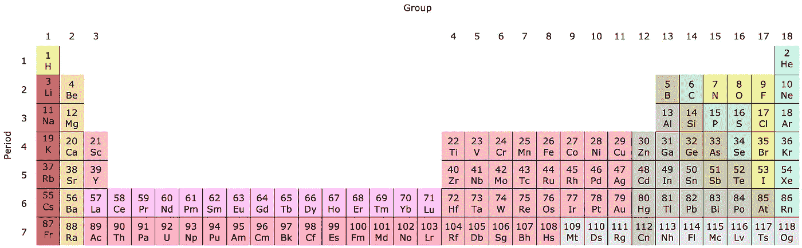

为了防止它变得如此之宽，有一些版本的表将元素单独分组。我不得不对我的桌子做同样的事情。

所以我做的是从标记和 CSS 中分离镧系元素和锕系元素。

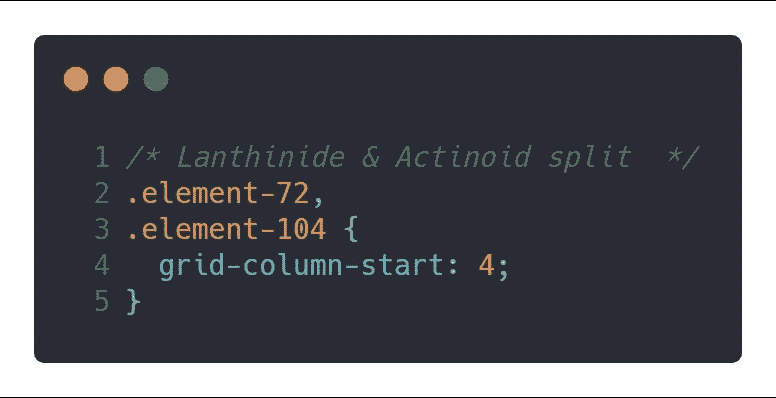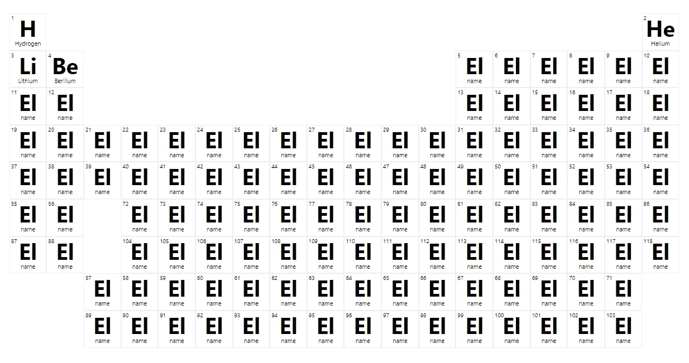

布局就绪后，现在是添加 React 的时候了。

# 用数据填充表格

这一切都很有趣，游戏填充了最初的几个元素。但是很快我意识到有上百个元素需要添加。我必须把每一个都打出来吗？它会吸走我的乐趣和生活。

那么，为什么不做聪明的事情，务实地填写信息呢？

我在网上搜索了一下，[找到了一个 JSON](https://github.com/Bowserinator/Periodic-Table-JSON) ，里面有所有 118 个项目的信息。所以我将这些数据添加到我的应用程序中。

在 JSON 中，有一个元素数组。我的想法是按顺序引用每个元素。在数组中，第一项从 0 开始。这意味着氢在 0，氦在 1，锂在 2，以此类推。为了避免这种混乱，我在第 0 个位置添加了一个占位符。所以现在每一个元素都正确地处于，和它在周期表中相同的位置。

现在我已经有了我需要的数据，我可以只让一个 React 组件来呈现所有的元素，并将数据作为道具传入。

最初，我认为需要将元素的名称、编号和符号作为道具传递给 React 组件。

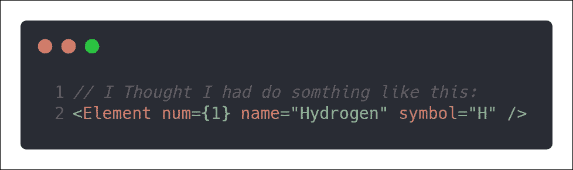

预期

然后我意识到我可以只传入元素的编号，这样就足以使用 JSON 数据来提取关于`<Element />`组件中特定元素的全部信息。

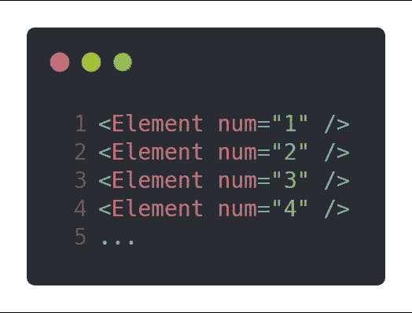

剩下的就是让应用程序具有交互性。

# 给元素组着色

在元素周期表中，每一种元素都是按其类别排序的，并且是有颜色的。所以我没有给它们着色，而是使用 React 组件将它们的类别放在 CSS 上。

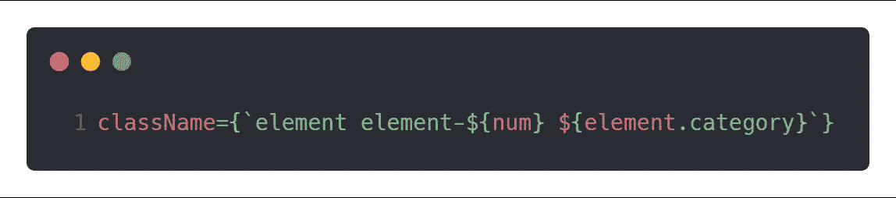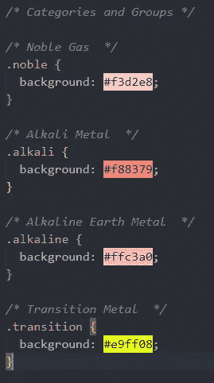

这让桌子看起来很酷。

# 让桌子适合屏幕

首先，我按照一般的布局做法制作了 1000 像素宽的表格。但是这使得元素太小了。

所以我决定让它适合屏幕，并专门利用视口宽度。在整个应用程序中，我使用`vw`作为元素尺寸、文本和标题。这有助于在各种屏幕尺寸和设备上保持形状。这张桌子主要是为桌面屏幕设计的，但在平板电脑上看起来也不错。

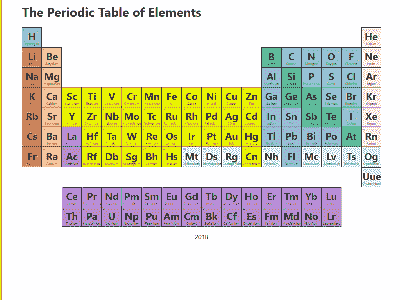

# 最后润色

如果桌子只是坐在那里什么也不做，那它就不完整。我添加了一个面板，当元素被选中时，它会显示元素的附加信息。React 非常适合这份工作。那么，你为什么不[在这里](https://tamalanwar.github.io/periodic-table/)亲自看看它的作用呢？

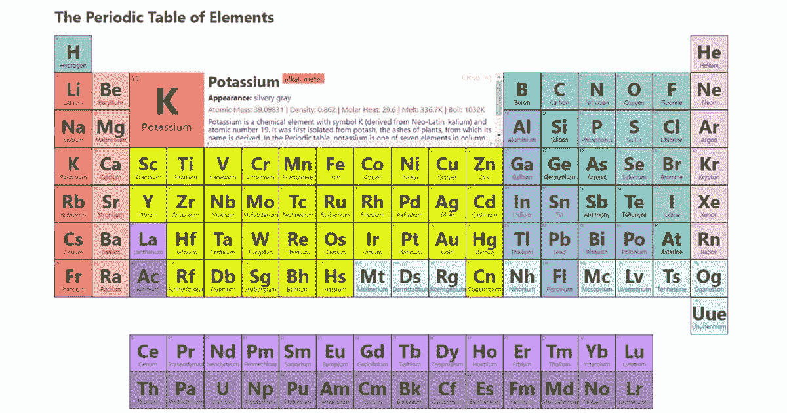

代码里发生了更多的事情，为什么不自己去挖掘里面看看呢？

欢迎大家从 Github 上抄代码/叉它[。我也对改进持开放态度，你可以](https://github.com/TamalAnwar/periodic-table)[在 Twitter 上联系我](https://twitter.com/TamalAnwar)很乐意谈论它。

***喜欢读什么？请为这个帖子鼓掌！***

***也有*** [***查看我的博客***](https://tamalweb.com/blog) ***和*** [***我的 Twitter***](https://twitter.com/TamalAnwar)***了解更多关于 JavaScript 的 web 开发素材。***

 [## 学习 React -最佳 React 教程(2019) | gitconnected

### 排名前 49 的 React 教程-免费学习 React。课程由开发人员提交并投票，使您能够…

gitconnected.com](https://gitconnected.com/learn/react)