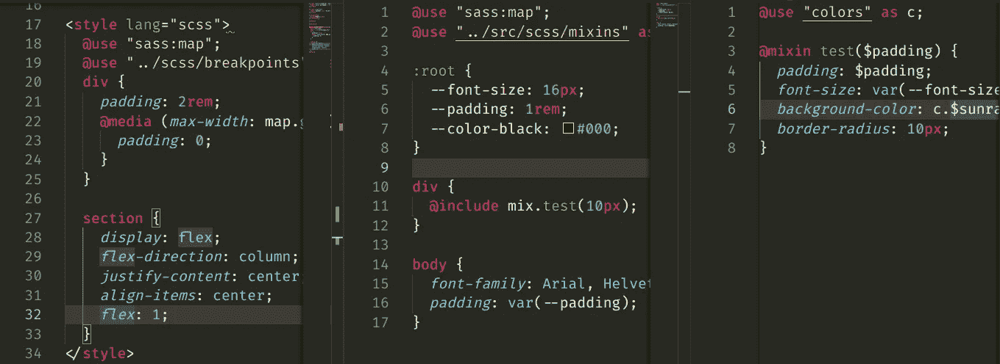
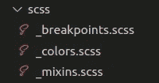

# 我如何管理我的 CSS/SCSS 属性

> 原文：<https://levelup.gitconnected.com/how-i-manage-my-scss-properties-55ee71f5ec1>



大多数时候，随着项目的发展，我们的 CSS 值和属性会变得混乱。这就是我如何通过使用**主**文件和**变量**文件使它至少好一点。

# 为什么？

变量很棒，因为它们给公共值起了一个名字，所以很容易记住，并在整个网站上实施一致的风格。

# 全局 CSS 变量

CSS 至少给了我们一些全局变量的可管理性。使用`:root`选择器，可以用`**kebab-case**`命名约定定义变量。

```
// global.scss
:root {
 --font-size: 16px;
 --padding: 1rem;
 --color-black: #000;
}
```

为了引用这些全局变量中的一个，我简单地使用带有变量名的`**var()**`作为参数。

```
// global.scss
body {
 *font-family*: Arial, Helvetica, sans-serif;
 *padding*: var(--padding);
}
```

我喜欢这项技术的地方在于，它使得变量可以在任何地方使用**、在`<style>`元素中使用**，以及在内联 CSS 中使用。如果运行单个页面应用程序，只需要在 HTML 中链接到样式表本身。

然而，这还不够。这些变量不能在`@media`查询中使用，这对宽度响应是有用的。而一组房产呢？这将在下一节中讨论。

# SCSS 变量、混合和宽度断点

在 SCSS，我们可以定义可以在项目的任何地方使用的变量和混合，包括查询。

我把它们存放在一个 SCSS 文件夹里，分成不同的文件，它们的变量有不同的用途。例如，混合、断点和颜色。



SCSS 文件夹是什么样子的

命名约定是有目的的。使用下划线(`_`)作为文件名的第一个符号表示它将被导入到**主/主**样式表中，如`global.scss`或`style.scss`。无论哪种方式，都不会影响文件的导入方式，我们将在下面进行讨论。

# 使用@使用🇺

`@import`被**弃用**，不鼓励在 SCSS 使用。取而代之的是`**@use**`和`**@forward**`，它们可以用来向其他样式表添加文件。我一直使用`@use`，但从未使用过`@forward`，所以现在我将展示如何使用`@use`。

为了使用`@use`导入文件，我们使用**相对文件路径**，以及可选的**别名**。例如，让我们使用`_colors.scss`:

```
// _colors.scss
$onyx: #32373B;
$space-gray: #4A5859;
$unbleached-silk: #F4D6CC;
$sunray: #F4B860;
$red: #C83E4D;
```

并用`@use`添加到`global.scss`:

```
// global.scss
@use "../src/scss/colors" as c;
```

注意文件名和扩展名开头的下划线是不需要的。然而，使用完整的文件名(`_colors.scss`)仍然可以。别名前缀使用`**as**`关键字设置，后跟别名。别名是不需要的，如果没有设置，就用**文件名** ( `colors`)作为前缀。

要使用该文件中的变量，先写前缀**后写变量**本身，中间用句号**隔开**。编译器将替换它的值，如下所示:****

```
// global.scss
@use "../src/scss/colors" as c;
div {
 *color*: c.$red;
 *width*: 100%;
}
```

传输的 CSS 代码:

```
// global.css (transpiled)
div {
 *color*: #C83E4D;
 *width*: 100%;
}
```

需要前缀的原因是防止多个文件的样式表由于多个文件具有相同的变量名而**冲突**。

但是，我建议使用全局 CSS 变量来存储常规值，因为它们不需要任何额外的代码来导入。

对于 mixins，过程非常相似:

```
// _mixins.scss
@use "colors" as c;@mixin test($padding) {
  *padding*: $padding;
  *font-size*: var(--font-size);
  *background-color*: c.$sunray;
  *border-radius*: 10px;
}
```

mixin 的用法如下:

```
// global.scss
@use "../src/scss/mixins" as mix;
div {
 @include mix.test(10px);
}
```

传输的 CSS:

```
// global.css (transpiled)
div {
 *padding*: 10px;
 *font-size*: var(--font-size);
 *background-color*: #F4B860;
 *border-radius*: 10px;
}
```

到目前为止，我们使用了一般意义上的导入，比如引用变量和混合。现在让我们转到断点。

# @media 查询中的用法:响应宽度断点

`@media`查询不允许全局 CSS 变量，它们在测试时根本不起作用。然而，SCSS 变量确实有效，因为编译器会替换这些值。在这个例子中，我将使用响应宽度断点。

我是如何使用如下所示的**图**来管理断点的:

```
// _breakpoints.scss
$breakpoints: (
  "sm": 576px, 
  "md": 768px, 
  "lg": 992px, 
  "xl": 1200px, 
  "sl": 1400px
);
```

使用映射而不是单独的变量是一个很好的实践，因为它允许代码更有组织性(当你有不同类型的断点时)，并允许这些值在一个地方。它还在整个项目中强制实施恒常性。

要导入，请确保随文件一起导入`@use "sass:map"`。

```
// global.scss
@use "sass:map";
@use "../src/scss/breakpoints" as break;div {
 *width*: 80%;
 *color*: #fff;
 *background-color*: #121212;
 @media (*max-width*: map.get(break.$breakpoints, "md")) {
  *width*: 100%;
 }
}
```

传输的 CSS:

```
// global.css (transpiled)
div {
 *width*: 80%;
 *color*: #fff;
 *background-color*: #121212;
}
@media (*max-width*: 768px) {
 div {
  *width*: 100%;
 }
}
```

# 结论

通过使用这里详述的方法，我设法让我的 SCSS 更有条理。感谢您的阅读，希望这能对您有所帮助。

## 来源:

*   [MDN Web Docs - var()](https://developer.mozilla.org/en-US/docs/Web/CSS/var())
*   [YouTube(Coder Coder)——Sass @ import 被替换为@use 和@forward](https://www.youtube.com/watch?v=dOnYNEXv9BM)