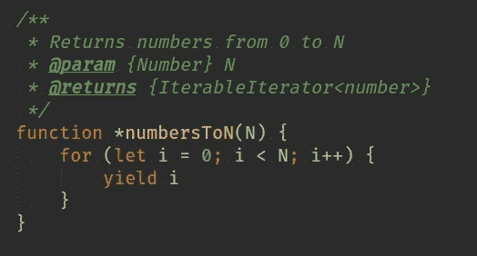
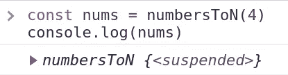
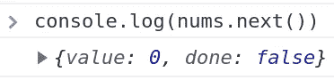
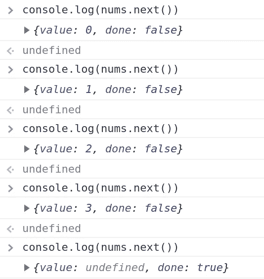
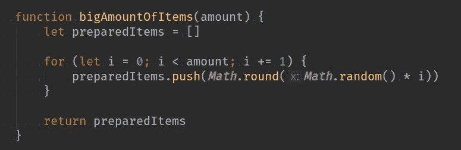
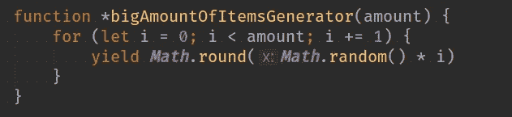
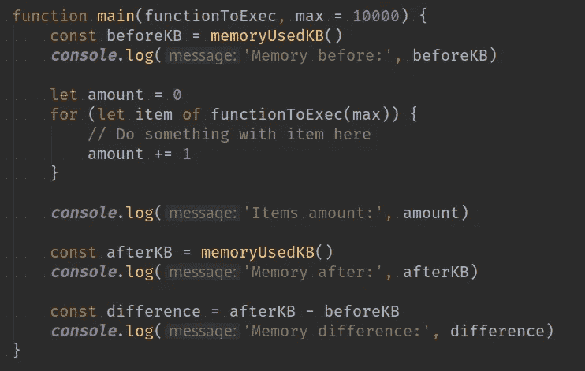
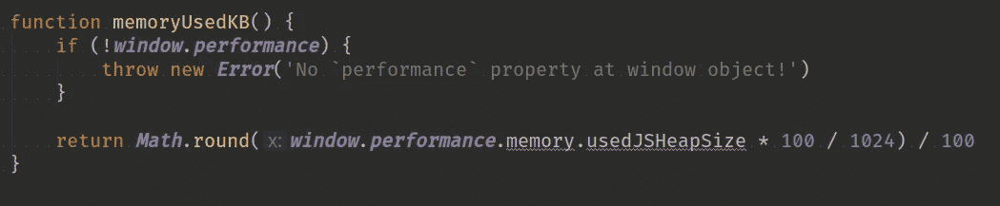
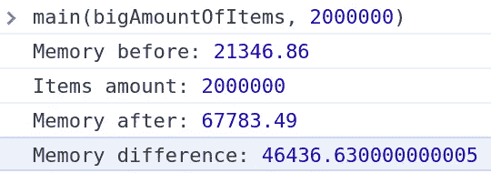
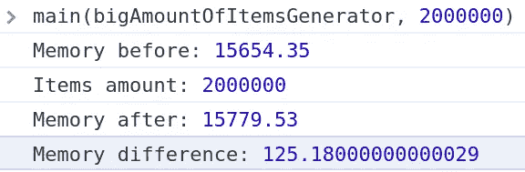

# 使用 JavaScript 生成器函数来减少内存使用

> 原文：<https://levelup.gitconnected.com/how-i-met-your-javascript-generators-reduce-memory-used-on-your-browser-and-server-8ed2c5077d5c>

## 普通 JavaScript 函数和生成器函数的内存管理比较

安娜斯塔西娅·帕拉古蒂娜在 [Unsplash](https://unsplash.com?utm_source=medium&utm_medium=referral) 上的照片

在本文中，我将解释 [JavaScript 生成器](https://developer.mozilla.org/en-US/docs/Web/JavaScript/Guide/Iterators_and_Generators)以及相对于普通的 JavaScript 函数，它们如何利用内存。

几乎每个程序员都遇到过迭代大量项目的问题(比如文章、图像、数据库记录等的集合)。一切都很好，直到我们的服务器或浏览器说:“嘿，你在做什么？我想处理的事情太多了，请帮帮我…”=)因为我们热爱我们的工作，我们戴上手套，开始深入研究我们的代码，剖析一切。

首先，我想说这不是一个完整的 JavaScript 生成器指南。只是我的经验在这里说明一下。本文主要是关于可迭代项处理的方法，而不是深入的技术。当然，我们可以用闭包实现类似的逻辑。但是今天让我们来看看 JS 生成器:)

什么是 JS 生成器？它是一个可以返回值并在以后继续执行的函数。普通的 JS 函数使用一个`return`语句，而生成器函数使用一个`yield`操作符。这是一个例子(注意函数名前的星号):

返回从 0 到 N 的所有整数的生成器函数

如果我们用任何参数调用函数，它将返回一个迭代器，而不是我们期望的值。

生成器函数的示例输出返回了迭代器对象，而不是值

为了得到这个值，我们将调用迭代器对象的`next()`方法。

从迭代器中获取值

如您所见，当前结果保存在返回对象的`value`属性中。此外，还有一个`done`属性，指示生成器函数是否已经完成了它的工作。

在上面的示例函数中，我们将`4`指定为生成器函数的参数，这就是为什么在每次调用`next()`方法时，该函数将继续返回值从 0 到 4(独占)。

直到最后一个值的生成器函数迭代器的示例输出

现在我想向您展示一个生成器函数和一个普通函数在一个`for`循环语句中对大量项目的比较。

假设我们需要迭代大量的随机数，并对每个随机数做一些事情。在普通的 JavaScript 函数中，它将采用如下所示的形式:

生成“数量”的随机数并返回它们的函数

为了用 JavaScript 生成器函数做同样的事情，我们将使用下面的代码:

用于创建“数量”随机数的 JS 生成器函数

为了测试这两个函数，我将创建一个`main()`函数，它将检查每一次迭代后内存使用是如何变化的。

主函数在“for”循环中使用提供的“T2”来迭代随机项，并显示函数调用前后内存使用的差异

我用一个简单的函数计算了内存使用量，这个函数利用了`window`对象的`performance`属性:

JS 浏览器内存使用函数(千字节)

现在让我们用普通函数和生成器函数调用我们的`main()`方法来计算各自的内存使用情况。

我们首先运行我们的标准 JS 函数`main(bigAmountOfItems, 2000000)`。

用普通函数迭代超过 20 亿项后的内存差异

接下来将执行发电机功能`main(bigAmountOfItemsGenerator, 2000000)`。

使用生成器函数迭代超过 20 亿项后的内存差异

如您所见，标准 JS 函数显示内存增加了 **~46.5 千字节**，而生成器仅增加了 **~0.125 千字节**。这是因为我们不需要用生成器函数将所有 2000000 个条目保存在 RAM 中。迭代器允许我们跟踪当前迭代项，并继续返回下一项，直到结束。

这是允许开发人员节省内存并跟踪局部变量或生成器函数中的内部循环的主要原因，而不需要外部代码了解函数的内部逻辑。

此外，浏览器在生成器和承诺上使用`async / await`。但那是另一篇文章的主题:)我希望你从这个故事中得到一些有用的东西。感谢阅读！好好生活；)

 [## 学习 JavaScript -最佳 JavaScript 教程(2019) | gitconnected

### JavaScript 是世界上最流行的编程语言之一——它随处可见。JavaScript 是一种…

gitconnected.com](https://gitconnected.com/learn/javascript)