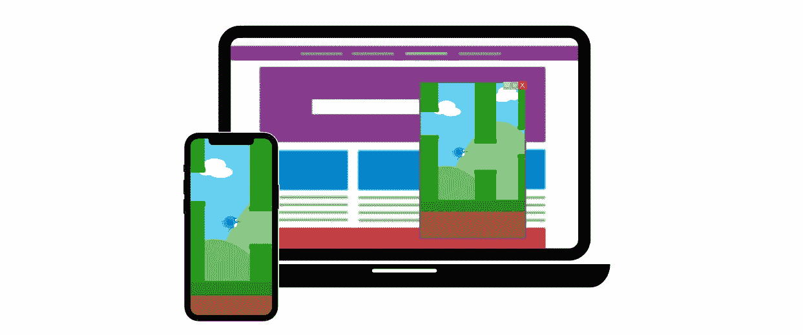

# 我如何在一夜之间将手机游戏迁移到 Windows

> 原文：<https://levelup.gitconnected.com/how-i-migrated-my-mobile-game-to-windows-in-a-single-night-b2827df6aea3>

## 颤动的力量



如果你以前看过我的作品，你就知道我是一个狂热的颤振爱好者。从它的声明式 UI 到它的活跃社区&开发，有很多值得喜欢的地方。也许关于 Flutter 最好的事情是它对跨平台开发的关注。对于小型团队和个人开发人员来说，它在提供一种维护较小代码库和跨多个平台快速迭代的方法方面的能力是无与伦比的。在这篇文章中，我将分享这样一个经历的主要例子，我作为一个单独的开发者，能够在仅仅一个晚上就将一个 Android & iOS 游戏移植到 Windows。

我们将看看我这样做的动机，以及从移动到桌面时要考虑的因素。然后，我们将看看我为实现这一目标所采取的具体步骤，以及我在这个过程中学到的一些东西。首先，我们来看看游戏。

# 灯光:记忆游戏

这绝不是我的游戏的插件，但如果你想自己检查一下，它可以在 iOS，Android 和现在的 Windows 上使用！如果您打算尝试一下，我鼓励您在移动和 Windows 上尝试一下，看看这两个平台之间存在的细微差异。

如你所见，这个游戏是经典的西蒙说的公式的现代版。它最初是一个个人项目，因为我正在学习 Flutter 框架的不同部分。接下来我知道的是，有超过 15 种游戏模式，成就&排行榜，以及一个我想与世界分享的应用程序。你可能还会注意到，这就是所谓的类似应用程序的游戏，这意味着它利用触摸输入，有一个类似应用程序的界面，不需要传统的游戏循环。然而，颤振当然有能力处理[更多的](https://pinball.flutter.dev)。

# 动机

我收到了一个喜欢和家人朋友一起玩的玩家发来的电子邮件，我想知道是否有可能在 Windows 上提供，这样他们就可以在更大的屏幕上玩了。用他们的话说，PC 上的类似产品比不上我的游戏质量。因为我用 Dart/Flutter 编写了游戏，所以我知道软件的核心不需要改变。我设计的游戏引擎，以及关键的 UI 组件，比如发光的按钮，在移植过程中确实不会被触及。我很兴奋地感觉到，我的游戏让我爱的人在一起度过了一段美好的时光，并且感谢 fluth，我可以用最少的努力改善他们的体验。男孩，我是对的！让我们来看看我在设计 Windows 端口时必须考虑的事情。

# 考虑

## 不兼容的插件

不是每个 Flutter 插件都适用于每个平台。有些可能最终会实现，而其他一些没有理由实现，因为它们提供了特定于一两个平台的功能。Lights for mobile 使用了 3 个这样的插件: [games_services](https://pub.dev/packages/games_services) 、 [google_mobile_ads](https://pub.dev/packages/google_mobile_ads) 和 [in_app_purchase](https://pub.dev/packages/in_app_purchase) 。列出的第一个插件提供了游戏中心&的 Google Play 游戏功能，这在 Windows 上没有任何用处。后两个是不言自明的，目前不支持 Windows，尽管将来可能会支持。

有两种方法可以处理你正在使用的应用程序。如果可能的话，我们可以重新设计应用程序，使其不依赖于目标平台上不可用的插件。否则，我们可以使用条件导入和代码块来避免不兼容的插件。我选择了后一种方法，因为我不想在手机上失去成就和排行榜。目前，移动版本仍然支持广告&通过应用内购买实现无广告的能力，尽管这种体验让我开始对永久删除移动广告进行 A/B 测试。

## 用户界面/行为预期

移动应用和桌面应用的预期用户体验有很大不同。我们必须考虑 UI 特性(窗口对全屏)，行为(最小化/最大化等)，以及不同的输入设备(触摸屏对鼠标/触摸板和键盘)。

要考虑的关键组件:

*   你的 app *自适应*吗？你的布局能在不同尺寸的屏幕/窗口上显示吗？请记住，你的应用程序将在桌面上的一个窗口中运行，当用户调整大小时，窗口的尺寸会有很大的变化。
*   你的 app *是反应式*吗？当用户调整窗口大小时，布局会调整以最好地显示信息吗？
*   用户会知道如何与你的应用程序交互吗？他们能以预期的方式最小化或最大化窗口吗？当一个项目是可点击的(通过改变指针)你中继吗？
*   你的应用需要处理替代输入吗？一些考虑包括键盘，游戏控制器，多按钮鼠标。总的来说，有了 Flutter，点击就像移动设备上的触摸一样，内置的接收文本的小部件可以很好地处理键盘输入。但是，您可能需要处理一些事情来满足用户的期望。

## 分配

你将如何分发你的应用？这是一个内部应用程序，可以用必要的文件作为 exe 分发吗？可以自签名打包成安装程序内部使用吗？您是否需要可信机构的证书来通过您自己的网站分发安装程序？还是会在微软商店发布？

对于几乎所有情况，我建议使用 [msix](https://pub.dev/packages/msix) 包。它使用 Windows 最新的打包格式 [*MSIX*](https://learn.microsoft.com/en-us/windows/msix/) 来提供一种现代且相对容易的打包体验。最后，您将获得一个可以作为安装程序分发或直接上传到微软商店的包。

# 该过程

老实说，Flutter/Dart 让这个过程变得如此简单有点可笑。我敢说，在微软商店出售我的游戏之前，我只接触了不到 1%的代码。在我的例子中，代码已经被设计为适应不同大小的设备，因为它在手机和平板电脑上可用。由于它是如何写的，布局也是反应性的。你可能会发现你需要花一点时间来更新你的布局。

事实上，那天晚上我花了大部分时间注册成为微软的合作伙伴&弄清楚如何正确地打包我的应用程序，以便通过微软商店进行销售。如果您以前没有为 Windows 打包过，我也将帮助您避免一些学习曲线。现在让我们深入研究，从代码调整开始。

## 条件插件用法

首先，在使用任何手机特定插件之前，我们需要检查我们是否在手机上。我们可以编写一个简单的 helper 方法，当我们需要检查时，可以从任何地方调用它。

```
bool get isMobile => Platform.isIOS || Platform.isAndroid;
```

现在，假设我们通过`Provider`传递控制器，这是颤振中的一种常见方法。我们基于`isMobile`实例化它们，如果我们在桌面上，就让它们`null`。这将允许我们根据控制器是`null`(桌面)还是非(移动)来调用控制器。为简洁起见，我将只展示一个正在使用的控制器。

```
// conditional instantiation
GamesServicesController? gamesServicesController;
if(isMobile) gamesServicesController = GamesServicesController();

// pass the object down the tree
Provider<GamesServicesController?>.value(
  value: gamesServicesController,
);

// conditional use
context.read<GamesServicesController?>()?.showAchievements();
```

如你所见，如果我们在 Windows 上，就不会调用`showAchievements`方法。这种方法可以处理我们插件的所有条件使用。

既然我们已经删除了不可用的功能，我们需要实现新的桌面特定功能。为此，我使用了两个包:[bitsdojo _ window](https://pub.dev/packages/bitsdojo_window)&[window _ manager](https://pub.dev/packages/window_manager)。您的需求可能会有所不同。还有一个很棒的软件包叫做 [fluent_ui](https://pub.dev/packages/fluent_ui) ，它将帮助你获得 Windows 的原生感觉。

## 桌面用户界面/功能

大多数内置的 Flutter 窗口小部件已经能够正确处理鼠标指针的更新，但是您可能有一些自定义的窗口小部件在可点击时也应该这样做。对我来说，游戏按钮需要更新。这款游戏的真正目的是在二合一笔记本电脑上通过触摸屏来玩，但如果你愿意，也可以用鼠标/触摸板来玩。因此，鼠标指针应该反映这一点。幸运的是，像大多数东西一样，这是一个快速简单的添加。只需将您的小部件包装在一个`MouseRegion`中。

```
MouseRegion(
  cursor: SystemMouseCursors.click,
  child: ...,
)
```

现在我们需要做最后的 UI 调整。即右上角的最小化、最大化和关闭按钮。这也是一个好主意，调整应用程序栏的情况，以允许标准的窗口功能，如窗口拖动和双击最大化/恢复。对于所有这些，我们将使用 [bitsdojo_window](https://pub.dev/packages/bitsdojo_window) 。首先，我们将设置它。

在`windows\runner\main.cpp`的开头添加以下几行:

```
#include <bitsdojo_window_windows/bitsdojo_window_plugin.h>
auto bdw = bitsdojo_window_configure(BDW_CUSTOM_FRAME | BDW_HIDE_ON_STARTUP);
```

然后，在您调用`main`方法中的`runApp`之后，直接添加以下内容:

```
void main() {
  ...
  runApp(MyApp());

  // Add this code
  doWhenWindowReady(() {
    appWindow.size = Size(600, 450);
    appWindow.alignment = Alignment.center;
    appWindow.show();
  });
}
```

在调用`show`之前有很多选项可以设置，所以我鼓励你查看一下软件包文档。

现在让我们使用软件包提供的一些小部件来完成我们的设计。这个包还提供了许多小部件，旨在提供良好的桌面体验。我们将介绍我在这里使用的方法:

*   `WindowBorder`(不言自明)
*   `WindowTitleBarBox` —这是定义窗口顶部的方式。类似于手机上的 AppBar。
*   `MoveWindow` —这是一个允许用户抓取&拖动窗口的小部件。通常也是标题栏。
*   `WindowButton`—窗口右上角按钮的基类。子类包括`MinimizeWindowButton`、`MaximizeWindowButton`和`CloseWindowButton`。

首先，让我们使用提供的类定义按钮的颜色。

```
final defaultButtonColors = WindowButtonColors(
    iconNormal: const Color(0xff454545),
    mouseOver: const Color(0xff363636),
    mouseDown: const Color(0xff363636),
    iconMouseOver: const Color(0xff525252),
    iconMouseDown: const Color(0xff525252));

final closeButtonColors = WindowButtonColors(
    mouseOver: const Color(0xffd32f2f),
    mouseDown: const Color(0xffb71c1c),
    iconNormal: const Color(0xff454545),
    iconMouseOver: Colors.white);
```

然后，我们可以在一个类中定义我们的`Row`按钮。

```
class WindowButtons extends StatelessWidget {
  const WindowButtons({Key? key}) : super(key: key);
  @override
  Widget build(BuildContext context) {
    return Row(
      mainAxisSize: MainAxisSize.min,
      children: [
        MinimizeWindowButton(colors: defaultButtonColors),
        MaximizeWindowButton(colors: defaultButtonColors),
        CloseWindowButton(colors: closeButtonColors),
      ],
    );
  }
}
```

现在让我们定义一个小部件，它将基于平台有条件地对我们的小部件树做出一些决定。为了简单起见，我们将在 Windows 上重用当前的移动设备`AppBar`。这是我们的小部件将要做的事情:

*   将身体包裹在桌面上的`WindowBorder`中。
*   给`Scaffold`提供一个`AppBar`在手机上。
*   将机身包裹在桌面上的`Column`中，提供一个`WindowTitleBarBox`。
*   将`AppBar`包装在一个`MoveWindow`小部件中，并将二者传递给`WindowTitleBarBox`。
*   `MoveWindow`将定义双击时的操作。

```
class ConditionalScaffold extends StatelessWidget {
  const ConditionalScaffold({
    Key? key,
    required this.isMobile,
    required this.appBar,
    required this.child,
  }) : super(key: key);

  final bool isMobile;
  final PreferredSizeWidget appBar;
  final Widget child;

  @override
  Widget build(BuildContext context) {
    if (isMobile) {
      return Scaffold(
        appBar: appBar,
        body: child,
      );
    }
    return Scaffold(
      body: WindowBorder(
        color: const Color(0xff494949),
        width: 1,
        child: Column(
          crossAxisAlignment: CrossAxisAlignment.stretch,
          children: [
            WindowTitleBarBox(
              child: MoveWindow(
                onDoubleTap: appWindow.maximizeOrRestore,
                child: appBar,
              ),
            ),
            child,
          ],
        ),
      ),
    );
  }
}
```

`maximizeOrRestore`方法由 [bitsdojo_window](https://pub.dev/packages/bitsdojo_window) 包中的`appWindow`提供。

现在只缺一件东西了！让我们将按钮添加到窗口的右上角。为此，我们将把我们的`MoveWindow`包装在一个`Stack`中，并把我们的`WindowsButtons`放在它的上面，与右上方对齐。

```
WindowTitleBarBox(
  child: Stack(
    children: [
      MoveWindow(
        onDoubleTap: appWindow.maximizeOrRestore,
        child: appBar,
      ),
      const Align(
        alignment: Alignment.topRight,
        child: WindowButtons(),
      ),
    ],
  ),
),
```

干得好！现在，我们的 UI 和窗口行为正是用户在 Windows 上使用我们的应用程序时所期望的。接下来，我们将看看如何监听窗口变化，以防我们需要做一些响应。

## 处理窗口事件

当应用程序被放到移动设备的后台时，Lights 游戏循环没有太多意义。为了处理这些事件，我们混合`WidgetsBindingObserver`并监听`AppLifecycleState`的变化。当 app 为`paused`时，我停止游戏，显示主菜单。在桌面上，等同于窗口最小化。为了监听这些事件，我们可以使用 [window_manager](https://pub.dev/packages/window_manager) 包。你的应用程序可能不需要监听窗口事件，但是这个包有很多功能，所以你可能还是想看看。

让我们将`WindowListener`混合到与`WidgetsBindingObserver`相同的类中，并覆盖`onWindowMinimize`方法来执行与`didChangeAppLifecycleState`相同的逻辑。不要忘记在`initState`中添加监听器，并在`dispose`中删除它。我们也应该以`isMobile`为条件。

```
@override
  void initState() {
    if (isMobile) {
      WidgetsBinding.instance.addObserver(this);
    } else {
        windowManager.addListener(this);
    }
    super.initState();
  }

  @override
  void dispose() {
    if (isMobile) {
      WidgetsBinding.instance.removeObserver(this);
    } else {
      windowManager.removeListener(this);
    }
    super.dispose();
  }
```

厉害！现在，我们的应用程序正式 Windows 就绪。现在开始包装！

## 打包和上传

win32 格式的 Flutter 构建用于 Windows。Flutter 一度还提供 UWP 版本，但由于微软几乎已经宣布了该格式的消亡，这一版本已经被关闭。如今，打包 win32 应用程序的最佳方式是将其打包成 MSIX 软件包。它使处理元数据比以前容易得多，并提供了一个安装程序。一旦您在商店上有了列表，并将其与您产品的正确配置打包在一起，它就可以上传到 Microsoft 商店进行分发。

msix Dart 包为我们处理了大量的流程，使事情变得更加简单。我们只需要通过我们的`pubspec.yaml`文件为它提供正确的配置。让我们来看看如果我们为微软商店之外的发行或测试进行[自签名](https://learn.microsoft.com/en-us/windows/msix/package/create-certificate-package-signing#create-a-self-signed-certificate)时的配置是什么样子的。

```
msix_config:
  display_name: App Name
  publisher_display_name: Publisher Name
  logo_path: assets/icons/app_icon.png
  certificate_path: path/to/cert/TEST.pfx
  certificate_password: certPassword
  capabilities: internetClient, location, microphone, webcam
```

当不发布到微软商店时，这里没有什么可担心的。如果您的证书创建正确，您就可以开始了。为了将您的应用程序安装到电脑上，必须事先在电脑上安装证书。在`capabilities`选项中，您可以声明您的应用程序在设备上需要的任何[功能](https://learn.microsoft.com/en-us/windows/uwp/packaging/app-capability-declarations)。

现在让我们来看看为了在微软商店上发布，我们需要做些什么改变。

```
msix_config:
  display_name: App Name
  publisher_display_name: Publisher Name
  family_name: 3626482PubName.AppName_uw93xa52ug
  identity_name: 38092PubName.AppName
  logo_path: assets/icons/app_icon.png
  languages: en, es, de, fr, it, ja, ko, nl, sv, tr, uk
  store: true
  sign_msix: false
  publisher: CN=S797AJDU-128S-AFOU-S8WJ-JFA8EH7AFBH2
  capabilities: internetClient, location, microphone, webcam
```

首先要注意的是，我们已经不签 app 了。Windows 应用商店会为我们解决这个问题。我们还必须告诉`msix`,我们正在打包以发布到商店。我们还列出了我们的应用程序支持在商店中列出的所有语言。

最后，我们包括`family_name`、`identity_name`和`publisher`。这些都是微软商店提供的价值，可以从[合作伙伴中心](https://partner.microsoft.com/dashboard)访问。您可以在应用/游戏概述的*产品标识*下找到它们。您还必须确保提供给`display_name`和`publisher_display_name`的值与微软商店中注册的值相匹配。

现在，您可以使用以下命令打包您的应用程序。

```
flutter pub run msix:publish
```

之后，您将拥有一个可以通过合作伙伴中心上传的`.msix`文件。只需开始一个新的提交，在商店上填写详细信息，并将`.msix`文件拖放到*包*页面。在 1-3 个工作日内，您的 Flutter 应用程序将向 Windows 用户提供！

# 结论

Flutter 允许我将我的游戏带到一个全新的平台，以响应一个用户的请求。如果我被迫为 Windows 原生重写整个应用程序，这肯定是不可行的。这就是颤动的力量。我希望这篇指南已经为你提供了用最少的努力把你自己的 Flutter 移动应用程序带到 Windows 上的知识。

如果您对该流程有任何问题或意见，我很乐意收到您的来信。如果你觉得某个方面需要更深入的指导，请告诉我。这是为了展示我们如何快速、轻松地用 Flutter 将移动应用移植到 Windows 上，而不是一个详尽的指南。

如果你觉得这篇文章有帮助，请拍几下让我知道。您可以关注我，了解我在 Flutter 以及其他软件开发和 IT 主题方面的工作。同时，看看我目前的[颤振文章](https://medium.com/@lp3/list/flutter-eaade608fb9a)目录。感谢阅读！

# 分级编码

感谢您成为我们社区的一员！在你离开之前:

*   👏为故事鼓掌，跟着作者走👉
*   📰查看[升级编码出版物](https://levelup.gitconnected.com/?utm_source=pub&utm_medium=post)中的更多内容
*   🔔关注我们:[Twitter](https://twitter.com/gitconnected)|[LinkedIn](https://www.linkedin.com/company/gitconnected)|[时事通讯](https://newsletter.levelup.dev)

🚀👉 [**加入升级人才集体，找到一份神奇的工作**](https://jobs.levelup.dev/talent/welcome?referral=true)