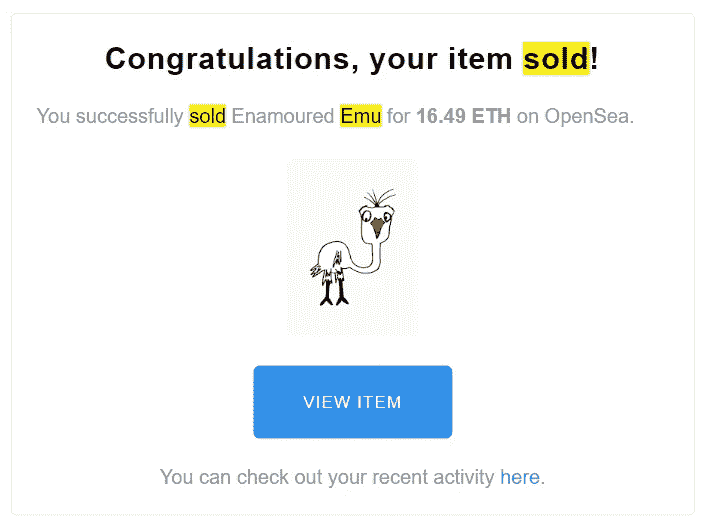

# 我如何投资 650 美元打造 24 个朋友系列 2

> 原文：<https://levelup.gitconnected.com/how-i-minted-24veefriends-series-2-with-a-total-investment-of-650-53699a19711c>

为 2.2 ETH 铸造

虽然像诺查丹玛斯一样坐在这里很容易，但我们不要自欺欺人。过去的 12 个月在 NFT 过得相当简单。在 2021 年中期的某个时候，如果你的钱只赚到微不足道的 2 倍，你会很生气。在这个市场上，现在，我愿意用一个肾换两倍。

现在情况略有不同。最近市场的健康调整让我们保持了诚实。

曾几何时，我们是家里的神谕。无所不知，无所不知，无所不晓，铸造一只屁股上有烟花的浣熊是你做过的最好的投资决定。为什么？因为社区告诉你了。

看着你花 250 美元创造的那个毛茸茸的朋友，到 5 万美元，然后又回到零，回到你的日常工作中，可能会非常清醒。

如果我的孙子们在 30 年后读到这篇文章，他们会认为我夸大了这些数字。我相信我们都希望记录下人们确实取得了这些收益。

# **让我们回到这个博客的标题上……**

首先，我在 2017 年购买了少量以太坊，完全忘记了它在比特币基地的交易所账户上。我甚至可能已经删除了应用程序，这可能会让你了解我是一个多么前卫的人。

至少在过去的六年里，我看着 Garyvee 记录他的商业之旅。我看过励志视频，看过博客，买过书。在这一点上，很难否认我是一个超级粉丝，因为有压倒性的证据对我不利。

当加里推出 Veefriends 时，这个星球上没有任何东西能让我相信这不会是一项重大投资。

他被广泛记录的商业成功，在利用他的观众(除了那些 K-swiss 运动鞋)时从不妥协的态度，然后把它放在线上，真的让我坐起来听。

在做了更深入的研究后，我孤注一掷，铸造了 12 个 Veefriends，并在二级市场上又买了一个。就在这个时候，我明白了过度杠杆化意味着什么。

在深入了解购买流动性差的 Jpegs 的技巧后，我突然意识到，我相信其他数百人也是如此，一个项目的初始阶段或价格发现阶段是最大的增长所在。

因此，在图书游戏发布的早期阶段，我以 16.49eth 的价格卖掉了我的一个 Veefriends，并买下了图书游戏的地板代币，后来我用这些代币作为 Veefriends 系列二的“朋友列表”广告。

基本上，这给了我以最优惠的价格购买第二季的机会。

我卖掉了一些加里空投的用于购买实体书的中档代币，然后重新购买。如果你读过我以前的文章，我会大声疾呼不要买中间的。

就在拍摄快照之前，我卖掉了 20 个图书游戏，以确保我有足够的钱来支付实际的造币厂。我设法为我举办的每个系列 1 争取到 24 个允许名单点和 12 次免费空投。

这没什么稀奇的，我当然也不是交易员。但是当你看到一个明显的机会时，你会最大化它。

***以上都不是理财建议。我不是一个合格的财务顾问，尽管我尽了最大努力，我也无法预测未来。***

***NFT 空间有风险。***

***专家说，目前 99%的项目都在走向 0。***