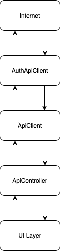
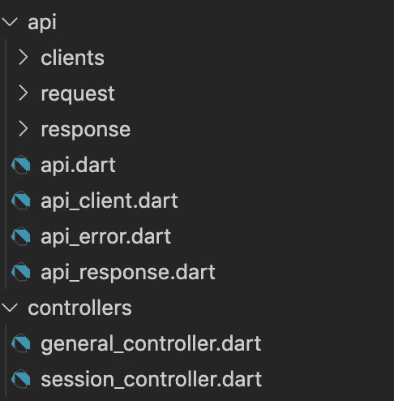
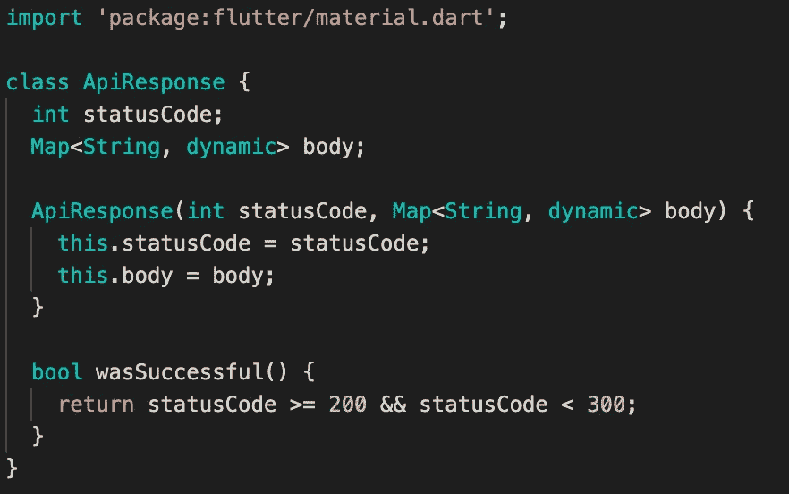
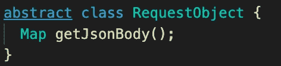
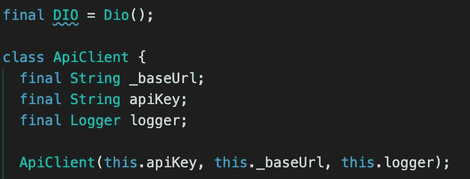
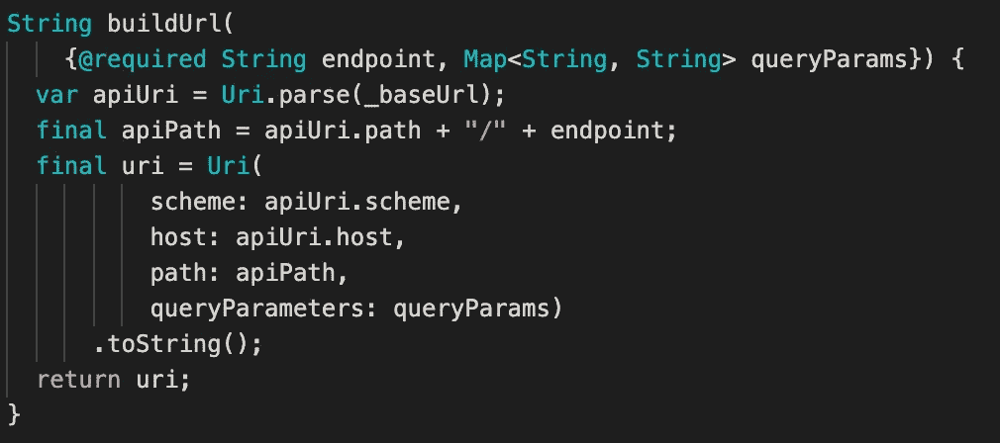
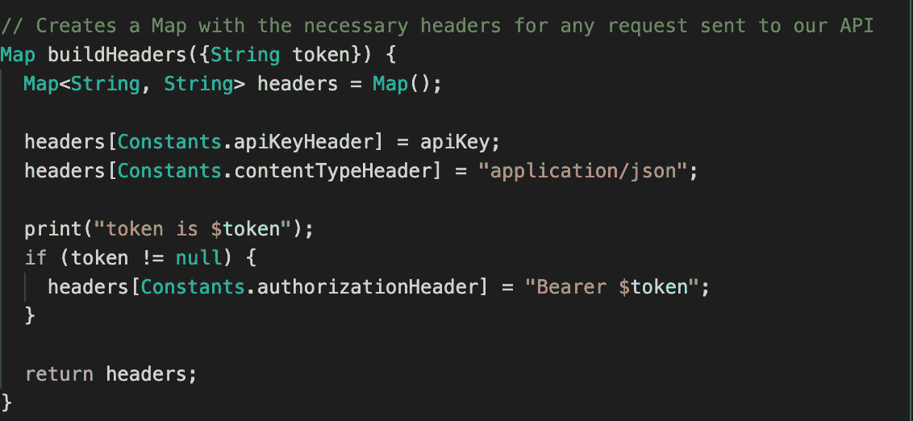
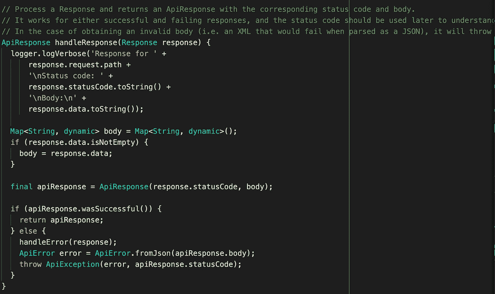
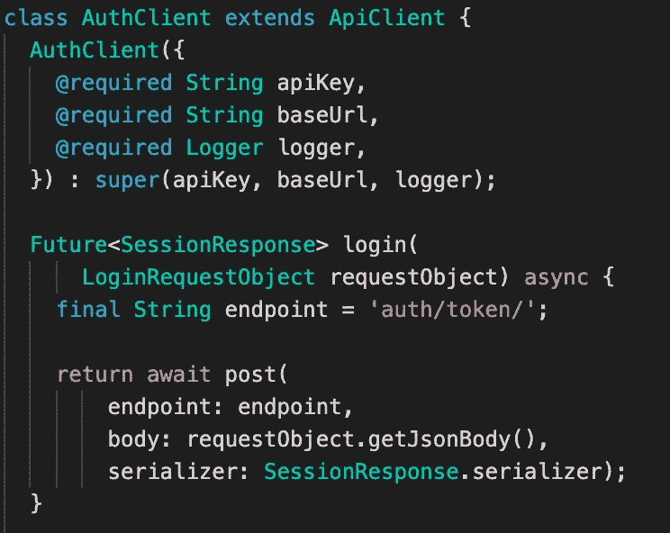
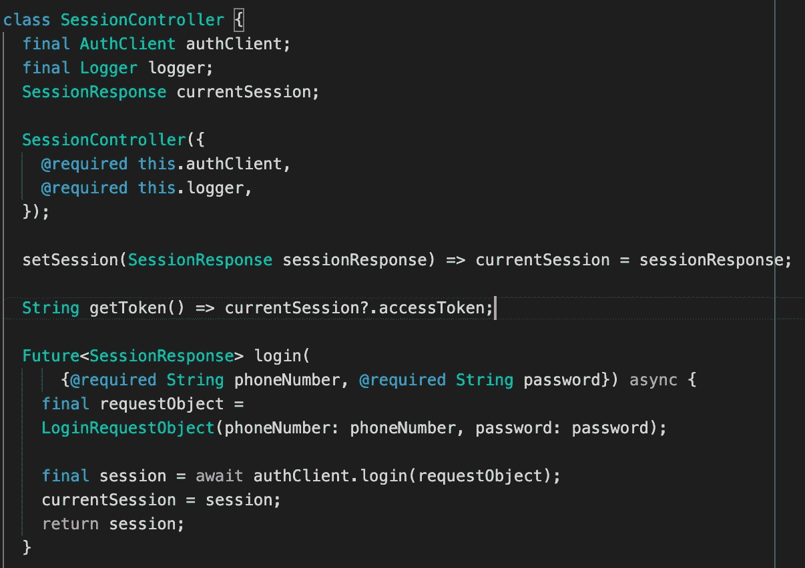

# 我如何在我的 Flutter 项目中组织 API 文件

> 原文：<https://levelup.gitconnected.com/how-i-organize-api-files-in-my-flutter-project-8f21c17050df>

这个解释会很长很复杂，所以如果你想直接看到代码库，你可以在这里看到它:

 [## black ment hor/flutter _ project _ boilerplate

### 在 GitHub 上创建一个帐户，为 black mentor/flutter _ project _ boilerplate 开发做出贡献。

github.com](https://github.com/blackmenthor/flutter_project_boilerplate/tree/master/lib/core/api) 

市场上几乎所有的应用程序都使用外部数据源(也就是互联网)并向其发送数据。虽然有些应用程序依赖本地数据库来保存和获取数据以显示给用户。这在移动编程中是相当容易的，因为对于全球的移动程序员来说，这是一个非常基本的话题，通常我们在学习移动编程框架本身的时候就会学到这一点。

对于小项目来说，这可能没什么大不了的，因为应用程序中使用的 API 调用很少。但是，如果应用程序大量使用并发送来自互联网的数据，会怎么样呢？当然，这带来了一个问题，尤其是如果代码库是由多个程序员处理的话。随着越来越多的程序员处理代码并向代码库写入代码，我们必须有一个标准化来使事情变得清晰并以正确的顺序进行。

那么，在为 Flutter app 设计 API 层的时候，我们应该考虑到什么呢？我试图列出在为 Flutter 设计 API 层之前需要考虑的所有事情

*   API 层必须给 UI 层适当的抽象。
*   API 层必须将所有的 API 响应转换成一个普通的 dart 对象，这样 UI 就可以直接消费它。
*   API 层必须能够自己管理会话，因此 UI 部分不应该负责管理会话。

考虑到这些因素后，这就是我在专业项目中经常使用的 API 层的形状。

首先，让我们从 API 层将使用的组件开始，我将用一个简单的图表来说明这一点

那么那些组件是什么意思呢？

*   先说互联网。

这就是我们需要从设备外部获取的“互联网”或外部数据。这可以是任何通信方式，REST API，Websockets，文件下载/上传，任何东西。

*   接下来，我们从 AuthApiClient 开始。这是什么？

大多数现代应用程序都需要用户登录/注册到应用程序的系统(后端)，这意味着大多数 API 调用都需要由系统进行验证。一个简单的例子是这样的:假设你正在开发一个电子商务应用程序，你不希望看到用户 A 以其他人(用户 B)的身份买卖东西，对吗？

因此，这个 AuthApiClient 将处理所有关于用户身份验证和对需要它的其他组件的授权的通信。例如，如果我们需要某个页面上的用户信息，这就是您正在寻找的组件。

关于后端认证的更多信息，你可以在这里阅读[https://www . digital ocean . com/community/tutorials/an-introduction-to-oauth-2](https://www.digitalocean.com/community/tutorials/an-introduction-to-oauth-2)

*   接下来，我们得到 ApiClient。

那么 ApiClient 和 AuthApiClient 有什么区别呢？好的，所以基本上它们是“相同”的东西，可以用于几乎相同的东西。但是责任是 ApiClient 和 AuthApiClient 的主要区别。

ApiClient 将从用户的角度负责更实际的用例，例如当我们必须调用一个 API 来创建一个新的电子商务交易时，这就是你所需要的。

而 AuthApiClient 将只负责与认证相关的用例。大多数情况下，用户只会在登录和注册应用程序内部的流时与该组件“交互”。但是这个组件总是在幕后工作，为其他组件提供与身份验证相关的数据。

ApiClient 将从 API 获取原始信息，并将原始信息发送到 API，并对其进行处理，直到准备好供 UI 使用(在普通的 Dart 对象表单上)。因此，这将包括您为应用程序选择的任何数据解析机制。或多或少，这是 API 层本身的核心。

另外，值得一提的是，ApiClient 需要一个 AuthApiClient 才能正常运行。因为出于安全原因，现代移动应用程序中的大多数操作都需要身份验证数据。这是我把这两个分成不同部分的另一个原因。

*   接下来是 ApiController。

虽然 ApiClient 将为用户界面提供现成的数据，但是用户界面层不应该直接与 API 层通信。主要是因为 API 层内部有很多逻辑，UI 不应该知道太多。

这就是为什么我在这里为 UI 创建了另一个抽象层，称为 ApiController。因此，基本上 ApiController 将负责创建对 ApiClient 的请求，在最适合用例的客户端之间切换。

因此，UI 层不应该知道 API 调用背后的太多逻辑，它需要做的只是告诉 ApiController 它需要什么(获取最新数据、发送登录信息等)，ApiController 应该完成剩下的工作。

*   最后，是用户界面层。

这是用户在应用程序中直接交互的界面。例如(按钮被点击、拉至刷新窗口小部件被触发等)。这只与 ApiController 通信，不多也不少。

首先，文件夹看起来像这样:

Api 层文件夹

因此，我们有两个顶层文件夹，它们是 Api 和控制器。除了 ApiController 类之外，大多数 Api 层文件都放在 Api 文件夹中。

然后，我们需要定义 Api 层的请求和响应基类。这是必要的，因为我们需要将来自互联网/外部来源的所有信息转换为一个 Dart 对象。

因此，对于所有 Api 响应，不管它是否是一个错误，我们都将它们转换成一个 Api response 类。实现将如下所示

这个类将包含我们从后端收到的响应的 JSON 表示，以及原始 API 响应的 HTTP 状态代码(如果不使用 HTTP，可能不需要这个)。

接下来是 RequestObject 和 ResponseObject 类，它将是所有保存 API 响应结果的普通 Dart 对象的基类。

这个抽象类是一个非常简单的类，我们需要它，所以如果将来我们需要在响应/请求对象上添加新的功能，我们可以只在这个基类上添加抽象方法，所有的子类都需要跟随。

接下来，这是最重要的部分，ApiClient 类。这个类包含了很多方法，因为我们需要在一个 REST API 中支持很多 Api 方法(GET、POST、PUT、PATCH 等)。所以我只针对 GET 方法进行说明。

首先，我们将对 HTTP 库使用 Dio，因为它非常非常实用，而且几乎所有的 REST API 方法都是现成的。即使是下载和上传文件。

好了，让我们从 Dio 声明开始，理想情况下，它应该被注入到 ApiClient 中，这样就可以很容易地对它进行模拟测试，但是我现在跳过了这一部分。

然后，我们声明 ApiClient 需要的所有参数，它们是:

*   ApiKey(您的后端需要 Api Key 来确保 HTTP 请求来自您的应用程序，而不是来自恶意来源)
*   BaseURL(后端系统的基本 URL)
*   记录器(这是不需要的，但这将是方便的记录所有的请求和响应，我们得到了所有的记录器机制，在应用程序中使用)

接下来是 buildUrl 方法:

这种方法基本上是将应用程序所需的每个端点附加到后端系统的基本 URL 上，并在需要时在请求上添加 queryparams。

然后构建 Headers 方法。

该函数将添加后端所需的任何 HTTP 请求头，通过添加授权令牌和 API 密钥来识别 HTTP 请求是否来自正确的来源。你也可以根据自己的需要在这里添加更多的基本标题。

接下来是 handleResponse 方法。

所以这个方法将通过 Dio(我使用的 HTTP 实现)解析原始的响应类，并将其转换为 ApiResponse 或 ApiError(我们自己的保存 API 响应的 Dart 对象)。

请注意，序列化不是在这个函数中完成的，因为我们只将信息保存到 ApiResponse 中的映射<string dynamic="">中。</string>

序列化之后，我们将得到一个普通的 Dart 对象，它描绘了一个真实世界的域，类似于`Car`、`Person`等。

接下来是 ApiClient 的 GET 方法。

这就是神奇之处，因此这个方法将编译您对某个端点发出的请求，使用某些查询参数(如果需要)，并从 Dio 调用 GET 方法的实际实现，并将其转换为类似于`Car`或`Person`的实际 Dart 对象。

但是你可能在这里看到了一个遗漏的解释，get 函数中的序列化参数是什么意思？

因此，我创建了一个名为 Serializer 的简单函数定义，它将由每个 Dart 对象实现，这些对象将代表来自 Api 响应的实际对象，类似于`Car`或`Person`。

例如，参见下面的`SessionResponse`类:

所以我用 json_annotation 包把 json 解析成一个 Dart 对象(这里可以用自己的选择进行 json 解析，没有对错)。

我创建了一个名为`serializer`的简单 getter，它将返回一个静态函数，该函数将解析 Map <字符串，在本例中是将动态>解析为`SessionResponse`。

因此 ApiClient 将只接收如何将从 Api 接收的 Json 对象解析成普通 dart 对象的实现。

接下来，如何用这个客户端实现一个实际的 Api？

这很简单，所以首先，对于 AuthApiClient(我将这个 Api 组件从通用 ApiClient 中分离出来)，实现将如下所示:

因此，我们将从 ApiClient 类扩展这个类，从 ApiClient 类扩展所有参数。为了创建请求(例如，登录请求)，我们只需要创建一个端点、一个请求对象(基于后端的需求)，并定义一个序列化程序来解析 Json。

接下来，对于此 AuthClient 的 ApiController，定义如下:

我们将注入 AuthClient、logger(不需要)，然后我们将创建一个登录函数，该函数将从 AuthClient 实际调用登录实现。这将由 UI 层直接调用。

其他 Api 客户端呢？将用于一般用例的那个。它看起来会像这样:

因此，与 AuthClient 相比，这个 GeneralClient 将多一个参数，即 SessionController。如果我们想要向请求添加授权令牌(例如`fetchDummy`请求)，这将是需要的。除此之外，与 AuthClient 相比，它的实现基本相同。

对于这个 ApiController，它看起来像这样:

或多或少，auth controller/session controller 实现也是如此。这将由 UI 层直接调用。

好了，最后一件要做的事情是，我将把所有的 ApiClients 分组到一个 Api 类中。这是必需的，这样我们就可以在这里组织所有的客户端，我们只需要调用 factory `Api.create`语法来基于某些参数(Api 键、基本 URL、日志程序和会话控制器)初始化所有的 Api 客户端

瞧啊。我们刚刚从头开始为我们的 Flutter 项目做了一个完整的 Api 层&这将涵盖我们的应用程序与后端通信以获取和发送数据所需的几乎所有基本功能。

我知道这很难一下子完成，但是我希望如果你打算用 Api 调用之类的东西开始你的 Flutter 项目，这将会很有用。

像往常一样，如果你有任何问题，你可以在 anggadwiarifandi96@gmail.com 问我

谢谢你，祝你愉快。注意安全！