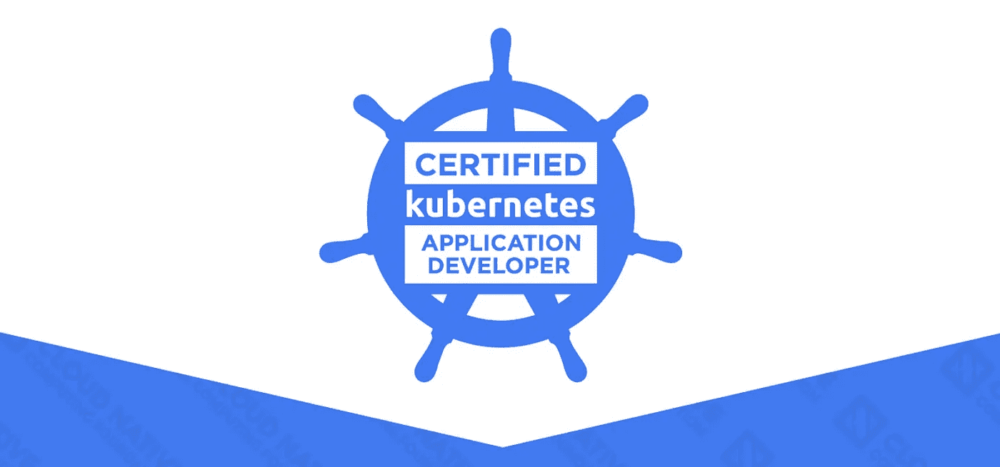

# 我成为认证 Kubernetes 应用程序开发人员的旅程

> 原文：<https://levelup.gitconnected.com/how-i-passed-the-ckad-exam-certified-kubernetes-application-developer-90227a0f9040>

## 学习、准备和通过 CKAD 考试的技巧



CKAD

作为一名经验丰富的承包商，我渴望更新我的技能。最近通过了 CKAD 认证考试(认证 Kubernetes 应用开发者)。

准备好卷起袖子，考验你的技能吧！

CKAD 考试是一项实践挑战，要求您在真实环境中解决现实世界的问题。这不是一个简单的考试，但回报是值得的——这项考试在业内受到高度重视，可以给你的职业生涯带来优势。不要被传统的 MCQ 考试所愚弄 CKAD 考试真正测试你的知识和专业技能，让你在竞争中脱颖而出。

在这篇文章中，我将分享我的考试经验。

## 我的背景

在我开始准备这个考试之前，我对 Kubernetes 的了解有限。我接触过一些 OpenShift，并且理解一些 Kubernetes 的概念，比如 Pod、部署等等。

我熟悉 vim 和基本的 Linux 命令。这被证明是一个重要的优势。

## 我是如何准备考试的

我花了 6 周时间准备并通过了考试。我做了以下工作:

*   我完成了 Udemy 课程 [Kubernetes 认证应用程序开发员(CKAD)考试](https://www.udemy.com/course/certified-kubernetes-application-developer/)。这是一门极好的课程，有最新的信息。
*   在 [kodecloud](https://kodekloud.com) 上的两次模拟考试和两次闪电实验室(如果你订阅了上述 Udemy 课程，将免费提供)。
*   [CKAD 模拟器](https://killer.sh/ckad)来自 killer.sh 考试前我练习了几次。购买 CKAD 考试后，您将获得两次免费培训。每节课允许您使用模拟器 36 个小时，包括 22 个考试问题和 3 个预习问题。模拟题比真题稍微难一点，但是风格和范围都很像。
*   [CKAD 备忘单](https://www.devopsmadness.com/cka_cheatsheet/)。熟悉所有命令是很重要的。
*   我在我的 Macbook 上设置了 minikube，并进行了相当多的练习。

我的学习策略由 Udemy 课程和实践的多次迭代组成。完成第一轮课程后，我参加了模拟考试和闪电实验室。第一次模拟测试成绩不太好，我又回到了 Udemy 的课程上重新学习相关的题目。我重复这个过程，直到我在半小时内通过了所有的模拟考试和闪电实验室。

我在 killer.sh 的模拟器考试中采用了同样的策略。在第一次考试中，我无法在两个小时内完成 22 道题。在研究了答案，重温了题目后，我取得了不错的成绩，在规定的时间内完成了 22 道题。这给了我参加实际考试的信心。

最重要的是理解关键概念。许多问题要求您对 Pod 或服务不工作/不可连接等问题进行故障诊断。如果不深入了解这些要素是如何协同工作的，就很难回答这些问题。

## 考试前

在考前检查期间，监考人员将通过视频检查您的考试环境。在检查过程中我得到了一些惊喜。这里有一些你可能想知道的事情:

*   不允许浏览器书签
*   **不允许第二班长**
*   书桌要干净(没有书，杯子，或者任何与考试无关的东西)

## 考试期间

测试是在 PSI 安全浏览器中嵌入的 Linux 虚拟机上进行的。平台不是很友好，考试时延迟也不理想。开始的时候，我花了几分钟弄清楚如何正确地复制/粘贴。我的 vim 技能在考试中帮了大忙。

我做的第一件事是创建几个别名

```
alias k=kubectl
alias kc="kubectl create"
export do="--dry-run=client -o yaml"
```

在考试中，我通常使用命令式命令来创建 YAML 文件，如下例所示。

```
k -n mynamspace run newPod --image=nginx $do > newPod.yml
```

然后，我编辑 YAML 文件，添加考试问题所需的内容，并运行`create`命令来执行它。

```
kc -f newPod.yml
```

对于每个问题，都有一个警告，提醒您切换到问题所需的上下文。别忘了做那件事，否则，即使你做得很完美，你也可能得零分。

2 小时的考试有 16 个问题(考试中的问题数量可能略有不同)。我在剩下 10 分钟的时候完成了所有的问题。我利用剩下的时间重新检查我的答案。所以平均来说，我在每个问题上花了 6 到 7 分钟。

考前看了一些博文建议根据分数权重而不是顺序答题。但是我没有遵循这个建议。我按顺序回答了所有的问题。我觉得在考试中考虑分数权重会分散注意力。分数权重通常与复杂度成线性关系。2%分数的问题比 8%分数的问题容易。如果我在一个问题上卡住了，我会继续下一个问题，不管分数权重如何。

## 考试结束后

恰好在 24 小时后(从考试开始算起)，我收到了几封电子邮件，通知我考试结果、徽章、证书等等。证书有效期为 3 年。


## 摘要

总的来说，我感觉考试的难度和 Udemy 课程中的闪电实验室差不多。如果准备充分，练习足够，通过并不难。我对备考花费的时间和精力很满意，因为我在证书之上学到了真正的技能。

如果你打算参加考试，请记住

*   研究关键概念并充分理解
*   熟悉 vim 和 Linux 命令
*   使用别名和命令式命令来节省时间
*   熟悉官方文档网站

祝你好运。