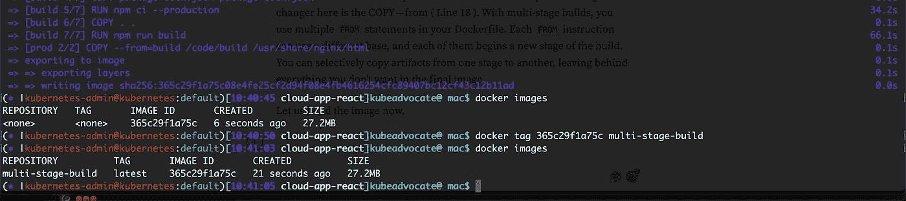

# 我如何将 Docker 图片的尺寸缩小 95%

> 原文：<https://levelup.gitconnected.com/how-i-reduced-the-size-of-my-docker-image-by-95-520a05439300>

使用多阶段构建缩小 Docker 映像的大小

编写 Dockerfile 似乎很容易，除非您最终编写的 docker 映像的大小为 0.5GB。我最近在做一个 React JS 项目，在那里我构建了一个前端应用程序。React JS 项目并没有什么新内容。我使用的是同一个 package.json，一组典型前端应用程序会使用的依赖项。现在，我决定将应用程序转移到 Kubernetes。所以我把 docker 镜像推送到 DockerHub，尝试部署一个 Pod。

我使用的是本地集群，pod 启动时间为 5 分 7 秒。我肃然起敬。然后我把它部署到 AKS 集群(Azure Kubernetes 集群)。令人惊讶的是用了 3 分 40 秒。这是巨大的。我试着给豆荚加压来触发 Kubernetes HPA。新的 pod 需要同样的 3 分钟来启动，最终应用程序会被太多的请求淹没。经过调查，我发现图像的大小是瓶颈，当然，你不会想要这么大的 docker 图像(O.5GB)。这时候，我意识到我将不得不做一些关于 docker 图像大小的事情。因此我利用了 Docker 多阶段构建的概念。

# 整个故事是关于什么的？(TLDR)

1.  使用多阶段构建减小 Docker 图像的大小。
2.  理解多阶段构建的概念。

# 故事资源

1.  GitHub 链接:【https://github.com/pavan-kumar-99/medium-manifests 
2.  GitHub 分支:[多级构建码头](https://github.com/pavan-kumar-99/medium-manifests/tree/multistage-build-docker)

## Docker 版本:

这是我的一个典型 React JS 应用程序的初始 Docker 图像。如果您看到第 1 行，我使用的是 alpine 版本的节点。构建 docker 文件后，这里是它的大小。

非多阶段构建

这是构建图像的典型方式，编写这样的 docker 文件似乎很容易。但是从 Kubernetes 的角度来看，使用这种方法有一些缺点。

a)图像的大小直接影响 Pod 启动时间。

b)图像越小，pod 启动越快。

## Docker 多阶段构建:

Dockerfiles 中的多级构建特性使您能够创建更小的容器映像，具有更好的缓存和更小的安全足迹。对于多阶段构建，您可以在 docker 文件中使用多个`FROM`语句。每条`FROM`指令可以使用不同的基础，并且它们中的每一条都开始了构建的新阶段。您可以有选择地将工件从一个阶段复制到另一个阶段，在最终图像中留下所有不想要的东西。

好像不一样？好吧，让我们理解文件。

第一行称为阶段。这些阶段没有命名，您通过它们的整数来引用它们，第一个`FROM`指令从 0 开始。然而，你可以通过给`FROM`指令添加一个`AS <NAME>`来命名你的阶段。

然后剩下的步骤保持不变。改变游戏规则的一个步骤是 COPY — from(第 18 行)。对于多阶段构建，您可以在 docker 文件中使用多个`FROM`语句。每条`FROM`指令可以使用不同的基础，并且每条指令都开始了构建的新阶段。您可以有选择地将工件从一个阶段复制到另一个阶段，在最终图像中留下所有不想要的东西。

现在让我们来构建图像。

多阶段构建后图像的大小

哇，是的！！这是真的。图像尺寸缩小了 95%。图像大小现在是 27.2 MB。

我的本地集群花了 25 秒来提取图像并开始运行。我的 AKS 集群花了 10 秒钟提取图像并开始运行。

这不是很牛逼吗:)！！

这就是如何利用 docker 中的多阶段构建来缩小 docker 图像的大小。请在评论区分享你在制定这些政策时的经验。

直到下一次…..

# 被推荐的

 [## 使用 jsPolicy 在 Kubernetes 中将策略作为代码

### 使用 jsPolicy 在 Kubernetes 中进行开发

pavan1999-kumar.medium.com](https://pavan1999-kumar.medium.com/policies-as-code-in-kubernetes-using-jspolicy-8d358d064bfd)  [## MlOps:使用 kubeflow 的机器学习管道

### 使用 Kubeflow 对 Kubernetes 进行有效的 MLOps

medium.com](https://medium.com/nerd-for-tech/mlops-machine-learning-pipelines-using-kubeflow-fc06508a3f0d)  [## 与 CSI 司机在 Kubernetes 哈希克沃特秘密

### 使用 Vault CSI 驱动程序向 Kubernetes Pods 注入秘密

pavan1999-kumar.medium.com](https://pavan1999-kumar.medium.com/hashicvault-secrets-in-kubernetes-with-csi-driver-ec917d4a2672)  [## 地球化吉托普斯之路！！！

### 使用 Atlantis(拉式请求自动化)通过 GitOps 建立 Terraform。

medium.com](https://medium.com/nerd-for-tech/terraforming-the-gitops-way-9417cf4abf58)