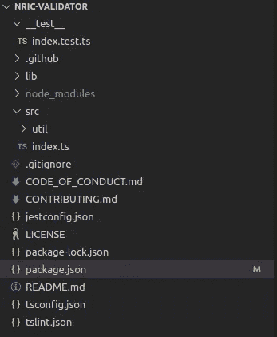
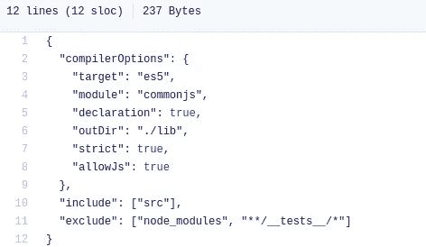
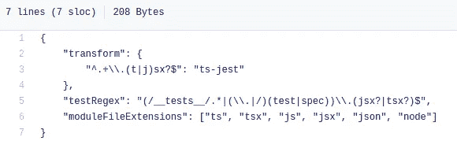
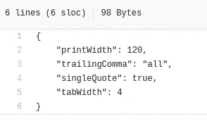
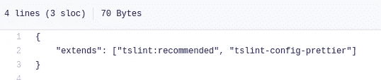
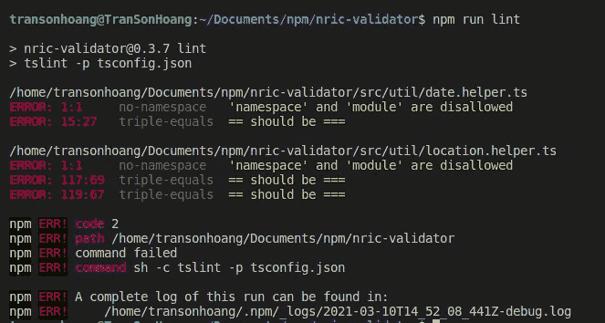
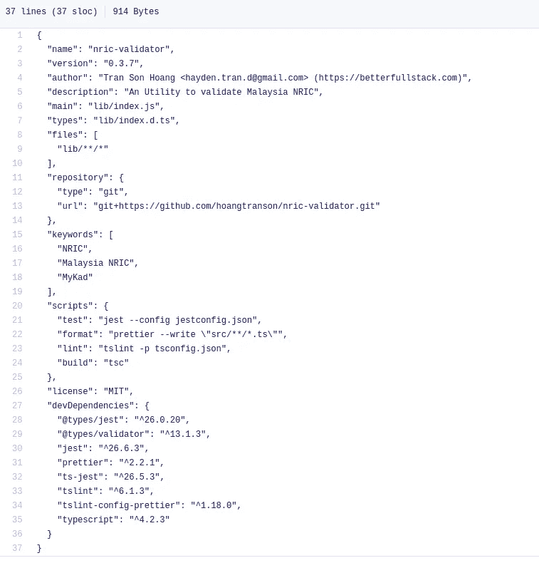

# 我如何将 JavaScript 库重构为 TypeScript

> 原文：<https://levelup.gitconnected.com/how-i-refactor-javascript-implemented-library-to-typescript-f7cec19ce5a8>

## Java Script 语言

## 使用 TypeScript、Jest、Prettier 和 Eslint 设置 npm 库的指南

由 [Lex Sirikiat](https://unsplash.com/@pundalex?utm_source=unsplash&utm_medium=referral&utm_content=creditCopyText) 在 [Unsplash](https://unsplash.com/s/photos/coffee?utm_source=unsplash&utm_medium=referral&utm_content=creditCopyText) 上拍摄的照片

在这个故事中，我将重构我的一个库( [nric-validator](https://www.npmjs.com/package/nric-validator) )。场景是用 JavaScript +艾娃(单元测试)写代码，结构不好。因此，我想重新构建这个 npm 库来归档这些要点:

1.  能够通过 [TypeScript](https://www.typescriptlang.org/) 编写并导出到 JavaScript。
2.  使用 [jest](https://jestjs.io/docs/en/getting-started) 进行单元测试。
3.  [更漂亮](https://prettier.io/) + [eslint](https://eslint.org/) 。
4.  我想将 TypeScript 生成的代码只导出到 npm。

以下是更改后的项目结构:

新的 nric-验证器项目结构

# 添加类型脚本支持

为了做到这一点，你需要做三件事:

1.  通过运行`npm i -D typescript`将 typescript 安装到`package.json`
2.  添加`tsconfig.json`

[https://github . com/Hoang transon/nric-validator/blob/master/ts config . JSON](https://github.com/hoangtranson/nric-validator/blob/master/tsconfig.json)

这将把代码从`src`构建到`lib`文件夹。

查看 TypeScript 的[文档](https://www.typescriptlang.org/docs/handbook/tsconfig-json.html)了解更多信息。

3.给`package.json`添加一个脚本来构建`"build": "tsc"`

注意:在这个故事中安装的所有库总是有`-D`，这意味着库将放入`devDependencies`。

# 添加 Jest 配置

如果你是一个超过一年的 JavaScript 开发者，你肯定会知道 Jest。

为了安装 Jest 编写单元测试，我们还需要做三件事:

1.  运行`npm i -D jest @types/jest ts-jest`
2.  创建文件`jestconfig.json`

[https://github . com/Hoang transon/nric-validator/blob/master/jest config . JSON](https://github.com/hoangtranson/nric-validator/blob/master/jestconfig.json)

在这个文件中，我们将指定在哪里寻找单元测试文件以及文件的模式，例如它应该包括 **.test.ts** 或 **.spec.ts** 。

3.向`package.json`添加脚本以运行测试`"test": "jest --config jestconfig.json"`

# 添加 beauty+Eslint

*   一个固执己见的代码格式化程序
*   **Eslint** :查找并修复你的 JavaScript 代码中的问题

## 较美丽

1.  安装`npm i -D prettier`
2.  添加更漂亮的配置文件`.prettierrc`

[https://github . com/Hoang transon/nric-validator/blob/master/。prettierrc](https://github.com/hoangtranson/nric-validator/blob/master/.prettierrc)

3.添加脚本`"format": "prettier --write \"src/**/*.ts""`

这意味着我们将格式化库的`src`文件夹中的每个文件。

## Tslint

1.  安装`npm i -D tslint`
2.  添加 tslint 配置文件`tslint.json`来告诉 Tslint 我们将遵循什么规则。

[https://github . com/Hoang transon/nric-validator/blob/master/ts lint . JSON](https://github.com/hoangtranson/nric-validator/blob/master/tslint.json)

3.添加脚本`"lint": "tslint -p tsconfig.json"`

## 用更漂亮的和 Tslint 不冲突？

安装`npm i -D tslint-config-prettier`。本库将禁用所有可能导致此类问题的冲突规则。Prettier 负责格式化，而 tslint 负责所有其他的事情。

现在，当我们运行`npm run lint`时，我们可以看到一些错误。

运行 npm 运行 lint 以检查库 nric-validator 的错误

# NPM 产品包的额外配置

这是我想补充的这个故事的有趣路径。

你是否曾经质疑过如何将构建文件夹中的代码只发布到 npm？

开始吧！我将添加如何仅向 npm 发布通过运行该库中的`npm run build`生成的`lib`。

为了发布库，我们将主要关注 3 个属性:

*   主要的
*   类型
*   文件

[https://github . com/Hoang transon/nric-validator/blob/master/package . JSON](https://github.com/hoangtranson/nric-validator/blob/master/package.json)

## [总管](https://docs.npmjs.com/cli/v7/configuring-npm/package-json#main)

*main 字段是一个模块 ID，它是程序的主要入口点。也就是说，如果您的包被命名为 foo，并且用户安装了它，然后确实需要(“foo”)，那么您的主模块的导出对象将被返回。*

这意味着当用户安装一个库时，会将它导入到他们的项目中，这个属性会告诉他们哪个是主文件。

## [类型](https://www.typescriptlang.org/docs/handbook/declaration-files/publishing.html)

这是打字稿里的。而不是原始的表单 npm 文档，这是通过运行 build 命令生成库的主要文件类型的地方。

## [文件](https://docs.npmjs.com/cli/v7/configuring-npm/package-json#files)

*可选的* `*files*` *字段是一个文件模式数组，描述当您的软件包作为依赖项安装时要包含的条目。*

这意味着当我们运行`npm publish`时，它将只发布属于`files`模式的文件。

所以，我们不需要把整个源代码发布给 npm。

# 摘要

我希望这篇文章对你有用！可以跟着我上[媒](https://medium.com/@transonhoang?source=post_page---------------------------)。我也在推特上。欢迎在下面的评论中留下任何问题。我很乐意帮忙！