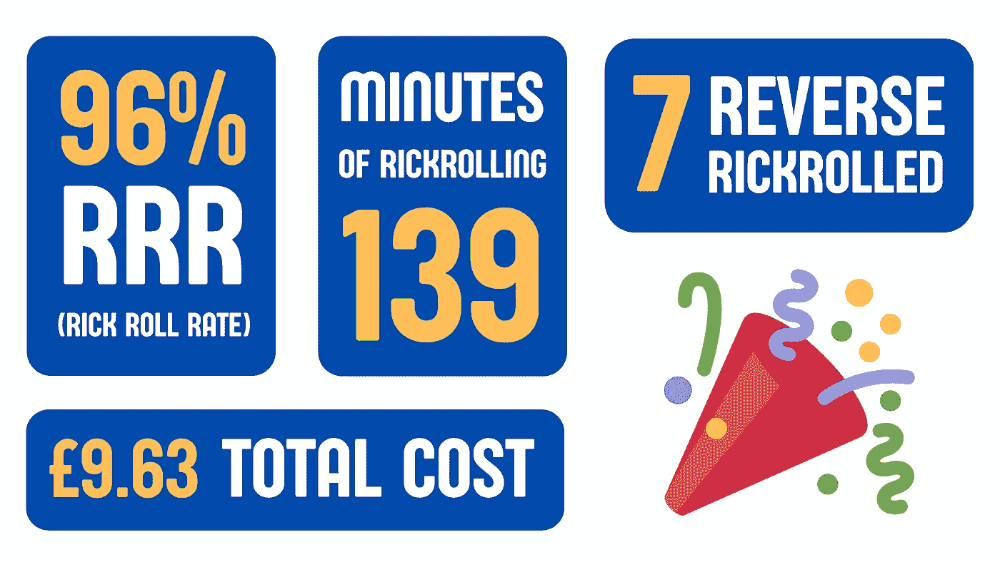

# 我是如何摇醒全班同学的

> 原文：<https://levelup.gitconnected.com/how-i-rick-rolled-my-entire-class-d9f8b4b58cd5>

## 疫情的故事

这是一个凉爽的春天早晨。鸟儿在啁啾，阳光灿烂。那天是 4 月 1 日，一切都很好。时候到了。

*我打开剧本，深吸了一口气。*

*3… 2… 1…我按了回车。*

世界各地的电话开始响起。空气中弥漫着里克·阿斯特利雄壮的声音，再次向所有愿意聆听的人表白他永恒的爱。

我猜他永远不会放弃。

我希望我们对 Rick Rolling 并不陌生——如果需要，这里有一个[概述](https://www.youtube.com/watch?v=dQw4w9WgXcQ)。

想象一下:我是一名程序员，我喜欢里克·阿斯特利的音乐，我被困在一个封闭的房间里，无聊透顶。一件事接着一件事，最后我让里克滚了全班。

我是这样做的:

## №1

第一个问题——我如何同时联系到数百名学生？

*   **邮件？**垃圾邮件——很可能以 IT 主管的 Zoom 电话结束。
*   **不和？**低 CTR。(点击率——这是一个营销术语)
*   **电话？**以前没见过。额外收获:我和班上几乎所有人都在 WhatsApp 群聊。

## №2

下一个问题——我如何给数百人打电话？

*   ****。**以编程方式打电话和发短信的必备工具。**

**我怎样才能不在钱包上烧个洞？**

*   **[**GitHub 教育包**](https://www.twilio.com/quest/github-education) **。Twilio 通过学生开发者包提供 50 美元的 API 积分。完美！****

## **№3**

**现在我需要得到电话号码。事实证明，WhatsApp 让收集数字变得有点困难——这是应该的。因为它很容易被滥用于数据收集目的，所以我不会分享这部分的代码。**

**但是假设我在一个文本文件中有一个数字列表:)**

## **№4**

**是时候写些代码了。需要注意的几点:**

*   **我按照这个 NodeJS [教程](https://www.twilio.com/docs/voice/quickstart/node)进行了 Twilio 账户设置和号码购买。**
*   **我设置了一个最大通话时长来帮助成本估算。**
*   **我在发送调用请求之间添加了一个延迟，以避免触及任何可能存在的 API 速率限制。**

**这是最终的脚本:**

## **№5**

**我想人们可能会试着回拨这个号码。为什么不找点乐子呢？**

**Twilio [再一次给了](https://www.twilio.com/docs/voice/quickstart/node#receive-and-respond-to-inbound-voice-calls-with-nodejs-and-express)惊喜——通过一些 webhook 和 [ngrok](https://ngrok.com/) 魔法，我现在可以接听来电了:**

## **№6**

**这一天终于到来了——4 月 1 日。我必须保持传统，对吗？我打开脚本，按下回车键。**

**几秒钟之内，群聊爆发了，混杂着困惑和娱乐。以下是我收到的一些热情洋溢的推荐:**

****

**现在是你们期待已久的时刻——成功了吗？**

****

**事实证明，如果电话没有被接听，它会留下语音邮件，从而提高风险滚动率！总的来说，我认为这是一个巨大的成功。**

## **结束语**

**纯属巧合的是，类似的事情以前也发生过——我想英雄所见略同。**

> **在早期，Twilio 首席执行官杰夫·劳森自己开发了一个 Rick Roll 应用程序，给[的人打恶作剧电话，并演示他们的产品。](https://techcrunch.com/2008/11/18/no-one-is-safe-from-the-rickroll-now/)**

**截至发稿时，Twilio 已经是一家市值 350 亿美元的上市公司。客户/投资者似乎很喜欢它！**

**在这方面，向 Twilio 和 Github Education 大声疾呼，没有他们，这些重要的工作都不可能完成。**

**如果你喜欢这个故事，请跟我来。相信我，你不会从其他人那里得到这个。**