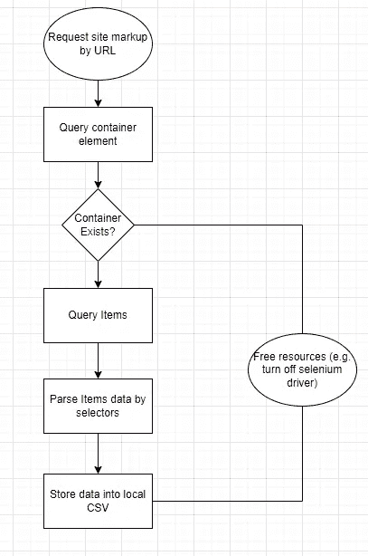

# 我如何用一个 python 脚本抓取大量网站

> 原文：<https://levelup.gitconnected.com/how-i-scrape-lots-of-sites-with-one-python-script-9fba09d5c9be>

## 代码可配置执行的能力。

你有没有想刮一个网站却又不想花钱买 Octoparse 这样的刮除工具？或者你只需要从网站上抓取几页，不想设置抓取脚本。在这篇博文中，我将向你展示我如何创建了一个工具，只用 python 和一点 docker 就能免费抓取 90%的网站。

***UPD:*** [*我是如何用一个 Python 脚本刮出很多站点的。Part 2 带 Docker*](https://destiq.medium.com/how-i-scrape-lots-of-sites-with-one-python-script-part-2-with-docker-9722d9348303) *可用！不过，我鼓励您阅读这篇文章，让您对脚本解决方案有一个大致的了解。*

> 你可以在这里找到我关于[网页抓取的代码](https://bit.ly/3omBlaG)，格式简单。


# 可以抓取的数据类型

大多数抓取机器人都是为了抓取**表格数据或列表**而创建的。就标记而言，表格和列表本质上是相同的。在一个容器中，它们保存的行的单元格中填充了值。因此脚本的算法是:



申请流程图

# 抓取网站的过程

为了扩展潜在的抓取目标列表，我决定使用 python 和 Selenium 的老式组合。虽然我很喜欢使用 Scrapy，并且在创建自己的解析脚本时深受其可配置设计的影响，但它在使用分页解析站点方面有一定的限制，所以我不得不选择已经提到的解决方案。

为了稳定起见，我还决定使用 chromedriver 的**dockered 版本。它在本地 Chrome 的更新过程中为我节省了一些痛苦，并且总是在那里，为我准备好，不像你在操作系统上安装的版本，它可能会被系统更新或新软件的安装搞砸。**

假设您的机器上已经运行了 docker 服务，那么用 chromedriver 启动一个新容器就像运行两个命令一样简单:

```
$ docker pull selenium/standalone-chrome$ docker run -d -p 4444:4444 -p 7900:7900 — shm-size=”2g” selenium/standalone-chrome
My python script for scraping websites 
```

这个帖子的核心——代码共享段落。首先，我将向您介绍助手方法:

这两个版本允许我在开发过程中需要调试时在 Selenium 的 dockerized 版本和本地版本之间切换。

还有一种直接的方法可以从我正在使用的 HTML 元素中提取文本。在不久的将来，我计划添加助手来自动提取链接和图像。如果对这个主题感兴趣，我可以分享一个脚本的更新版本。

这种基于硒的蜘蛛的本质在下面的要点中。请通读评论，如果有任何关于它如何工作的问题，请在评论中告诉我。

# 如何使用脚本抓取网站

在这一部分，我将演示如何使用这个脚本。首先，您需要创建一个 YAML 配置文件，然后运行您的蜘蛛。例如，让我们刮刮老好人 quotes.toscrape.com。它的配置示例如下所示:

首先，注意$p$是未来页码的占位符。这是因为大多数网站提供的页面内容在 URL 上有明显的变化。你的任务将是确定它是如何从一页到另一页的变化，并为你的蜘蛛配置这个掩码。

请注意，在数据选择器和数据列标题中，顺序很重要。例如，引号中的文本将从选择器中解析。正文”(咄)。

准备好配置后，可以使用以下命令执行它:

```
python -m spider -c “./configs/quotes.yaml” -o “./outputs/quotes/$(date +%Y-%m-%d).csv”
```

上面的 Bash 行从"。/configs/quotes.yaml "文件并将结果存储在 CSV 文件中。/outputs/quotes/*current _ date*。csv "

# 关于如何改善刮削过程的提示

*   使用代理

Selenium 允许传递代理 IP 地址，就像在构造函数中添加一个参数一样简单。在 StackOverflow 有一个完美的[答案，所以我不会尝试发明轮子。](https://stackoverflow.com/a/17093125/5601064)

*   对你正在解析的网站要温和

查看 robots.txt 并遵守。使用特定的超时运行您的请求，以平稳加载。使用调度在晚上或当你认为该网站的传入流量低时运行脚本。

# 群众的声音

敏捷抓取机器人最大的好处之一是，你不必为每个你想解析的站点编写一个新的机器人。你只需要一个好的脚本，可以针对每个网站或领域进行调整。回想一下今年到目前为止你所有的搜集项目——你希望我在我的剧本中加入什么？