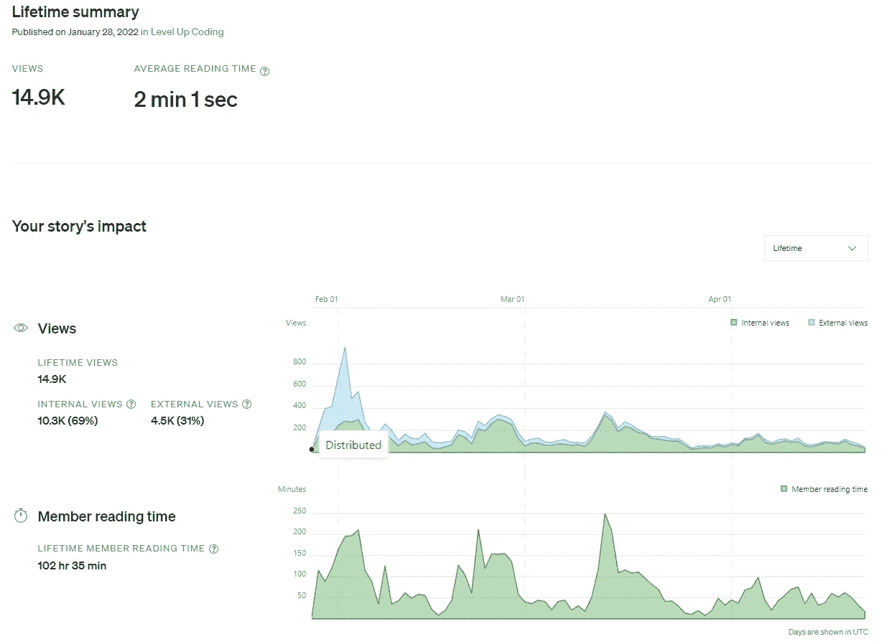

# 我如何用一个 Python 脚本抓取大量站点 Docker 第 2 部分

> 原文：<https://levelup.gitconnected.com/how-i-scrape-lots-of-sites-with-one-python-script-part-2-with-docker-9722d9348303>

今年我出版了我最成功的教程，现在我想让它更容易使用。


穆罕默德·拉赫马尼在 [Unsplash](https://unsplash.com/s/photos/docker?utm_source=unsplash&utm_medium=referral&utm_content=creditCopyText) 上的照片

一篇名为“[我如何用一个 python 脚本](/how-i-scrape-lots-of-sites-with-one-python-script-9fba09d5c9be)”的文章对于我卑微的写作生涯来说是一个巨大的成功。你自己看看:



“我如何用一个 python 脚本抓取大量网站”统计

这很自然，因为我给出了一个有用的脚本，可以根据个性化需求进行复制和定制。但是它能更方便用户吗？

在本文中，我将与您分享:

*   Github 存储库，您可以从中克隆它；
*   链接到 docker 容器，可以帮助你用一个命令刮东西；
*   一些用例以及如何处理它们；

> 你可以从我在[实用网络抓取](https://bit.ly/3omBlaG)上的其他博客文章中找到代码，格式简单。

# 回购和更新

拥有版本控制是对重构过程进行适当控制的必要条件。这也是比 Gist 脚本更方便的共享代码库的方式。

[](https://github.com/destilabs/webtric) [## GitHub-destilab/web tric

### 在 GitHub 上创建一个帐户，为 destilab/web tric 开发做出贡献。

github.com](https://github.com/destilabs/webtric) 

默认情况下，这个库允许你解析一个著名的抓取沙箱[quotes.toscrape.com](https://quotes.toscrape.com/)。为了更好地理解脚本以及如何根据自己的目的修改它，请[阅读第 1 部分](/how-i-scrape-lots-of-sites-with-one-python-script-9fba09d5c9be)。

您可以通过执行一个 shell 脚本立即在本地使用它:

```
./scripts/quotes.sh ./outputs/quotes local
```

或者

```
./scripts/quotes.sh ./outputs/quotes remote
```

我鼓励您阅读这个带有注释的脚本清单，以便更好地理解它的作用:

[](https://github.com/destilabs/webtric/blob/main/scripts/quotes.sh) [## 主网站上的 webtric/quotes.sh

### 此文件包含双向 Unicode 文本，其解释或编译可能与下面显示的不同…

github.com](https://github.com/destilabs/webtric/blob/main/scripts/quotes.sh) 

# 码头工人

虽然这个解决方案似乎对许多读者很有帮助，但我可以想象它在安装过程中并不是没有痛苦的。Chromedriver 是一个讨厌的工具，需要定期更新，并对操作系统配置的细微差别有“初学者+”级别的理解。另一方面，Docker 只需要知道运行容器的正确命令。

可能没有比显示其 docker-compose 文件更好的方式来描述这个容器了:

[](https://github.com/destilabs/webtric/blob/main/docker-compose.yml) [## 位于 main destilabs/webtric 的 webtric/docker-compose.yml

### 此时您不能执行该操作。您已使用另一个标签页或窗口登录。您已在另一个选项卡中注销，或者…

github.com](https://github.com/destilabs/webtric/blob/main/docker-compose.yml) 

让我们也一步一步地经历它:

Chromedriver 和 Selenium Hub 分别是独立的服务。它们会在相应的端口上启动并运行。在剧本中等到他们起床是必不可少的。

**Webtric** 服务(帖子的主角)将被动态构建，然后等待上面的两个服务。您将在日志中看到一些错误，但是它应该会赶上并开始解析。


Webtric 的预期输出

***运行 docker-compose 文件执行两个命令:***

```
export APP=./scripts/quotes.sh
docker-compose up
```

Jupyter 服务将被提升为可以立即访问解析的数据。输入 [http://localhost:8888/lab？token=webtric](http://localhost:8888/lab?token=webtric) 并创建一个新笔记本:


选择 Python 3 (ipykernel)

下面是一个简洁的脚本，用于访问“/home/webtric”卷中最后一个抓取的文件:

这是它最终的样子


你成功了！

# 用例

首先，我做这个项目只是为了好玩和学习，你也可以。从实用的角度来看，在 docker 中使用 Webtric 对于扩展是有用的，因为现在可以通过生成越来越多的容器来并行地进行扩展。记住刮擦的黄金法则:

> 对你正在解析的网站要温和

现在托管蜘蛛也更容易了，因为大多数现代云托管提供商对容器都很友好。我将准备一个关于如何在不久的将来让它工作的教程，敬请期待。

**免责声明:**这仍然是一个早期版本的工具，我希望从我的读者那里得到更多的反馈。如果你遇到了什么问题——不要犹豫，在这里或者 GitHub 上分享它，我会尽快解决它。拉请求也很受欢迎。