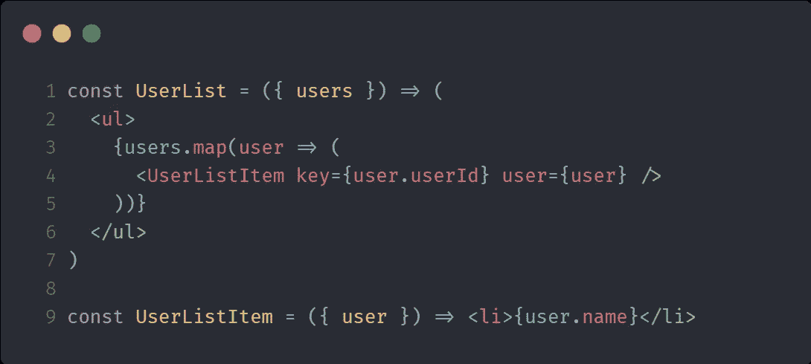

# 我如何构建我的 React 项目

> 原文：<https://levelup.gitconnected.com/how-i-structure-my-react-projects-34b35e18f91e>


[https://unsplash.com/photos/-nz-GTuvyBw](https://unsplash.com/photos/-nz-GTuvyBw)

自从我写了一篇关于如何构建 Node.js REST APIs 的[文章](https://larswaechter.dev/blog/nodejs-rest-api-structure/)已经有一段时间了。本文介绍了为 Node.js 应用程序设计组织良好且可维护的文件夹结构的方法。

所以今天我不想谈论 Node.js APIs，而是谈论 React 应用程序的架构，并再次回答上一篇文章中的同一个问题:

> *文件夹结构应该是什么样子？*

再说一遍:这个问题没有完美或 100%正确的答案，但互联网上有大量其他文章讨论这个问题。这种文件夹结构也部分基于它们中的多个。

值得一提的是，React 并没有真正告诉你如何组织你的项目，除了你应该避免过多的嵌套和过度思考。确切地说，他们说:([来源](https://reactjs.org/docs/faq-structure.html))

> React 对你如何将文件放入文件夹没有意见。也就是说，在生态系统中有一些常见的方法你可以考虑。

看一下链接的源代码，在那里你可以读到更多关于这些常用方法的内容。本文不再赘述。

下面的结构和架构对我来说已经被证明是可维护和可靠的。它可能会帮助你设计你自己的项目。请记住，以下架构是基于一个用 [create-react-app](https://github.com/facebook/create-react-app) 引导的应用程序，并且是用 JavaScript 编写的。

# 目录:根目录

```
react-project
├── node_modules
├── public
├── src
├── package.json
└── package-lock.json
```

这个结构没什么特别的，对你来说不应该是新的。这实际上是一个基本的[创建-反应-应用](https://github.com/facebook/create-react-app)设置。这里有趣的部分是本文所涉及的`src`文件夹的内容。

我们这里有什么？

```
react-project
├── api
├── components
├── i18n
├── modules
├── pages
├── stores
├── tests
├── utils
├── index.js
├── main.js
└── style.css
```

如您所见，该应用程序主要分为八个目录。从这里开始，我们将自上而下地浏览目录并检查每一个目录。

让我们从`api`目录开始。

# 目录:src/api

```
react-project
├── api
│   ├── services
│   │   ├── Job.js
│   │   ├── User.js
│   ├── auth.js
│   └── axios.js
```

`api`目录包含所有负责 React 应用程序(前端)和 API(后端)之间通信的服务。单个服务提供多种功能，使用 HTTP 协议从外部服务检索数据或将数据发送到外部服务。

`auth.js`提供认证功能，而`axios.js`包含一个 [axios](https://www.npmjs.com/package/axios) 实例，该实例包括用于传出 HTTP 请求和传入响应的拦截器。此外，刷新 jwt 的过程是在这里处理的。

# 目录:src/组件

```
react-project
├── components
│   ├── Job
│   │   ├── Description.js
│   │   └── Preview.js
│   └── User
│   │   ├── Card.js
│   │   ├── Create.js
│   │   └── List.js
```

如果你已经熟悉 React，你应该知道它主要是基于组件的。组件实际上是每个 React 应用程序的核心。整个应用程序，至少是表示视图，是由许多小组件组成的。

那么什么是组件呢？([来源](https://reactjs.org/docs/components-and-props.html))

> *组件让你将用户界面分割成独立的、可重用的部分，并孤立地考虑每一部分。*

想象一下，你有一个像 Twitter 或脸书这样的网站。大型网站由许多较小的部分(组件)组成，例如按钮、输入或小部件。这些碎片被放在一起，以建立更复杂和更大的。每个组件都有自己的生命周期和状态管理，因此您可以与其他组件共享组件的状态。

组件在应用程序中被多次重用，以避免开发人员编写多余的代码。

> [*【不重复自己(干)*](https://de.wikipedia.org/wiki/Don%E2%80%99t_repeat_yourself)

将代码库拆分成多个组件不仅仅是一件“反应”的事情。简化开发过程和后期维护是软件工程中的一种常见模式。

在 React 中，组件主要是一个简单的 JavaScript 函数或类。通常，我为每个单独的组件创建一个新文件。在一些罕见的情况下，我把它们(函数或类)组合成一个文件。想象一个呈现多个`UserListItem`元素的`UserList.js`组件:



用户列表&用户列表项组件

在这里，将两者合并到一个文件中是有意义的。此外，`UserListItem`甚至可能没有被除了`UserList`之外的任何其他组件使用。

除了组件本身，您还可以将它们的样式表或测试添加到这个目录中。

# 目录:src/i18n

```
react-project
├── i18n
│   ├── de.json
│   └── en.json
```

`i18n`代表国际化，负责应用程序的语言支持。包含的 JSON 文件基本上是包含固定常量作为键和相关翻译作为值的对象。

因此，每个语言文件的键应该是相同的。只有值(翻译)彼此不同。稍后，您可以通过编写自己的定制钩子或组件来轻松查询这些语言文件。

# 目录:src/模块

```
react-project
├── modules
│   ├── logger.js
│   └── session.js
```

这个目录包括一些全局模块，例如，这些模块可能用于日志记录或者作为浏览器的`LocalStorage`的包装器。

# 目录:src/pages

```
react-project
├── pages
│   ├── Home
│   │   ├── components
│   │   │   ├── Dashboard.js
│   │   │   └── Welcome.js
│   │   └── index.js
│   ├── Login.js
│   └── Profile.js
```

`pages`目录包括在应用程序中导航时访问的`react-router-dom`路径。这里，我们将多个组件收集到一个更大的组件中，以显示一个完整的页面视图。

一个页面可能包含它自己的`component`目录，其中包含只在这个页面上使用的“本地”组件。对于具有深度组件树的复杂页面，您可能想要检查一下 [React 上下文 API](https://reactjs.org/docs/context.html) ，这使得沿着树传递属性和处理全局“页面状态”更加容易。

# 目录:src/stores

```
react-project
├── stores
│   ├── language.js
│   └── user.js
```

该目录包括所有全局 React 状态，可以从应用程序中的任何组件访问这些状态。虽然 [Redux](https://react-redux.js.org/) 可能是管理全局状态最流行的解决方案，但我更喜欢使用 [zustand](https://github.com/pmndrs/zustand) 。它很容易上手，而且它的 API 非常简单。

# 目录:src/tests

```
react-project
├── tests
│   ├── language.test.js
│   └── utils.test.js
```

`tests`目录包括不属于某些组件的测试。例如，这可以是对算法实现的测试。此外，我验证并比较了我上面提到的语言文件的关键字，以确保我没有错过任何给定语言的翻译。

# 目录:src/utils

```
react-project
├── utils
│   ├── hooks
│   │   ├── useChat.js
│   │   ├── useOutsideAlerter.js
│   │   ├── useToast.js
│   ├── providers
│   │   ├── HomeContextProvider.js
│   │   ├── ToastContextProvider.js
│   ├── colors.js
│   ├── constants.js
│   ├── index.js
```

这里，我们有一堆实用工具，比如:定制钩子、上下文提供者、常量和帮助函数。请随意在此添加更多内容。

# 一起

最后但同样重要的是，项目结构的完整概述:

```
react-project
├── api
│   ├── services
│   │   ├── Job.js
│   │   ├── User.js
│   ├── auth.js
│   └── axios.js
├── components
│   ├── Job
│   │   ├── Description.js
│   │   └── Preview.js
│   └── User
│   │   ├── Card.js
│   │   ├── Create.js
│   │   └── List.js
├── i18n
│   ├── de.json
│   └── en.json
├── modules
│   ├── logger.js
│   └── session.js
├── pages
│   ├── Home
│   │   ├── components
│   │   │   ├── Dashboard.js
│   │   │   └── Welcome.js
│   │   └── index.js
│   ├── Login.js
│   └── Profile.js
├── stores
│   ├── language.js
│   └── user.js
├── tests
│   ├── language.test.js
│   └── utils.test.js
├── utils
│   ├── hooks
│   │   ├── useChat.js
│   │   ├── useOutsideAlerter.js
│   │   ├── useToast.js
│   ├── providers
│   │   ├── HomeContextProvider.js
│   │   ├── ToastContextProvider.js
│   ├── colors.js
│   ├── constants.js
│   ├── index.js
├── index.js
├── main.js
└── style.css
```

就是这样！我希望这对不知道如何构建 React 应用程序或不知道如何开始的人有一点帮助。请随意提出任何建议。

**这篇文章最初发表在我的博客上。看一看。**

 [## 我如何构建我的 React 项目

### 自从我写了一篇关于如何构建 Node.js REST APIs 的文章已经有一段时间了。的…

拉斯瓦切特.德夫](https://larswaechter.dev/blog/react-project-structure/)