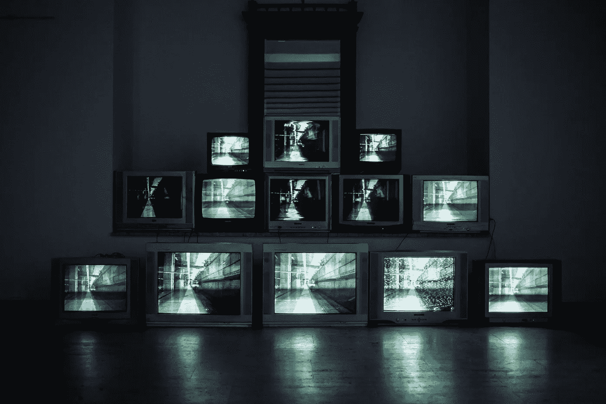

# 我如何用我的 32 英寸显示器换取更高的软件质量

> 原文：<https://levelup.gitconnected.com/how-i-traded-my-32-inch-display-for-more-software-quality-7828ffce28a9>

## 从使用多显示器到在我的 13 英寸笔记本电脑屏幕上开发的转变

几年前，出现了需要无限数量显示器的趋势。每个人都希望桌面看起来像华尔街的交易台。

照片由 [Murai 拍摄。hr](https://unsplash.com/@murai?utm_source=unsplash&utm_medium=referral&utm_content=creditCopyText) on [Unsplash](https://unsplash.com/s/photos/displays?utm_source=unsplash&utm_medium=referral&utm_content=creditCopyText)

我在 2017 年达到了个人巅峰，当时我使用了三个 27 英寸的显示器(这需要一个非常昂贵的适配器，因为我当时的 Mac 只能支持两个这样大小的显示器)。

从那以后，我生活中的显示器数量不断下降，先是卖掉了三个显示器中的一个，然后用剩下的两个换了一个弯曲的 32 英寸，最后在 2020 年才转移到我的笔记本电脑显示器上(先是 2020 年的 16 英寸，到 2021 年只有 13 英寸)。

# 我的生产力和注意力

在开发过程中，人们感觉需要同时看到网站、模拟器、IDE、Spotify、网飞、Finder 和终端。在我的三屏设置中，中间有一个是水平的，显示模拟器、网页和代码编写的任何结果。左边的是垂直站立，显示我的 IDE，彩色文本伸向天空 62 厘米。右边的也是垂直的，显示了 StackOverflow 上的 10 个响应，没有滚动，还有一个终端窗口。

## 多任务和信息超载的问题。

在这种环境下工作时，你*会觉得*很有效率。当退一步或回顾今天，这是一个可怕的场景。一次看到所有的信息意味着我会持续分心。很难进入专注发展或工作的适当模式。当你晚上躺在床上时，你不会试图同时看《网飞》、看书和写一篇中等水平的文章。那么，为什么要在白天这样做呢？

## 做一件事，做对一件事

我知道，我已经收到了很多关于只用笔记本电脑工作的反馈。像“只有显示，你总是必须在编码和模拟器之间切换！”。是的，但是这有一个很大的好处。不要在 10 秒的迭代中构建和模拟，首先，完成你正在看的任务(在全聚焦模式下)，然后切换到模拟器并测试它(在全聚焦模式下)。

互联网上的阅读帮助论坛也是如此。首先，试着解决问题。如果你不能，试着定义好这个问题，然后去谷歌开始寻找答案。回到 2017 年，搜索问题看起来像“app 崩溃 Xcode，怎么了？”。而且没有一个合适的问题定义，你就找不到正确的答案(或者至少在没有搜索数小时和测试 30 个理论的情况下是找不到的)。

## 代码的可视性

是的，你在 13 英寸的笔记本电脑屏幕上一次能看到的代码量是有限的。但是如果你应用 Bob 叔叔的 [Clean Code](http://cleancoder.com/files/cleanCodeCourse.md) 的规则，你正在处理的每个函数都将适合屏幕(众所周知的规则是每个函数 15 到 60 行代码)。如果你不能在 13 英寸的屏幕上阅读任何给定的功能，你就做错了，是时候进行重构了。

## 利用键盘快捷键

一个快速提示，有很多键盘快捷键，从在窗口之间切换到在两个应用程序之间快速创建分屏，最小化一个应用程序，从 Spotlight 打开一个应用程序，或者在 Chrome 标签之间切换。一旦你掌握了这些快捷方式，你将在信息和工作之间快速切换，不再需要所有的信息都是可见的。

*感谢阅读。我很想听听你的设置，以及你是否已经从光墙走到只有一个显示器的那一步。*