# 我如何训练一个机器学习模型来识别狗的品种

> 原文：<https://levelup.gitconnected.com/how-i-trained-a-machine-learning-model-to-identify-dog-breeds-7f3e8d406d35>

这篇博文会告诉你所有你需要知道的自己动手做！

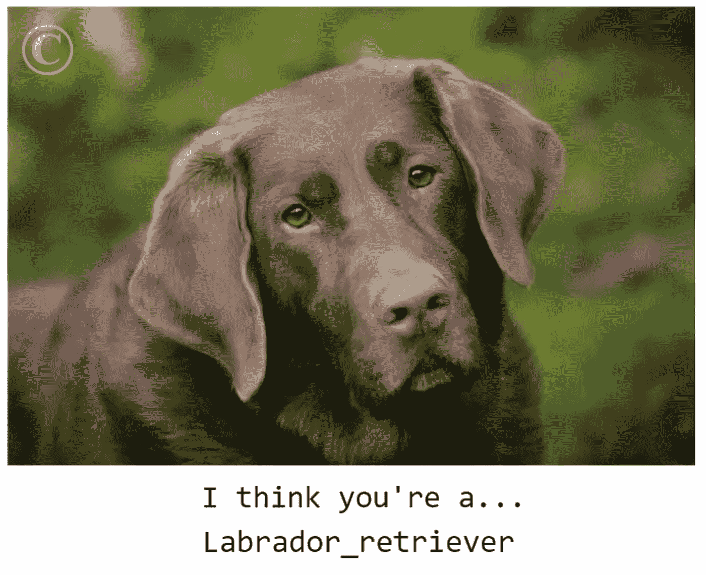

模型做出的示例预测

用于这个项目的代码可以在 Github 库中找到。

骨架代码由 Udacity 提供，作为数据科学 Nanodegree 的一部分。

# 项目定义

在这个项目中，我们希望创建一个深度学习模型，它可以接收一张狗的照片，并识别它是什么品种的狗。这是一个有趣的问题，因为如果成功，它可能有助于减少对大量未标记图像数据进行分类所需的人工工作量。

为了确定我们的模型是否成功，我们将考察我们的模型对未知数据的准确性。我们的模型将根据大部分数据进行训练，并尝试在测试数据中预测狗的品种。我们的精确度可以定义为:

(正确预测数)/(预测总数)

# 数据分析

我们可以访问包含 133 个不同品种的 8351 张狗图片的标签数据集。确保每个品种都有相似数量的图像是很重要的。下面的直方图显示了每个品种的图片数量。

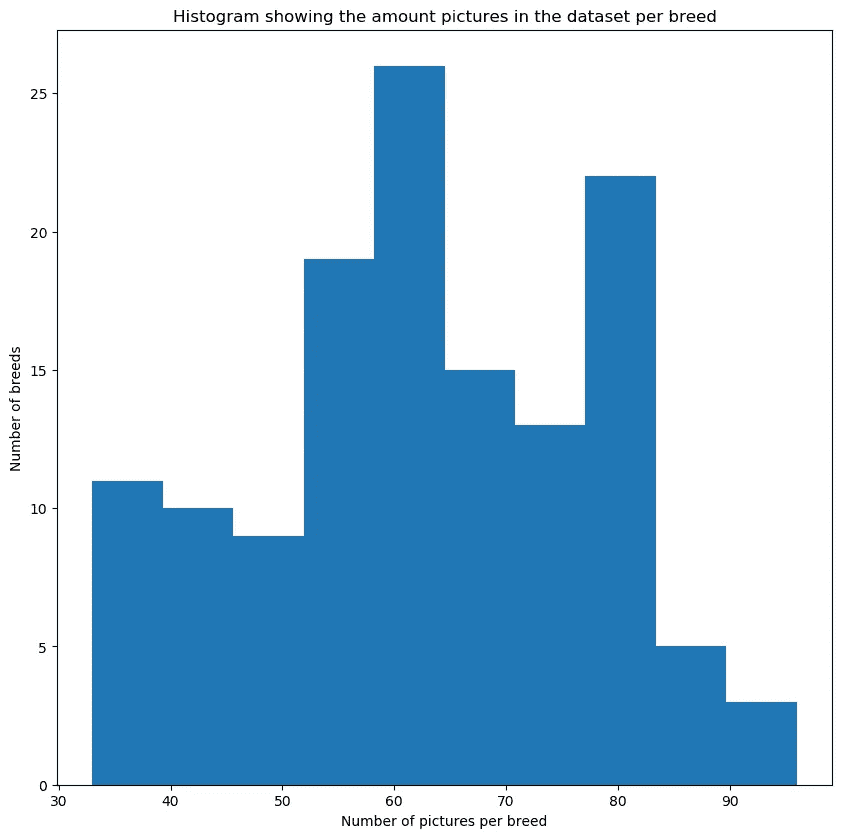

所有品种都有 33 到 96 张图片。理想情况下，我们希望所有的品种都有相同数量的照片，但是对于我们的目的来说，这种分布是令人满意的。

# 数据预处理

我们的图像需要转换成深度学习模型可以解释的数字格式。为此，我们执行以下步骤:

*   从文件路径加载图像，并将其大小调整为 224 x 224 像素。
*   将其转换为形状为(224，224，3)的 3D 张量，其中 3 个值表示像素的 RGB 值。
*   将其转换为形状为(1，224，224，3)的 4D 张量，以便深度学习模型可以正确解释它。

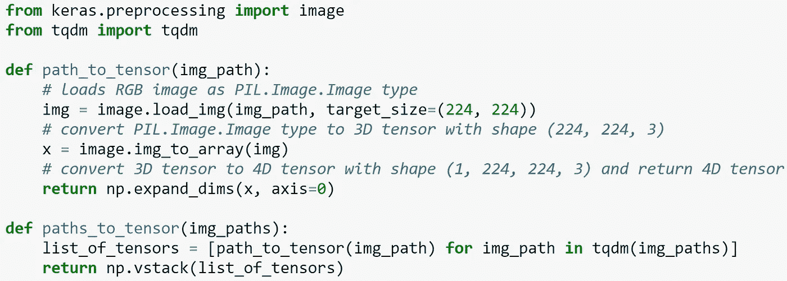

# 履行

在这个项目中，我们研究了两种方法。首先，我们从头开始创建自己的 CNN 来对狗的品种进行分类。在此之后，我们采用 ResNet50 预训练模型，并应用迁移学习来允许它从我们的数据集中对狗的品种进行分类。

## CNN 从零开始

我们首先通过运行以下代码初始化我们的模型:

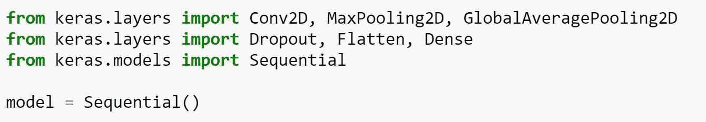

一旦完成了这些，我们就可以使用“model.add(…)”向我们的深度学习模型添加层。我们遵循 Udacity 笔记本中的模型示例，代码如下:

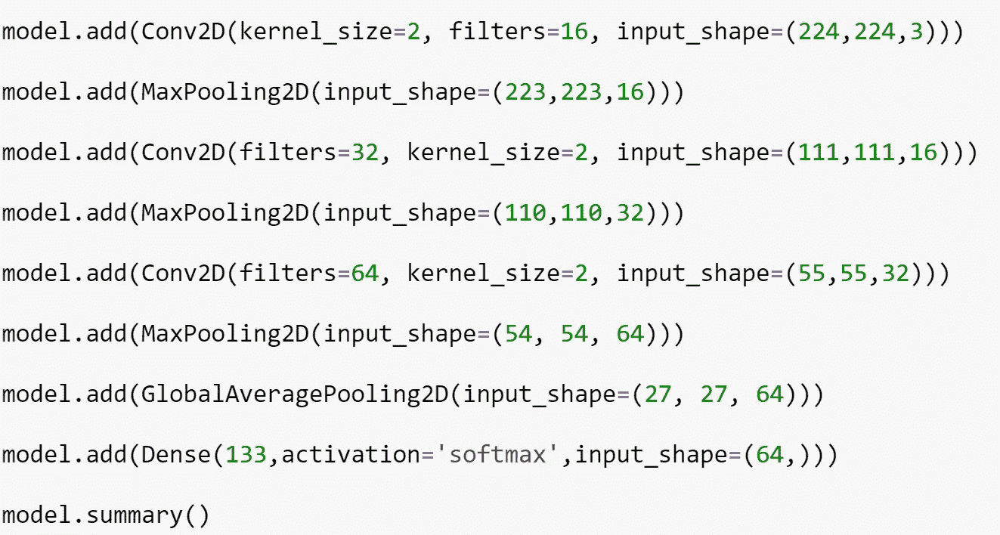

这给我们留下了下面的模型总结:

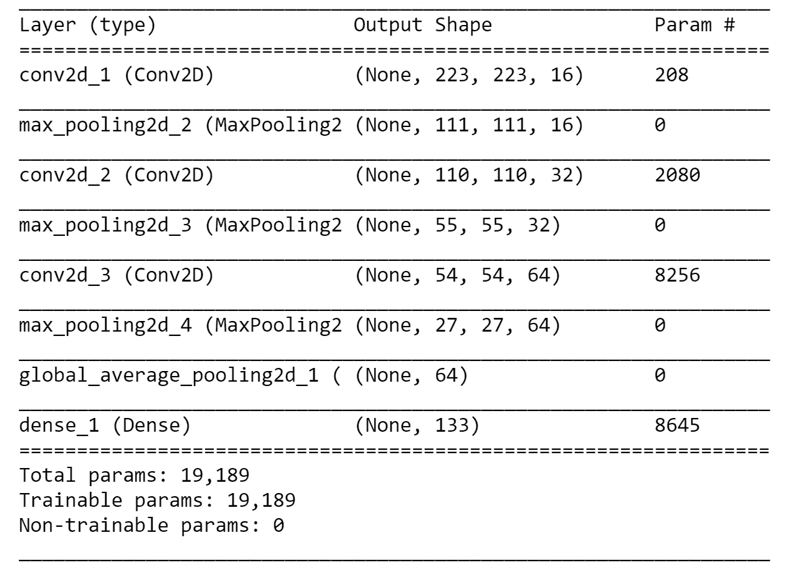

我们这里有四种不同的图层类型，其中一些已经使用了多次。

*   conv2d 是一个标准的卷积层，它采用一组平方值，并将每个值乘以一个核值，以给出一个单一数字的输出，供下一层使用。这是从图像中提取特征的主要方法，因为可以用它来检测边缘和形状。
*   max_pooling_2d 通过从一组方形像素中获取最大值来移除小值。
*   global_average_pooling2d 取 27 x 27 x 64 并取 27 x 27 切片的平均值，以给出形状为(1，1，64)的张量，该张量被整形为大小为 64 的 1D 向量。这用于显著减少训练模型所需的参数数量，而不会丢失太多信息
*   最后，我们应用一个稠密层，它给出了我们的最终预测。我们使用输出大小为 133 的“softmax”激活。这将给我们 133 个值，加起来等于 1，代表 133 个品种中的每一个成为照片中所示品种的预测概率。

随着我们的模型的创建，我们对其进行了 5 个时期的训练。一个时期是数据集的完整运行，因此模型将运行所有训练数据 5 次，并将最佳权重保存在 hdf5 文件中。

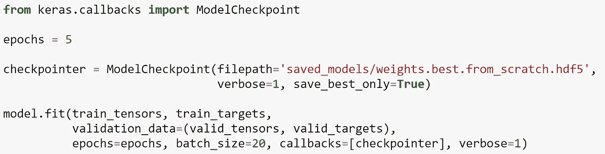

为了评估模型，我们通过模型运行测试照片，看看哪个品种被预测，并将其与照片的真实情况进行比较。我们使用 argmax 函数取最大的预测概率来决定所选的品种。

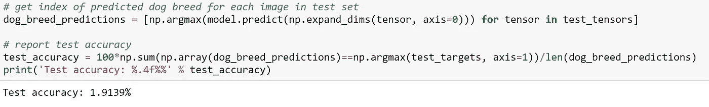

考虑到有 133 种不同的品种，我们的基线模型仅仅猜测将会给我们 0.75%的准确率。我们得到了 1.9%的精度，这无疑是一个进步，但不是很好。

这种方法的主要缺点是我们必须花费大量的时间来设计和训练一个模型。在 Udacity 提供的 GPU 上训练这个模型只需要 2 分钟左右。如果有更多的时间来测试不同的层组合，调整参数和运行更复杂的模型，我们将能够获得更高的分数。

## 迁移学习

但是，既然已经有非常好的模式可以利用，为什么还要付出那么多努力呢？迁移学习允许我们采用更通用的图像识别模型，并将其应用于我们特定的数据集和用例。这是一个关键的方法，可以让人们不费吹灰之力就训练出高质量的深度学习模型，所以让我们试一试。

我们首先下载 ResNet50 模型，并获得用于训练或建模的瓶颈特征。我们使用与前面相同的命令实例化我们的模型，并向其中添加一个 GlobalAveragePooling2D 层。这将输入数据的要素转换为一个矢量，该矢量可输入到进行预测的完全连接的密集图层中。

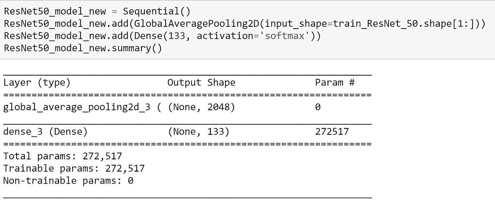

我们训练这个迁移学习模型类似于我们之前的模型 20 个时期。

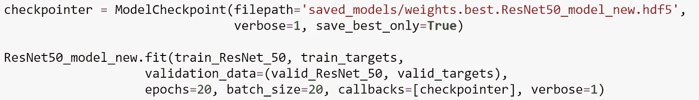

这给了我们一个难以置信的提高，准确率达到了 79.6%！

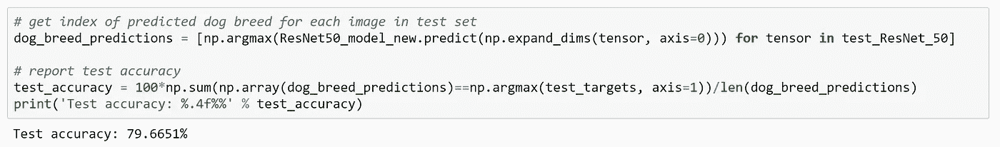

利用这一点，我创建了一个算法，可以识别是否有狗或人脸，然后尝试识别出现的是什么品种(或人类看起来最像什么品种)。下面是一些输出的例子。

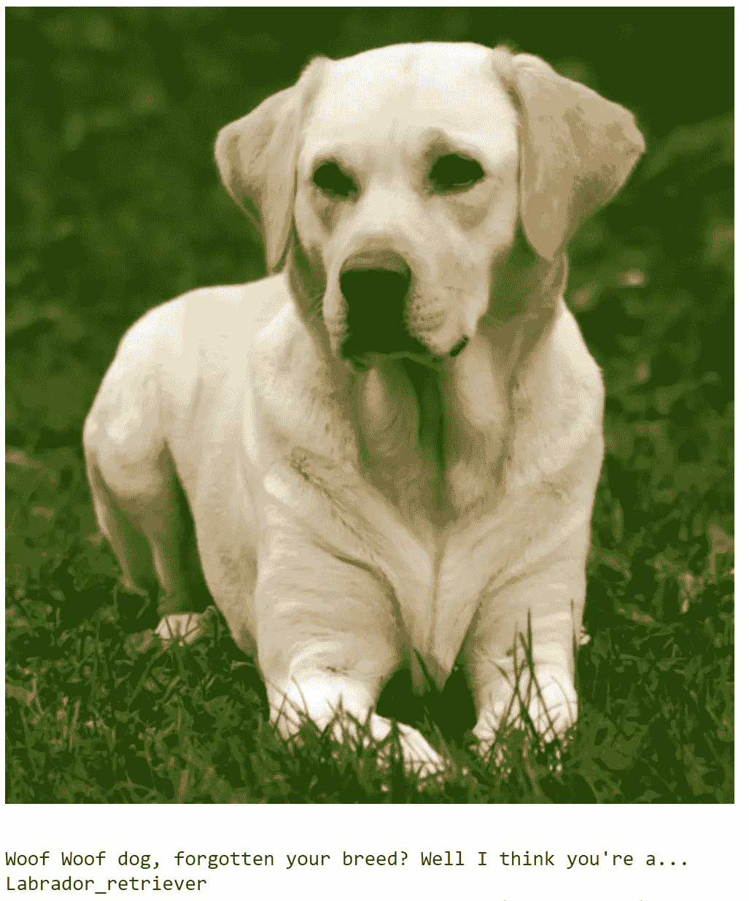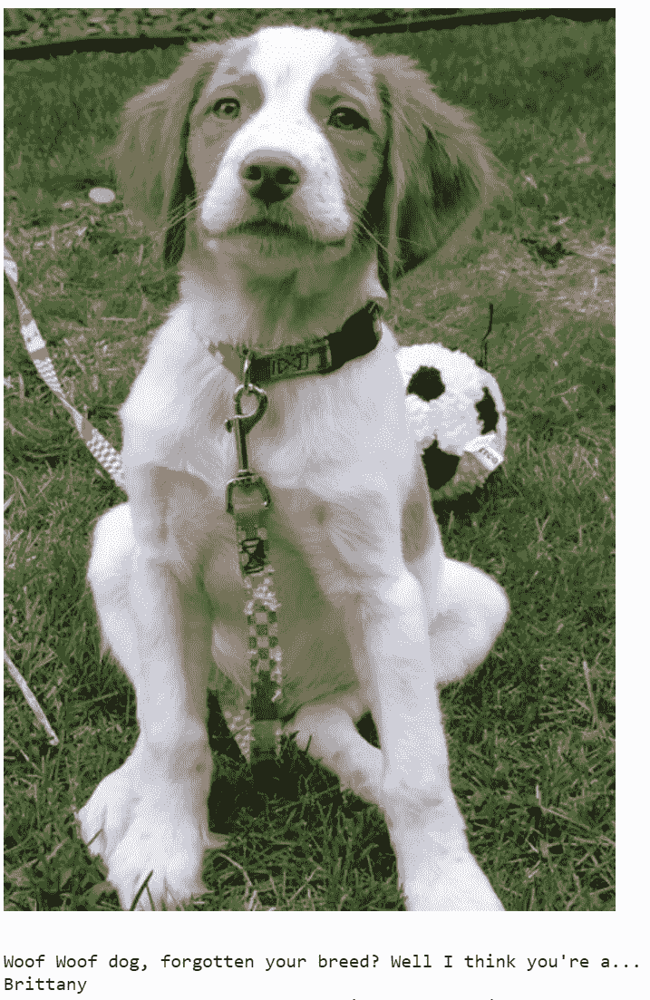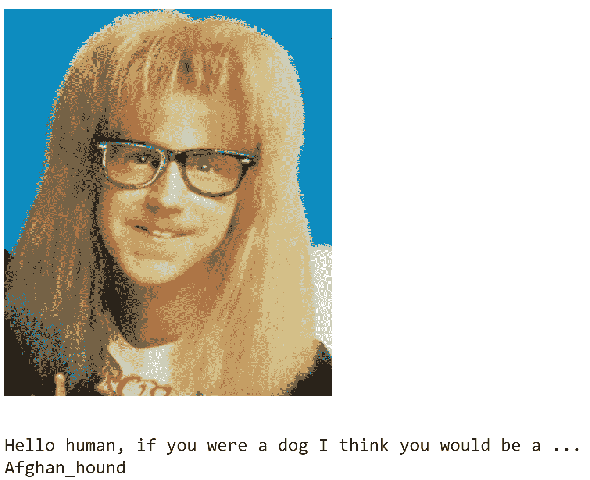

# 结论

总的来说，我认为迁移学习模式的结果非常好。深度学习是一个非常有趣的话题，因为有太多不同的方法可以添加到模型中，很难找到完美的组合。

如果有更多的时间，我会努力改进以下几点:

*   增加训练时间，该模型在 Udacity GPU 上的训练时间约为 2 分钟。通过增加历元数来花费更多的时间训练可以提高其准确性。
*   通过添加更多层或更复杂的层(如 Dropout)来增加模型的复杂性。这可以允许模型创建更好的关联。
*   扩充数据将为我们提供更多样化的训练数据集，这将使模型更好地泛化。