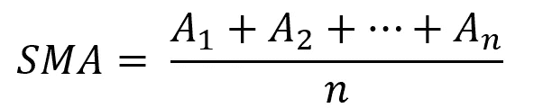
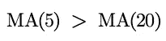
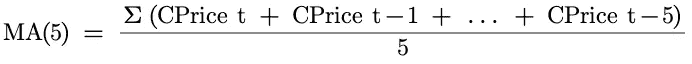
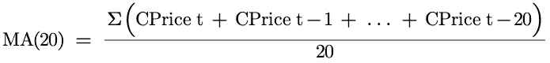
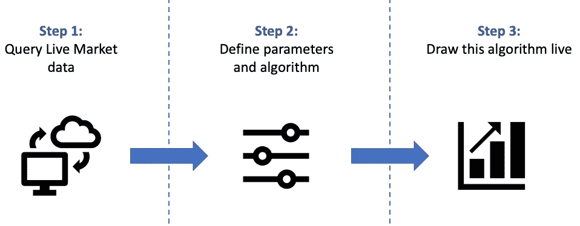
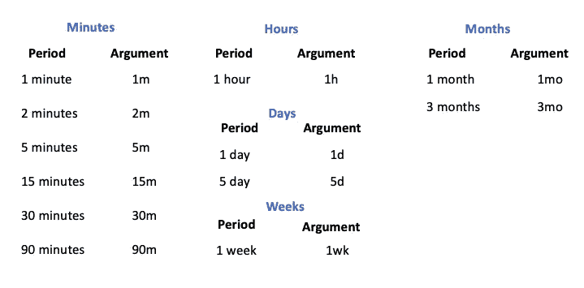
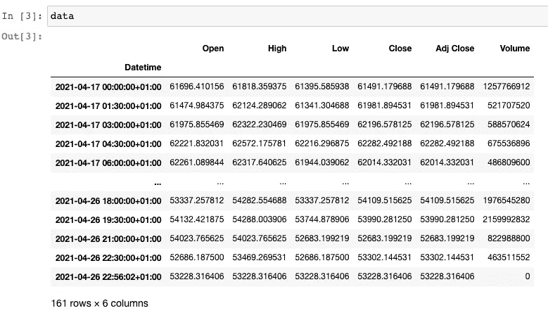
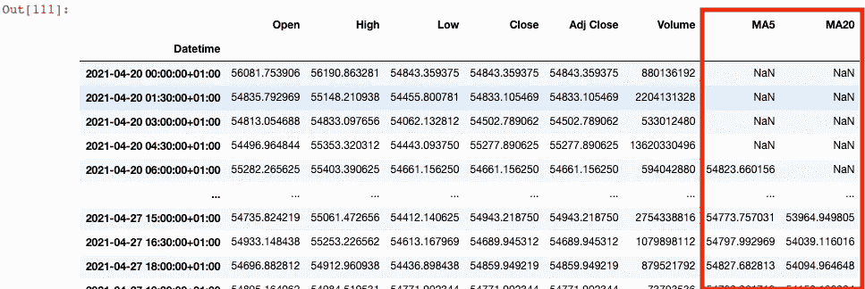
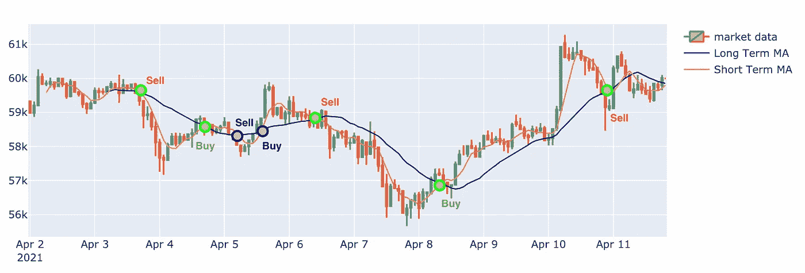

# 我如何利用数学、算法和 Python 让我的比特币回报率翻了三倍

> 原文：<https://levelup.gitconnected.com/how-i-tripled-my-return-on-bitcoin-using-mathematics-algorithms-and-python-347edd9b5625>

## 面向交易者的 Python

## 利用黄金线算法，我预测了比特币、Ripple、以太坊和 Dogecoin 的价格演变。完整的 Python 代码共享。


作者照片。

他的文章将会与平常略有不同。对于那些在 Medium 或 [Youtube](https://www.youtube.com/c/AlgorithmicTradingbySajid) 上关注我几个月的人来说，你已经看到了不同的文章或视频，在这些文章或视频中，我用数学、科学和概率来帮助预测市场。

最近，在看到大肆宣传和强劲的购买指标后，我开始对加密货币感兴趣。但是在深入挖掘并开始讨论理论和编码之前，让我们先了解一些背景知识，看看到目前为止我们已经讨论了哪些内容。

## 开始前

在之前的一篇文章中，我们在标准普尔 500(美国股票交易所指数)上测试了一个著名的数学技术。我们发现当你想在**美国市场**交易时，布林线理论是多么的准确和棒。

[](https://medium.com/analytics-vidhya/python-i-have-tested-a-trading-mathematical-technic-in-realtime-658a80381151) [## Python:我已经测试了实时交易数学技术。

### 我用 Python 实时测试了一个著名的预测市场的数学技术的实现…

medium.com](https://medium.com/analytics-vidhya/python-i-have-tested-a-trading-mathematical-technic-in-realtime-658a80381151) 

即使所有的交易都不完美，这个以前的算法给我们带来了严肃的趋势指标来预测市场的运动。

然而，经过回溯测试，我注意到约翰·布林格在上面文章中提出的理论并不能准确预测加密货币。

这就是为什么在进一步的测试和阅读之后，弹出了一个病毒式的算法:**黄金十字 vs 死亡十字**。

这就是为什么我测试了几个星期，这是我的总结。

在探索现场测试的编码脚本之前，让我们开始挖掘一些基础科学和理论问题，看看这些交易信号是如何计算的。

# 黄金十字，死亡十字？

对于有金融背景的人来说，黄金交叉和死亡交叉指标是**均线的**衍生**，**也叫交叉指标。

例如移动平均线，这两个交叉指标中的每一个都将通过使用下面的公式对某个时间段的市场收盘价进行平均来计算。



在上面的公式中，n 对应于使用的周期数。

这个概念将包括结合两个移动平均线(短期和长期)来获得加密货币的趋势。当短期移动平均线**超过**或**超过长期移动平均线**时，就会出现买入或卖出信号。

从数学上讲，如果你选择 5 个周期的短期移动平均线和 20 个周期的长期移动平均线，我们将通过以下条件得到我们的**买入**信号:



其中 MA(5)和 MA(20)明显等于:



***CPrice*** *对应收盘价值。例如，目前比特币的价格为 49670 美元。而* ***t*** *是定义的时间段。(本文末尾教程视频内有更多解释)。*

这些交叉指标是等式的一部分，有助于检测所研究的加密货币的全球趋势。这些 CI(交叉指标)通常被全球多个交易商和基金用来定义**支撑位、** **阻力位、** **止损位**和**目标**，并了解潜在趋势。

现在我们已经了解了一些背景知识，让我们开始测试，看看它们如何帮助预测市场。

> 如果您想以同样的速度编码，需要预先安装一些配置和软件包。

再者，如果你太心急，想知道如何快速实施这个策略，可以直接看本文末尾的录音。我正在现场应用这个策略，你可以自己看看结果:)。

我记录了自己对理论、代码的解释，并给出了开发过程中的额外提示。可以自己在家涂。

# 先决条件:

首先，如果你想跟踪我的进度，在开始之前，你需要在你的机器上安装一个 **Python 3** 版本和以下软件包:

*   熊猫
*   **数字价格**
*   **金融**
*   **plottly**(*不是强制的，但对 plotting* 有用)

如果这些软件包中的任何一个尚未安装，您可以使用 pip 命令，如下所示。

```
pip install yfinance
pip install plotly
```

一旦您确保安装了以下软件包，我们就可以开始讨论我们的数据管道和数据模型了。

## 数据管道和建模:

既然我们已经确认上面的包已经安装在我们的机器中，我们就可以定义数据处理了。

数据模型将分为 3 个不同的步骤。



**首先**我们将使用**雅虎金融 API** 查询实时加密货币的数据。

**秒**，定义一段时间，为我们计算的字段创建新列，并每秒更新这些值。

**第三个**，现场绘制这个图形，检查我们的信号是否准确。

在这篇文章中，我不会过多地谈论关于代码和 API 的细节；阅读下面的文章，你可以找到更多关于如何获得 live market 的信息:

[](https://towardsdatascience.com/python-how-to-get-live-market-data-less-than-0-1-second-lag-c85ee280ed93) [## Python:如何获取实时市场数据(滞后小于 0.1 秒)。

### 这篇文章会有点特别。我将测试雅虎财经 Python API 的最新版本…

towardsdatascience.com](https://towardsdatascience.com/python-how-to-get-live-market-data-less-than-0-1-second-lag-c85ee280ed93) 

现在我们已经有了一个清晰的模型计划，我们可以开始编码了！

> ***如果你已经有了使用 Python 的经验，可以跳到第二步。第一步包括导入包。***

# 步骤 1:导入所需的包。

第一步将包括导入必要的包。

首先，您将使用以下代码行导入先前安装的软件包:

上面几行是查询要导入的 numpy，pandas，yfinance & plotly。

一旦我们成立了，让我们进行下一步。

既然库已经导入，我们现在可以导入加密货币的数据了。

# 第二步:获取实时市场数据。

既然已经上传了所需的不同包。我们将使用一对**BTC-美元**作为例子，通过 Yahoo Finance API 设置我们的导入。

加密货币的选择列表可以像货币一样扩展。

例如，如果你来自**印度**或**加拿大**，你可以使用**印度卢比**或**CAD；两个**都将正常工作，如果你想要的是波纹或以太坊数据也是如此。

> *为了获得关于如何获得正确报价器的完整解释，我邀请您看一看本文末尾的代码解释视频。*

让我们回到我们的 API 结构。

Yahoo Finance API 将需要三个强制参数，顺序如下:

*   跑马灯 *(1)*
*   *开始日期+结束日期*或期间 *(2)*
*   音程 *(3)*

对于我们的例子，股票代码 *(* ***自变量 1*** *)* 将是一对**BTC-美元**。此外，对于此示例，我们将选择最后 7 天**作为期间 *(* ***自变量 2*** *)* 。并设置了区间 *(* ***自变量 3****)***90 分钟**。**

**要调用您的数据，您必须使用以下结构:**

****

**上面描述了获取我们感兴趣的数据的结构。**

**在继续之前，我将带来一些关于第三个论点的细节( ***区间*** )。**

# **快速查找可能的间隔**

**我想给你一个快速拍摄的不同间隔，你可以使用雅虎财经 API 设置。**

**下面详细列出了可能需要的间隔的完整列表:**

****

**上面列出了可以选择的不同间隔。**

**现在我们已经定义了三个参数，让我们执行查询并检查输出:**

**上面一行将请求 BTC-美元到雅虎金融 API。**

**下面是您必须得到的输出:**

****

**90 分钟间隔的市场输出**

**现在，我们已经下载并存储了数据，我们可以继续定义我们的移动平均线，买入和卖出信号。**

**如果你想了解更多的信息，你可以点击下面的链接:**

**[](https://www.udemy.com/course/python-for-algorithmic-trading/?couponCode=LOVE_SEPTEMBER) [## 2021 年:一天学会算法交易

### 你好，我是赛义德·赫萨尼。我一直在伦敦的多家银行担任数据科学家，是一名…

www.udemy.com](https://www.udemy.com/course/python-for-algorithmic-trading/?couponCode=LOVE_SEPTEMBER) 

# 三。部署我们的算法

现在，我们的实时数据已经下载并存储在一个名为“数据”的变量中。下一步包括计算我们的移动平均线和设置我们的买卖信号。

我们需要创建以下计算字段:

*   **马(5)**
*   【马(20)】

为此，我们将使用 Python 中包含的滚动函数来获得 n 个最新周期的平均值。关于 MA(5)，我们将在最后 90 分钟内应用我们的策略。这意味着我们将计算最近 7 小时 30 分钟的平均收盘价(5 乘以 90 分钟)。


对于 MA(20 ),我们将使用滚动函数，但我们将计算 20 个最新周期的平均值，而不是计算 5 个最新的 90 分钟周期。

所以，让我们用 Python 来编码:

上面这条线是用 Python 滚动函数得到的移动平均线。

上面的代码一旦执行，将为您的数据框创建 2 个新列，如下所示:



现在，您已经定义了您的波段，必须创建 2 个额外的列。

我们终于可以部署并测试我们的策略了。

# 实时绘制这个图表

我们计划的最后一步是绘制我们的数据，并检查我们是否能预测市场运动。我在下面的视频中现场录制了这一部分:

这个视频是编码黄金十字策略的一步一步的教程。

嘣！我们成功了。

如果你不能播放视频，请观看结果并听听我的评论。这里有一个你绘制图表后应该有的样本。

在下图中，我用绿色表示好的预测，黑色表示错误的预测。



有买入和卖出信号的预期输出

此外，我已经上传了上面视频中描述的完整 Python 脚本，您现在可以在家开发它了:** 

# **最终想法**

**即使并非所有的交易都是完美的，有时我们倾向于滞后进入或离开市场，但在比特币稳定的时期，黄金交叉策略一直是提高我们利润的有用策略。**

**经过短暂的计算，并使用我的个人经纪人的滑点费，我们将在一周内获得**7.1%**的回报，而比特币在同一时期稳定在**1.7%**左右。**

**这一直是个很有意思的概念，探讨**抵抗**和**支持** **级**的实况。这是我经常和我的同事和朋友讨论的一个话题，在一个真实的案例上开发它更有见地。**

**这是一次见识理论如何在现实中发挥作用的经历。**

**请随时提供反馈，并询问您是否有任何问题；我会尽全力帮你解锁。**

**感谢你的关注。**

**编码快乐！**

**赛义德**

# **来源和进一步了解算法交易:**

**[](https://www.udemy.com/course/python-for-algorithmic-trading/?couponCode=LOVE_SEPTEMBER) [## 2021 年:一天学会算法交易

### 你好，我是赛义德·赫萨尼。我一直在伦敦的多家银行担任数据科学家，是一名…

www.udemy.com](https://www.udemy.com/course/python-for-algorithmic-trading/?couponCode=LOVE_SEPTEMBER)** 

# **之前必须阅读的文章:**

****算法交易 A 到 Z 的 Python:****

**[](https://medium.com/analytics-vidhya/python-i-have-tested-a-trading-mathematical-technic-in-realtime-658a80381151) [## Python:我已经测试了实时交易数学技术。

### 我用 Python 实时测试了一个著名的预测市场的数学技术的实现…

medium.com](https://medium.com/analytics-vidhya/python-i-have-tested-a-trading-mathematical-technic-in-realtime-658a80381151) 

**如何获取实时市场数据:**

[](https://towardsdatascience.com/python-how-to-get-live-market-data-less-than-0-1-second-lag-c85ee280ed93) [## Python:如何获取实时市场数据(滞后小于 0.1 秒)。

### 这篇文章会有点特别。我将测试雅虎财经 Python API 的最新版本…

towardsdatascience.com](https://towardsdatascience.com/python-how-to-get-live-market-data-less-than-0-1-second-lag-c85ee280ed93)**