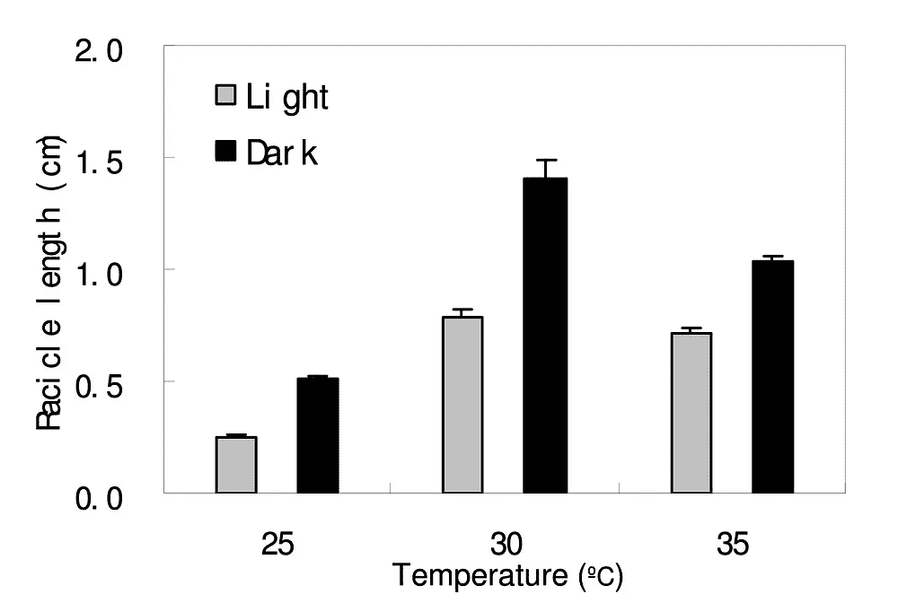
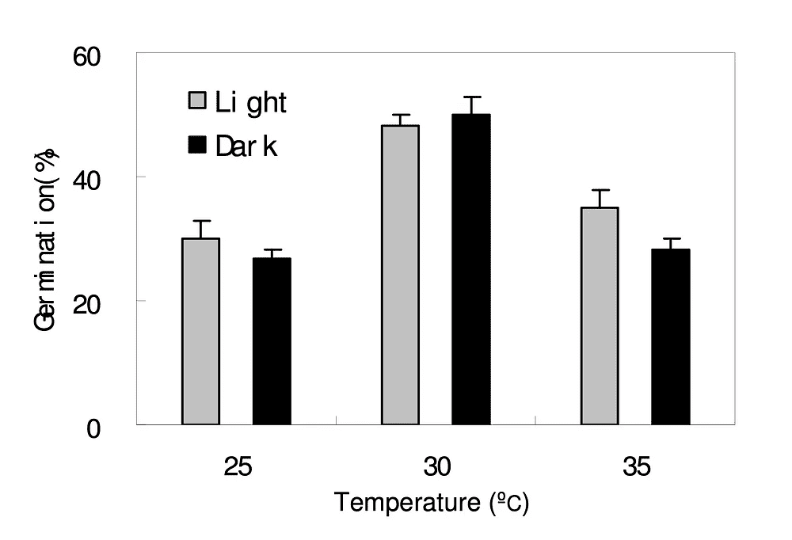
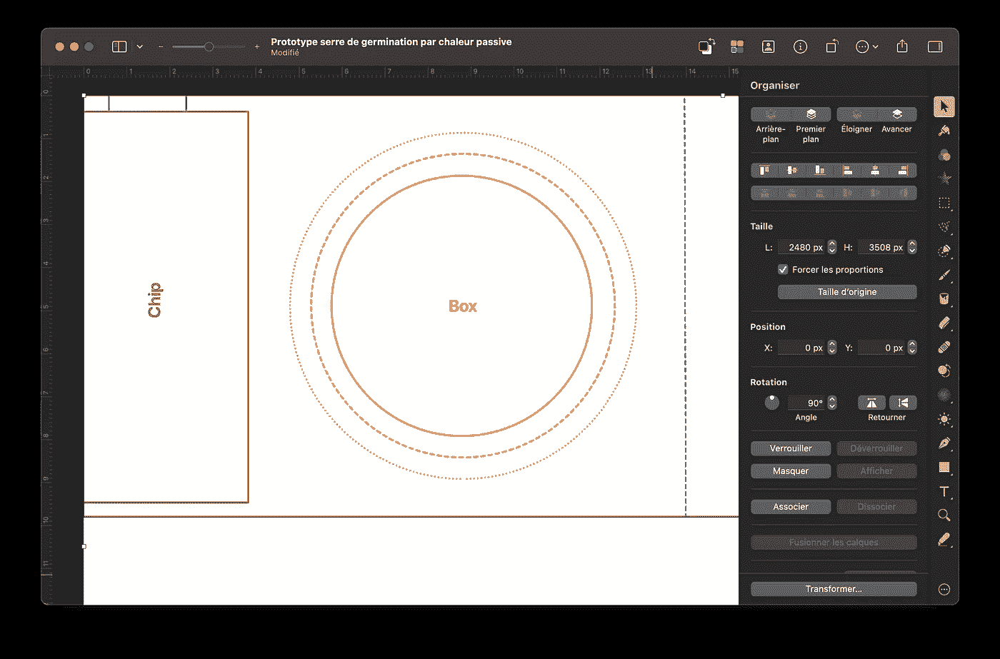
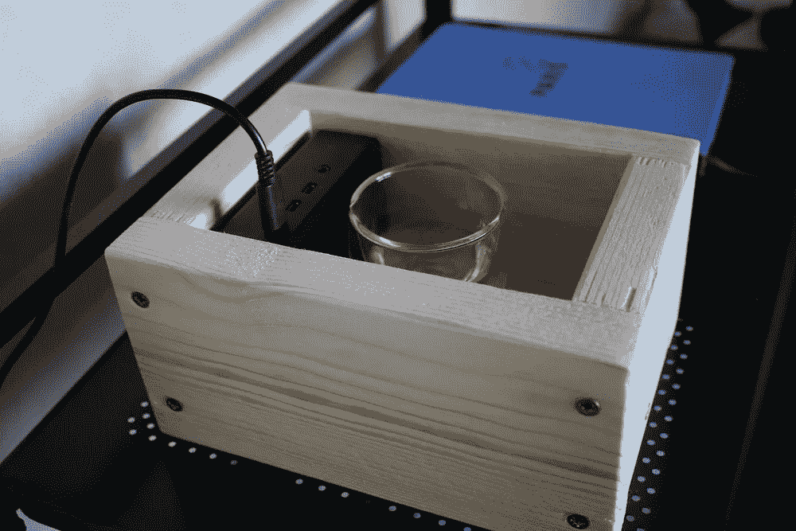
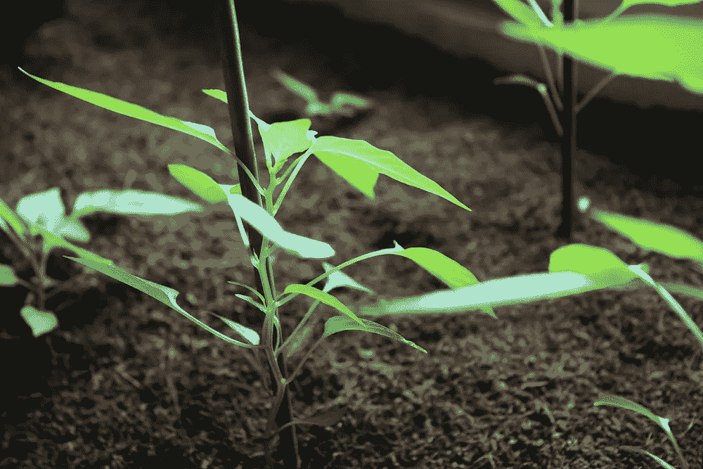

# 我如何把我的网络服务器的热量变成了辣椒发芽的温室

> 原文：<https://levelup.gitconnected.com/how-i-turned-the-heat-of-my-web-server-into-a-germination-greenhouse-for-hot-peppers-147bc2352b92>

## 几年来，我注意到我用来制作原型、远程计算和托管网站的 Raspberry pi 4 产生了大量热量，并投资了一个散热器，之后我决定将这些能量用于绿化我的办公室，并有可能探索另一个科学和商业领域。

[王伟霞](https://unsplash.com/@elxw?utm_source=medium&utm_medium=referral)在 [Unsplash](https://unsplash.com?utm_source=medium&utm_medium=referral) 上拍照

每个开发人员在设置远程计算解决方案时都知道沸腾服务器的感觉。本文的写作源于一个显而易见的想法，即这种热量应该用于有益的目的，以优化设备的能耗。

在撰写本文时，CPU 的温度为 50.01 摄氏度，在高活动期间可升至 60 度，在半封闭空间内半径 5 至 15 厘米的范围内产生 30 至 38 度之间的热辐射。

30 度既很多又不够。30 度你不能做饭，更不用说给房间供暖了。然后，有必要找到一个原始的想法来利用这种热量，还有什么比将它转化为一种完全不同的辣椒素更好的方法。

稍加研究，我们很快意识到，这个热量范围实际上非常适合辣椒的发芽和早期生长。因此，中国热带农业科学院在 2010 年的一项简短研究表明，30%的恒温可以使黑胡椒种子的发芽率提高两倍

**温度、光照和植物生长调节剂对黑胡椒种子萌发的影响。**

因此，我决定优化树莓皮的热扩散，将热量集中到一个专门用于种子萌发的空间，这个空间位于一个专门为安装培养皿而设计的木箱内。

发芽温室，尺寸以厘米为单位。

方案敲定后，我买了一块 2 米乘 9.5 厘米的松木板，按照上面说明的尺寸切割，结果是这样的:

最后一块(左)和植物(右)。

这将需要几个月的时间来获得类似的植物，目前正在开花，很快就会产生辣椒。

> 然而，有必要特别注意树莓果的温度，以使其在封闭的空间中不会保持过高的温度，但是根据经验，这不会造成任何问题，并且会允许任何种子发芽。

感谢您的阅读，并希望它能给您一些创造性的想法来回收您服务器中的热量，

路易·布鲁莱·诺代

 [## 路易·布鲁莱·诺代

### 商务和财政法研究硕士(巴黎-多芬大学)，概念专业…

louisbrulenaudet.com](https://louisbrulenaudet.com) 

# 分级编码

感谢您成为我们社区的一员！在你离开之前:

*   👏为故事鼓掌，跟着作者走👉
*   📰查看[级编码出版物](https://levelup.gitconnected.com/?utm_source=pub&utm_medium=post)中的更多内容
*   🔔关注我们:[推特](https://twitter.com/gitconnected) | [LinkedIn](https://www.linkedin.com/company/gitconnected) | [时事通讯](https://newsletter.levelup.dev)

🚀👉 [**加入升级人才集体，找到一份惊艳的工作**](https://jobs.levelup.dev/talent/welcome?referral=true)