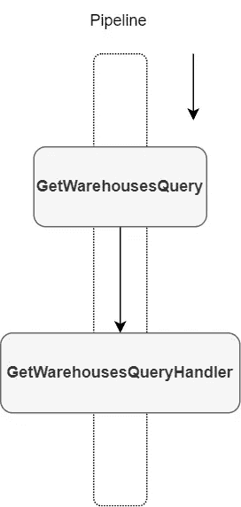
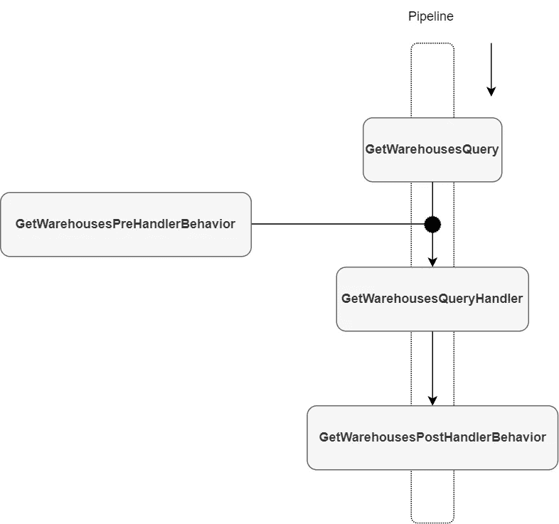

# 我如何使用？网络 6

> 原文：<https://levelup.gitconnected.com/how-i-upgrade-my-code-style-of-mediatr-pipeline-using-net-6-ed49aca61f47>

## 软件架构和重构

## 我想和你分享一下。NET 6 新的[mediator 的特性。NuGet 包帮助我完善了我的 MediatR 管道。](https://github.com/ITIXO/MediatR.Extensions.AttributedBehaviors)


# 什么是 MediatR

它是由 [Jimmy Boggard](https://jimmybogard.com/) 为 C#创建的一个流行的[库](https://github.com/jbogard/MediatR)，可以描述为一个简单的 [Mediator 模式](/ugly-dependency-graph-the-mediator-design-pattern-is-the-solution-for-you-8b35df60558b)在. NET 中的实现，Mediator[NuGet 包](https://www.nuget.org/packages/MediatR/)目前有将近**5000 万次下载**并且还在上升。

GitHub 上的维基页面说:

*mediator 是一个低野心的库，试图解决一个简单的问题——将消息的进程内发送从消息处理中分离出来。*

**工序内**一词必不可少。这不是 Kinesis 或 RabbitMQ 那样的消息代理。这是关于从一个地方发送消息和在不同的地方处理这样的消息，但是仍然在一个过程中。

我使用 MediatR 来分离命令和查询请求。所以在我的例子中，MediatR 消息是查询或命令，这取决于数据流的方向。这个架构设计被称为**命令-查询分离**，我在博客文章[的特征记录](/3-cqrs-architectures-that-every-software-architect-should-know-a7f69aae8b6c# 9，但它与一篇博客文章的主题有关，所以我也将向您介绍它们。名为<a class=)。Records 引入了一个更短的语法来定义一个不可变的类。我发现在声明命令或查询类时很有帮助。

看第 8 行。`GetWarehousesQuery`的定义现在是**单行码**。我喜欢将查询和命令类与它们的处理程序类放在一个地方，这使我的代码更整洁。

有一个**缺点**。记录初始化后，您将无法更改任何属性值。它是一个不可变的对象，每个属性的 setter 都是用`init`关键字定义的。

## 全球使用

糖的另一个特点。NET 6 是[全局使用](https://blog.jetbrains.com/dotnet/2021/11/18/global-usings-in-csharp-10/)。在使用 directive 之前的新关键字`global`使得在我们实现来自 MediatR 库的接口的每个文件中不包含`using MediatR`成为可能。

全局使用是项目范围的，所以我建议您**在项目文件夹的根目录下为它们创建一个专用文件**。只在那里定义你的全局使用。一旦你开始在一个随机文件中写`global using` ，事情就会变得一团糟。

让我们用这行代码创建一个`GlobalUsings.cs`文件:

```
global using MediatR;
```

现在，我们可以从代码示例中移除`using MediatR;`。

## 文件范围的命名空间

文件范围的名称空间意味着为每个文件定义一个名称空间，没有花括号。所以我们的代码样本可以更干净。看看下面。

一个短文件中的查询和处理程序。我就喜欢这样。

# 使用 MediatR 属性化行为升级代码

## MediatR 管道

在进行最后一次升级之前，我需要解释一下什么是 MediatR 管道。它是为一个 MediatR 请求(消息)定义的管道。管道执行从`Mediator.Send`方法调用开始，并将 MediatR 请求的对象传递给它。



简单管道

## 管道行为

MediatR 有一个特性叫做**管道行为**。通过定义适当的接口实现，可以将行为附加到管道中。



带有行为的管道

您可以在处理程序之前或之后附加行为**，这取决于您将在哪里调用`next()`委托。一个典型的例子是在处理程序之前验证 MediatR 请求表单的验证行为。**

现在是一些代码。这是我的新`CreateWarehouseCommand`管道。处理程序中的代码对于概念的证明并不重要。它的作用是将新的仓库记录持久化到数据库中。

现在让我们定义验证行为。

因为我们在验证后调用`next`委托，所以`ValidateCreateWarehouseBehavior`将在处理程序之前执行。如果`await next()`在`if`之前在第 14 行，那么处理程序将在验证之前被调用。这就是你如何管理行为相对于处理程序或管道中另一个行为的位置。

行为必须手动注册到 DI 容器**中**。

```
services.AddScoped<IPipelineBehavior<CreateWarehouseCommand, NewRecordDto<string>>, ValidateCreatedWarehouseBehavior>();
```

顺便说一下，如果一个管道有多个行为，它们的**执行顺序由注册到 DI 容器的**顺序定义。这是 MediatR 令人不愉快的隐藏行为方式。但是在下一段我有一个很好的解决方法。

## 中介归因行为

最后一次升级是 mediator 的扩展库，名为[mediator 属性化行为](https://github.com/ITIXO/MediatR.Extensions.AttributedBehaviors)。这个库帮助你**从开发者那里移除手工 DI 注册**行为的责任。此外，您可以在 MediatR 请求定义上看到管道的行为。看一下最后一个代码示例。

这个扩展库的另一个功能是定义行为的顺序和范围，并将其作为其他参数传递。

```
[MediatRBehavior(typeof(MySingletonPipelineBehavior<MyQuery>), serviceLifetime: ServiceLifetime.Singleton, order: 1)]
public class MyQuery : IRequest
```

# 来源

*   [联发科 GitHub](https://github.com/jbogard/MediatR)
*   [mediator 属性 GitHub](https://github.com/ITIXO/MediatR.Extensions.AttributedBehaviors)

# 遗言

感谢你的关注。在这里，我为我的每篇博文都列了一个非限制性链接列表。我是 Itixo 公司的一员。NET 中欧会议，[布拉格更新会议](https://www.updateconference.net/en)。

[](https://updateconference.net)[](https://www.itixo.com)

赞助商

# 进一步阅读

[](/from-monolith-to-microservices-in-5-minutes-83069677d021) [## 5 分钟内从整体服务到微服务

### 微服务架构风格是将单个应用程序开发成一套小型服务的方法——

levelup.gitconnected.com](/from-monolith-to-microservices-in-5-minutes-83069677d021) [](/let-me-hear-you-screaming-architecture-3adcc02f2ca3) [## 文件夹和尖叫建筑的功能组织

### 架构应该表达系统的意图——鲍勃叔叔

levelup.gitconnected.com](/let-me-hear-you-screaming-architecture-3adcc02f2ca3) [](/layers-in-software-architecture-that-every-sofware-architect-should-know-76b2452b9d9a) [## 每个软件架构师都应该知道的软件体系结构的层次

### “所有的架构都有相同的目标——关注点的分离。都是通过分软件来实现的…

levelup.gitconnected.com](/layers-in-software-architecture-that-every-sofware-architect-should-know-76b2452b9d9a) [](/3-domain-centric-architectures-every-software-developer-should-know-a15727ada79f) [## 每个软件开发人员都应该知道的 3 个以领域为中心的架构

### 建筑师首先关心的是确保房子是可用的，而不是确保房子是…

levelup.gitconnected.com](/3-domain-centric-architectures-every-software-developer-should-know-a15727ada79f)