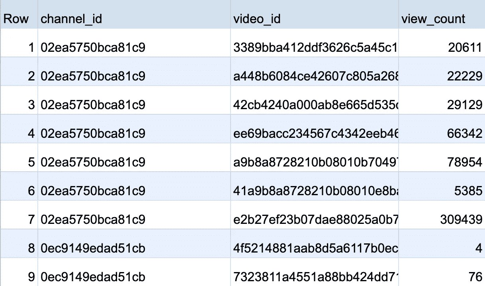
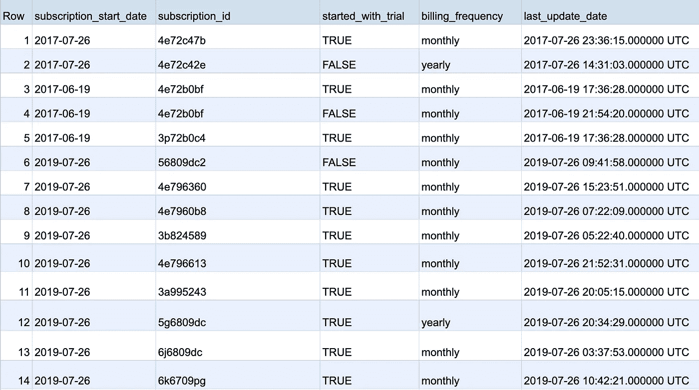
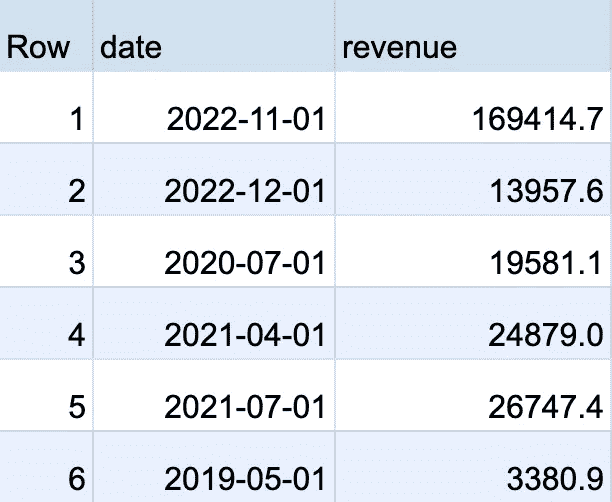
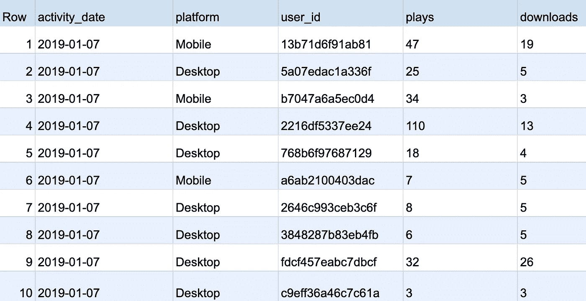

# 作为一名数据科学家，我如何使用 BigQuery 分析函数

> 原文：<https://levelup.gitconnected.com/how-i-use-bigquery-analytic-functions-as-a-data-scientist-d8d662fd6c97>


照片由 [lilzidesigns](https://unsplash.com/@lilzidesigns?utm_source=unsplash&utm_medium=referral&utm_content=creditCopyText) 拍摄

## 如何在 BigQuery 中使用高级 SQL 进行分析的实例

我使用 BigQuery 已经 3 年多了，所以我认为是时候分享一下我在作为一名数据科学家的日常工作中是如何使用它最强大的功能之一——分析功能(或者也称为窗口功能)的了。

为了让您了解这个工具有多有用，您可以使用分析函数计算移动平均值、排列项目列表、计算累积和，以及执行其他非常有用和更复杂的分析，所有这些都直接来自 BigQuery。

如果你想了解更多关于分析函数调用如何工作的细节，我建议你查阅官方的[文档](https://cloud.google.com/bigquery/docs/reference/standard-sql/window-function-calls)，否则在下一节中，我将带你浏览一些我经常遇到的真实用例，这将帮助你开始！

# 使用案例和示例

## 1.查找每个 Youtube 频道的前 5 个视频

假设您处理 Youtube 数据，并且可以访问每个视频占一行的表格。对于每一个视频，你也可以得到它的总浏览量和它属于哪个频道。这是一张桌子的样本



**分析范围:**

> 现在，你的利益相关者走到你面前，问你“你能帮我找到每个频道的前 5 个视频(基于他们的总浏览量)吗？”

**解决方案:**通过使用解析函数`ROW_NUMBER()`，我们可以根据`view_count`为每个`channel_id` *给每一行一个排名。*

```
ROW_NUMBER() OVER (PARTITION BY channel_id ORDER BY view_count DESC)
```

以下是完整的 SQL 语句:

```
SELECT
  *
FROM table
-- Here is the solution
-- We use the QUALIFY clause to filter the results of the window function
QUALIFY ROW_NUMBER() OVER (PARTITION BY channel_id ORDER BY view_count DESC) <= 5
```

## 2.获取每个客户可用的最新订阅数据

假设您有一个包含订阅数据的表，但是每次以某种方式更新订阅时，都会创建一个新行。这是一张桌子的样本



**分析范围:**

> 有人问你，“你能告诉我我们的活跃用户中有百分之多少是每月会员吗？”。
> 
> 当然，在你开始计算你的用户的“计费频率”分布之前，你必须确保你只考虑了每个用户可用的最新的订阅数据

**解决方案:**通过使用解析函数`ROW_NUMBER()`，我们可以根据每个`subscription_id` *的`last_update_date`给每一行一个排名。*

```
ROW_NUMBER() OVER (PARTITION BY subscription_id ORDER BY last_update_date)
```

```
SELECT
  *
FROM table
-- Here is the solution
-- We use the QUALIFY clause to filter the results of the window function
QUALIFY ROW_NUMBER() OVER (PARTITION BY subscription_id ORDER BY last_update) = 1
```

## 3.计算累计收入，同时保留每月收入

假设您有公司的月度收入数据。每月产生的收入占一行。这是一张桌子的样本



**分析范围:**

> 你的利益相关者问你“你能展示一个比较月收入和累计收入的图表吗？”

**解决方案:**使用`SUM()`和`ROWS BETWEEN UNBOUNDED PRECEDING AND CURRENT ROW` 来合计从分区的第一行到当前行的收入，这将计算到可用的每个点的总收入。

```
SUM(revenue) OVER (ORDER BY date ROWS BETWEEN UNBOUNDED PRECEDING AND CURRENT ROW)
```

以下是完整的 SQL 语句:

```
SELECT
  date,
  revenue,
  -- Here is the solution
  SUM(revenue) OVER (
    ORDER BY date
    ROWS BETWEEN UNBOUNDED PRECEDING AND CURRENT ROW
  ) AS total_revenue
FROM table
```

## 4.找到每个用户在每个平台上第一次和最后一次活动的时间

假设您有每个用户的活动数据。用户可以在桌面或移动设备上活动。



**分析范围:**

> 您的利益相关者找到您，要求您汇总每个用户的活动，以及他们在每个平台上第一次和最后一次活动的时间。

**解决方案:**使用`MIN()`和`MAX()`分别找到每个`platform`内每个`user_id`的第一个和最后一个日期。

```
MIN(activity_date) OVER (PARTITION BY platform, user_id)
```

以下是完整的 SQL 语句:

```
SELECT
  activity_date,
  platform,
  user_id,
  SUM(plays) AS total_plays,
  SUM(downloads) AS total_downloads,
  -- Here is the solution
  MIN(activity_date) OVER (PARTITION BY platform, user_id) AS first_activity_date,
  MAX(activity_date) OVER (PARTITION BY platform, user_id) AS last_activity_date,
FROM table
GROUP BY 1, 2, 3
```

## 5.计算月环比收入增长

假设您有一个包含月收入数据的表。这是一个数据样本


**分析范围:**

> 你的利益相关者走近你，问你“在给定的时间段内，公司的销售收入增长情况如何，比如年同比？”

**解决方案:**使用`LAG()`来帮助查找前一行的收入，在本例中是上个月的收入。

```
LAG(revenue) OVER (ORDER BY date ASC) AS prev_month_revenue
```

以下是完整的 SQL 语句:

```
WITH
find_last_month_revenue AS (
  SELECT
    date,
    revenue,
    -- Use LAG() to help find the previous month revenue
    LAG(revenue) OVER (ORDER BY date ASC) AS last_month_revenue
  FROM table
)
SELECT
  date,
  revenue,
  -- Apply Growth Rate formula
  ((revenue - last_month_revenue)/last_month_revenue) * 100 AS growth_rate
FROM find_last_month_revenue
```

希望这个指南有用，如果你有任何想法或问题，请在下面的评论中留下:)

另外，如果你希望支持我成为一名作家，可以考虑[注册成为一名灵媒成员](https://medium.com/@avourakis/membership)。