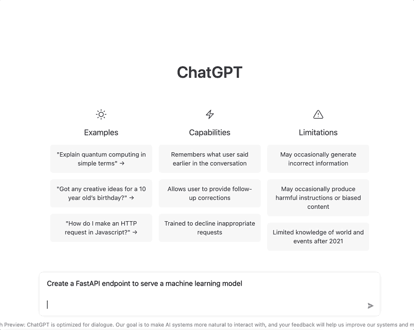
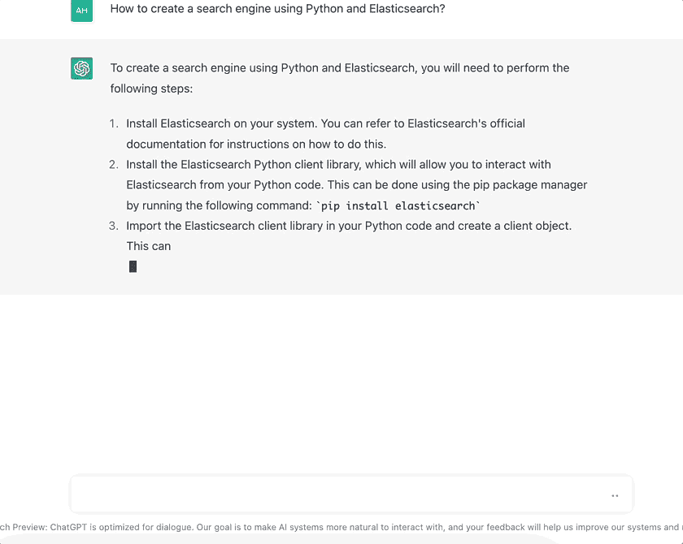
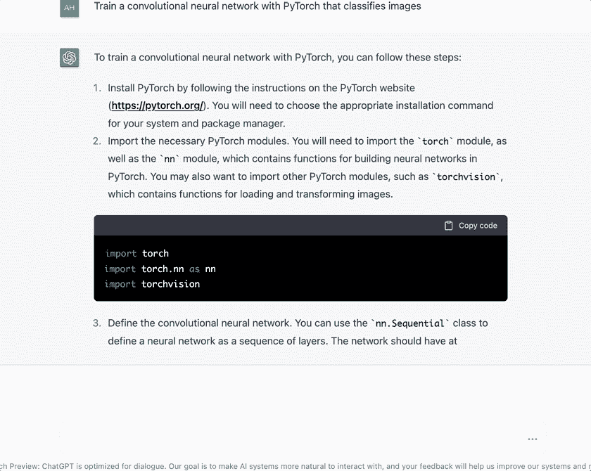
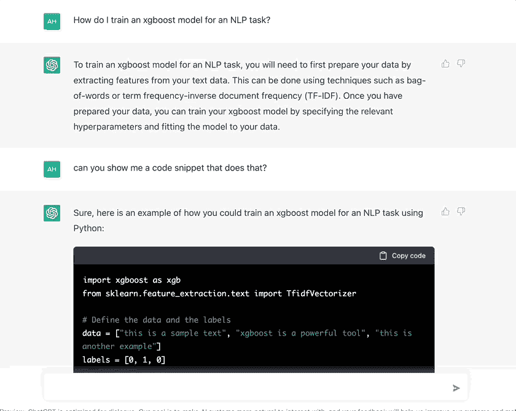
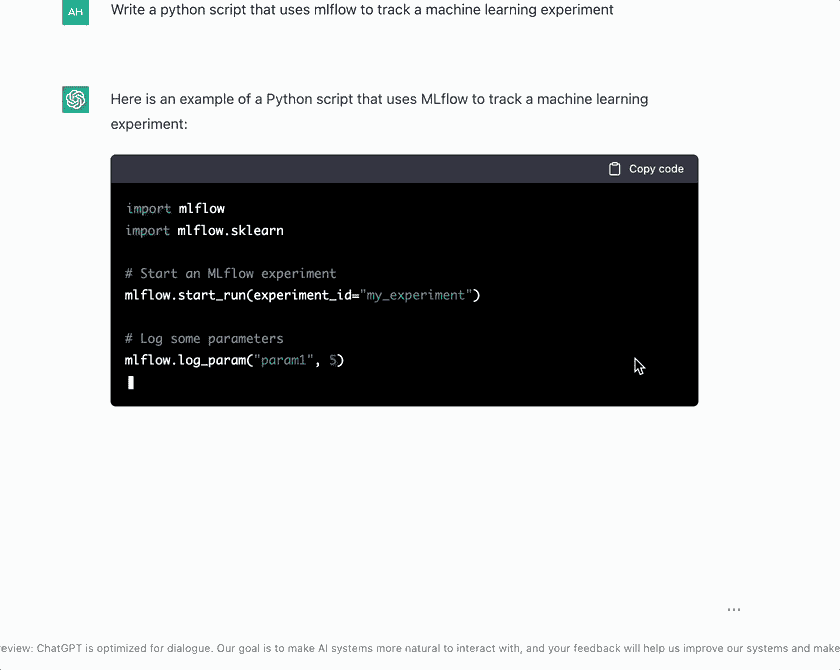
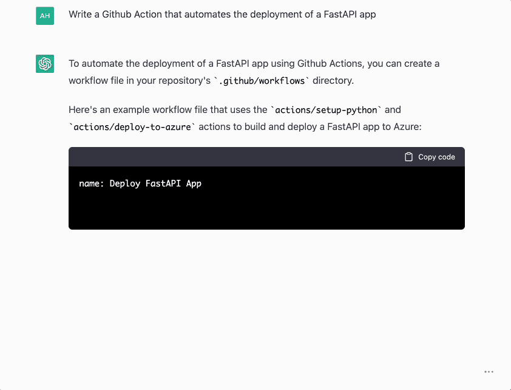

# 在我的数据科学角色中，我如何使用 ChatGPT 来自动化这 6 项任务

> 原文：<https://levelup.gitconnected.com/how-i-used-chatgpt-to-automate-these-6-tasks-in-my-data-science-role-52e8ddfc03cf>

## ChatGPT 就像 Google，StackOverflow 和 Readthedocs 的总和


詹姆斯·a·莫尔纳尔在 [Unsplash](https://unsplash.com?utm_source=medium&utm_medium=referral) 上拍摄的照片

你可能听说过 ChatGPT。

这是一个新的人工智能聊天机器人，由 [OpenAI](https://openai.com/) 开发，这是 GPT-3 背后的同一家公司，DALL。E2，以及其他疯狂的产品。

ChatGPT 真是棒极了。这和我以前用过的聊天机器人完全不同。它对各种话题产生详细而全面的答案的能力令人难以置信。例如，这个工具可以回答哲学、数学或计算机科学中的技术问题。它可以闲聊，写关于机器学习的诗歌(用 rimes！)，搞笑，甚至改变其写作风格。

但是 ChatGPT 在另一个领域也很出色，这个领域特别有趣:**编写和解释代码。**

> 在 ***这篇帖子里，我会用一些涵盖机器学习和软件工程的编程问题来挑战 ChatGPT。
> 我会让它写一些我在工作中经常用到的代码片段和函数，看看它能不能把它们自动化。***

对于每一个问题，我都会以交互式 GIF 的形式提供 ChatGPT 的答案以及它生成的代码。

让我们看一看👀

> 新到中？你可以每月订阅 5 美元，解锁我写的不限数量的关于编程、MLOps 和系统设计的文章，以帮助数据科学家(或 ML 工程师)编写更好的代码。

[](https://ahmedbesbes.medium.com/membership) [## 加入我的介绍链接媒体-艾哈迈德贝斯

### 阅读 Ahmed Besbes 的每一个故事(以及媒体上成千上万的其他作家)。您的会员费直接支持…

ahmedbesbes.medium.com](https://ahmedbesbes.medium.com/membership) 

# **1 —创建一个 FastAPI 端点，为机器学习模型服务**

当我需要为机器学习模型服务时，我的首选 web 框架肯定是 [FastAPI](https://fastapi.tiangolo.com/) 。然而，当我写基本路线时，我总是忘记语法。

ChatGPT 可以刷新我的记忆:下面是当我要求它创建一个预测端点时它生成的内容。



作者 GIF

不错吧？它不仅能正确地生成 API 代码，还能对其进行注释并举例说明。

它甚至使用 Pydantic 进行键入和输入验证。

这是代码。当然，您可以根据您的用例来调整它。

```
# Install FastAPI
!pip install fastapi

# Import necessary modules
from fastapi import FastAPI
from pydantic import BaseModel
import numpy as np
import joblib

# Load the trained machine learning model
model = joblib.load("model.pkl")

# Create a FastAPI app
app = FastAPI()

# Define the input schema for the endpoint
class Input(BaseModel):
    x1: float
    x2: float
    x3: float
    x4: float

# Define the endpoint
@app.post("/predict")
def predict(input: Input):
    # Use the model to make predictions
    prediction = model.predict(np.array([input.x1, input.x2, input.x3, input.x4]).reshape(1, -1))

    # Return the predictions in a JSON format
    return {"prediction": prediction[0]}
```

# 2 —使用 Python 和 Elasticsearch 创建搜索引擎

当我需要实现一个搜索引擎来查询文本数据时，我通常依靠 [Elasticsearch](https://www.elastic.co/guide/index.html) 。

为了能够使用 Elastisearch，必须首先创建一个索引和一个映射。

而不是浏览文档(再次！)要了解这些对象是如何定义和创建的，让我们看看 ChatGPT 对此能说些什么:



作者 GIF

不出所料，文档和示例都直截了当。

下面是生成的代码:

```
from elasticsearch import Elasticsearch

# Create an Elasticsearch client
es = Elasticsearch()

# Index a document with an ID of 1
es.index(index="my_index", doc_type="my_type", id=1, body={"name": "John Doe", "age": 34})

# Perform a search query
results = es.search(index="my_index", doc_type="my_type", body={"query": {"match": {"name": "John"}}})

# Print the results
print(results)
```

# 3-使用 PyTorch 训练卷积神经网络，对图像进行分类

当我需要训练一个神经网络时，我总是从以前的项目中复制粘贴样板代码。

问 ChatGPT 这个不是更好吗？



作者 GIF

产生的代码几乎是完美的:出于某种原因，ChatGPT 停止在前进阶段，没有使用渐变更新权重。

有趣的是，训练中使用的参数值(学习率、时期数、内核数和内核大小)是真实的。

代码:

```
# Import necessary libraries and modules
import torch
import torchvision
from torchvision import datasets, transforms

# Define hyperparameters
num_classes = 10
learning_rate = 0.001
num_epochs = 10

# Load and transform the dataset
train_dataset = datasets.MNIST(root='./data', train=True, transform=transforms.ToTensor())
test_dataset = datasets.MNIST(root='./data', train=False, transform=transforms.ToTensor())

# Define the network architecture
class ConvNet(torch.nn.Module):
    def __init__(self):
        super(ConvNet, self).__init__()
        self.layer1 = torch.nn.Sequential(
            torch.nn.Conv2d(1, 16, kernel_size=5, stride=1, padding=2),
            torch.nn.ReLU(),
            torch.nn.MaxPool2d(kernel_size=2, stride=2))
        self.layer2 = torch.nn.Sequential(
            torch.nn.Conv2d(16, 32, kernel_size=5, stride=1, padding=2),
            torch.nn.ReLU(),
            torch.nn.MaxPool2d(kernel_size=2, stride=2))
        self.fc = torch.nn.Linear(7*7*32, num_classes)

    def forward(self, x):
        out = self.layer1(x)
        out = self.layer2(out)
        out = out.reshape(out.size(0), -1)
        out = self.fc(out)
        return out

# Initialize the network and specify the loss function and optimization algorithm
model = ConvNet()
criterion = torch.nn.CrossEntropyLoss()
optimizer = torch.optim.Adam(model.parameters(), lr=learning_rate)

# Train the network
for epoch in range(num_epochs):
    for i, (images, labels) in enumerate(train_dataset):
        # Forward pass
        outputs = model(images)
        loss = criterion(outputs, labels)
```

# 4-为 NLP 任务训练 XGBoost 模型

让我们通过使用 XGBoost 构建文本分类器来检查 ChatGPT 是否能够对文本数据执行特征工程。

在下面的响应中，它使用了 Tfidf 矢量器。还不错！



作者 GIF

我想知道它是否可以改变它的答案并使用单词嵌入🤔。

代码:

```
 import xgboost as xgb
from sklearn.feature_extraction.text import TfidfVectorizer

# Define the data and the labels
data = ["this is a sample text", "xgboost is a powerful tool", "this is another example"]
labels = [0, 1, 0]

# Extract features using a TF-IDF vectorizer
vectorizer = TfidfVectorizer()
features = vectorizer.fit_transform(data)

# Convert the features to a dense matrix
features = features.toarray()

# Train the xgboost model
model = xgb.XGBClassifier()
model.fit(features, labels)
```

# 5-使用 MLflow 跟踪机器学习实验

当我运行不同的机器学习实验并想要比较它们时，我通常会使用 [MLflow](https://mlflow.org/) 在中央服务器中跟踪它们。

以下是我会多次重复使用的确切片段。(谢谢 ChatGPT🙏)



作者 GIF

代码:

```
import mlflow
import mlflow.sklearn

mlflow.start_run(experiment_id="my_experiment")

mlflow.log_param("param1", 5)
mlflow.log_param("param2", "value2")

# Train a model
from sklearn.ensemble import RandomForestRegressor
model = RandomForestRegressor()
model.fit(x_train, y_train)

# Log model as artifact
mlflow.sklearn.log_model(model, "random-forest-model")

# Log metrics
mlflow.log_metrics("mse", mean_squared_error(y_test, model.predict(x_test)))
mlflow.log_metrics("mse", mean_absolute_error(y_test, model.predict(x_test))) 
```

# 6 —编写一个 GitHub 动作，自动部署 FastAPI 应用程序

如果您正在将应用程序推向生产，那么您很可能依赖于一些 CI/CD 管道来自动化它们的部署，或者在代码库上运行一套集成测试。

为此，我通常使用 Github 动作。

以下是 ChatGPT 对这个话题的看法。



作者 GIF

代码:

```
name: Deploy FastAPI App

on:
  push:
    branches:
      - master

jobs:
  build-and-deploy:
    runs-on: ubuntu-latest
    steps:
      - uses: actions/checkout@v2
      - uses: actions/setup-python@v2
        with:
          python-version: 3.8
      - run: |
          python -m pip install -U pip
          pip install fastapi uvicorn
      - run: uvicorn main:app --host 0.0.0.0 --port 8080
      - uses: actions/deploy-to-azure@v1
        with:
          app-name: my-fastapi-app
          resource-group: my-resource-group
          package: .
```

# 结论

ChatGPT 提供了优秀的代码生成能力，并有望很快集成每个开发人员的工具箱。

然而，请记住，它肯定(还)没有能力推理或提供复杂问题的优化解决方案。如果出现问题，您不能依靠 ChatGPT 来修复您的生产代码。

在我看来，ChatGPT 是一种浓缩的开放知识，你可以用自然语言以一种非常复杂的方式进行查询。这并不意味着你不能用它做疯狂的事情。这并不意味着你也可以盲目依赖它。

用你最好的判断力去问*正确的*问题。

# 新到中？您可以每月订阅 5 美元，并解锁各种主题的无限文章(技术、设计、创业……)您可以通过点击我的推荐链接[来支持我](https://ahmedbesbes.medium.com/membership)

[](https://ahmedbesbes.medium.com/membership) [## 加入我的介绍链接媒体-艾哈迈德贝斯

### 阅读 Ahmed Besbes 的每一个故事(以及媒体上成千上万的其他作家)。您的会员费直接支持…

ahmedbesbes.medium.com](https://ahmedbesbes.medium.com/membership)