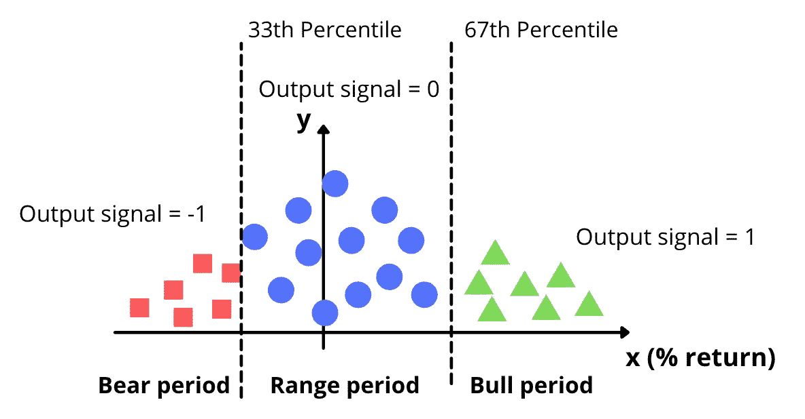
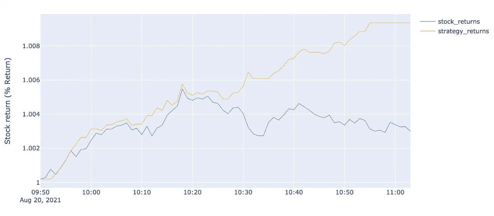

# 我如何利用数学和人工智能将利润提高 22.4% —第二部分

> 原文：<https://levelup.gitconnected.com/how-i-used-mathematics-and-ai-to-increase-my-profits-by-22-4-part2-89cd1443fa56>

## 面向交易者的 Python 故事时间

## 网飞使用一个错误的机器学习算法，像高频交易者一样交易。

[行政长官](https://unsplash.com/@executium?utm_source=medium&utm_medium=referral)在[广场](https://unsplash.com?utm_source=medium&utm_medium=referral)拍照

*本文是关于如何使用机器学习和人工智能开发交易模型的 A 到 Z 教程的第二部分。*

今天，在这篇文章中，我们将讨论文章的第二部分，如何使用数学来提高你的交易业绩。**第 2/3 部分**

这个模型适用于日内交易，但是可以被任何人使用，用于不同的目的。要么是为了**在去面试前建立一个数据科学项目组合**，了解**人工智能背后的数学直觉**，要么是为了**在金融领域开启职业生涯**。

仅供参考—您可以通过以下链接访问第一部分:

 [## Python 交易——我如何使用分类算法将我的胜率提高了 22.4%

### 网飞使用的一个错误的机器学习算法，以增加我的技术…

levelup.gitconnected.com](/python-for-trading-how-i-used-classification-algorithms-to-easily-enhance-my-winning-rate-by-22-4-6269167fbf93) 

开始吧！

# 在上一篇文章中…

在上一篇文章中，我们首先介绍了**分类算法(网飞使用的)以及如何使用它们进行交易。**

然后，我们定义了发展日内交易机器学习模型的路线图:

数据模型

我们已经定义了一种使用雅虎财经 API 获取实时市场数据的方法，我们选择了**一分钟的间隔**停留在我们的**日交易**窗口中。

然后，我们将第二步细化为四个不同的阶段:

我们从清理可能导致默认模型的变量开始(在开始开发模型之前，每个人都必须清理这个变量)。并计算每分钟的相对强度。

这是第一部分末尾的数据框:

最后，我们将这些数据可视化，发现 RSI 和市场运动之间存在令人兴奋的相关性:

既然我们已经介绍了到目前为止所看到的内容，我们可以继续增强我们的模型。

## 添加趋势指示器以帮助机器。

在开始用变化百分比来索引我们的值之前，我们将添加三个不同的交易指标，以提供关于**市场趋势**和**市场波动**的更多信息。

我们将添加的指标是被交易者称为 **MACD** 的移动平均线、**抛物线 SAR** 来确定**趋势方向**和**价格的潜在反转**以及**平均方向指数** ( **ADX** )来确定我们趋势的**强度**。

类似于我们对 RSI 所做的，我们使用**塔利布**库来计算这些字段。

在这些交易指标之上，我们增加了 SMA 和市场之间的**相关系数**以获得更多信息。

那一定给大学学金融的大家勾起了很多美好的回忆:)通常金融老师称之为 **beta** 系数。

查韦斯先生(我大学时的金融老师)一定以我为荣:)

Gif 来自 giphy.com

所以，玩笑归玩笑。现在我们添加了最有影响力的交易指标，我们可以追求额外的信息，使模型更加稳健。

## 以前的分钟值

我将推荐添加的最后一个变量，也是基于我自己的经验的**，是将**前一分钟的** ` **高**`**低**`**开**价格作为算法的输入。这将有助于算法感知过去时间段的波动性。**

使用 python 中已经包含的 shift 函数非常容易:

shift 函数将从上面的一行中获取数据

我们开始吧。我们刚刚增加了三个变量。

我们还将创建另外两列作为特征:最后一分钟和当前一分钟之间`**开仓**价格的变化&当前一分钟`**开仓**价格和最后一分钟`**收盘**价格之间的差异。

在进一步开始实施算法之前，我们将添加变化百分比，这将有助于我们发现牛市中的熊市。实际上，变化的百分比将更有利于算法判断运动。它将允许我们在高盈利期、区间期和亏损期之间划分我们的价值。

如下图所示:

*牛市是市场趋势高涨的时候。熊市是指市场趋势低迷的时候。

## 计算回报

因此，让我们计算每个数据点(行)的回报(从数学上来说，是上面提到的变化的百分比)。我们还将过去 n 分钟的返回保存在名为 return1、return2 等的 n 列中。这将有助于算法了解最近 n 个周期的收益趋势。

在结束数据处理之前，在设置输出(如上图所述)和拆分数据之前，需要对相关列进行最后的清理。

## 清理相关列

我注意到一个大于 1 小于-1 的相关系数有时会因为缺少值而出现。我们将把所有小于-1 的值改为-1，把所有大于 1 的值改为 1。

这不会影响我们的计算，因为极值是由于数据中的 NaN 值而实现的，这需要在训练算法之前进行处理。然后，我们从整个数据帧中删除所有 nan。

现在，我们已经清理/修整了变量并添加了计算字段，在实现我们的机器学习算法之前，我们将需要两个数据结构化/处理步骤。

我们首先在训练集和测试集之间划分数据集，然后为训练数据集设置目标值。

以下是如何组织数据的示例:

关于这一步对于人工智能和人工智能模型的重要性，本文中的一切都解释得很清楚:

 [## 训练数据集和测试数据集有什么区别？

### 这是一篇与我的数据科学文章相关的补充文章，为我的读者带来了更多的理解。

lhessani-sajid.medium.com](https://lhessani-sajid.medium.com/what-is-the-difference-between-training-and-test-dataset-91308080a4e8) 

既然我们已经理解了训练和测试数据集之间的重要性和差异，我们将创建一个 split 函数来复制这个结构。

## 分裂函数

我们将使用 80%的数据进行训练，剩下的 20%进行测试。我们将创建一个分割参数，以 80–20 的比例分割数据帧。

要分的比例完全取决于你和你面临的任务。80%的数据用于训练，其余的用于测试，这并不重要。

> 例如，如果您有一个超过 10，000 行的数据集，使用 95–5 的分割比会更好。

这可以根据您的选择进行更改，但建议至少将 70%的数据作为训练数据，以获得良好的结果。但在这种情况下，我会推荐 80%，因为我们将有足够的数据来训练模型，也有足够的数据来验证测试。

因此，让我们创建一个“split”函数，它将捕获 80%的数据集。

*目前，这个变量只是将总行数的 80%作为一个整数。我们将在以后使用它来确定要考虑的最后一行。*

现在是时候定义我们的**输出** **信号**(也叫**目标**)。

## 定义输出信号

输出信号将基于百分比回报，并分为三类:

*   熊周期:输出信号= -1
*   范围周期:输出信号= 0
*   牛市周期:输出信号= 1

让我们执行我们的代码行:

接下来，我们将输出值赋给创建的名为 signal 的列。

我们将通过创建特性和值来结束这第一步。

## 删除不必要的变量

我们将降列`*`、` ***信号*** `、` ***时间*** `、` ***高*** `、` ***低*** `、` ***卷*** `、` ***Ret*** `自算法将接下来，我们将` ***信号*** 赋值给` ***y*** `，这是您将使用测试数据预测的输出变量。*

*此时，我们已经将数据集分成了两个不同的部分。第一个将包含份额的趋势和最终输出。第二次我们将评估我们的模型。*

*现在，数据集已经准备好推动并开始我们的实时交易。*

*现在我们有了我们的训练集，是时候找到我们的最佳参数了。在下一部分中，我们将在算法部署方面再次取得进展。*

*如何创建从 A 到 Z 的机器学习将在第三和最后一部分讨论。第三部将于 2021 年 9 月 22 日星期三**出版。**所以，想在 [**上订阅**](https://lhessani-sajid.medium.com/) 或者 [**Youtube**](https://www.youtube.com/c/AlgorithmicTradingbySajid) 来获取更新。*

**

*点击订阅电子邮件列表，提醒您不要错过最后一部分。*

*我爱你们所有人。我希望你喜欢这第二部分；第三部会更精彩。*

# *在下面的文章中…*

*第三部分，我们将开发我们的机器学习，运行我们的 AI 机器人进行交易！*

*下面，您可以获得最终结果的示例:*

**

*你可以访问下面的完整视频教程，如果你想在家里开发它，还有进一步的解释:*

*教程视频*

*快乐编码，*

*赛义德*

# *完整的 Python 代码—第 2/3 部分*