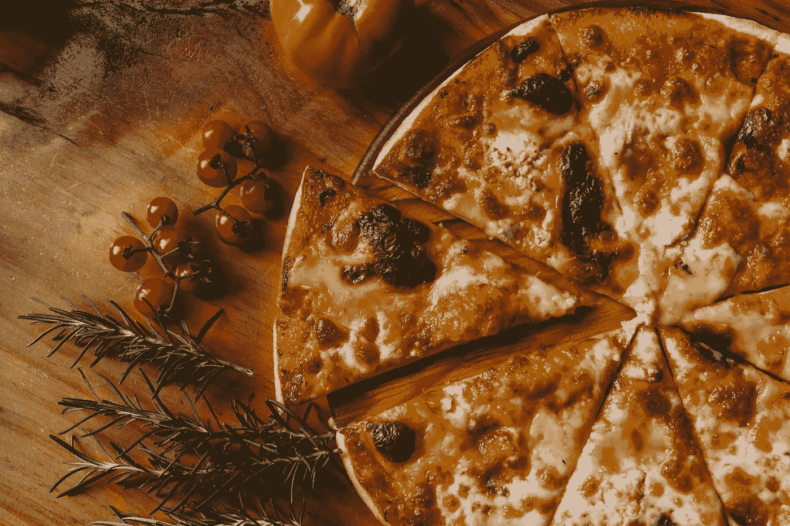

# 我是如何使用 Python 和 Selenium 来获得终身供应的大蒜披萨棒的

> 原文：<https://levelup.gitconnected.com/how-i-used-python-and-selenium-to-get-a-lifetime-supply-of-garlic-pizza-sticks-94abb66b71e1>

## 一个充满好奇心和渴望的学生的故事。

照片由[伊万·托瑞斯](https://unsplash.com/@iavnt?utm_source=unsplash&utm_medium=referral&utm_content=creditCopyText)在 [Unsplash](https://unsplash.com/?utm_source=unsplash&utm_medium=referral&utm_content=creditCopyText) 拍摄

我不知道你怎么样，但是我喜欢比萨饼。尤其是当披萨上有棒约翰自己的大蒜披萨棒的时候。所以当我在完成最近的外卖后，收到他们的如下邮件时，我欣喜若狂:

棒约翰的调查邮件标题

免费食物！我确实需要完成调查…

# 该调查

棒约翰的反馈调查

我以普通人的身份完成了调查，果然，我得到了免费大蒜披萨的验证码。

但是，出于好奇，我又看了看最初的链接。似乎 *GUID* 参数是一个客户标识符。猜猜当我把它改成随机的时候发生了什么？一个全新的调查出现了，等待完成更多的披萨棒。

我可以永远这样做！然而，这似乎不是对我时间的有效利用——让我们引入一些硒魔法。

# 机器人

Selenium Webdriver 是一个浏览器自动化框架，主要用于测试目的。我选择 Python 作为我的语言，并决定使用 Selenium 来制作调查机器人。

## 建立

我跑了`pip install selenium` & `pip install fake_useragent`入门。什么是用户代理？ [MDN Web 文档](https://developer.mozilla.org/en-US/docs/Web/HTTP/Headers/User-Agent)将其定义为:

> 用户代理请求头是一个特征字符串，它让服务器和网络对等点识别应用程序、操作系统、供应商和/或发出请求的用户代理的版本。

随机化这个请求头以绕过任何可能存在的过滤/阻止机制似乎是个好主意——这就是`fake_useragent`的用武之地。

我还需要下载 Chrome 驱动程序，以便与 Chrome 浏览器连接。

## 密码

基本的 selenium 设置如下(使用随机用户代理完成初始化):

随机化了 *GUID* 参数后，机器人打开网页开始点击。我在每个动作之间添加了一秒钟的延迟，以允许页面加载，同时表现得像一个模糊的正常人。

机器人脚本的一部分。

## XPath

XPath 是一种用于从 HTML 或 XML 文档中选择节点的查询语言。对于每个调查问题，我利用了一个实时 XPath 测试工具[来选择机器人要点击的正确节点。当然，我给棒约翰的所有东西都打了五星。](http://xpather.com/#)

XPath 测试

## 不客气！

最后，我们有验证码。

棒约翰的反馈调查

提取验证码。

## 庆祝

经过半个小时的编程，我已经完成了我的 Python 机器人。这里有一个包含代码的[要点](https://gist.github.com/thesanjeetc/2e78ab31047d8c5075e947a0afbe50be)，它是这样的:

# 谢谢约翰爸爸

我在棒约翰收银台输入了每个生成的代码。这就是你想要的——一个潜在的无穷无尽的大蒜披萨棒供应。

给我免费的蒜味面包，给棒约翰市场部的好评。在我看来这是双赢的局面！在这个过程中，我甚至学习了 XPath 并灵活运用了 Selenium 技能。

棒约翰的收银台

但是当然，我没有点任何东西。作为一个有道德的人，我把这个漏洞和概念验证视频一起通知了棒约翰——截至发稿时，他们还没有回应。然而，这项调查已经不起作用了，所以我想他们已经明白了。

顺便提一下，我可以有计划地从英国的每一家棒约翰店订购 1000 份大蒜披萨，然后单枪匹马让棒约翰疯狂一把。你能想象这会引起多大的混乱吗？

我可能是在一个平行宇宙中做的。

**感谢阅读。**