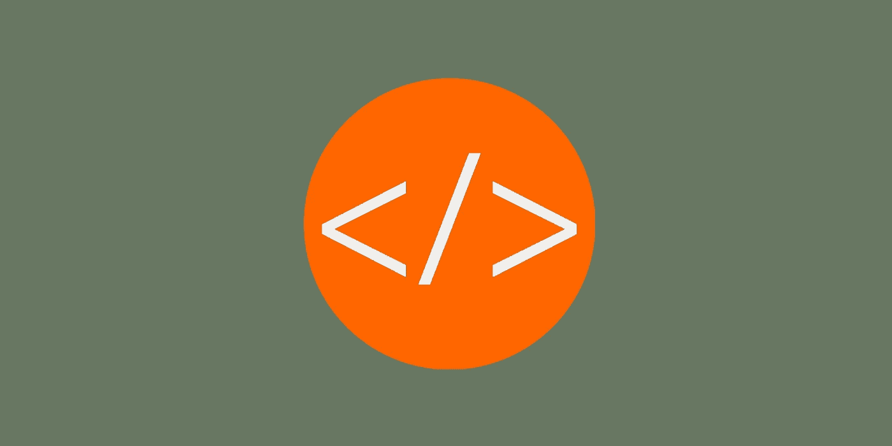

# 我如何在一个月内从“你好世界”变成我的第一个自由客户

> 原文：<https://levelup.gitconnected.com/how-i-went-from-hello-world-to-my-first-freelance-client-in-1-month-2bf56750f2bf>

## 从我的第一行代码到我的第一个客户的路径

图片由 Jovan Cicmil 提供

回到 2011 年，我是一名大学毕业生，对未来的看法非常模糊。我 18 岁时选择的研究领域现在看来是一个愚蠢的选择。尽管这是一个工程学位，但在我的国家，它让我不得不在十几家电信公司中的一家做办公室工作。

这不是我离开高中时所设想的。

然而，我很幸运，在这个时候开始接触编程。我读了一些书，并决定利用大量的空闲时间，我突然不得不尝试建立一个网站。

从那一刻起，一个月过去了，直到我找到我的第一个自由客户。对许多人来说，这个时间框架似乎短得不合理。请继续阅读，了解我是如何做到的，以及为什么在寻找自由职业者之前，你不应该试图成为一名专家。

# **学什么**

这是技术影响者之间激烈争论的问题。有的坚持学习一些特定的框架。有些人坚持读一本特定的书。大多数人坚持让你购买他们的产品，无论是在线课程、教程还是电子书。各种各样的建议让人望而生畏。

简而言之，如果你是一名(非常初级的)全栈开发人员，你需要具备以下基本条件:

*   超文本标记语言
*   半铸钢ˌ钢性铸铁(Cast Semi-Steel)
*   java 描述语言
*   后端语言
*   一个数据库

就是这样。按照这个顺序。现在，你可以对这些领域中的每一个领域学习数年，但仍然不觉得你已经达到了真正的专业水平。如果是这样的话，你可能会问，你怎么能在开始学习的一个月内找到工作呢？通过学习每一种的正确数量。

# **多少才够？**

我将告诉你在找到工作之前，我在每项技能上花了多少时间，以及在每个领域应该关注什么。请记住两件事:

1.  那时我没有工作，每天至少可以花 5-6 个小时在这上面。
2.  找到工作后，学习不会停止。它加剧了。

## **HTML**

我花了一天时间研究 HTML。就是这样。原因是双重的:

1.  HTML 很简单。
2.  我意识到，反正学习后期都会涉及到 HTML。

## **CSS**

我花了 3 天时间试验 CSS 以及它如何应用于各种 HTML 元素。

要理解的关键是各种类型的定位和对齐。颜色、字体等纯审美方面几乎可以瞬间吸收。如果你需要，可以研究更复杂的选项。

## **Javascript**

我花了大约一周的时间学习和练习 Javascript 的基础知识。需要理解的关键是循环、条件、函数、基本语法、如何使用浏览器控制台、客户端和服务器之间的划分，以及如何向服务器发送请求(AJAX)。

一旦到了最后一部分，是时候后退一步，学习后端编程语言的基础知识了。

## **一种后端语言**

我的第一个后端语言是 PHP。对你来说，它可以是你选择的任何东西，但是我建议你选择一个主流的，那里有很多工作和在线文档。PHP、Python 和 Ruby 是一些流行的选择。以后 Node.js 是一个很好的选择，但是我不推荐它作为后端语言。这有两个原因:

1.  Node.js 使用 Javascript 语法，所以你不会受益于学习第二语言。
2.  它是非常面向异步的，对于一个绝对的初学者来说可能是一个太大的挑战。

一旦你选择了一门语言，再次从基础开始:语法、循环、最佳实践。现在是花几天时间阅读一般软件开发最佳实践和面向对象编程的好时机。尝试用您选择的后端语言实现您在那里学到的概念。

然后通过构建一个 Javascript 向后端发送一些请求，后端进行响应，Javascript 通过操作页面、显示返回数据等方式处理响应的应用，来做前端和后端的连接。

这部分学习花了我大约两周的时间。

## **一个数据库**

为了存储和检索数据，你需要一个数据库。我选择了 MySQL，这是当时最流行的数据库。您可以再次选择您想要的任何内容，但是我建议您将它作为一个关系数据库。

您需要学习一些基础知识:可以存储在数据库中的数据类型、读取数据、写入数据、更新记录以及删除记录。然后，您需要了解如何使用数据库表之间的索引和关系。确保您理解了连接的概念，但是您还不需要深入到那个兔子洞。所有这些都可以在任何入门教程中找到。

一旦你了解了数据库的基本知识，把所有的组件放在一起:建立一个带有数据库的小网站，用户可以在那里注册，与服务器通信，在数据库中存储一些数据，并在以后检索。应用程序做什么并不重要。重要的是把你到目前为止积累的所有知识汇总起来。

最后一个阶段我花了大约一周的时间。

# **你能比我做得更好**

在我继续解释我是如何找到工作的之前，我想花一点时间告诉你，如果我重新开始，我会有什么不同的做法。作为初学者，很难知道什么重要，什么不重要。以下是一些我当时认为不重要的事情，但后来证明是重要的。

## 一个好的代码编辑器是你的朋友

我的第一行代码是在记事本上写的。我觉得使用一个漂亮的编辑器除了美观之外没有什么价值。我大错特错了。

一个好的编辑器提供了开箱即用的适当缩进，这在学习循环、条件和语法时很有帮助。它为您选择的语言提供颜色编码，并警告您语法错误。对于不可避免地会犯很多简单错误的初学者来说，这两个特性都至关重要。它帮助您定位错误，以及理解不同的数据类型、变量范围等。

一个好的编辑还会提供许多其他的额外津贴，但是这足以说服你作为一个初学者去买一个。免费的多的是。Sublime 是一个不错的起步选择。

## **获得一个域名**

在大多数机器上设置一个基本的开发环境是很简单的。但是，你也应该立即投资于公共领域，在那里你可以上传你的作品。

这很重要，原因有三:

1.  你会学到一些关于托管公司和域名注册的基本知识。
2.  您将学习如何使用 FTP 和 SSH 与远程服务器通信。
3.  当你有了第一个客户，你需要一种方式向他们展示你的作品。如果您有一个可公开访问的域，您可以在那里为您的项目创建一个测试环境，并将您的客户端链接到它。

## **了解 git**

我在最初的学习时期完全跳过了这一部分。然后，它让我在一个项目上措手不及，我不得不花了几个晚上的时间与之斗争。

采取一些基本步骤来避免这个错误:为您的测试项目创建一个 git repo，学习分支如何工作，理解拉请求、合并和获取。这应该足够让你开始了。

## **不要忽视移动**

当我开始创业的时候，移动浏览器还没有像今天这样流行。但是趋势已经出现了，我应该更加关注 CSS 中的响应性。

今天，这一点尤为重要。移动流量占所有网络流量的一半以上，你构建的任何东西都必须考虑到不同的屏幕尺寸。

# **找工作**

为了找到我的第一份工作，我注册了几个自由职业平台。在此期间，我尝试了不同的方法。大约一年后，我[搬到了 Upwork](https://jovancicmil.com/blog/how-i-made-over-150k-on-upwork) 并在那里呆了很长时间。

我申请了几个小时的小工作，主要是对现有网站进行小的修改和修复小问题。我完全理解这将是一个陡峭的学习曲线，我也这样告诉客户——在每一份工作申请中，我都写着我需要几天时间来完成工作。

几天后，给客户发了十几条信息，我得到了第一个付费项目。我花了三天时间完成它，在这个过程中我学到了很多东西。但是，最大的教训发生在项目完成之后:一切都正常，然而客户却放弃了这个项目，并在我的个人资料上将其标记为未完成。为什么？因为我没有办法展示我的作品。所以，我重申:事先建立一个公共领域。

# **继续前进**

最初的失败并没有让我气馁，我继续努力，很快我就有了一些小项目。职业生涯开始大约 20 天后，我得到了第一份更大的工作:我记得，我要建立一个网站，提供每个地区的房地产经纪人的可搜索数据库。其他的，就像他们说的，都是历史了。

在接下来的九年里，我做了很多东西，我[在每一次迭代](https://jovancicmil.com/blog/the-evolution-of-my-productivity-as-a-freelancer)中都进行了优化。我积累了编程语言的知识，并开始将许多框架和库整合到我的工作中。我从未后悔以这种方式开始——用全栈开发所有领域的基础知识。

我将在以后的文章中写更多关于在职学习的内容，以及适合这种方法的项目/客户。现在的主要观点是:太多的 web 开发人员想在把脚趾浸入水中之前学会游泳。不要成为他们中的一员。鼓起勇气，放手一搏，你会让所有人大吃一惊——包括你自己。