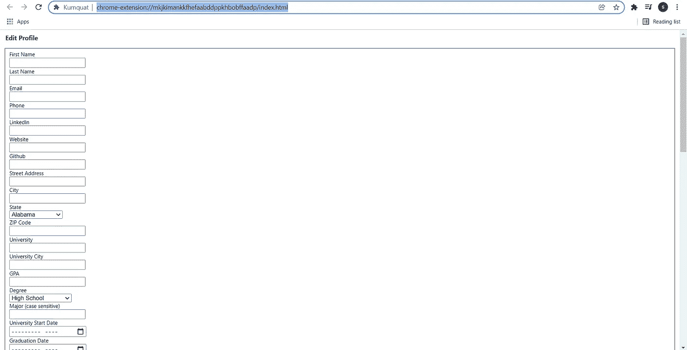

# 我 18 岁时如何在微软工作

> 原文：<https://levelup.gitconnected.com/how-i-worked-at-microsoft-at-18-9e294bd6674a>

马修·曼努埃尔在 [Unsplash](https://unsplash.com?utm_source=medium&utm_medium=referral) 上的照片

我在北卡罗来纳州拜访一位朋友时，接到一个来自华盛顿州的电话。我急切地接起电话，那个声音告诉我他是微软的招聘人员，想祝贺我获得了在**雷蒙德微软总部**担任软件工程师的职位。我简直不敢相信这个消息，几乎不敢相信地摔了手机。

接下来的一周，我的笑容一直挂在脸上——基本上我的梦想实现了。我从来没有想过这一天会到来，这一天我知道我不是什么黑客，我所有的奋斗实际上都有意义。

我也意识到，我收集的所有建议和技巧都来自业内的朋友。我在网上找不到任何关于**具体技巧的资源；我知道我需要一份简历，有时需要一个大学学位和基本的面试技巧，但是接下来呢？**

> Z 公司更喜欢 X 还是 Y？如果我编程考试不及格，他们会拒绝我吗？我在面试中应该更讨人喜欢还是更有逻辑？

# **准备申请——个人项目**

在我开始考虑申请过程之前，我想确保我已经准备好了所有的东西。我对自己的**简历**不满意*也没给*留下好印象，我想改进一下。任何人都可以将他们在项目中编写的一行代码变成“面向团队的机器学习软件工程师”，所以我想脱颖而出。

我问在两个适马工作的朋友，是什么让我的项目脱颖而出，他是这么说的

> 公司喜欢数字，如果你能更好地证明它们。你应该为几乎所有的项目寻找具体的度量标准:显示人们下载并使用它们。发布和宣传你的作品，在简历上写上你有 30，000 次下载，10，000 个并发用户，等等。

做你喜欢的事情是最重要的，但是如果你能把它变得有用并且可以发表，那就是金星！我用来寻找合适项目的过程如下:

*   找到一个你可以用技术解决的利基
*   确保没有一个[自由/开源软件](https://en.wikipedia.org/wiki/Free_and_open-source_software#:~:text=Free%20and%20open%2Dsource%20software%20(FOSS)%20is%20software%20that,the%20design%20of%20the%20software.)项目在解决同样的问题。是否存在专有解决方案并不重要
*   确保这个项目是可行的，也就是说，不要试图创造一个可以从一张黄瓜照片中说出你母亲娘家姓的 ML 模型
*   完成项目
*   仔细检查项目，使代码可读或添加注释
*   [**做个自述**](https://docs.github.com/en/repositories/managing-your-repositorys-settings-and-features/customizing-your-repository/about-readmes) **！如果没有自述文件或类似文件，大多数人不会对你的项目多看一眼**
*   在各种网络社区做广告。

一旦你有了一个适销对路的发布项目，开始添加你的统计数据吧！我的 GitHub 上有一个这个过程的例子。

 [## GitHub-saleguas/上下文菜单:💻一个 Python 库，用于创建和部署跨平台的本机…

### 一个 Python 库，用于创建和部署跨平台的本地上下文菜单。通过 pip 安装库:python -m pip…

github.com](https://github.com/saleguas/context_menu) 

# **准备申请—简历**

这听起来可能很蠢，但确保你的简历不是很好，笨蛋。我曾经有一个朋友给我看她的简历，那是一个 5 页的 word 文档，上面写着她曾经取得的每一项成绩，包括中学。

> 请不要包括中学的东西。

我写的前几份简历糟糕透顶，充满拼写错误和其他错误。我不是招聘人员或简历专家，但我有朋友是。你不需要擅长制作简历来拥有一份好的简历。请你的朋友、同事、同事，任何人都来看看你的简历。继续问，直到你得到的唯一反馈是语法或布局上的微小变化，因为这表明你的简历总体上是可靠的。

我有一些基本的简历技巧:

*   [如果埃隆·马斯克有一页纸的简历](https://novoresume.com/career-blog/elon-musk-one-page-resume)，你也可以。
*   包括姓名和某种联系方式。
*   你应该使用一个模板。

# 为申请做准备——编码面试练习

照片由 [LinkedIn 销售解决方案](https://unsplash.com/@linkedinsalesnavigator?utm_source=medium&utm_medium=referral)在 [Unsplash](https://unsplash.com?utm_source=medium&utm_medium=referral) 上拍摄

我这辈子没看过编程书，也没上过竞技编程的课程。我是一个非常注重实践的学习者，对我来说，最好的练习方式就是不停地编码。

> 我推荐完成 [LeetCode 十大简单面试问题](https://leetcode.com/explore/interview/card/top-interview-questions-easy/)和[leet code 100 大中等面试问题](https://leetcode.com/explore/interview/card/top-interview-questions-medium/)。

他们能问你的面试问题只有*那么多*。从字面上看，有*无限*。然而，大多数公司都会重复问题，尤其是来自 HackerRank 或 LeetCode 等网站的问题。你解决的问题越多，你看到你以前做过的问题的机会就越大。在我几乎所有的编程面试中，我看到**至少有一个问题**与我以前解决过的一个问题非常相似。

我并不是说这是最好的准备方案，而只是对我帮助最大的一个。我认识一些人，他们从书上收集了他们所知道的一切，并在面试中表现出色。然而，如果你像我一样，那么你可能会发现这种方法比其他方法更令人耳目一新。

当谈到编程面试的细节时，这篇文章没有足够的篇幅来详述它。有整本书和一系列关于如何破解编程面试，所以我现在能给的最好的建议就是练习。

# 应用程序游戏——以及如何玩

您的申请过程可以分为四个不同的主要类别，从难度最小到最大排列如下:

*   高中
*   大学本科生
*   新毕业生(几个月前毕业，正在找工作)
*   研究生院
*   常规(其他一切)

不是所有的公司/项目都会提供这些类别，但是我会给他们一个大概的分类。

> **重要提示**:这只是我的看法。我根据我的同龄人和我自己的经验把这些信息放在一起。很有可能你的会不同。

**高中:**这里的要求宽松多了，因为你是青少年。具有讽刺意味的是，这些项目对于大公司(彭博、微软、谷歌)来说是相当挑剔的，因为很多有上进心的高中生申请了这些项目。几乎任何个人项目都可以在这里进行，因为他们并不真正期望完全公开的项目。

*   **编码难度:**无/容易
*   **所需经验**:无-非常少
*   **面试难度:**中等
*   机遇:一些大公司，通常是本地公司。

大学本科:目前最容易得到的职位。几乎所有的财富 500 强公司都想雇佣聪明的即将毕业的学生为他们工作。这是我上大学的主要原因，因为它让获得一份高端软件工程工作变得更加现实。PittCSC 是一个 GitHub 组织，发布[非常广泛和详细的关于实习的列表](https://github.com/pittcsc/Summer2022-Internships)。如果你是本科生，我强烈建议你使用它。

 [## GitHub-Pitt CSC/Summer 2022-实习:2022 年夏季科技实习集锦！

### 使用此报告分享并跟踪 2022 年夏季的软件、技术、CS、PM 和 quant 实习。由…维护的列表

github.com](https://github.com/pittcsc/Summer2022-Internships) 

*   **编码难度:**容易/中等
*   **所需经验**:没有/很少
*   **面试难度:**容易/中等
*   **机遇**:基本上无处不在

**新毕业生:**我在这方面没有太多经验，但从经历过这个周期的同龄人来看，它非常接近本科，但有更难的编码问题。这是一个短暂的时间窗口，但非常有利可图。我也强烈推荐访问一个新的毕业生名单，比如这个。

 [## GitHub-coderQuad/New-Grad-Positions-2022:SWE、Quant……

### SWE、Quant 和 PM 中新毕业生全职角色的集合。-GitHub-coderQuad/New-Grad-Positions-2022:A…

github.com](https://github.com/coderQuad/New-Grad-Positions-2022) 

*   **编码难度:**中/硬
*   **所需经验**:一些
*   **面试难度:**中等
*   **机遇**:基本上到处都是++的

**研究生院:**我在这里也没什么经验。它类似于新毕业生，但通常有更多以研究为重点的机会。

*   **编码难度:**中/硬
*   需要的经验:一些
*   **面试难度:**中等
*   **机会**:有的地方，很多研究的地方。

**一般**:目前为止最难的；你可以从顶级科技公司那里得到一些非常不可能的期望。机会可能会因为你是否有学位而受到限制，但这因公司而异。

*   **编码难度:**中等/不可能
*   需要的经验:一些/很多
*   **面试难度:**中等/不可能
*   **机会**:每个公司

# 应用程序游戏——加速流程

申请公司有两个主要途径:**人脉和数字**。

社交是一种更注重质量而非数量的方法，你可以参加活动或在 LinkedIn 上给人发消息以获得推荐。你甚至可以向在理想公司工作的朋友或同事要一个。招聘人员推荐基本上是进入至少一次行为面试的保证渠道。

**数字:**是我称之为数量重于质量的战略，我曾将其应用于公司。这是我最初使用的策略，也是我用来在**微软获得职位的策略。**

你要做的是找到一份财富 500 强(或其他)公司的名单，并按此行事。

> 第一条规则:如果你手动申请每个职位，那你就错了！

加快数字游戏的速度非常容易，只需下载如下浏览器扩展:

 [## 金橘

### 一键自动填写工作申请

chrome.google.com](https://chrome.google.com/webstore/detail/kumquat/mkjkimankkfhefaabddppkhbobffaadp?hl=en)  [## 自动填写工作申请表

### 最先进的工作申请表格自动填充！

chrome.google.com](https://chrome.google.com/webstore/detail/autofill-job-application/kbgfilncepjeoodogmebahnloidgaibg?hl=en-US) 

> 免责声明:我与这些特定的扩展没有任何关系。我不负责任何可能的损害，我不知道创造者也不知道源代码，只有我推荐他们，因为我用他们来申请工作。永远小心你下载的任何软件。

这些应用程序中的大多数只需要你在一个在线表格中填写一些申请数据，他们会自动将你的信息写入热门的工作页面(我的工作日，温室等。)

金桔的个人信息页面

# 应用游戏——面试

不，不是那部塞斯·罗根的电影。最后的成败在于能否得到甜甜的 FAANG 提议。

我的面试方法与我的同龄人大相径庭。在技术面试中，我尝试了许多不同的策略，我找到了一个始终有效的特定策略。

> 做人！

我怎么强调这一点都不为过。对于大多数地方(也许不是邪恶的 quant 公司)，面试官也是人，听一个单调的计算机科学家漫谈他们创造的一些 ML 项目可能会很有趣，但更好的是保持清晰。

这里有两个让我看起来更人性化的小技巧:

*   真诚地谈论你的一天。不要胡编乱造*(除非你喜欢杀人)*，实实在在说出你的感受。抱怨你的室友，谈谈你那天做的一些有趣的事情等等。
*   **破劲**。我在面试中说的第一件事总是一些有趣或轻松的事情，比如说我穿了我最喜欢的香蕉袜子。他们通常会露出笑容，在整个面试过程中变得更加友好。
*   **要自信。这与其说是对人类的提示，不如说是一种必需。如果你不自信或者说话结结巴巴，你将会在所有事情上经历一段更加艰难的时期。**

# 结论

让我们很快结束一切:

*   有一个令人印象深刻的、市场化的个人项目
*   尽可能地强化你的简历
*   编码面试的实践
*   找到空缺职位的列表
*   或者网络或者使用工具来应用它们
*   在面试中要有人情味和自信

> 请记住，这些信息完全基于我和我周围的人的经验。我相信你可以找到无数的例子来反对我给出的任何建议。我简单地写下了我希望在开始申请时就知道的事情。

也就是说，我祝你在求职中好运，非常感谢你花时间阅读我的文章！