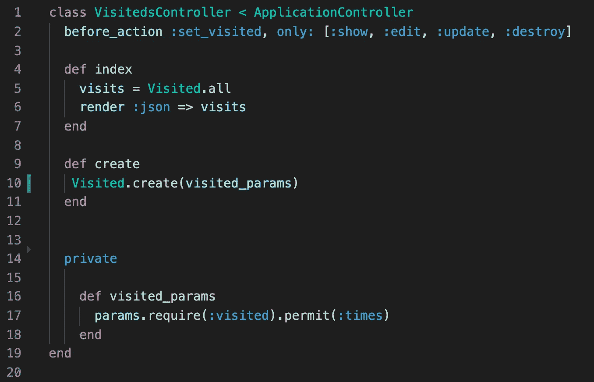
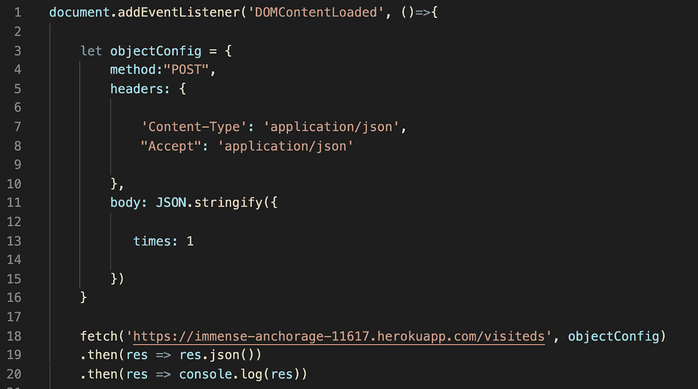

# 我如何编写一个 Javascript 程序来统计我的网站的所有访问量

> 原文：<https://levelup.gitconnected.com/how-i-wrote-a-javascript-program-to-count-all-visits-to-my-website-a075b29752a9>

# 介绍

几个月前，当我建立我的投资组合网站时，我意识到我花费了大量的时间来建立一些甚至可能不会被看到的东西，所以为了知道我的网络策略是否有效，我决定写一个程序来计算我在我的网站上的每次访问。在这篇文章中，我将解释我是如何做到这一点的，以及我必须采取的步骤。

# 它是如何工作的

该程序的工作方式是，每次有人加载我的网站时，都会向 Heroku 服务器发出 HTTP post 请求，我在那里有一个实时 Rails 后端数据库，它将创建一个名为“visited”的对象。每次创建一个对象时，都会给出一个新的 id，所以最后创建的对象的 id 将是我的网站被访问的次数。现在 Rails Heroku 后端也已经设置好了，这样每次我向服务器发出 fetch 请求时，我都会以 JSON 格式获取我的所有对象，以便于阅读。

## 设置数据库模型

所以，我做的第一件事是设置一个 Rails 后端，在那里我可以在每次页面加载时发送一个 post 请求，我创建了一个名为 Visited 的没有属性的类。我使用了 Rails 的“generate resource ”,它会自动为您的类创建控制器、模型、测试和迁移文件。在控制器内部，我真正需要的是一个索引和一个创建方法。控制器看起来像这样:

忽略参数。我用一个名为 visited 的属性创建了这个模型，但是后来我意识到我实际上并不需要它。

最后一步是在任何服务中托管你的 Rails 程序，我用的是 Heroku。

## JavaScript

这部分是最容易的。我简单地在文档中添加了一个“DOMContentLoaded”事件监听器，并在里面放了一个来自 [fetch API](https://developer.mozilla.org/en-US/docs/Web/API/Fetch_API/Using_Fetch) 的“Fetch()”函数，它将在每次页面加载时发出 post 请求。不要忘记在 HTML 文件中包含 JS 脚本文件。JS 文件如下所示:

同样，忽略主体键中指定的“times”属性，我真的不需要在后端创建 times 属性。在这里，您可以看到我是如何简单地添加事件侦听器和 fetch()调用的，我添加了 console.log 只是为了测试 post 请求是否工作。

就是这样！每次我访问 Heroku URL 时，我都能看到一个 JSON 格式的散列，每个对象都是访问过我页面的人。

# 结论

这个项目真的帮助我弄清楚我发送给人们的信息是否足够吸引他们来查看我的作品集网站。这个程序有一个缺陷，那就是如果有人重新加载页面，该程序将发出一个 post 请求，并增加一个计数，而实际上只有一个人看了这个网站，而不是两个，但即使有这个缺陷，我也能看到每次有人加载我的作品集。我希望你觉得这篇文章有趣和有帮助，感谢阅读！