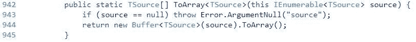
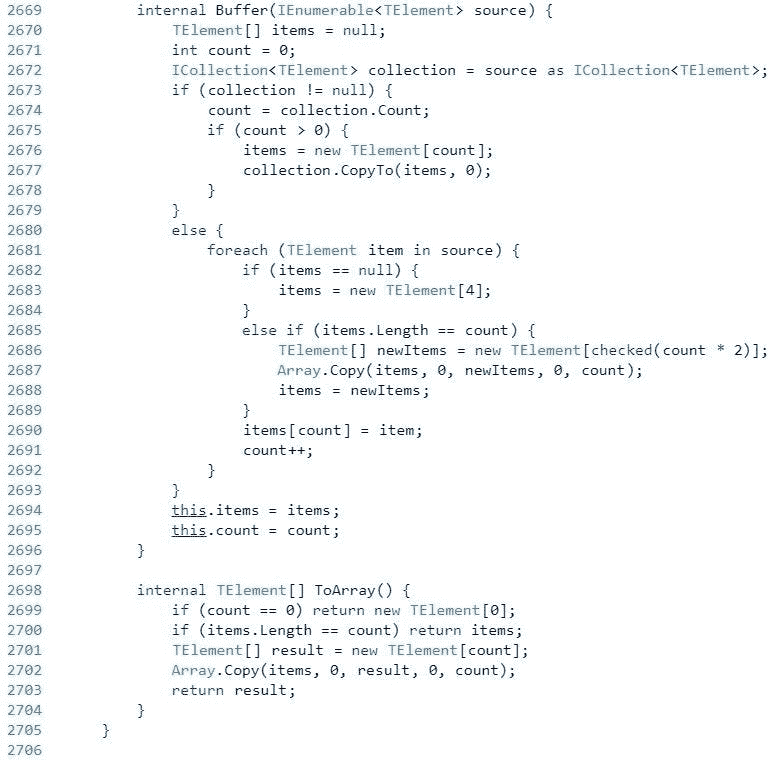
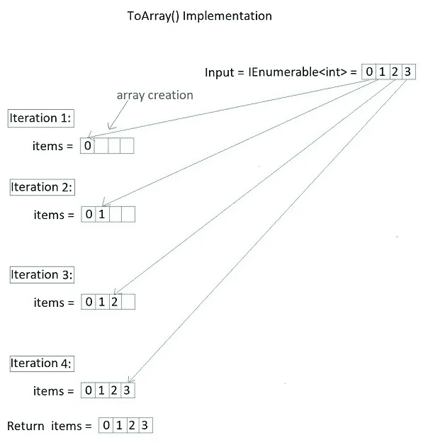
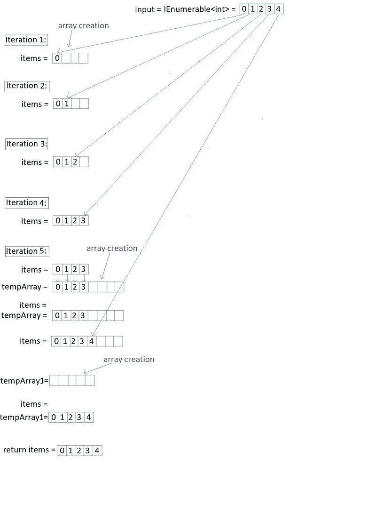

# 多么可爱。ToArray()有效

> 原文：<https://levelup.gitconnected.com/how-ienumerable-toarray-works-4bb7a2cabada>

## 英寸 NET Framework 4.x

这是一个 [2 部分](https://medium.com/@DavidKlempfner/how-ienumerable-tolist-works-c119a4572c1e)系列的第 1 部分，讨论`ToArray()`和`[ToList()](https://medium.com/@DavidKlempfner/how-ienumerable-tolist-works-c119a4572c1e)`如何在幕后工作，以及哪一个更高效。

# ToArray()源代码

以下摘自[。NET 源代码](https://referencesource.microsoft.com/#System.Core/System/Linq/Enumerable.cs,942):

## 代码摘要

下面是所用逻辑的总结:

**是** `**IEnumerable<T>**` **的一个** `**ICollection<T>**` **(即。它有** `**Count**` **属性吗？).如果是:**

1.  将`IEnumerable<T>`转换为`ICollection<T>`
2.  创建一个与`ICollection<T>`大小相同的新数组
3.  使用`CopyTo()`方法将项目从`ICollection<T>`复制到这个新数组中。

**是不是** `**IEnumerable<T>**` **不是一个** `**ICollection<T>**` **(即。真是一个普通的老** `**IEnumerable<T>**` **？).如果是:**

1.  创建一个长度为 4 的新数组
2.  对于`IEnumerable<T>`中的每个元素，将该元素加载到数组中，每次数组被填充时，创建一个两倍于前一个数组大小的新数组。
3.  一旦完成，如果数组的大小等于`IEnumerable<T>`中元素的数量，那么返回数组。
4.  如果数组的大小不等于`IEnumerable<T>`中元素的数量，即。数组的长度大于`IEnumearble<T>`中元素的数量，这是大多数情况下的情况，然后创建一个新的数组，其大小为`IEnumerable<T>`的大小，并将数组中过大的元素复制到这个大小完美的数组中。

# 例子

让我们看一些例子，从创建的临时阵列的数量来理解最好和最坏的情况。

在这些例子中，`IEnumerable<T>`源不是`ICollection<T>`。

## 示例 1 —最佳情况:

在最好的情况下，源`IEnumerable<T>`有 4 个元素，`foreach`循环从索引 0 到索引 3 计数，将来自`IEnumerable<T>`的每个元素放入长度= 4 的数组中。

因为它只到达 index = 3(即 count = 3)，`else if`块永远不会被执行，数组大小永远不会翻倍。

它也不需要创建一个大小合适的数组，因为它已经是一个大小合适的数组了。

然后它会将这个数组返回给`ToArray()`的调用者。

**在这个例子中，只创建了一个数组实例。**

这是一个流程图:

## 示例 2 —最坏情况

当`IEnumerable<T>.Count`为> 4 且临时双倍大小数组未被填充时，创建以下数组:

1.  一个在开始，大小为 4。
2.  在`else if`块中至少还有一个，创建一个两倍于先前大小的数组。
3.  一个是在最末尾，创建一个大小适合所有`IEnumerable<T>`元素的数组。

**所以在最坏的情况下，创建的数组数量是> = 3。**

点击[此处](https://medium.com/@DavidKlempfner/how-ienumerable-tolist-works-c119a4572c1e)查看第二部分。