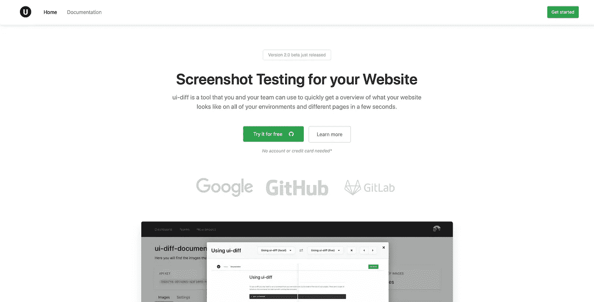

# 我如何建立自己的视觉测试库

> 原文：<https://levelup.gitconnected.com/how-im-building-my-own-visual-testing-library-31a4f3bd127>

ui-diff.com 的登录页面

我在瑞典的一家大型公司做全栈网站开发。当时我正在为公司管理网站，内置 React 和 Typescript。在一次部署之后，有一天我们意识到我们已经完全打破了我们网站上一个页面的风格。我们回滚，修复它，并再次部署。

这种情况发生了几次，开始变得相当烦人。我想要一种方法，只需几次点击就能快速检查网站的所有页面，并捕捉任何设计倒退。那年早些时候，我在斯德哥尔摩参加了一个会议，会上一个人展示了一款名为 Happo.io 的工具，承诺对前端组件进行设计测试。这并没有真正达到我想要的效果。我想将我的整个页面与不同的环境进行比较，以便能够发现任何倒退。

在这个时候，我决定在网站上建立一个工具，只能从一个特殊的链接，只有在开发模式下才能达到。我用木偶师浏览了所有页面，并将图片上传到特殊的网址。在那里，我可以在一个大窗口中打开它们，查看是否出现了任何设计倒退。这帮了我大忙，它看起来像这样:

在这之后，我决定实现在不同环境下截图的可能性。例如，假设你有一个本地版本的网站运行在 [http://localhost:3000](http://localhost:3000) 上，还有一个实时版本运行在【https://yourwebsite.com】的[上](https://yourwebsite.com)。然后，如果能够快速地将你网站上的所有页面与环境进行比较，找出设计中的任何倒退，那就太好了。结果是这样的:

# 打破它

过了一段时间，我意识到这可能不需要存在于网站本身，而是存在于一个完全独立的平台上，你可以去那里检查结果。为此，设立了 3 个不同的项目。

*   供用户安装的 NPM 模块
*   平台的后端
*   平台的前端

让我们开始分解 NPM 模块

# 供用户安装的 NPM 模块

这是我想说的最难的部分。虽然我已经有了一个来自网站代码的脚本，我可以开始使用，但我需要以某种方式将截图保存在云中，然后在数据库中保存对它们的引用，以便一些前端可以获取并为用户显示它们。为了上传图片到云端，我使用了 Cloudinary API。这是从后端项目完成的，后端项目从最终用户项目的 NPM 模块接收直接的缓冲区。NPM 模块真正做的事情如下:

*   使用请求的用户配置设置请求
*   启动无头/全浏览器
*   验证并循环浏览用户请求的页面
*   截图
*   将截图发送到后端

# 平台的后端

因此，随着 NPM 模块循环，截图，并发送截图图像，后端需要以某种方式采取这些图像，上传，然后将它们保存到数据库中。这是使用 Cloudinary API 进行图像托管，使用 DeepAI API 进行图像相似性分类。以下是后端对图像的处理。

*   设置云二进制配置
*   将图像上传到 Cloudinary
*   将新图像与旧图像进行比较
*   从 Cloudinary 和数据库中删除旧映像
*   将新图像添加到数据库中

# 图片上传

后端做很多其他后端 API 通常做的事情。比如:

*   创建和验证用户
*   创建团队、邀请成员、更新成员角色
*   管理项目
*   创建、删除和更新 API 密钥…

使用 Node.js、Express、REST 和 MongoDB 为数据库构建后端。这是一个我非常擅长的堆栈——尽管如果我要重新构建一切，我可能会选择 GraphQL。

# 平台的前端

前端也是使用 Javascript 构建的。它使用了 Typescript、React 上下文 API 和 axios-hooks(用于 http 请求)。前端由相当多的页面组成，为人们测试他们真正的项目和应用程序创建一个合适和稳定的前端。前端是你创建多个项目的平台。每个项目都有一个 api 密匙。这意味着你可以用它来截图测试你所有不同的项目，并在平台上不同的地方获得图片。仪表板视图如下所示:

# 仪表盘

# 项目页面

正如您在这里看到的，我们的图像周围有一个红色边框。这意味着图像不同于以前的图像。如果我们打开它，我们可以在不同的环境之间进行比较，也可以来回浏览图像。

# 更多功能

*   注册
*   仪表盘
*   排序和过滤项目
*   项目页面
*   创建项目
*   编辑项目
*   新 API 密钥
*   轮廓
*   组
*   创建团队
*   邀请成员
*   更新成员角色
*   编辑团队
*   注销

# 尝试一下🌟

这个项目我已经做了很长时间了。现在它完全免费使用。这是因为我想看到你们开发者的反应，并找到进一步改进的方法。它也是开源的，所以如果你愿意的话，可以考虑投稿！

[https://ui-diff.com](https://ui-diff.com)