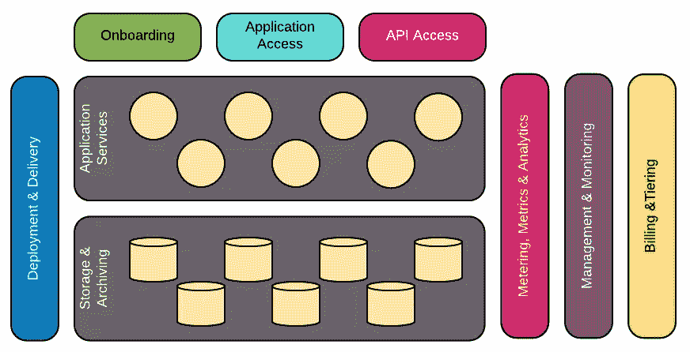

# SaaS 产品是如何构成的？

> 原文：<https://levelup.gitconnected.com/how-is-a-saas-product-structured-ff50109d300c>

## 软件即服务(SaaS)产品现在非常普遍。“云”的兴起为他们的持续成功提供了完美的媒介。但是，一个伟大的 SaaS 产品的建筑基石是什么呢？

我从事 SaaS 产品已经好几年了，现在我发现自己负责 [ResponseTap](https://medium.com/responsetap-engineering) 产品的架构和交付。在这段时间里，我很幸运地学到了一些坚实的建筑原理，并将它们付诸实践。

这些原则中包括构成任何 SaaS 产品的通用高级构建模块。理解这些构造块是什么，对于您的架构和设计来说是非常重要的。

格雷格·法罗摄影

# 积木

格雷格·法罗制图

SaaS 架构可能由 9 个概念资产组成:

## 部署和交付

这些组件负责将你的产品从你电脑上的想法和代码变成一个真正的产品。这包括以下内容:

*   用于部署代码的工具
*   这些工具的安全角色
*   基础设施即代码(IaC)

## 入职

当一个新用户注册了 SaaS 的产品，就会引发一系列事件。根据产品的不同，创建几行数据可能很简单。在更复杂的产品中，这可能意味着更重要的事情，也许是部署新的基础设施或扩展现有资源。

## 应用程序访问

拥有一个优秀的用户界面是 SaaS 产品的必备条件。前端及其任何支持资源。

## 应用程序接口

现代 SaaS 产品越来越支持与第三方的集成。API 层使这成为可能。

## 计量、指标和分析

SaaS 产品的透明度至关重要。了解用户如何使用产品以及这如何影响性能、成本和用户体验是至关重要的。

## 管理和监控

这既是在*计量、指标&分析*中收集的数据的抽象，也是额外的日志记录数据。这些服务将确保产品能够针对流量水平适当地放大和缩小，并且能够识别错误和不当行为并发出警报。

此外，还会强制实施任何与层相关的限制。

## 计费和分层

该产品通常会提供多个定价等级，每个等级都有使用限制(例如每天的操作次数)。一旦定义，任何订阅这些层的用户都需要准确计费。

## 产品:应用服务

这是魔尘🧙‍♀- ️the 的灵魂产物。这是产品的 IP 所在。

## 产品:存储和归档

该产品将需要存储数据，并根据其要求对数据进行归档。

# SaaS 快乐！

你有它！9 个建筑块中的 SaaS 建筑。

如果您正在构建或维护一个 SaaS 产品，了解并理解这些元素非常重要，并确保您考虑了所有这些元素。

每一款 SaaS 产品都是不同的，都有其独特的挑战。然而，如果你能识别产品的一般元素，那么你就能从他人的学习和研究中获益。这样可以避免你不得不去解决别人已经解决的问题。

最终，你可以自由地专注于你真正想做的事情。构建一个伟大的产品！