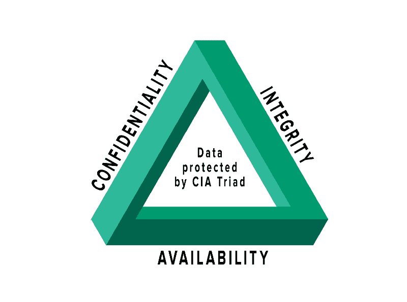

# 网络上的数据是如何保密的？

> 原文：<https://levelup.gitconnected.com/how-is-data-on-the-web-being-kept-secret-cc7687cea3d7>

谢尔盖·佐尔金在 [Unsplash](https://unsplash.com?utm_source=medium&utm_medium=referral) 上拍摄的照片

2021 年创建的数据量达到了 **74 兆字节**。是的，你没看错 zettabytes！前一年，每个用户每秒钟产生 1.7 MB 的数据。几乎是预计的 2018 年的三倍。考虑到去年创建的大量数据，本文介绍了可能发生的攻击。数据对公司、第三方、分析师、黑客至关重要..有些数据可能非常珍贵。每个人都想被填鸭式喂养，所以作为用户和程序员，让我们尽可能地了解更多。

根据 Statista..

> **截至 2021 年 1 月，全球共有 46.6 亿活跃互联网用户，占全球人口的 59.5%。其中，92.6%(43.2 亿人)通过移动设备访问互联网。**

 [## 2021 年世界互联网用户|统计

### 截至 2021 年 1 月，全球共有 46.6 亿活跃互联网用户，占全球人口的 59.5%。的…

www.statista.com](https://www.statista.com/statistics/617136/digital-population-worldwide/) 

了不起！

互联网是不可信的数据传输媒介。我们知道这一点，但我们似乎并不在乎。我们可以得出结论，所有这些内容的交换应该是非常安全的。但是是吗？出于这个原因，我深入研究了模糊的网络攻击，并介绍了密码学作为一种有效的防御手段。

我们从早到晚都在使用手机、笔记本电脑、平板电脑、台式机和智能设备。现在，让我们想象一下，每一个上网的人每年都会产生多少数据。了不起！

那么一个 zettabyte 值多少钱呢？一万亿千兆字节。根据思科的文章[zetta byte 时代正式开始(多少钱？)](https://blogs.cisco.com/sp/the-zettabyte-era-officially-begins-how-much-is-that)

> 一个 zettabyte 等于一个 60 亿字节或 1021(10 亿，000，000，000，000，000)字节，或者，一个 zettabyte 等于**一万亿千兆字节**。

这里有很多零要考虑！

在 zettabyte 时代，网络安全是一个至关重要的领域。2016 年收集了第一批 zettabyte，这个时代开始了，据估计互联网流量达到了 1.3 ZB(链接)。确实如此。根据这篇文章，zetta 可以发生许多令人惊奇的事情。

> "如果一个 Zettabyte 中的每一 TB 是一千米，那么它就相当于往返月球 1300 次(768800 千米)"
> 
> Shruti Jain(思科公司高级分析师)

在这里找到思科的文章

 [## Zettabyte 时代正式开始(那是多少钱？)-思科博客

### 十多年来，思科一直跟踪和预测全球互联网流量的增长和相关的网络趋势…

blogs.cisco.com](https://blogs.cisco.com/sp/the-zettabyte-era-officially-begins-how-much-is-that) 

但是数据以什么形式传播呢？考虑到每天都有数量惊人的数据被传输，它们必须以一种确保其保密性的方式传输，这一点至关重要。在这篇文章中，我们将了解数据是如何保密的，密码学的基础知识和一些最常见的可能发生的网络攻击。

如果你想学习计算机通信的基础知识，你可以回顾一下我以前的文章“计算机如何相互通信？”。你可以学习计算机网络如何工作，并通过 OSI 层了解数据传输的表面。

 [## 计算机是如何相互通信的？

### 了解每次单击发送按钮时会发生什么。数据去哪里了？

levelup.gitconnected.com](/how-do-computers-communicate-with-each-other-50636acbeb4c) 

接下来，让我们一起来探索我们真正谈论的数据量，探索 2021 年数据增长的统计数据。互联网人口达到全球人口的 65%。同年活跃用户达到**51.7 亿人。**那么一分钟内创建的数据量有多大？

**让数字说话。**

*   用户在亚马逊上花费了 283.000 美元
*   148，000 条消息在空闲时间发送
*   用户在脸书上分享了 240，000 张图片
*   575，000 用户在 Twitter 上发布了推文
*   Youtube 上 694.000 小时的视频流
*   网飞河 453.000 小时
*   570 万次谷歌搜索
*   668，000 条用户发送的不和谐消息
*   Zoom 上举办的 856 分钟网络研讨会

更多信息请点击此处查看 Domo 的信息图和《视觉资本家》的调查。

 [## 从亚马逊到 Zoom:2021 年的互联网一分钟

### 在信息时代，注意力是越来越有价值的货币形式。2021 年，少数公司站在…

www.visualcapitalist.com](https://www.visualcapitalist.com/from-amazon-to-zoom-what-happens-in-an-internet-minute-in-2021/) 

这些数字既惊人又可怕。

您可以假设在数据传输过程中存在许多威胁和攻击。数据库可能被破坏、操纵并暴露有价值的数据。这些数据对每个攻击者来说都是一种享受。

网上什么都可以曝光。

## 问题场景

> x 想给 y 传递一个信息，就这么简单。数据包必须从一个点传输到另一个点，并通过不确定且不可信的介质(互联网)传输。
> 
> 我们怎样才能确保这条信息的保密性呢？
> 
> 我们如何认证用户并确保他们作为发送者和接收者的身份？
> 
> 我们怎样才能发现信息的任何变化？

让我们呼出它

…并介绍**密码术**。

密码术是网络安全使用的一套技术，并且确保消息的内容可以保密。网络安全衡量威胁和漏洞。一个可能的威胁是网络攻击。为了避免攻击者接触到潜在的数据，系统必须非常安全。密码术的任务是将明文转换成密文，将文本转换成不可读的格式。使用加密和散列算法、私钥和公钥来保持上下文的秘密和安全。

根据《应用密码学》一书

> 密码术的全部要点是保持明文(或密钥，或两者)不被窃听者(也称为对手、攻击者、拦截者、闯入者、入侵者、对手，或简称为敌人)窃取。假设窃听者可以完全访问发送者和接收者之间的通信。

如果我们想要一个安全的媒介，那么加密技术必须在任何地方应用。应用、路由、开发和运营。我们需要安全传输。回到我们之前的消息交换的例子，让我们注意一些重要的方面。其中一些是加密/解密，认证和授权是开始解决问题和防止数据泄露的主要关键。

问题场景解决方案:

在[https://www.okta.com/identity-101/asymmetric-encryption/](https://www.okta.com/identity-101/asymmetric-encryption/)发现的图像

下面这篇文章按时间顺序解释了加密的历史。

 [## 加密简史

### 当您在网上购物或办理银行业务时，加密可以保护您的个人数据安全。它扰乱数据，像你的…

www.thalesgroup.com](https://www.thalesgroup.com/en/markets/digital-identity-and-security/magazine/brief-history-encryption) 

> 对称加密、不对称加密和散列函数。

**对称加密**只使用一个密钥来加密和解密数据。发送方和接收方使用相同的密钥。如果这个密钥被暴露，那么数据也被暴露，因为它是真相的一个来源。这不是一个有效的解决方案，但它比不对称加密更快。

**不对称加密**使用两种不同的密钥。与对称加密相反，发送方和接收方拥有自己的公钥和私钥。他们用公钥加密消息，用私钥解密。它更慢，因为它更复杂，但更值得信赖。

因此上述问题场景中的用户可以使用这种加密。x 用户用公钥加密消息并发送给 Y，然后 Y 用他们的私钥解密消息并读取其内容。如果想要回复，则用他们的公钥加密一个新消息，并将其发送给 x。加密算法被提议给更强、生成更大的随机值并且更安全的非对称加密算法。

**哈希函数**生成一个唯一的固定长度值，该值是随机的，并保护数据，使其身份唯一。使用散列函数的优点是，它可以验证消息是否与其先前版本相同，并检测可能的更改。

> 首先我们加密，然后我们散列！

现在我们知道了密码学的基础知识，让我们来探索一下 CIA 三人组。根据《应用密码学手册》一书，术语密码学被解释为

> …研究与信息安全相关的数学技术，如机密性、数据完整性、实体认证和数据源认证。

但是，机密性、数据完整性和可用性这些术语是什么意思呢？

**中情局三人组**是网络安全的高潜力。让我们开始吧。

图片来自[https://www . F5 . com/labs/articles/education/what-is-the-CIA-triad](https://www.f5.com/labs/articles/education/what-is-the-cia-triad)

**保密性**

保护数据免受未经授权的**访问**。只有授权用户才能查看资源的上下文。例如，只有具有适当权限的用户才能访问用户详细信息页面、查看特定数据(如信用信息)或登录应用程序的特定部分，而不是受限部分。机密性确保通信或数据的保密性，防止第三方访问。认证和授权过程提供了保密性。

**完整性**

保护数据免受未授权的**操作**。只有授权用户可以编辑他们的详细信息或向他们的联系人发送消息。如果应用程序违反了机密性，那么完整性就是第二道防线，它可以通知我们数据是否发生了变化。完整性增加了一些额外的措施，使得检测数据状态更加容易。哈希是一种使用唯一的随机值来验证数据完整性的方法。哈希值可以与先前数据的哈希值进行比较。如果比较相似或不相似，那么我们可以确定数据的状态是否随着传输而改变。数字签名是另一个伟大的措施，它确保发送者或接收者的身份，并确保消息不会被更改，因为如果数据在某个阶段发生变化，签名会受到影响并被更改。额外的简单提示:从网上下载软件时检查哈希。例如，如果散列不相同，那么有人可以向其中添加恶意脚本。

**可用性**

无论何时，数据都必须能够被授权方访问。维护硬件、避免系统故障、保持软件更新和监控变化可以避免停机故障。例如，如果服务器关闭或发生错误，出现白页，则数据对用户不可用。灾难恢复措施(通常是备份)可以提高可用性，并可以在网络攻击期间节省攻击软件的时间。

现在我们知道了中情局的三人组，让我们来探索潜在的网络攻击。攻击可以是被动的，也可以是主动的。

当攻击者可以观察网络流量几个小时、几天或几个月等，以便找到漏洞或有助于暴露数据的东西时，就执行了被动攻击。当攻击者采取行动破坏系统时，我们就在谈论主动攻击。

在观察过程中，攻击者可以使用软件工具，如网络分析仪或数据包嗅探器。如果网络上的数据包没有加密，那么攻击者就可以使用这些工具非常非常容易地探索它们的内容。数据完全不受保护地传输，它们的上下文暴露给任何对这些工具有简单和基本了解的人。

有许多不同类型的攻击和恶意软件。恶意软件可以是病毒、特洛伊木马、蠕虫、勒索软件或间谍软件。每种恶意软件感染系统的范围和重点都不同。

**最流行的网络攻击**

**SQLi** (SQL 注入)

SQL 注入(SQLi)是最流行和最有效的攻击之一。它用于访问和接管 SQL 数据库的控制，以便使用查询作为普通输入来操作它，并将它们传递到后端，以便在数据库上执行操作。

**XSS** (跨站点脚本)

跨站点脚本(XSS)在客户端注入恶意代码脚本。这是与 SQLi 并列的两大攻击之一。XSS 攻击有很多种。Javascript 是这种攻击最常用的语言之一。但是剧本在哪里呢？在注释部分的输入或图像中。脚本被注入到网站的组件中。用户或管理员不知道每次呈现页面时都会加载恶意脚本。它不容易被发现，并且在后台执行。如果网站不验证其内容，它更容易存在很长一段时间，并造成损害。

用户必须注意网络钓鱼，这是最常见的攻击之一，可以窃取敏感信息。攻击者可以发送看似来自可信作者的电子邮件。这封电子邮件包含一个链接，如果我们点击它，然后我们重定向到一个虚假的页面，这是完全相同的页面从授权方。然后我们输入我们的登录凭据，就这样我们暴露了我们的个人数据。双因素身份认证可以防止网络钓鱼，因为它增加了一个额外的验证层来防止数据泄露。

MITM(中间的人)

中间人攻击沿着网络执行。攻击者将自己置于发送者和接收者之间的通信中。攻击者可以打开公共 wifi，让用户无需密码即可连接。那么所有的流量和数据包都可以被监控。你知道规矩，所以不要打开无线网络。

**DDoS** (分布式拒绝服务)

让我们继续讨论分布式拒绝服务(DDoS)攻击。这种攻击使用许多被感染的“僵尸”计算机(它们的 IP)。他们可以执行指令来攻击另一台计算机。在 OSI 模型的第 7 层(应用层)上执行。这一层使用 HTTP 协议。所有的僵尸电脑都在向受害者的 IP 发送请求，让服务器超载。这会导致服务器关闭，因为它无法处理所有这些请求。这个过程称为拒绝服务，服务器现在不为请求提供服务。监控流量是避免这种攻击的一种方法。

结论

据估计，到 2025 年，数据量将达到 **150 兆字节。**现在你知道你没看错了。此外，如果你读了这篇文章，你就会知道这种海量数据传输的脆弱性。如果你是一个用户，那么你必须清楚你在网上上传和生成什么样的数据。小心你访问的网站，你发布的信息和你点击的链接。总是再三检查你的资源。如果你是一名程序员，那么确保你使用强大的加密算法，散列输入，保持你的软件最新，永远不要相信用户。每个硬币都有两面。

永远多探索。

感谢您阅读本文！！

🌐**在**[**Twitter**](https://twitter.com/StelHunter)**和** [**Github**](https://github.com/StelKinigou) 上找我